# oauth2Client() - Resource Owner Password

> 스프링 시큐리티의 `oauth2Login()` 필터에 의한 자동 인증 처리를 하지 않고 `DefaultOAuth2AuthorizedClientManager` 클래스를 사용하여 Spring MVC에서 직접
> 인증처리를 하는 로그인 기능을 구현한다.

### 기본 구성

- `AppConfig` : `DefaultOAuth2AuthorizedClientManager` 빈 생성 및 설정 초기화
- `DefaultOAuth2AuthorizedClientManager` : OAuth2 권한 부여 흐름 처리
- `LoginController` : `DefaultOAuth2AuthorizedClientManager`를 사용해서 로그인 처리

### 로그인 구현 순서

1. `DefaultOAuth2AuthorizedClientManager` 빈 생성 및 파라미터 초깃값 정의
2. 권한 부여 유형에 따라 요청이 이루어지도록 `application.yml` 설정 조정
3. `/oauth2Login` 주소로 권한 부여 흐름 요청
4. `DefaultOAuth2AuthorizedClientManager` 에게 권한 부여 요청
5. 권한 부여가 성공하면 `OAuth2AuthenticationSuccessHandler`를 호출하여 인증 이후 작업 진행
    - `DefaultOAuth2AuthorizedClientManager`의 최종 반환값인 **OAuth2AuthorizedClient**를 `OAuth2AuthorizedClientRepository`에 저장
6. **OAuth2AuthorizedClient** 에서 `AccessToken`을 참조하여 `/userinfo` 엔드포인트 요청으로 최종 사용자 정보를 가져온다.
7. 사용자 정보와 권한을 가지고 인증객체를 만든 후 `SecurityContext`에 저장하고 인증 완료
8. 인증이 성공하면 위 과정을 커스텀 필터를 만들어 처리하도록 한다.


---

## 예제 코드

### application.yml

```yaml
spring:
  security:
    oauth2:
      client:
        registration: # 클라이언트 설정
          keycloak:
            client-id: oauth2-client-app
            client-secret: 9KNAzAnHOBURT3vQHuJFkVqz468KJalY
            client-name: oauth2-client-app
            authorization-grant-type: password
            client-authentication-method: client_secret_basic
            scope:
              - openid
              - profile
            provider: keycloak

        provider: # 공급자 설정
          keycloak:
            authorization-uri: http://localhost:8080/realms/oauth2/protocol/openid-connect/auth # OAuth 2.0 권한 코드 부여 엔드포인트
            token-uri: http://localhost:8080/realms/oauth2/protocol/openid-connect/token        # OAuth 2.0 토큰 엔드포인트
            issuer-uri: http://localhost:8080/realms/oauth2                                     # 서비스 공급자 위치
            user-info-uri: http://localhost:8080/realms/oauth2/protocol/openid-connect/userinfo # OAuth 2.0 UserInfo 엔드포인트
            jwk-set-uri: http://localhost:8080/realms/oauth2/protocol/openid-connect/certs      # OAuth 2.0 JwkSetUri 엔드포인트
            user-name-attribute: sub                                                            # OAuth 2.0 사용자명을 추출하는 클레임명
```

### AppConfig

```java
@Configuration
public class AppConfig {

    @Bean
    public DefaultOAuth2AuthorizedClientManager oAuth2AuthorizedClientManager(ClientRegistrationRepository clientRegistrationRepository,
                                                                       OAuth2AuthorizedClientRepository oAuth2AuthorizedClientRepository) {

        OAuth2AuthorizedClientProvider oAuth2AuthorizedClientProvider = OAuth2AuthorizedClientProviderBuilder.builder()
                .authorizationCode()
                .password()
                .clientCredentials()
                .refreshToken()
                .build();

        DefaultOAuth2AuthorizedClientManager oAuth2AuthorizedClientManager =
                new DefaultOAuth2AuthorizedClientManager(clientRegistrationRepository, oAuth2AuthorizedClientRepository);

        oAuth2AuthorizedClientManager.setAuthorizedClientProvider(oAuth2AuthorizedClientProvider);
        oAuth2AuthorizedClientManager.setContextAttributesMapper(contextAttributesMapper());

        return oAuth2AuthorizedClientManager;
    }

    /**
     * Function<T, R>
     * T 받아서 R 리턴
     * @return : Map<String, Object>
     */
    private Function<OAuth2AuthorizeRequest, Map<String, Object>> contextAttributesMapper() {
        return oAuth2AuthorizeRequest -> {
            Map<String, Object> contextAttributes = new HashMap<>();

            HttpServletRequest request = oAuth2AuthorizeRequest.getAttribute(HttpServletRequest.class.getName());

            // OAuth2ParameterNames : 스프링 시큐리티가 제공하는 클래스
            String username = request.getParameter(OAuth2ParameterNames.USERNAME);
            String password = request.getParameter(OAuth2ParameterNames.PASSWORD);

            if (StringUtils.hasText(username) && StringUtils.hasText(password)) {
                //OAuth2AuthorizationContext : 스프링 시큐리티가 제공하는 클래스
                contextAttributes.put(OAuth2AuthorizationContext.USERNAME_ATTRIBUTE_NAME, username);
                contextAttributes.put(OAuth2AuthorizationContext.PASSWORD_ATTRIBUTE_NAME, password);
            }

            return contextAttributes;
        };
    }
}
```

> 여기서 정의한 `contextAttributesMapper()` **Function** 인터페이스로 `PasswordOAuth2AuthorizedClientProvider` 에서 `OAuth2PasswordGrantRequest`를 
>  생성하여 인가 서버에 요청하게 된다.
> 
> 이렇게 하기 위해서는 컨트롤러에서 `OAuth2AuthorizeRequest`에 **HttpServletRequest** 객체를 담아야 파라미터를 추출할 수 있다.

**👏 참고 - DefaultOAuth2AuthorizedClientManager 생성자**

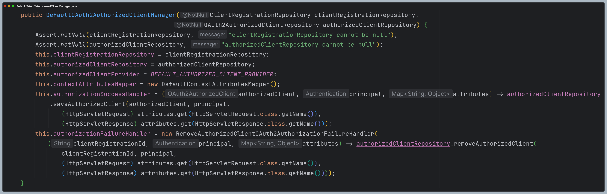

- 기본적으로 `DefaultOAuth2AuthorizedClientManager` 셍성자 만으로 모든 필요한 필드값들은 초기화가 된다.
- 커스텀이 필요할 때 `setter()`를 통해 커스텀 할 수 있다.

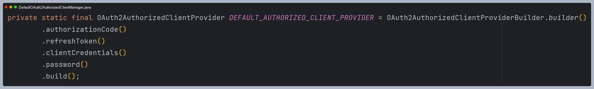

- 기본 `ContextAttributes`는 다음과 같다. 파라미터에 `scope` 값만 속성에 추가해준다.
- **Resource Owner Password** 방식에서는 `username`과 `password`가 필요하기 때문에 커스텀 해 주었다.

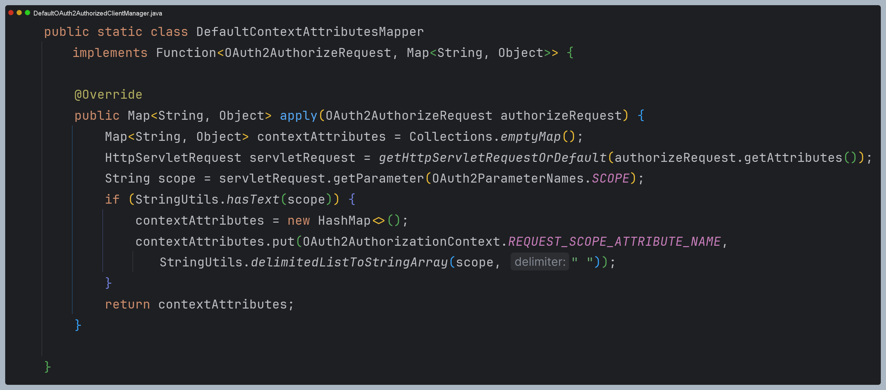

### HTML

```html
<!DOCTYPE html SYSTEM "http://www.thymeleaf.org/dtd/xhtml1-strict-thymeleaf-4.dtd">
<html xmlns="http://www.w3.org/1999/xhtml"
      xmlns:th="http://www.thymeleaf.org"
      xmlns:sec="http://www.thymeleaf.org/extras/spring-security" lang="en">

<head>
    <meta charset="UTF-8">
    <title>Insert title here</title>
</head>
<body>
<div>Welcome</div>
<div sec:authorize="isAuthenticated()"><a th:href="@{/logout}">Logout</a></div>
<form sec:authorize="isAnonymous()" action="#">
    <div sec:authorize="isAnonymous()">
        <a th:href="@{/oauth2Login/password(username='user', password='1234')}">Password Flow Login</a>
    </div>
</form>
</body>
</html>
```

### LoginController

```java
@RestController
@RequestMapping("/oauth2Login")
@RequiredArgsConstructor
public class LoginController {

    private final DefaultOAuth2AuthorizedClientManager oAuth2AuthorizedClientManager;

   /**
    * Resource Owner Password
    */
    @GetMapping("/password")
    public String oauth2Login(HttpServletRequest request, HttpServletResponse response) {

        //익명 객체
       Authentication authentication = SecurityContextHolder.getContextHolderStrategy()
                                                            .getContext()
                                                            .getAuthentication();

       OAuth2AuthorizeRequest authorizeRequest = OAuth2AuthorizeRequest
                                                 .withClientRegistrationId("keycloak")
                                                 .principal(authentication) //anonymous
                                                 .attribute(HttpServletRequest.class.getName(), request)
                                                 //AppConfig에서 Function 으로 username과 password 를 추출하기 위해
                                                 //HttpServletRequest 객체를 담아놓는다.
                                                 .attribute(HttpServletResponse.class.getName(), response)
                                                 .build();

       OAuth2AuthorizedClient authorizedClient = oAuth2AuthorizedClientManager.authorize(authorizeRequest);

       //클라이언트 인증이 되었다면
       if (authorizedClient != null) {
          ClientRegistration clientRegistration = authorizedClient.getClientRegistration();
          OAuth2AccessToken accessToken = authorizedClient.getAccessToken();

          OAuth2UserService<OAuth2UserRequest, OAuth2User> oAuth2UserService = new DefaultOAuth2UserService();
          OAuth2User oAuth2User = oAuth2UserService.loadUser(new OAuth2UserRequest(clientRegistration, accessToken));

          //SecurityContext에 저장할 인증 객체
          OAuth2AuthenticationToken oAuth2AuthenticationToken = new OAuth2AuthenticationToken(
                  oAuth2User,
                  oAuth2User.getAuthorities(),
                  clientRegistration.getRegistrationId()
          );

          SecurityContextHolder.getContextHolderStrategy().getContext().setAuthentication(oAuth2AuthenticationToken);
          return oAuth2AuthenticationToken;
       }

       return null;
    }
}
```

## 과정 디버깅

### 1. 컨트롤러

- 익명 인증 객체, `request` 등을 포함한 `OAuth2AuthorizeRequest`를 생성하고 `DefaultOAuth2AuthorizedClientManager`를 호출한다.

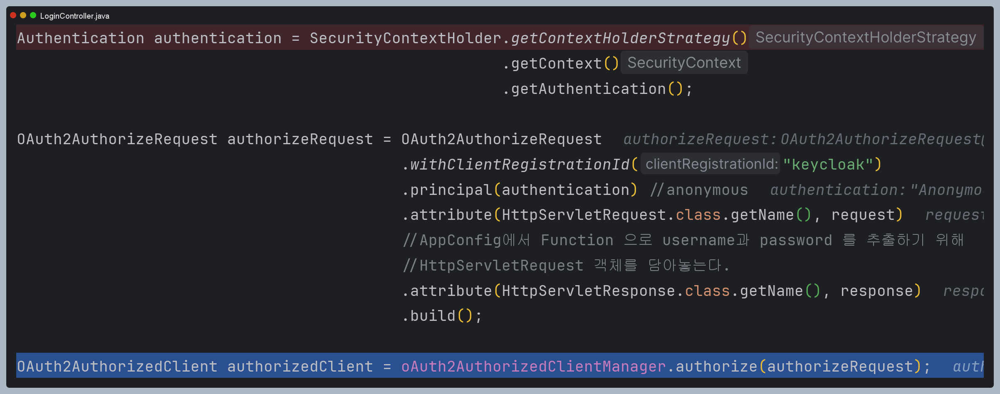

### 2. DefaultOAuth2AuthorizedClientManager

- 이미 인증 받은 클라이언트가 있는지 확인한다.
- 현재는 처음 요청이기 때문에 `clientRegistration` 정보를 담은 `OAuth2AuthorizationContext`를 생성한다.

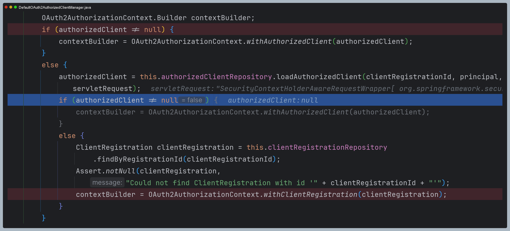

- 추가로 필요한 속성들을 저장한다.
- 여기서 설정 클래스에서 만든 `Function`이 실행된다.

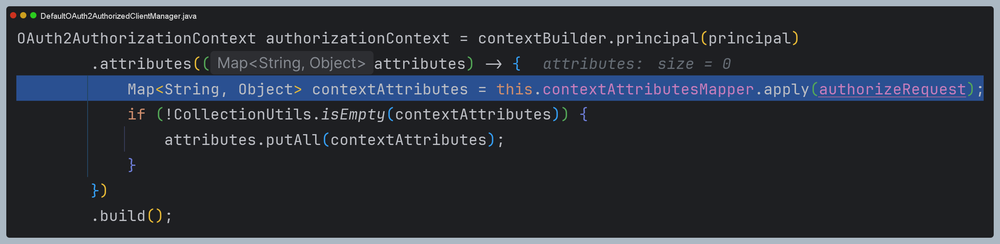

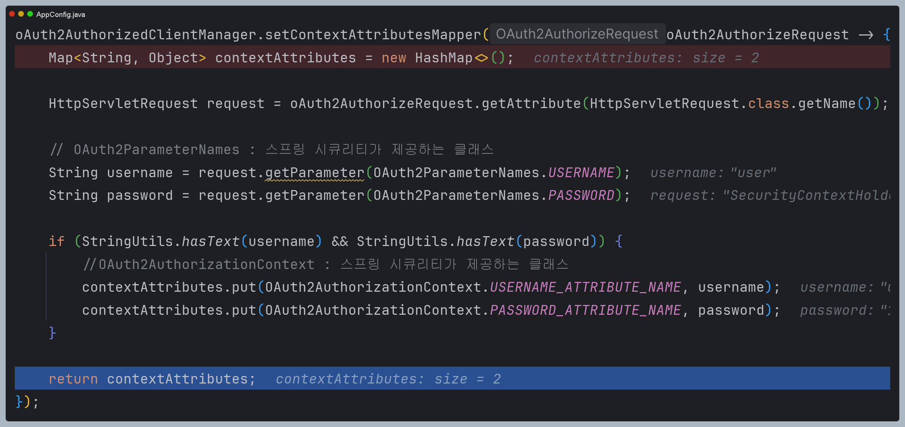

- 최종 생성된 `OAuth2AuthorizationContext`로 `authorizedClientProvider`에게 전달한다.


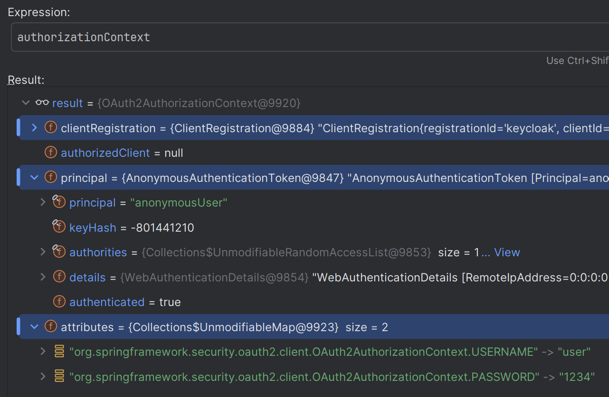

### 3. DelegatingOAuth2AuthorizedClientProvider

- `OAuth2AuthorizedClientProviderBuilder`에 의해 생성된 각 `OAuth2AuthorizedClientProvider`에게 요청을 위임한다. 


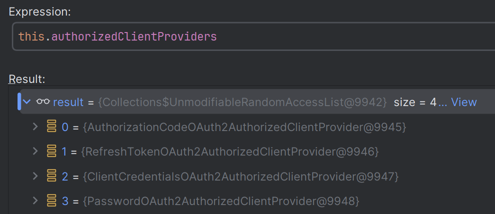

### 4. PasswordOAuth2AuthorizedClientProvider

- 권한 부여 타입, 필수 속성, 이미 `authorizedClient`가 존재하고 `AccessToken`이 만료되지 않았는지, `AccessToken`은
만료되고 `RefreshToken`이 존재하는지 확인한다.

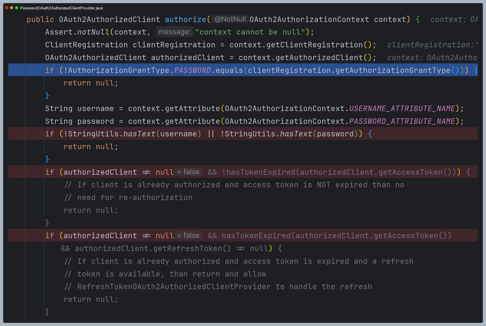

- 첫 요청이기 때문에 어느 것도 해당되지 않아 인가 서버와 통신한다.
- `DefaultPasswordTokenResponseClient`에게 인가 서버 통신을 맡긴 후
받은 결과로 `OAuth2AuthorizedClient`를 반환한다.

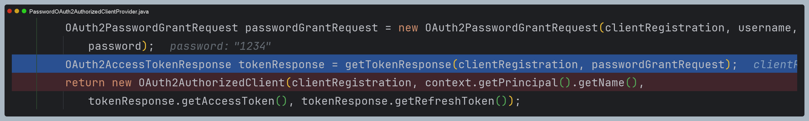

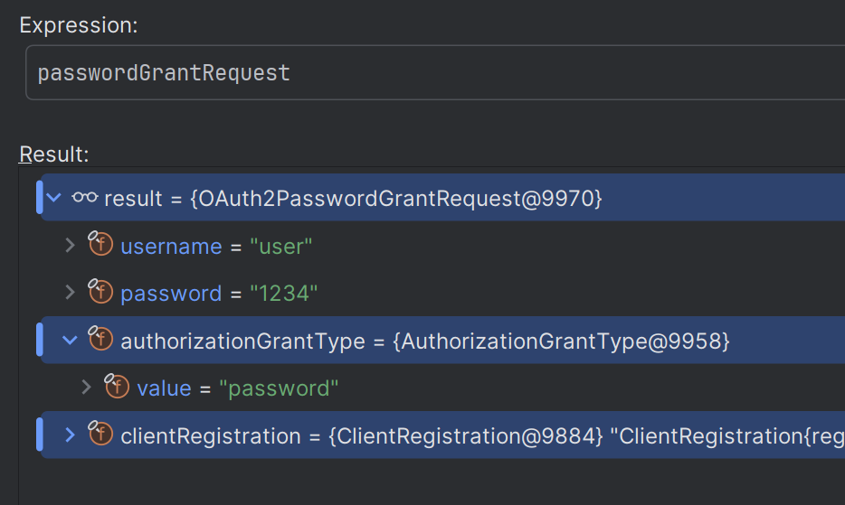

### 5. DefaultPasswordTokenResponseClient

- 인가 서버와 통신 후 `OAuth2AccessTokenResponse`를 반환한다.

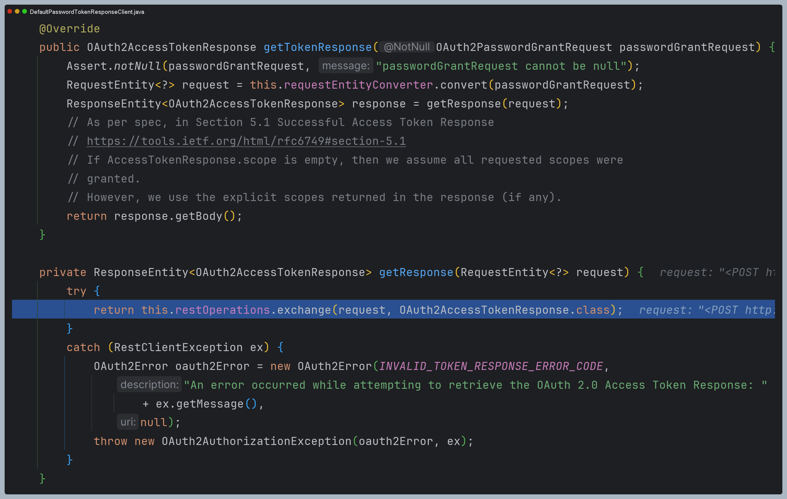

### 6. DefaultOAuth2AuthorizedClientManager

- `authorizationSuccessHandler`를 실행하고 `authorizedClient`를 반환한다.

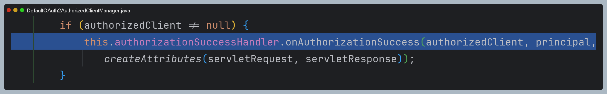

- 그리고 나서 다시 컨트롤러에서 `DefaultOAuth2UserService`로 사용자 정보를 얻고
최종 인증 객체를 `SecurityContext`에 저장한다.

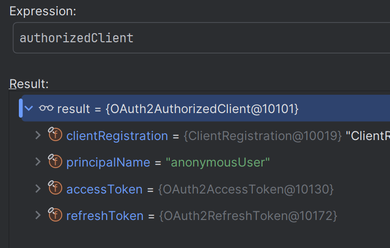

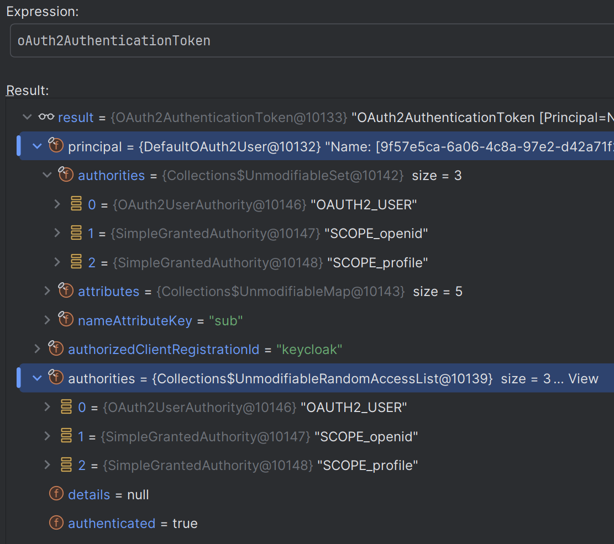

---

[이전 ↩️ - OAuth 2.0 Client(oauth2Client) - DefaultOAuth2AuthorizedClientManager](https://github.com/genesis12345678/TIL/blob/main/Spring/security/oauth/OAuth2Client/DefaultOAuth2AuthorizedClientManager.md)

[메인 ⏫](https://github.com/genesis12345678/TIL/blob/main/Spring/security/oauth/main.md)

[다음 ↪️ - OAuth 2.0 Client(oauth2Client) - DefaultOAuth2AuthorizedClientManager - `Client Credentials` 권한 부여 구현](https://github.com/genesis12345678/TIL/blob/main/Spring/security/oauth/OAuth2Client/Client%20Credentials.md)