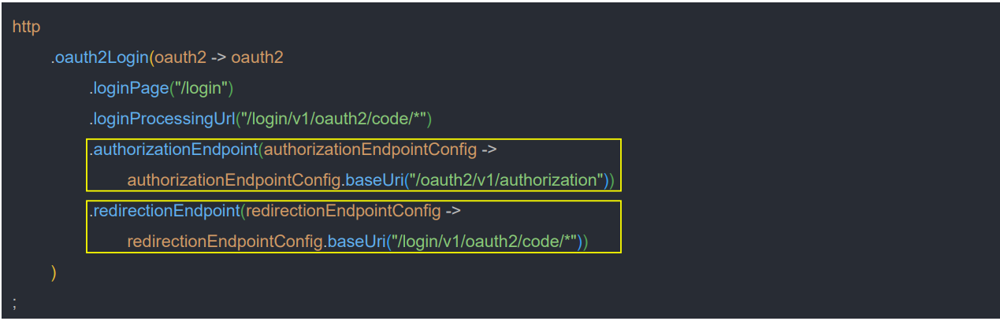
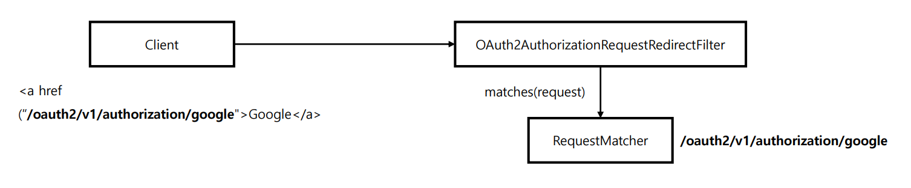
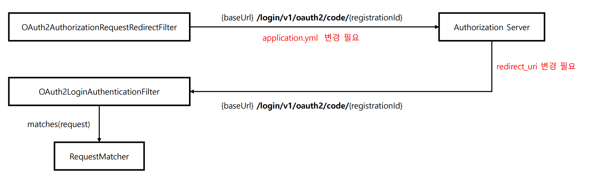

# oauth2Login() - API 커스텀 `Authorization BaseUrl` & `Redirection BaseUrl`



- ` authorizationEndpointConfig.baseUri("/oauth2/v1/authorization"))`
  - 권한 부여 요청 `BaseUri`를 커스텀 한다.
  - 1단계 권한 부여 요청을 처리하는 `OAuth2AuthorizationRequestRedirectFilter` 에서 요청에 대한 매칭 여부를 판단한다.
  - **설정에서 변경한 값이 클라이언트의 링크 정보와 일치하도록 맞춰야 한다.**



- `redirectionEndpointConfig.baseUri("/login/v1/oauth2/code/*"))`
  - 인가 응답의 `BaseUri`를 커스텀 한다.
  - **Token** 요청을 처리하는 `OAuth2LoginAuthenticationFilter` 에서 요청에 대한 매칭 여부를 판단한다.
  - `application.yml` 설정 파일에서 `registration` 속성의 **redirectUri** 설정에도 변경된 값을 적용해야 한다.
  - 인가 서버의 **redirectUri** 설정에도 변경된 값을 적용해야 한다.
  - `loginProcessingUrl()`로 설정해도 결과는 동일하고, `redirectionEndpointConfig.baseUri()`가 더 우선이다.



---
### SecurityConfig

```java
@Configuration
@RequiredArgsConstructor
public class OAuth2ClientConfig {

    @Bean
    public SecurityFilterChain securityFilterChain(HttpSecurity http) throws Exception {
        http
                .authorizeHttpRequests(request -> request
                        .requestMatchers("/login").permitAll()
                        .anyRequest().authenticated()
                )
                .oauth2Login(oauth2 -> oauth2
                        .loginPage("/login")
//                        .loginProcessingUrl("/login/v1/oauth2/code/*")
                        .authorizationEndpoint(authorizationEndpointConfig ->
                                authorizationEndpointConfig.baseUri("/oauth2/v1/authorization"))
                        .redirectionEndpoint(redirectionEndpointConfig ->
                                redirectionEndpointConfig.baseUri("/login/v1/oauth2/code/*"))
                )
        ;

        return http.build();
    }
}
```
> - `authorizationEndpoint`를 재정의 했기 때문에 클라이언트에서 요청 Uri도 변경해 주어야 한다.
> - `redirectionEndpoint`를 재정의 했기 때문에 `application.yml`의 `redirect-uri`, 인가 서버의 `redirect-uri`도 변경해 주어야 한다.

### login.html

```java
@Controller
public class LoginController {

    @GetMapping("/login")
    public String login() {
        return "login";
    }
}
```
```html
<!DOCTYPE html>
<html lang="en" xmlns:th="http://www.thymeleaf.org">
<head>
    <meta charset="UTF-8">
    <title>Title</title>
</head>
<body>
<div class="container">
    <h2 class="form-signin-heading">Login with OAuth 2.0</h2><table class="table table-striped">
    <tr>
        <td><a href="/oauth2/v1/authorization/keycloak">oauth2-client-app</a></td>
    </tr>
</table>
</div>
</body>
</html>
```

### application.yml

```yaml
server:
  port: 8081

spring:
  security:
    oauth2:
      client:
        registration:
          keycloak:
           ...
            redirect-uri: http://localhost:8081/login/v1/oauth2/code/keycloak
            ...
        provider:
          keycloak:
            ...
```

---

[이전 ↩️ - OAuth 2.0 Client(oauth2Login) - Spring MVC 인증 객체 참조]()

[메인 ⏫](https://github.com/genesis12345678/TIL/blob/main/Spring/security/oauth/main.md)

[다음 ↪️ - OAuth 2.0 Client(oauth2Login) - API 커스텀 - `OAuth2AuthorizationRequestResolver`]()