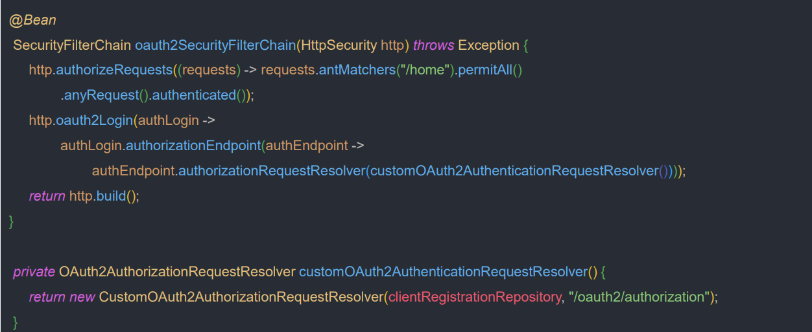

# oauth2Login() - API 커스텀 `OAuth2AuthorizationRequestResolver`

## OAuth2AuthorizationRequestResolver

- **Authorization Code Grant** 방식에서 클라이언트가 인가 서버로 권한 부여 요청할 때 실행되는 클래스
- `OAuth2AuthorizationRequestResolver`는 OAuth 2.0 인가 프레임워크에 정의된 표준 파라미터 외에 다른 파라미터를 추가하는 식으로 인가 요청을 할 때 사용한다.
- `DefaultOAuth2AuthorizationRequestResolver` 가 디폴트 구현체로 제공되며 `Consumer<>` 속성에 커스텀할 내용을 구현한다.




---

### application.yml

```yaml
server:
  port: 8081

spring:
  security:
    oauth2:
      client:
        registration:
          keycloak1:
            # 권한 부여 코드 승인 방식
            client-id: oauth2-client-app
            client-secret: ANwKmYvCcxiQbjsi4jh1JHqUWikngjec
            redirect-uri: http://localhost:8081/login/oauth2/code/keycloak # /login/oauth2/code 는 스프링 시큐리티에서 정해놓은 기본값
            client-name: oauth2-client-app
            authorization-grant-type: authorization_code
            client-authentication-method: client_secret_basic
            scope:
              - openid
              - profile
            provider: keycloak

          # PKCE 권한 부여 코드 승인 방식
          # authorization-grant-type을 none으로 해주어야 한다.
          keycloakWithPKCE:
            client-id: oauth2-client-app2
            client-secret: 4NNnaSZpHK0Bu4m1ZtTwVC2b7cByZZRk
            redirect-uri: http://localhost:8081/login/oauth2/code/keycloak
            client-name: oauth2-client-app2
            authorization-grant-type: none
            client-authentication-method: client_secret_basic
            scope:
              - openid
              - profile
            provider: keycloak

          # 암묵적 승인 방식
          # 현재 스프링 시큐리티 6 에서는 이 방식을 지원하지 않는다.
          keycloak2:
            client-id: oauth2-client-app3
            redirect-uri: http://localhost:8081/home
            client-name: oauth2-client-app3
            authorization-grant-type: implicit
            client-authentication-method: none
            scope:
              - openid
              - profile
            provider: keycloak

        provider:
          keycloak:
            issuer-uri: http://localhost:8080/realms/oauth2
            authorization-uri: http://localhost:8080/realms/oauth2/protocol/openid-connect/auth
            token-uri: http://localhost:8080/realms/oauth2/protocol/openid-connect/token
            user-info-uri: http://localhost:8080/realms/oauth2/protocol/openid-connect/userinfo
            jwk-set-uri: http://localhost:8080/realms/oauth2/protocol/openid-connect/certs
            user-name-attribute: preferred_username

```

> `client-authentication-method`를 `none`으로 설정하면 **PKCE** 방식으로 동작하며 클라이언트 인증을 사용하지 않는다. 즉 클라이언트 ID 만 사용하고, 클라이언트 시크릿은 사용하지 않는다.
> 하지만 액세스 토큰 교환 요청을 위해서는 클라이언트 시크릿이 필요한데, 액세스 토큰 교환 요청을 위해 만들어지는 객체를 보면 클라이언트 시크릿이 포함되지 않는다. 그래서 오류가 발생한다.
> 만약 `none`이 아닌 다른 방식으로 사용하면 **PKCE** 방식으로 동작하기 위한 `code_challenge`와 `code_challenge_method`가 포함되지 않기 때문에 오류가 발생한다.
> 
> 이럴 때 **OAuth2AuthorizationRequestResolver**를 사용할 수 있다.

### SecurityConfig

```java
@Configuration
@RequiredArgsConstructor
public class OAuth2ClientConfig {

    private final ClientRegistrationRepository clientRegistrationRepository;


    @Bean
    public SecurityFilterChain securityFilterChain(HttpSecurity http) throws Exception {
        http
                .authorizeHttpRequests(request -> request
                        .requestMatchers("/home").permitAll()
                        .anyRequest().authenticated()
                )
                .oauth2Login(authLogin -> authLogin.authorizationEndpoint(
                        authEndPoint -> authEndPoint.authorizationRequestResolver(customOAuth2AuthorizationRequestResolver())
                ))
                .logout(logout -> logout.logoutSuccessUrl("/home"))
        ;

        return http.build();
    }

    private OAuth2AuthorizationRequestResolver customOAuth2AuthorizationRequestResolver() {
        return new CustomOAuth2AuthorizationRequestResolver(clientRegistrationRepository, "/oauth2/authorization");
    }
}
```

### CustomOAuth2AuthorizationRequestResolver

```java
/*
 DefaultOAuth2AuthorizationRequestResolver의 주요 코드를 대부분 그대로 가져오고, 필요한 부분만 커스텀
 */
public class CustomOAuth2AuthorizationRequestResolver implements OAuth2AuthorizationRequestResolver {

    private static final String REGISTRATION_ID_URI_VARIABLE_NAME = "registrationId";
    private static final Consumer<OAuth2AuthorizationRequest.Builder> DEFAULT_PKCE_APPLIER =
            OAuth2AuthorizationRequestCustomizers.withPkce();
    private final AntPathRequestMatcher authorizationRequestMatcher;
    private ClientRegistrationRepository clientRegistrationRepository;
    private String baseUri;

    private DefaultOAuth2AuthorizationRequestResolver delegate; //PKCE 방식이 아닌 경우에는 기존에 스프링 시큐리티가 진행하던 대로 하기 위해 그대로 위임한다.

    public CustomOAuth2AuthorizationRequestResolver(ClientRegistrationRepository clientRegistrationRepository,
                                                    String baseUri) {

        this.clientRegistrationRepository = clientRegistrationRepository;
        this.authorizationRequestMatcher = new AntPathRequestMatcher(
                baseUri + "/{" + REGISTRATION_ID_URI_VARIABLE_NAME + "}");

        delegate = new DefaultOAuth2AuthorizationRequestResolver(clientRegistrationRepository, baseUri);
    }

    @Override
    public OAuth2AuthorizationRequest resolve(HttpServletRequest request) {
        String registrationId = resolveRegistrationId(request);
        if (registrationId == null) {
            return null;
        }

        if (registrationId.equals("keycloakWithPKCE")) {
            OAuth2AuthorizationRequest oAuth2AuthorizationRequest = delegate.resolve(request); //기본적으로 만들어진 요청 객체
            return customResolve(oAuth2AuthorizationRequest, registrationId);
        }

        return delegate.resolve(request);
    }

    @Override
    public OAuth2AuthorizationRequest resolve(HttpServletRequest request, String clientRegistrationId) {
        String registrationId = resolveRegistrationId(request);
        if (registrationId == null) {
            return null;
        }

        if (registrationId.equals("keycloakWithPKCE")) {
            OAuth2AuthorizationRequest oAuth2AuthorizationRequest = delegate.resolve(request);
            return customResolve(oAuth2AuthorizationRequest, clientRegistrationId);
        }

        return delegate.resolve(request);
    }

    private OAuth2AuthorizationRequest customResolve(OAuth2AuthorizationRequest oAuth2AuthorizationRequest, String clientRegistrationId) {

        //커스텀한 값도 추가 가능
        Map<String, Object> map = new HashMap<>();
        map.put("customName1", "customValue1");
        map.put("customName2", "customValue2");
        map.put("customName3", "customValue3");

        OAuth2AuthorizationRequest.Builder build = OAuth2AuthorizationRequest
                .from(oAuth2AuthorizationRequest)
                .additionalParameters(map);

        DEFAULT_PKCE_APPLIER.accept(build); //PKCE 방식을 위한 파라미터 추가

        return build.build();
    }

    private String resolveRegistrationId(HttpServletRequest request) {
        if (this.authorizationRequestMatcher.matches(request)) {
            return this.authorizationRequestMatcher.matcher(request)
                    .getVariables()
                    .get(REGISTRATION_ID_URI_VARIABLE_NAME);
        }
        return null;
    }
}
```
> 사실 **PKCE** 방식은 인가 서버에서 인증을 해제하고 클라이언트 시크릿을 사용하지 않아도 충분히 안전한 방식이다(기본적인 **PKCE** 방식이면서). 하지만 위와 같이 설정하여 **PKCE** 방식에
> 클라이언트 시크릿까지 더하여 더욱 강력한 보안을 구축할 수 있는 것이다.

---

[이전 ↩️ - OAuth 2.0 Client(oauth2Login) - API 커스텀 `Authorization BaseUrl` & `Redirection BaseUrl`](https://github.com/genesis12345678/TIL/blob/main/Spring/security/oauth/OAuth2Login/API%EC%BB%A4%EC%8A%A4%ED%85%801.md)

[메인 ⏫](https://github.com/genesis12345678/TIL/blob/main/Spring/security/oauth/main.md)