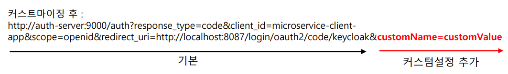
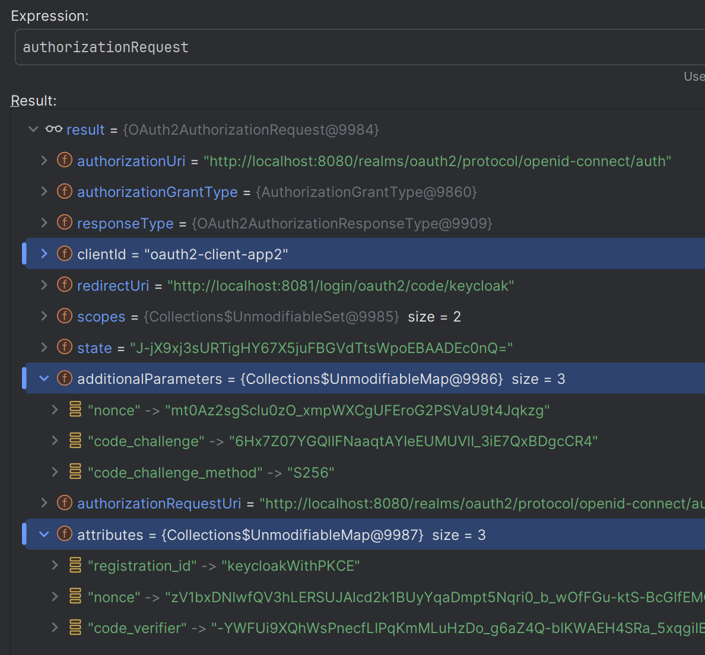
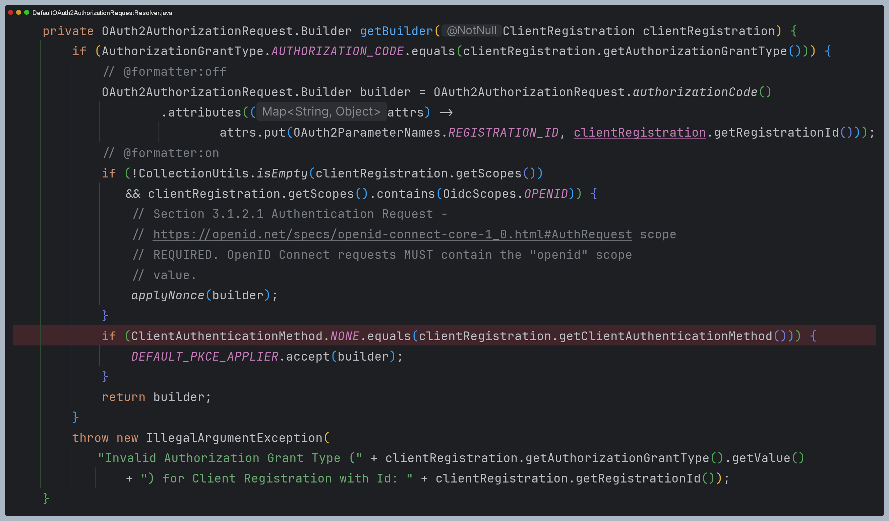
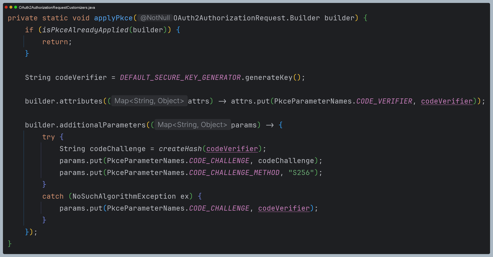
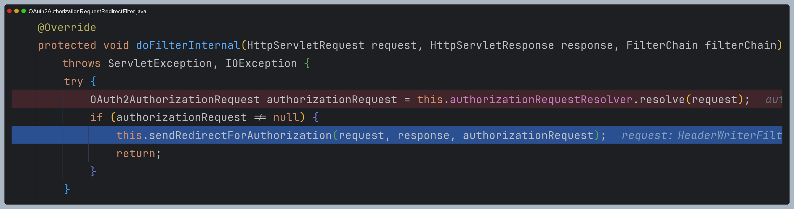
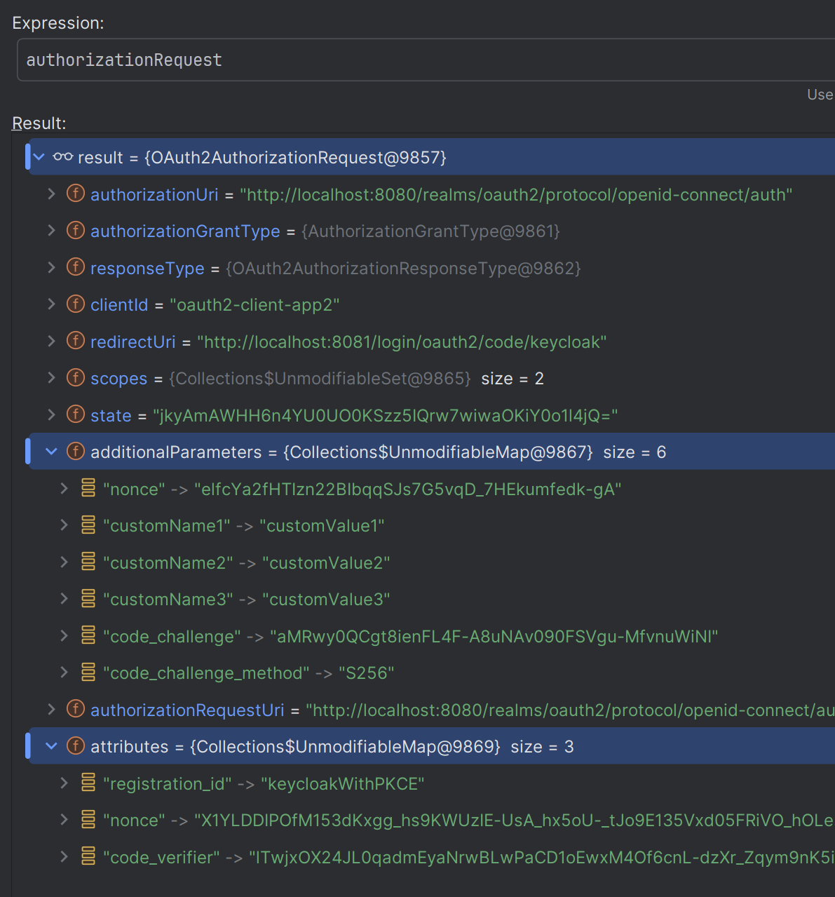

# oauth2Login() - API 커스텀 `OAuth2AuthorizationRequestResolver`

## OAuth2AuthorizationRequestResolver

- **Authorization Code Grant** 방식에서 클라이언트가 인가 서버로 권한 부여 요청할 때 실행되는 클래스
- `OAuth2AuthorizationRequestResolver`는 OAuth 2.0 인가 프레임워크에 정의된 표준 파라미터 외에 다른 파라미터를 추가하는 식으로 인가 요청을 할 때 사용한다.
- `DefaultOAuth2AuthorizationRequestResolver` 가 디폴트 구현체로 제공되며 `Consumer<>` 속성에 커스텀할 내용을 구현한다.



---

## 예제 코드

### home.html

```html
<!DOCTYPE html SYSTEM "http://www.thymeleaf.org/dtd/xhtml1-strict-thymeleaf-4.dtd">
<html xmlns="http://www.w3.org/1999/xhtml"
      xmlns:th="http://www.thymeleaf.org"
      xmlns:sec="http://www.thymeleaf.org/extras/spring-security" lang="en">

<head>
    <meta charset="UTF-8">
    <title>Insert title here</title>
    <script>
        function authorizationCode(){
            window.location = new URL('http://localhost:8081/oauth2/authorization/keycloak1');
        }

        function authorizationCodeWithPKCE(){
            window.location = new URL('http://localhost:8081/oauth2/authorization/keycloakWithPKCE');
        }

        function implicit(){
            window.location = new URL('http://localhost:8081/oauth2/authorization/keycloak2');
        }

    </script>
</head>
<body>
<div>Welcome</div>
<div sec:authorize="isAuthenticated()"><a th:href="@{/logout}">Logout</a></div>
<form sec:authorize="isAnonymous()" action="#">
    <p><input type="button" onclick="authorizationCode()" value="AuthorizationCode Grant" />
    <p><input type="button" onclick="authorizationCodeWithPKCE()" value="AuthorizationCode Grant with PKCE" />
    <p><input type="button" onclick="implicit()" value="Implicit Grant" />
</form>
</body>
</html>
```

### application.yml

```yaml
spring:
  security:
    oauth2:
      client:
        registration:
          keycloak1:
            # 권한 부여 코드 승인 방식
            client-id: oauth2-client-app
            client-secret: ANwKmYvCcxiQbjsi4jh1JHqUWikngjec
            redirect-uri: http://localhost:8081/login/oauth2/code/keycloak # /login/oauth2/code 는 스프링 시큐리티에서 정해놓은 기본값
            client-name: oauth2-client-app
            authorization-grant-type: authorization_code
            client-authentication-method: client_secret_basic
            scope:
              - openid
              - profile
            provider: keycloak

          # PKCE 권한 부여 코드 승인 방식
          # client-authentication-method : none으로 해주어야 한다.
          keycloakWithPKCE:
            client-id: oauth2-client-app2
            client-secret: 4NNnaSZpHK0Bu4m1ZtTwVC2b7cByZZRk
            redirect-uri: http://localhost:8081/login/oauth2/code/keycloak
            client-name: oauth2-client-app2
            authorization-grant-type: authorization_code
            client-authentication-method: none
            scope:
              - openid
              - profile
            provider: keycloak

          # 암묵적 승인 방식
          # 현재 스프링 시큐리티 6 에서는 이 방식을 지원하지 않는다.
          keycloak2:
            client-id: oauth2-client-app3
            redirect-uri: http://localhost:8081/home
            client-name: oauth2-client-app3
            authorization-grant-type: implicit
            client-authentication-method: none
            scope:
              - openid
              - profile
            provider: keycloak

        provider:
          keycloak:
            issuer-uri: http://localhost:8080/realms/oauth2
            authorization-uri: http://localhost:8080/realms/oauth2/protocol/openid-connect/auth
            token-uri: http://localhost:8080/realms/oauth2/protocol/openid-connect/token
            user-info-uri: http://localhost:8080/realms/oauth2/protocol/openid-connect/userinfo
            jwk-set-uri: http://localhost:8080/realms/oauth2/protocol/openid-connect/certs
            user-name-attribute: preferred_username
```

> - `client-authentication-method`를 `none`으로 설정하면 **PKCE** 방식으로 동작하며 클라이언트 인증을 사용하지 않는다. 
> - 즉 **클라이언트 ID** 만 사용하고, **클라이언트 시크릿**은 사용하지 않는다.
> - 하지만 액세스 토큰 교환 요청을 위해서는 클라이언트 시크릿이 필요한데, 액세스 토큰 교환 요청을 위해 만들어지는 객체를 보면 **클라이언트 시크릿**이 포함되지 않는다. **그래서 오류가 발생한다.**
> 
> 
> 
> - 만약 `none`이 아닌 다른 방식으로 사용하면 **PKCE** 방식으로 동작하기 위한 `code_challenge`와 `code_challenge_method`가 포함되지 않기 때문에 **오류가 발생한다.**
> 
> 이럴 때 **커스텀 OAuth2AuthorizationRequestResolver**를 사용할 수 있다.

- 커스텀 클래스를 만들어보기 전에 기존에 `DefaultOAuth2AuthorizationRequestResolver`는 어떻게 처리를 하는지 살펴보자.
- 다음은 `DefaultOAuth2AuthorizationRequestResolver` 내부의 일부 코드이다.
- 코드를 보면 **권한 부여 유형**이 `authorization_code` 방식이 아니면 예외를 발생시키고, **클라이언트 자격 증명 전송 방식**이
`none`일 때만 PKCE에 대한 설정을 해주고 있다.





- 그럼 커스텀 클래스를 만들어서 반드시 `none` 방식이 아니더라도 PKCE에 대한 속성이 추가되도록 해보자.

### CustomOAuth2AuthorizationRequestResolver

```java
/**
 * {@link DefaultOAuth2AuthorizationRequestResolver}의 주요 코드를 대부분 그대로 가져오고, 필요한 부분만 커스텀
 */
public class CustomOAuth2AuthorizationRequestResolver implements OAuth2AuthorizationRequestResolver {

    private static final String REGISTRATION_ID_URI_VARIABLE_NAME = "registrationId";
    private static final Consumer<OAuth2AuthorizationRequest.Builder> DEFAULT_PKCE_APPLIER =
        OAuth2AuthorizationRequestCustomizers.withPkce();
    
    private final DefaultOAuth2AuthorizationRequestResolver delegate;
    private final AntPathRequestMatcher authorizationRequestMatcher;

    public CustomOAuth2AuthorizationRequestResolver(ClientRegistrationRepository clientRegistrationRepository, String baseUri) {
        this.authorizationRequestMatcher = new AntPathRequestMatcher(baseUri + "/{" + REGISTRATION_ID_URI_VARIABLE_NAME + "}");
        this.delegate = new DefaultOAuth2AuthorizationRequestResolver(clientRegistrationRepository, baseUri);
    }

    @Override
    public OAuth2AuthorizationRequest resolve(HttpServletRequest request) {
        String registrationId = resolveRegistrationId(request);
        if (registrationId == null) {
            return null;
        }

        //PKCE 요청일 경우 위임 후 커스텀 값 추가
        if (registrationId.equals("keycloakWithPKCE")) {
            OAuth2AuthorizationRequest oAuth2AuthorizationRequest = delegate.resolve(request);
            return customResolve(oAuth2AuthorizationRequest);
        }

        //PKCE 방식이 아닌 경우 기존에 스프링 시큐리티가 진행하던 대로 하기 위해 그대로 위임한다.
        return delegate.resolve(request);
    }

    @Override
    public OAuth2AuthorizationRequest resolve(HttpServletRequest request, String clientRegistrationId) {
        String registrationId = resolveRegistrationId(request);
        if (registrationId == null) {
            return null;
        }

        //PKCE 요청일 경우 위임 후 커스텀 값 추가
        if (registrationId.equals("keycloakWithPKCE")) {
            OAuth2AuthorizationRequest oAuth2AuthorizationRequest = delegate.resolve(request);
            return customResolve(oAuth2AuthorizationRequest);
        }

        //PKCE 방식이 아닌 경우 기존에 스프링 시큐리티가 진행하던 대로 하기 위해 그대로 위임한다.
        return delegate.resolve(request);
    }

    private OAuth2AuthorizationRequest customResolve(OAuth2AuthorizationRequest oAuth2AuthorizationRequest) {

        //커스텀한 값도 추가 가능
        Map<String, Object> map = new HashMap<>();
        map.put("customName1", "customValue1");
        map.put("customName2", "customValue2");
        map.put("customName3", "customValue3");

        //기존 요청 객체 정보 + 커스텀 속성 값
        OAuth2AuthorizationRequest.Builder build = OAuth2AuthorizationRequest
                                                        .from(oAuth2AuthorizationRequest)
                                                        .additionalParameters(map);

        DEFAULT_PKCE_APPLIER.accept(build); //PKCE 방식을 위한 파라미터 추가
        return build.build();
    }

    private String resolveRegistrationId(HttpServletRequest request) {
        if (this.authorizationRequestMatcher.matches(request)) {
            return this.authorizationRequestMatcher.matcher(request)
                                                   .getVariables()
                                                   .get(REGISTRATION_ID_URI_VARIABLE_NAME);
        }
        return null;
    }
}
```

- 스프링 시큐리티에 기존에 정의된 기능을 최대한 활용했다.
- `delegate.resolve(request);`는 위에서 본 것처럼 **권한 부여 유형**이 `authorization_code` 방식인지를
검사하고 있기 때문에 `authorization_code` 방식은 그대로 사용해야 한다.

### SecurityConfig

```java
@Configuration
@EnableWebSecurity
@RequiredArgsConstructor
public class OAuth2ClientConfig {

    private final ClientRegistrationRepository clientRegistrationRepository;

    @Bean
    public SecurityFilterChain securityFilterChain(HttpSecurity http) throws Exception {
        http
            .authorizeHttpRequests(request -> request
                .requestMatchers("/home").permitAll()
                .anyRequest().authenticated()
            )
            .oauth2Login(authLogin -> authLogin
                .authorizationEndpoint(
                    authEndPoint -> authEndPoint.authorizationRequestResolver( //추가
                        new CustomOAuth2AuthorizationRequestResolver(clientRegistrationRepository, "/oauth2/authorization")
                    )
                )
            )
            .logout(logout -> logout.logoutSuccessUrl("/home"))
        ;

        return http.build();
    }
}
```

- 최종 액세스 토큰을 교환하기 위한 만들어진 요청 객체를 보면 커스텀 속성과 PKCE 관련 속성들이 정상적으로 설정된 것을
확인할 수 있다.





> 사실 **PKCE** 방식은 인가 서버에서 인증을 해제하고 클라이언트 시크릿을 사용하지 않아도 충분히 안전한 방식이다(기본적인 **PKCE** 방식이면서). 하지만 위와 같이 설정하여 **PKCE** 방식에
> 클라이언트 시크릿까지 더하여 더욱 강력한 보안을 구축할 수 있는 것이다.

---

[이전 ↩️ - OAuth 2.0 Client(oauth2Login) - API 커스텀 `Authorization BaseUrl` & `Redirection BaseUrl`](https://github.com/genesis12345678/TIL/blob/main/Spring/security/oauth/OAuth2Login/API%EC%BB%A4%EC%8A%A4%ED%85%801.md)

[메인 ⏫](https://github.com/genesis12345678/TIL/blob/main/Spring/security/oauth/main.md)