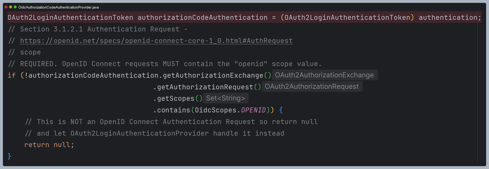

# oauth2Login() - Access Token 교환하기

## 주요 클래스

### OAuth2LoginAuthenticationFilter

- 인가 서버로부터 리다이렉트 되면서 전달된 `code`를 인가 서버의 `Access Token`으로 교환하고 `Access Token`이 저장된 `OAuth2LoginAuthenticationToken`을 **AuthenticationManager**에 위임하여
    `UserInfo` 정보를 요청해서 최종 사용자에 로그인한다.
- `OAuth2AuthorizedClientRepository`를 사용하여 **OAuth2AuthorizedClient**를 저장한다.
- 인증에 성공하면 `OAuth2AuthenticationToken`이 생성되고 **SecurityContext**에 저장되어 인증 처리를 완료한다.

**요청 매핑 URL**
- `RequestMatcher` : `/login/oauth2/code/*`

### OAuth2LoginAuthenticationProvider

- 인가 서버로부터 리다이렉트 된 이후 프로세스를 처리하며 `Access Token`으로 교환하고 이 토큰을 사용하여 `UserInfo` 처리를 담당한다.
- **Scope**에 `openid`가 포함되어 있으면 `OidcAuthorizationCodeAuthenticationProvider`를 호출하고, 아니면 `OAuth2AuthorizationCodeAuthenticationProvider`를 호출하도록 제어한다.

### OAuth2AuthorizationCodeAuthenticationProvider

- 권한 코드 부여 흐름을 처리하는 `AuthenticationProvider`
- 인가 서버에 `Authorization Code`와 `Access Token`의 교환을 담당하는 클래스

### OidcAuthorizationCodeAuthenticationProvider

- **OpenID Connect Core 1.0** 권한 코드 부여 흐름을 처리하는 `AuthenticationProvider` 이며 **요청 Scope**에 `openid`가 존재할 경우 실행된다.

### DefaultAuthorizationCodeTokenResponseClient

- 인가 서버의 `token` 엔드 포인트로 통신을 담당하며 `Access Token`을 받은 후 **OAuth2AccessTokenResponse**에 저장하고 반환한다.
- `Deprecated` 되었지만 아직 내부적으로 사용하는 것 같다.

---

## 구조

--- 

## 흐름

> - `openid`일 경우 `oauth2LoginAuthenticationProvider → OAuth2AuthorizationCodeAuthenticationProvider` 구조가 아니라
> 바로 `OidcAuthorizationAuthenticationProvider`에게 요청한다.
> - 그리고 `openid`일 경우 `OAuth2AuthorizationCodeAuthenticationToken`가 아니라 `OAuth2LoginAuthenticationToken`을 반환한다.

--- 

## 과정 디버깅

### 1. AbstractAuthenticationProcessingFilter

- `OAuth2LoginAuthenticationFilter`의 상위 추상 클래스에서 요청을 받고, 추상 메서드 `attemptAuthentication()`을 호출한다.

### 2. OAuth2LoginAuthenticationFilter

- 세션에 저장된 `OAuth2AuthorizationRequest` 얻기

- `ClientRegistration` 얻기

- 인증을 수행할 `OAuth2LoginAuthenticationToken` 생성

- `AuthenticationManager(ProviderManager)`에게 인증 위임

### 3. OidcAuthorizationCodeAuthenticationProvider

- 스코프에 `openid`가 포함되어 해당 필터에서 처리

- `DefaultAuthorizationCodeTokenResponseClient` 에게 `AccessToken` 교환 요청을 호출

- 요청 객체

- 응답 객체

- `OAuth2UserService`에 요청 객체 전달

---

[이전 ↩️ - OAuth 2.0 Client(oauth2Login) - Authorization Code 요청하기](https://github.com/genesis12345678/TIL/blob/main/Spring/security/oauth/OAuth2Login/Authorization%20Code.md)

[메인 ⏫](https://github.com/genesis12345678/TIL/blob/main/Spring/security/oauth/main.md)

[다음 ↪️ - OAuth 2.0 Client(oauth2Login) - OAuth 2.0 User 모델](https://github.com/genesis12345678/TIL/blob/main/Spring/security/oauth/OAuth2Login/OAuthUser.md)
