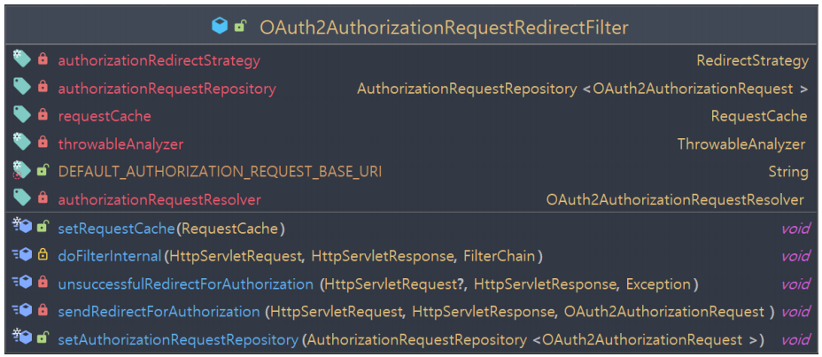
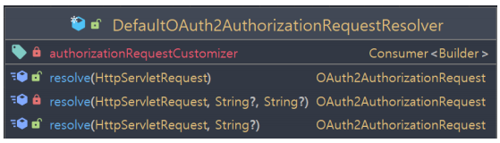
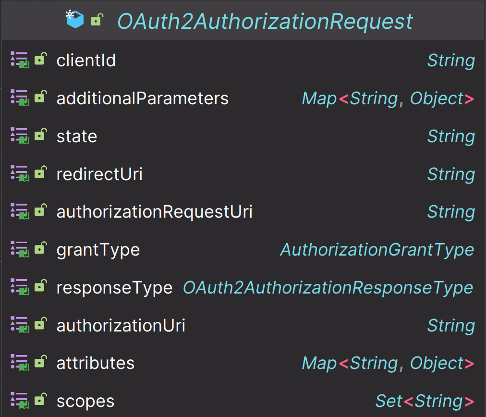
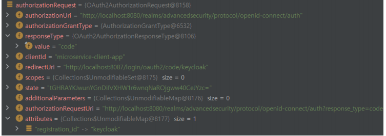
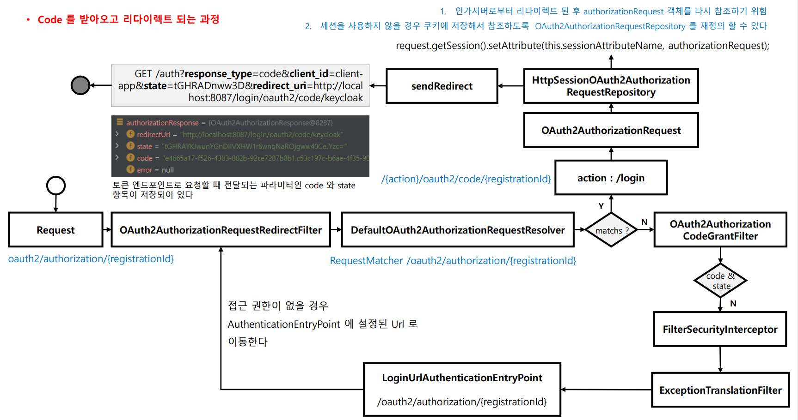

# oauth2Login() - Authorization Code 요청하기

## 주요 클래스

### OAuth2AuthorizationRequestRedirectFilter

- 클라이언트는 사용자의 브라우저를 통해 인가 서버의 권한 부여 엔드포인트로 리다이렉션 하여 권한 코드 부여 흐름을 시작한다.

- **요청 매핑 URL**
  - `AuthorizationRequestMatcher` : `/oauth2/authorization/{registrationId}`
  - `AuthorizationEndPointConfig.authorizationRequestBaseUri()`를 통해 재정의할 수 있다.

### DefaultOAuth2AuthorizationRequestResolver

- 웹 요청에 대하여 `OAuth2AuthorizationRequest` 객체를 최종 완성한다.
- `/oauth2/authorization/{registrationId}` 와 일치하는지 확인해서 일치하면 **registrationId** 를 추출하고, 이를 사용해서 `ClientRegistration`을 가져와
    `OAuth2AuthorizationRequest`를 빌드한다.

### OAuth2AuthorizationRequest

- 토큰 엔드포인트 요청 파라미터를 담은 객체로서 인가 응답을 연계하고 검증할 때 사용한다.

### ~OAuth2AuthorizationRequestRepository

- 인가 요청을 시작한 시점부터 인가 요청을 받는 시점까지(리다이렉트) `OAuth2AuthorizationReuqest`를 유지해준다.

---

## 흐름

---

[이전 ↩️ - OAuth 2.0 Client(oauth2Login) - OAuth2LoginConfigurer]()

[메인 ⏫](https://github.com/genesis12345678/TIL/blob/main/Spring/security/oauth/main.md)

[다음 ↪️ - OAuth 2.0 Client(oauth2Login) - Access Token 교환하기]()