# oauth2Login() - Authorization Code 요청하기

## 주요 클래스

### OAuth2AuthorizationRequestRedirectFilter

- 클라이언트는 사용자의 브라우저를 통해 인가 서버의 권한 부여 엔드포인트로 리다이렉션 하여 권한 코드 부여 흐름을 시작한다.

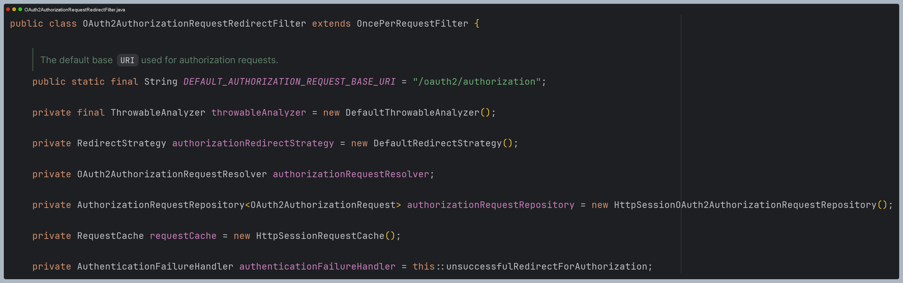

- **요청 매핑 URL**
  - `AuthorizationRequestMatcher` : `/oauth2/authorization/{registrationId}`
  - `AuthorizationEndPointConfig.authorizationRequestBaseUri()`를 통해 재정의할 수 있다.

### DefaultOAuth2AuthorizationRequestResolver

- 웹 요청에 대하여 `OAuth2AuthorizationRequest` 객체를 최종 완성한다.
- `/oauth2/authorization/{registrationId}` 와 일치하는지 확인해서 일치하면 **registrationId** 를 추출하고, 이를 사용해서 `ClientRegistration`을 가져와
    `OAuth2AuthorizationRequest`를 빌드한다.

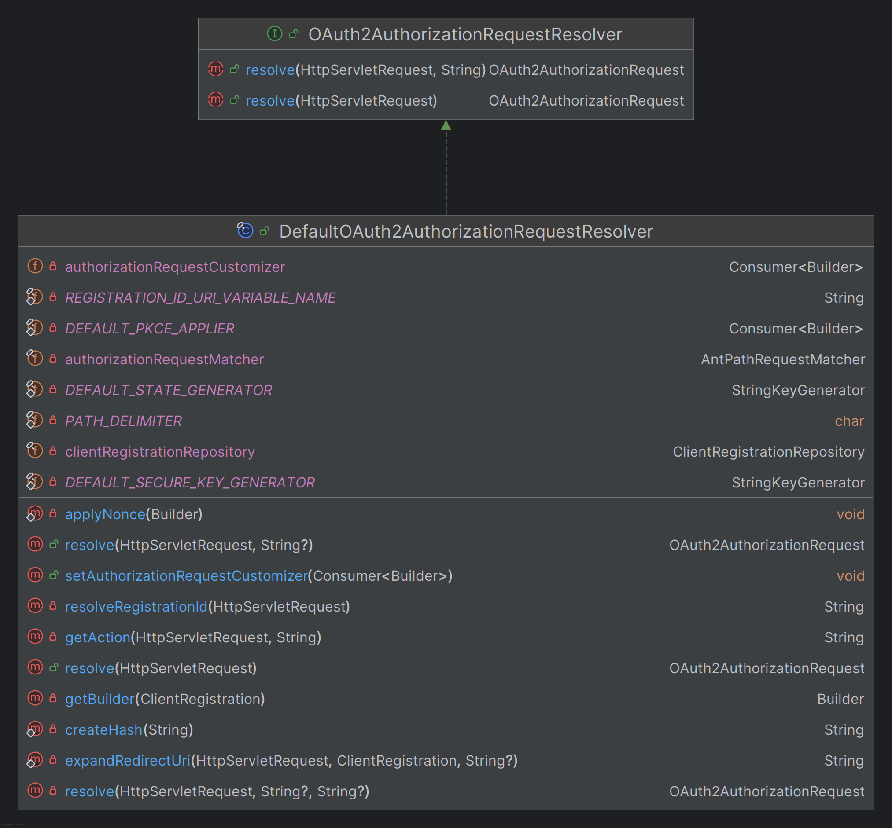

### OAuth2AuthorizationRequest

- 토큰 엔드포인트 요청 파라미터를 담은 객체로서 인가 응답을 연계하고 검증할 때 사용한다.

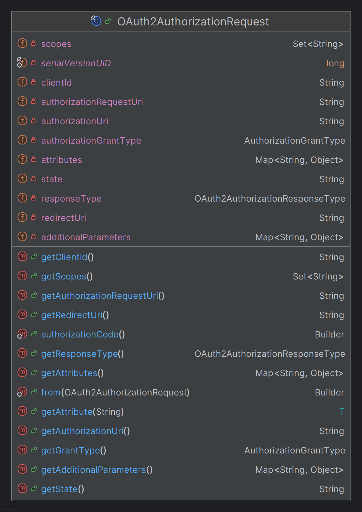

### AuthorizationRequestRepository

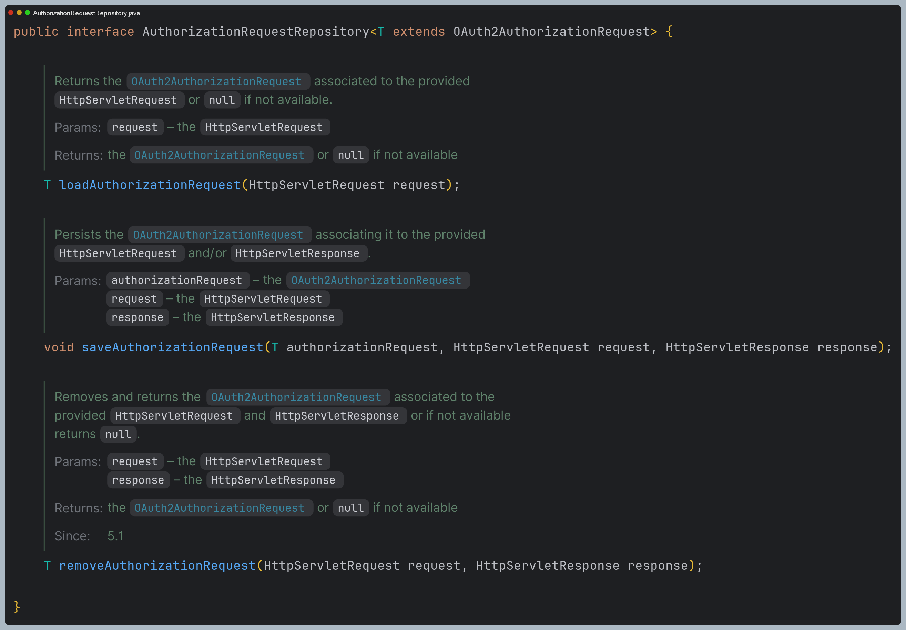

- 인가 요청을 시작한 시점부터 인가 요청을 받는 시점까지(리다이렉트) `OAuth2AuthorizationReuqest`를 유지해준다.

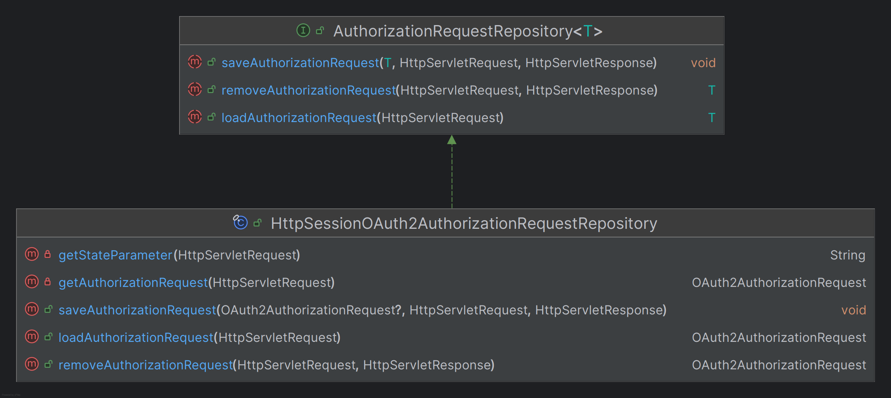

---

## 과정 디버깅

- 전체적인 흐름

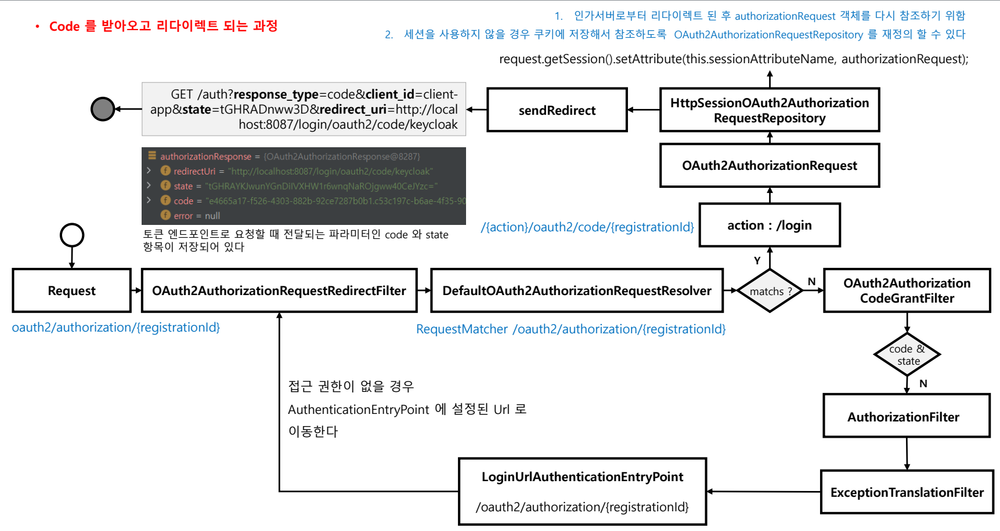

- 스프링 시큐리티가 자동으로 생성하는 OAuth 2.0 로그인 페이지와 URL을 확인할 수 있다.
- 저 링크를 눌렀을 때 과정을 디버깅 해보자.

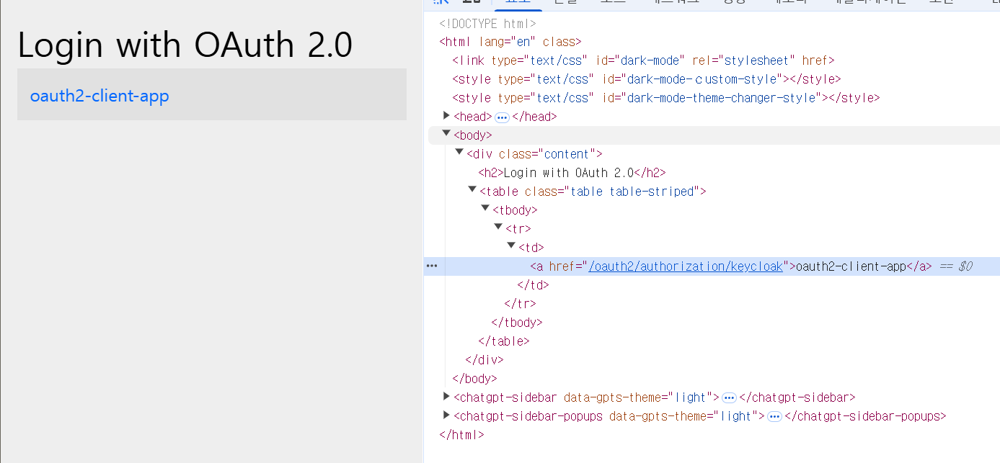

### 1. OAuth2AuthorizationRequestRedirectFilter

- `OAuth2AuthorizationRequestResolver`에게 `OAuth2AuthorizationRequest`를 추출하도록 위임한다.
- 만약 `OAuth2AuthorizationRequest`가 존재한다면 사용자의 승인을 받을 수 있는 url로 리다이렉트 한다. 

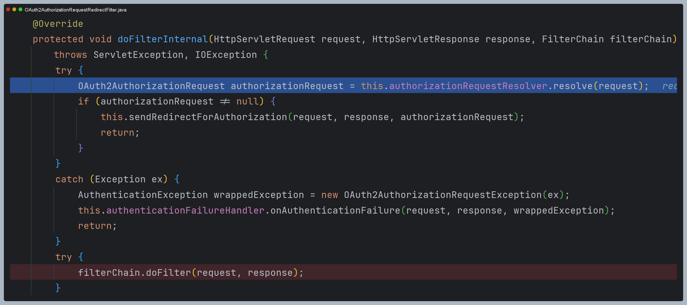

### 2. DefaultOAuth2AuthorizationRequestResolver

- 요청 저옵에서 `registrationId`를 추출하고, `OAuth2AuthorizationRequest`를 반환한다.

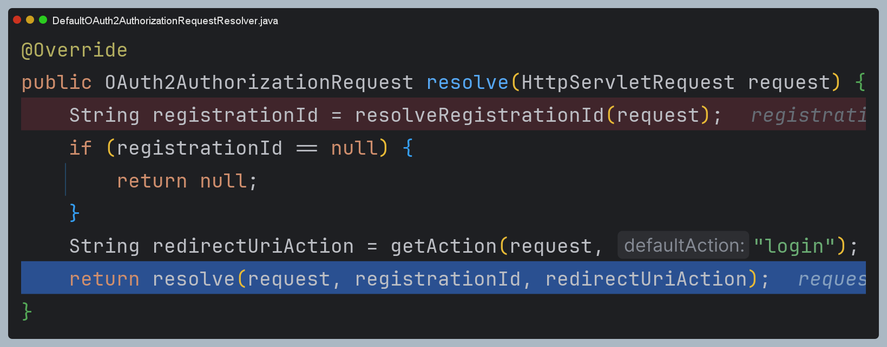

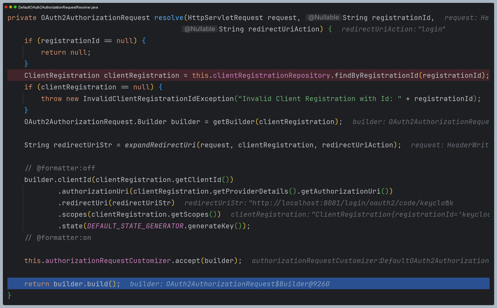

- 그리고 나서 로그인 화면으로 리다이렉션 된다.

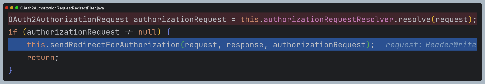

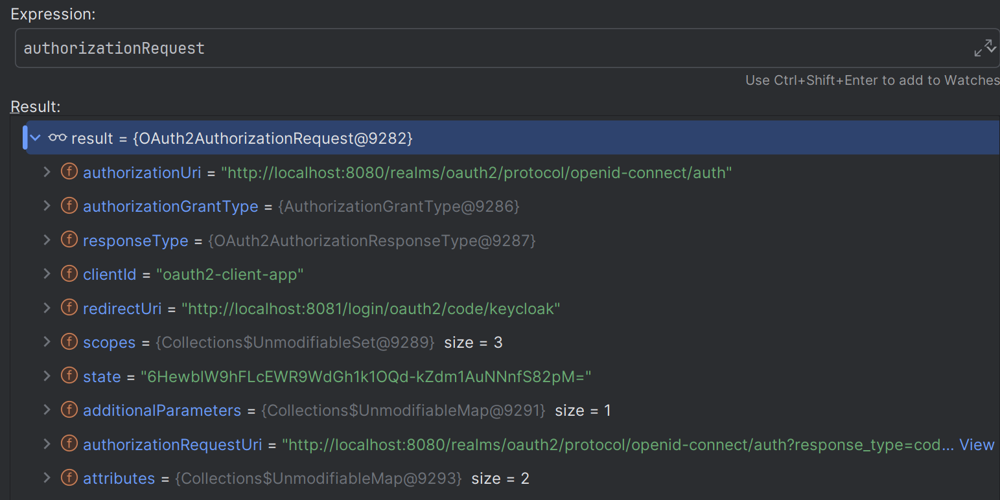

- 리다이렉트 하기 전에 세션에 `authorizationRequest`를 저장하는 것을 확인할 수 있다.

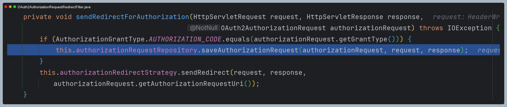

- 사용자가 로그인을 하고 나면 다시 `OAuth2AuthorizationRequestRedirectFilter`로 오게 되고, 이때는 인가 코드 요청
단계가 아니기 때문에 `Access Token`을 교환할 수 있는 필터로 넘어간다.

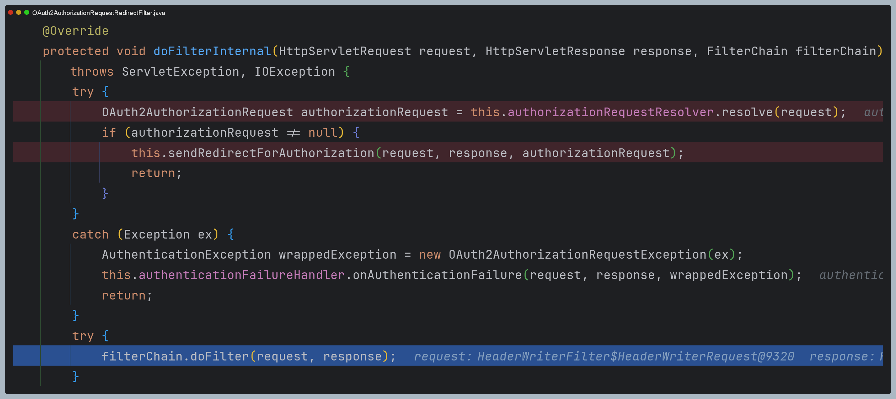

---

[이전 ↩️ - OAuth 2.0 Client(oauth2Login) - OAuth2LoginConfigurer](https://github.com/genesis12345678/TIL/blob/main/Spring/security/oauth/OAuth2Login/OAuth2LoginConfigurer.md)

[메인 ⏫](https://github.com/genesis12345678/TIL/blob/main/Spring/security/oauth/main.md)

[다음 ↪️ - OAuth 2.0 Client(oauth2Login) - Access Token 교환하기](https://github.com/genesis12345678/TIL/blob/main/Spring/security/oauth/OAuth2Login/Access%20Token.md)