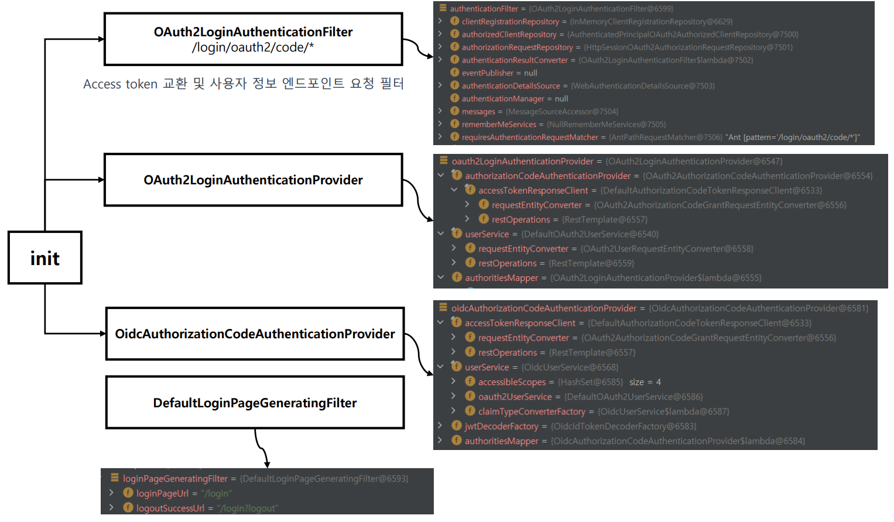
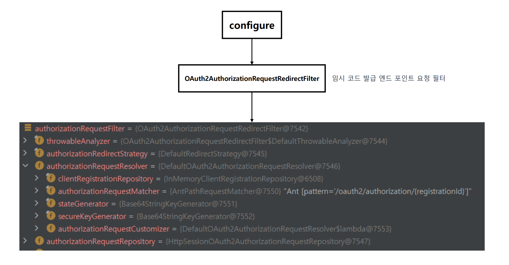
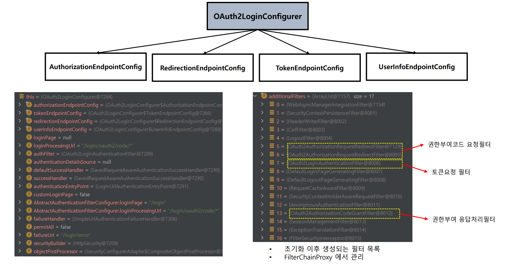
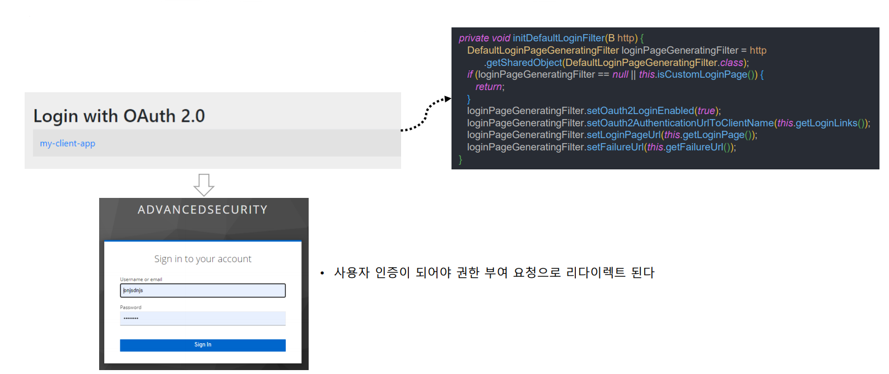

# oauth2Login() - OAuth2LoginConfigurer

```java
@Configuration
public class OAuth2ClientConfig {

    @Bean
    public SecurityFilterChain securityFilterChain(HttpSecurity http) throws Exception {
        http
                .authorizeHttpRequests(request -> request.anyRequest().authenticated())
                .oauth2Login(Customizer.withDefaults())
        ;
        return http.build();
    }
}
```

- 위 코드와 같이 `oauth2Login` API를 설정하면 스프링 시큐리티가 초기화 되면서 **OAuth2LoginConfigurer**가 실행 된다.

---



- `init` 과정에서 먼저 **OAuth2LoginAuthenticationFilter**가 생성된다.
  - 이 필터는 `/login/oauth2/code/*({registrationId})`로 요청이 올 때 동작한다.
- **OAuth2LoginAuthenticationFilter**는 요청에 따라 [AuthenticationProvider](https://github.com/genesis12345678/TIL/blob/main/Spring/security/security/AuthenticationArchitecture/AuthenticationProvider.md)의 구현체 중 하나인
  `OAuth2LoginAuthenicationProvider` 또는 `OidcAuthorizationCodeAuthenticationProvider` 에게 요청을 위임한다.
  - `OAuth2LoginAuthenicationProvider` : OAuth 2.0 인가 서버로부터 사용자 정보를 가져오는 Provider
  - `OidcAuthorizationCodeAuthenticationProvider` : [OpenID Connect](https://github.com/genesis12345678/TIL/blob/main/Spring/security/oauth/OpenID/OpenID.md) 를 사용해 사용자 정보를 가져오는 Provider

---



- `contigure` 과정에서는 **OAuth2AuthorizationRequestRedirectFilter**가 생성된다.
- `/oauth2/authorization/{registrationId}`로 요청이 올 때 동작한다.

---



- **OAuth2LoginConfigurer**는 각각의 엔드 포인트를 설정할 수 있는 속성들을 가지고 있다.

---

# OAuth 2.0 LoginPage 생성

- **OAuth 2.0 로그인 페이지 자동 생성**
  - 기본적으로 OAuth 2.0 로그인 페이지는 `DefaultLoginPageGeneratingFilter`가 자동으로 생성해준다.
  - 이 디폴트 로그인 페이지는 OAuth 2.0 클라이언트명을 보여준다.
  - 링크를 누르면 인가 요청(또는 OAuth 2.0 로그인)을 시작할 수 있다.



- **요청 매핑 URL**
  - `RequestMatcher` : `/oauth2/authorization/{registrationId}`
  - 디폴트 로그인 페이지를 재정의 하려면 `oauth2Login().loginPage()`를 사용하면 된다.

---

[메인 ⏫](https://github.com/genesis12345678/TIL/blob/main/Spring/security/oauth/main.md)

[다음 ↪️ - OAuth 2.0 Client(oauth2Login) - Authorization Code 요청하기](https://github.com/genesis12345678/TIL/blob/main/Spring/security/oauth/OAuth2Login/Authorization%20Code.md)
