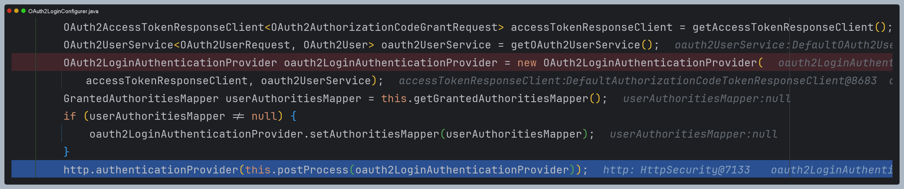

# oauth2Login() - OAuth2LoginConfigurer

- 별다른 설정을 하지 않으면 스프링 시큐리티 자동 초기화에 의해 기본값으로 `OAuth2LoginConfigurer`의 초기화 과정이 진행된다.

- `init` 과정에서 먼저 **OAuth2LoginAuthenticationFilter**가 생성된다.
  - 이 필터는 `/login/oauth2/code/*({registrationId})`로 요청이 올 때 동작한다.
- **OAuth2LoginAuthenticationFilter**는 요청에 따라 [AuthenticationProvider](https://github.com/genesis12345678/TIL/blob/main/Spring/security/security/AuthenticationArchitecture/AuthenticationProvider.md)의 구현체 중 하나인
  `OAuth2LoginAuthenicationProvider` 또는 `OidcAuthorizationCodeAuthenticationProvider` 에게 요청을 위임한다.
  - `OAuth2LoginAuthenicationProvider` : OAuth 2.0 인가 서버로부터 사용자 정보를 가져오는 Provider
  - `OidcAuthorizationCodeAuthenticationProvider` : [OpenID Connect](https://github.com/genesis12345678/TIL/blob/main/Spring/security/oauth/OpenID/OpenID.md) 를 사용해 사용자 정보를 가져오는 Provider

- `contigure` 과정에서는 **OAuth2AuthorizationRequestRedirectFilter**가 생성된다.
- `/oauth2/authorization/{registrationId}`로 요청이 올 때 동작한다.

- **OAuth2LoginConfigurer**는 각각의 엔드 포인트를 설정할 수 있는 속성들을 가지고 있다.

---

## 초기화 과정 디버깅

### init()

- `OAuth2LoginAuthenticationFilter` 생성

- `OAuth2LoginAuthenticationProvider` 생성

- `OidcAuthorizationCodeAuthenticationProvider` 생성
  - `JwtDecoder`는 `oauth2-client` 라이브러리를 추가하면 존재한다.

- `DefaultLoginPageGeneratingFilter` 생성

### configure()

- `OAuth2AuthorizationRequestRedirectFilter` 생성

- 엔드포인트 설정
  - 직접 `SecurityFilterChain`을 빈으로 등록했을 때 각각의 엔드포인트를 설정했을 때 저장된다.
  - 현재는 자동 초기화 과정이므로 아무것도 없다.

> 최종 만들어진 필터 목록
> 
> 

---

### OAuth 2.0 LoginPage 생성

- **OAuth 2.0 로그인 페이지 자동 생성**
  - 기본적으로 OAuth 2.0 로그인 페이지는 `DefaultLoginPageGeneratingFilter`가 자동으로 생성해준다.
  - 이 디폴트 로그인 페이지는 OAuth 2.0 클라이언트명을 보여준다.
  - 링크를 누르면 인가 요청(또는 OAuth 2.0 로그인)을 시작할 수 있다.

- **요청 매핑 URL**
  - `RequestMatcher` : `/oauth2/authorization/{registrationId}`
  - 디폴트 로그인 페이지를 재정의 하려면 `oauth2Login().loginPage()`를 사용하면 된다.

---

[메인 ⏫](https://github.com/genesis12345678/TIL/blob/main/Spring/security/oauth/main.md)

[다음 ↪️ - OAuth 2.0 Client(oauth2Login) - Authorization Code 요청하기](https://github.com/genesis12345678/TIL/blob/main/Spring/security/oauth/OAuth2Login/Authorization%20Code.md)
