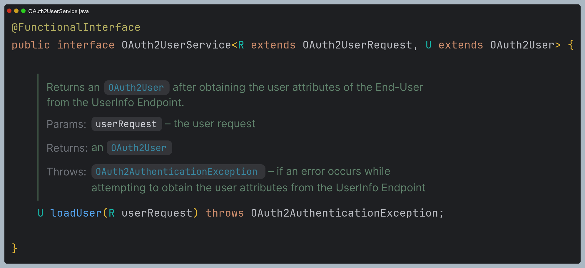
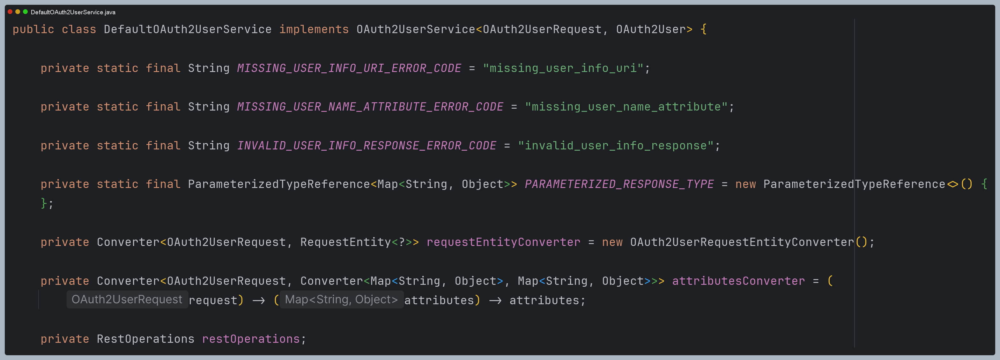
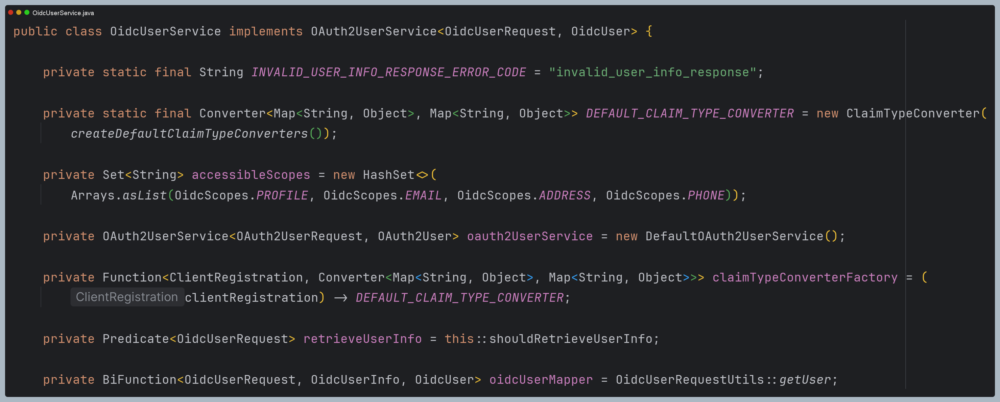
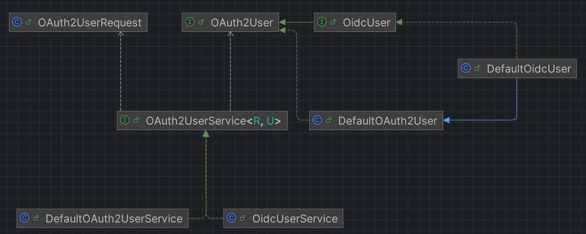
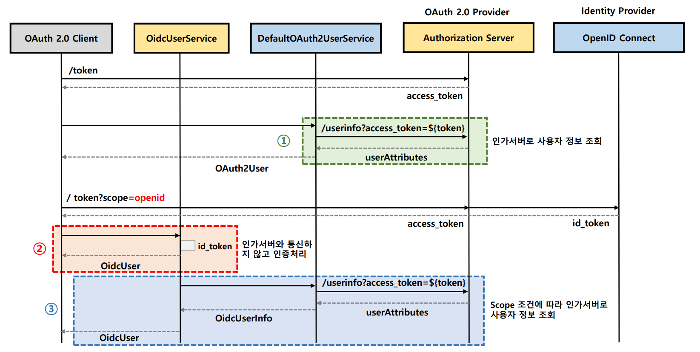
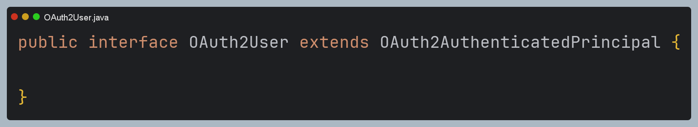
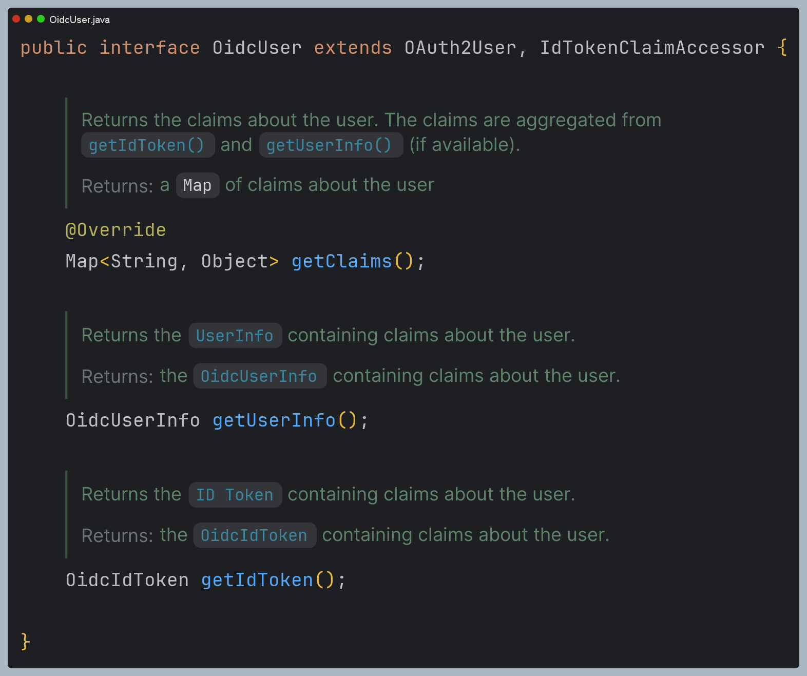
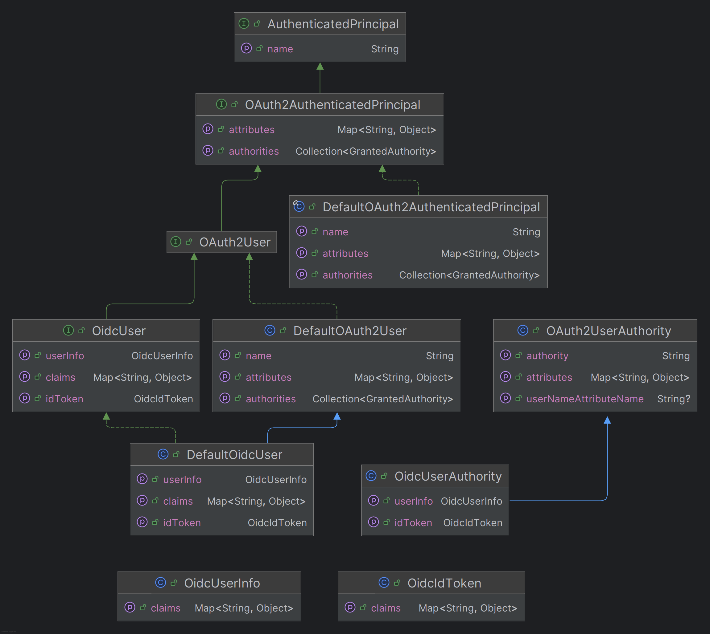

# oauth2Login() - OAuth 2.0 User 모델

> `UserInfo` 엔드포인트로 요청하는 과정을 보기 전에 OAuth 2.0 인증 과정에서 사용되는 User 모델에 대해 알아보자.

## OAuth2UserService

- 액세스 토큰을 사용해서 `UserInfo` 엔드포인트 요청으로 최종 사용자(리소스 소유자)의 속성을 가져오며 `OAuth2User` 타입의 객체를 리턴한다.
- 구현체로 **DefaultOAuth2UserService**와 **OidcUserService**가 제공된다.

### DefaultOAuth2UserService

- **표준 OAuth 2.0 Provider**(인가 서버)를 지원하는 `OAuth2UserService` 구현체다.
- `OAuth2UserRequest`에 `Access Token` 을 담아 인가 서버와 통신 후 사용자의 속성을 가지고 온다.
- 최종 `OAuth2User` 타입의 객체를 반환한다.

### OidcUserService

- **OpenID Connect 1.0 Provider**를 지원하는 `OAuth2UserService` 구현체다.
- `OidcUserRequest` 에 있는 `ID Token`을 통해 인증 처리를 하며 필요시 **DefaultOAuth2UserService**를 사용해서 `UserInfo` 엔드포인트의 사용자 속성을 요청한다.
- 최종 `OidcUser` 타입의 객체를 반환한다.

> 
> - **DefaultOAuth2UserService**는 `OAuth2User` 타입의 객체를 반환한다.
> - **OAuth2UserService**는 `OidcUser` 타입의 객체를 반환한다.
> - `OidcUserRequest`의 승인된 토큰에 포함되어 있는 **scope** 값이 `accessibleScopes` 의 값들 중 하나 이상
  포함되어 있을 경우 `UserInfo` 엔드 포인트를 요청할 수 있다.

### 흐름

---

## OAuth2User & OidcUser

- 스프링 시큐리티는 `UserAttributes` 및 `ID Token Claims`를 집계, 구성하여 **OAuth2User**와 **OidcUser** 타입의 클래스를 제공한다.

### OAuth2User

- **OAuth 2.0 Provider** 에 연결된 사용자 주체를 나타낸다.
- 최종 사용자의 인증에 대한 정보인 `Attributes`를 포함하고 있다.(`first name`, `middle name`, `address` 등으로 구성된다.)
- 기본 구현체는 **DefaultOAuth2User** 이며 인증 이후 `Authentication`의 `principal` 속성에 저장된다.

### OidcUser

- `OAuth2User` 를 상속한 인터페이스이며, **OIDC Provider**에 연결된 사용자 주체를 나타낸다.
- 최종 사용자의 인증에 대한 정보인 `Claims`를 포함하고 있으며 `OidcIdToken` 및 `OidcUserInfo` 에서 집계 및 구성된다.
- 기본 구현체는 **DefaultOidcUser** 이며 `DefaultOAuth2User`를 상속하고 있고, 인증 이후 `Authentication`의 `principal` 속성에 저장된다.

> 
> - **OAuth 2.0** 로그인을 통해 인증받은 최종 사용자의 `Principal` 에는 `OAuth2User` 또는 `OidcUSer` 타입의 객체가 저장된다.
> - 권한 부여 요청 시 `scope` 파라미터에 `openid`를 포함했다면 **OidcUser** 타입의 객체가 생성되고,
>   **OidcUser**는 `OidcUserInfo`와 `IdToken`을 가지고 있으며 최종 사용자에 대한 `Claims` 정보를 포함하고 있다.
> - `OAuth2UseAuthority`는 인가 서버로부터 수신한 `scope` 정보를 집계해서 권한 정보를 구성한다.
> - **OidcUser** 객체를 생성할 때 ID 토큰이 필요한데 이때 `JWT`로 된 ID 토큰은 JSON Web Signature(`JWS`)로 서명이 되어 있기 때문에 반드시 정해진 알고리즘에 의한
>   검증이 성공하면 **OidcUser** 객체를 생성해야 한다.

## 흐름

---

[이전 ↩️ - OAuth 2.0 Client(oauth2Login) - Access Token 교환하기](https://github.com/genesis12345678/TIL/blob/main/Spring/security/oauth/OAuth2Login/Access%20Token.md)

[메인 ⏫](https://github.com/genesis12345678/TIL/blob/main/Spring/security/oauth/main.md)

[다음 ↪️ - OAuth 2.0 Client(oauth2Login) - UserInfo 엔드포인트 요청하기](https://github.com/genesis12345678/TIL/blob/main/Spring/security/oauth/OAuth2Login/UserInfo.md)
