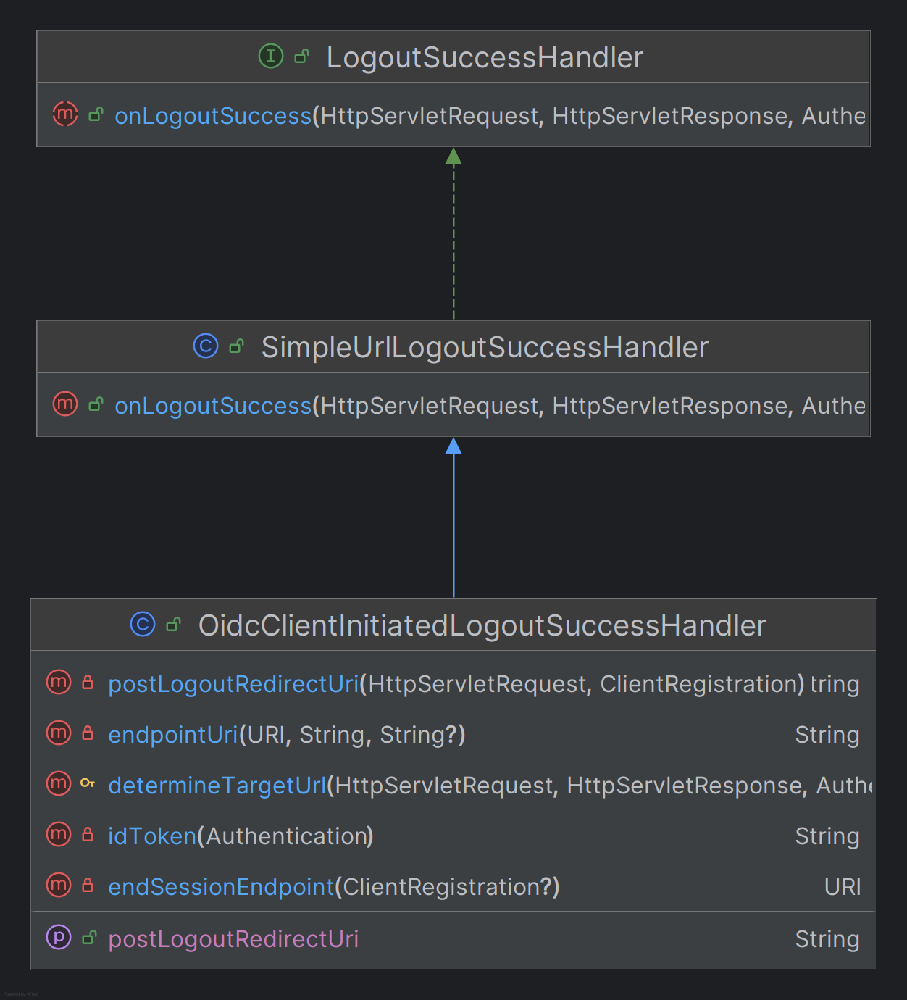
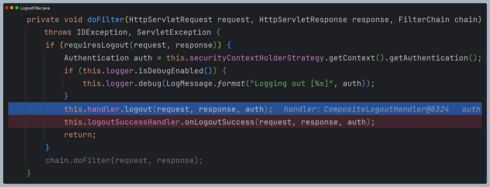
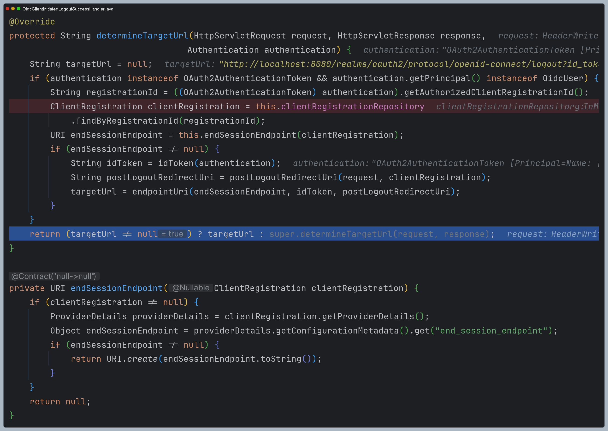

# oauth2Login() - OpenID Connect 로그아웃

- 클라이언트는 로그아웃 엔드포인트를 사용하여 웹 브라우저에 대한 세션과 쿠키를 지운다.
- 클라이언트 로그아웃 성공 후 `OidcClientInitiatedLogoutSuccessHandler`를 호출하여 **OpenID Provider** 세션 로그아웃을 요청한다.
- **OpenID Provider** 로그아웃이 성공하면 지정된 위치로 리다이렉트 한다.
- 인가 서버 메타 데이터 사양에 있는 로그아웃 엔드포인트는 `end_session_endpoint`로 정의되어 있다.
  - 예 - **keycloak** : `end_session_endpoint` = `http://localhost:8080/realms/oauth2/protocol/openid-connect/logout`



---

## 예제 코드

```java
@Configuration
@RequiredArgsConstructor
public class OAuth2ClientConfig {

    private final ClientRegistrationRepository clientRegistrationRepository;

    @Bean
    public SecurityFilterChain securityFilterChain(HttpSecurity http) throws Exception {
        http
                .authorizeHttpRequests(request -> request
                        .anyRequest().authenticated()
                )
                .oauth2Login(Customizer.withDefaults())
                .logout(logout -> logout
                        .logoutSuccessHandler(oidcLogoutSuccessHandler())
                        .invalidateHttpSession(true)
                        .clearAuthentication(true)
                        .deleteCookies("JSESSIONID")
                )
        ;

        return http.build();
    }

    private LogoutSuccessHandler oidcLogoutSuccessHandler() {
        OidcClientInitiatedLogoutSuccessHandler successHandler = 
                new OidcClientInitiatedLogoutSuccessHandler(clientRegistrationRepository);
        
        successHandler.setPostLogoutRedirectUri("http://localhost:8081/login");
        return successHandler;
    }
}
```

- `"/logout"`으로 요청하면 스프링 시큐리티가 제공하는 기본 로그아웃 화면이 보이고, 로그아웃 버튼을 클릭하면 
로그아웃이 수행되어 `LogoutFilter`에서 처리된다.



- 먼저 `CompositeLogoutHandler`를 호출하여 내부적인 로그아웃 처리를 한다. ([참고](https://github.com/geun-00/TIL/blob/main/Spring/security/security/AuthenticationProcess/Logout.md))
- 그리고 `logoutSuccessHandler`를 호출하는데 이 클래스는 설정 클래스에서 설정한 `OidcClientInitiatedLogoutSuccessHandler`이다.
- 아무 설정 하지 않으면 기본값으로 `SimpleUrlLogoutSuccessHandler`로 설정된다.



- `OidcClientInitiatedLogoutSuccessHandler`는 특별한 로그아웃 처리를 하는 것이 아니라 `end_session_endpoint`에
해당하는 url을 찾아 리다이렉트 할 url을 만드는 역할을 한다.
- 인가 서버로 만들어진 url로 인가 서버에 요청을 보내 로그아웃을 처리하게 하고, `setPostLogoutRedirectUri`에서 설정한
uri로 리다이렉션 된다.
- 이 uri는 인가 서버에도 등록이 되어 있어야 한다.

> - **Oidc**는 인증 기능이기 때문에 명확하게 로그아웃이 존재하는 것이 맞다. 따라서 `OidcClientInitiatedLogoutSuccessHandler` 같은
> 클래스도 스프링 시큐리티에서 지원하는 것이다.
> - 반면 **OAuth2**는 인증이 아닌 인가 기능이기 때문에 로그아웃과는 개념이 맞지 않다. 그래서 `Oauth2ClientInitiatedLogoutSuccessHandler` 같은
> 클래스는 존재하지 않는다.

---

[이전 ↩️ - OAuth 2.0 Client(oauth2Login) - UserInfo 엔드포인트 요청하기](https://github.com/genesis12345678/TIL/blob/main/Spring/security/oauth/OAuth2Login/UserInfo.md)

[메인 ⏫](https://github.com/genesis12345678/TIL/blob/main/Spring/security/oauth/main.md)

[다음 ↪️ - OAuth 2.0 Client(oauth2Login) - Spring MVC 인증 객체 참조](https://github.com/genesis12345678/TIL/blob/main/Spring/security/oauth/OAuth2Login/Spring%20MVC%20%EC%9D%B8%EC%A6%9D%20%EA%B0%9D%EC%B2%B4%20%EC%B0%B8%EC%A1%B0.md)