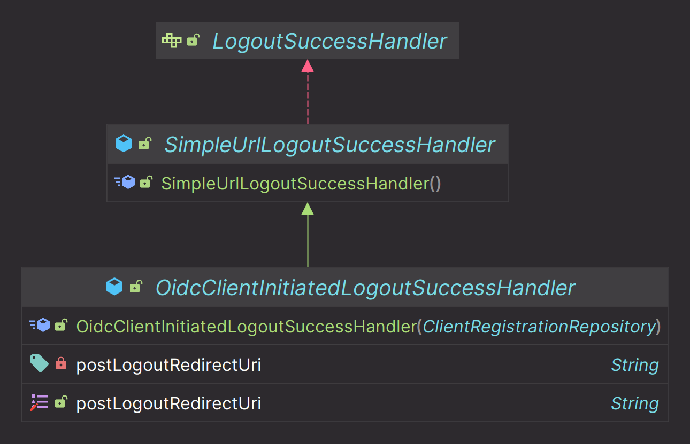

# oauth2Login() - OpenID Connect 로그아웃

- 클라이언트는 로그아웃 엔드포인트를 사용하여 웹 브라우저에 대한 세션과 쿠키를 지운다.
- 클라이언트 로그아웃 성공 후 `OidcClientInitiatedLogoutSuccessHandler`를 호출하여 **OpenID Provider** 세션 로그아웃을 요청한다.
- **OpenID Provider** 로그아웃이 성공하면 지정된 위치로 리다이렉트 한다.
- 인가 서버 메타 데이터 사양에 있는 로그아웃 엔드포인트는 `end_session_endpoint`로 정의되어 있다.
  - `end_session_endpoint` = `http://localhost:8080/realms/oauth2/protocol/openid-connect/logout`



---

```java
@Configuration
@RequiredArgsConstructor
public class OAuth2ClientConfig {

    private final ClientRegistrationRepository clientRegistrationRepository;

    @Bean
    public SecurityFilterChain securityFilterChain(HttpSecurity http) throws Exception {
        http
                .authorizeHttpRequests(request -> request
                        .anyRequest().authenticated()
                )
                .oauth2Login(Customizer.withDefaults())
                .logout(logout -> logout
                        .logoutSuccessHandler(oidcLogoutSuccessHandler())
                        .invalidateHttpSession(true)
                        .clearAuthentication(true)
                        .deleteCookies("JSESSIONID")
                )
        ;

        return http.build();
    }

    private LogoutSuccessHandler oidcLogoutSuccessHandler() {
        OidcClientInitiatedLogoutSuccessHandler successHandler = 
                new OidcClientInitiatedLogoutSuccessHandler(clientRegistrationRepository);
        
        successHandler.setPostLogoutRedirectUri("http://localhost:8081/login");

        return successHandler;
    }
}
```

---

[이전 ↩️ - OAuth 2.0 Client(oauth2Login) - UserInfo 엔드포인트 요청하기]()

[메인 ⏫](https://github.com/genesis12345678/TIL/blob/main/Spring/security/oauth/main.md)

[다음 ↪️ - OAuth 2.0 Client(oauth2Login) - Spring MVC 인증 객체 참조]()