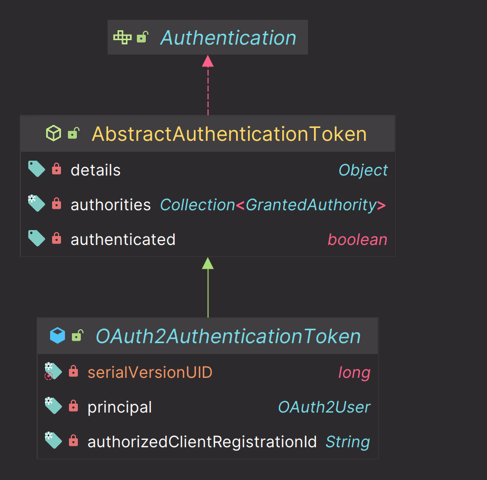

# oauth2Login() - Spring MVC 인증 객체 참조

## Authentication

- `public void method(Authentication authentication){...}`
  - `oauth2Login()`으로 인증을 받게 되면 **Authentication**은 `OAuth2AuthenticationToken` 타입의 객체로 바인딩 된다.
  - **principal** 에는 `OAuth2User` 타입 또는 `OidcUser` 타입의 구현체가 저장된다.
  - `DefaultOAuth2User` 는 `/userInfo` 엔드포인트 요청으로 받은 **User** 클레임 정보로 생성된 객체이다.
  - `DefaultOidcUser` 는 `OpenID Connect` 인증을 통해 **ID Token** 및 클레임 정보가 포함된 객체이다.



## @AuthenticationPrincipal

-  `public void method(@AuthenticationPrincipal OAuth2User principal or OidcUser principal){...}`
  - `AuthenticationPrincipalArgumentResolver` 클래스에서 요청을 가로채어 바인딩 처리를 한다.
  - **Authentication**을 `SecurityContext` 로부터 꺼내 와서 **Principal** 속성에 `OAuth2User` 또는 `OidcUser` 타입의 객체를 저장한다.

---

```java
@RestController
public class IndexController {

    @GetMapping("/user")
    public OAuth2User user(Authentication authentication) {
        // authentication1 == authentication2
        OAuth2AuthenticationToken authentication1 = (OAuth2AuthenticationToken) SecurityContextHolder.getContextHolderStrategy().getContext().getAuthentication();
        OAuth2AuthenticationToken authentication2 = (OAuth2AuthenticationToken) authentication;

        OAuth2User oAuth2User = authentication2.getPrincipal();
        return oAuth2User;
    }

    @GetMapping("/oauth2User")
    public OAuth2User oauth2User(@AuthenticationPrincipal OAuth2User oAuth2User) {
        System.out.println("oAuth2User = " + oAuth2User);

        return oAuth2User;
    }

    @GetMapping("/oidcUser")
    public OidcUser oidcUser(@AuthenticationPrincipal OidcUser oidcUser) {
        System.out.println("oidcUser = " + oidcUser);

        return oidcUser;
    }
}
```

---

[이전 ↩️ - OAuth 2.0 Client(oauth2Login) - OpenID Connect 로그아웃](https://github.com/genesis12345678/TIL/blob/main/Spring/security/oauth/OAuth2Login/OpenID%20Connect%20%EB%A1%9C%EA%B7%B8%EC%95%84%EC%9B%83.md)

[메인 ⏫](https://github.com/genesis12345678/TIL/blob/main/Spring/security/oauth/main.md)

[다음 ↪️ - OAuth 2.0 Client(oauth2Login) - API 커스텀 - `Authorization BaseUrl` & `Redirection BaseUrl`](https://github.com/genesis12345678/TIL/blob/main/Spring/security/oauth/OAuth2Login/API%EC%BB%A4%EC%8A%A4%ED%85%801.md)