# oauth2Login() - UserInfo 엔드포인트 요청하기

# OAuth 2.0 Provider UserInfo

## 주요 클래스

### DefaultOAuth2UserService

- `public OAuth2User loadUser(OAuth2UserRequest userRequest)`

### OAuth2UserRequestEntityConverter

- `OAuth2UserRequest`를 **RequestEntity**로 컨버터 한다.

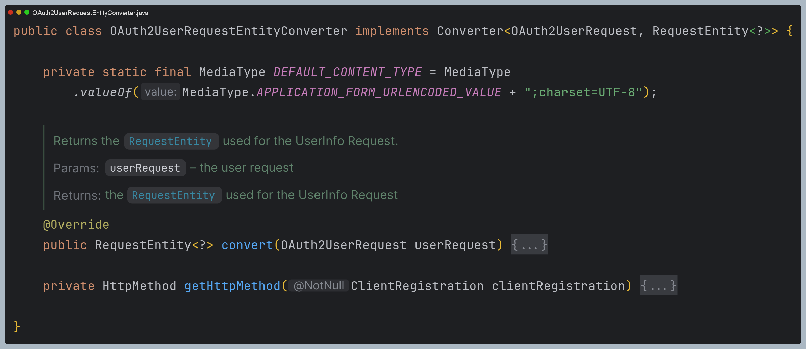

### RestOperations

- `RequestEntity`로 인가 서버에 요청하고 `ResponseEntity`로 응답 받는다.
- `OAuth2User` 타입의 객체를 반환한다.

**요청 URI**

- `POST`, `/userinfo`

---

# 과정 디버깅

## 1. OAuth2LoginAuthenticationFilter

- `AuthenticationManager(ProviderManager)`에게 인증 요청 위임

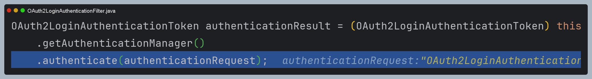

## 2. OAuth2LoginAuthenticationProvider

- 스코프에 `openid`가 포함되어 있지 않은지 확인

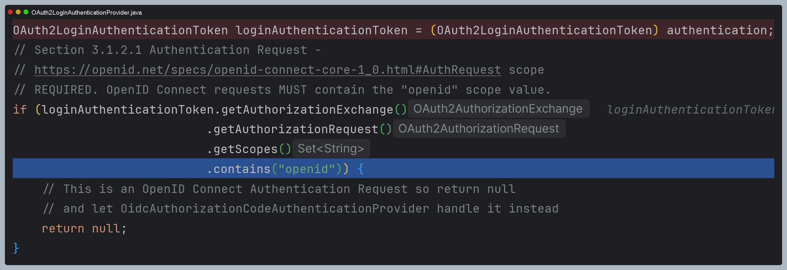

- `OAuth2AuthorizationCodeAuthenticationProvider` 호출

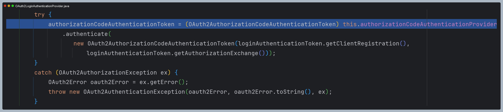

## 3. OAuth2AuthorizationCodeAuthenticationProvider

- 인가 서버와 통신하기 위해 `DefaultAuthorizationCodeTokenResponseClient` 호출

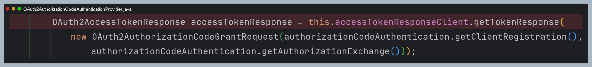

## 4. DefaultAuthorizationCodeTokenResponseClient

- 인가 서버와 통신 후 `OAuth2AccessTokenResponse`를 반환

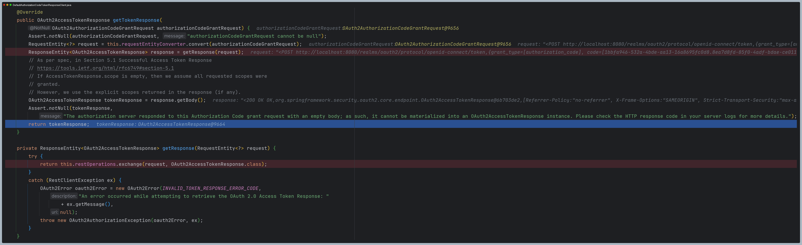

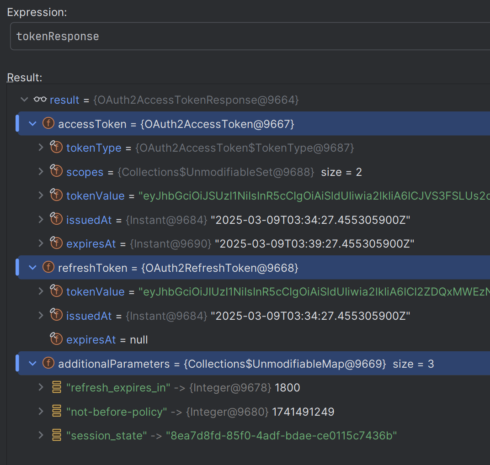

## 5. OAuth2AuthorizationCodeAuthenticationProvider

- 반환 받은 `OAuth2AccessTokenResponse`로 `OAuth2AuthorizationCodeAuthenticationToken`을 생성해서 반환

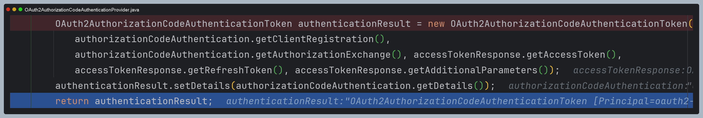

## 6. OAuth2LoginAuthenticationProvider

- 반환 받은 `OAuth2AuthorizationCodeAuthenticationToken`의 정보로 `OAuth2UserRequest`를 만들어 
`DefaultOAuth2UserService`에게 **UserInfo** 엔드포인트 요청

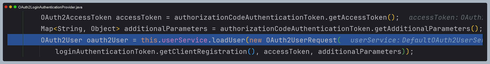

## 7. DefaultOAuth2UserService

- 인가 서버와 통신 후 반환된 결과를 이용해 `OAuth2User` 반환

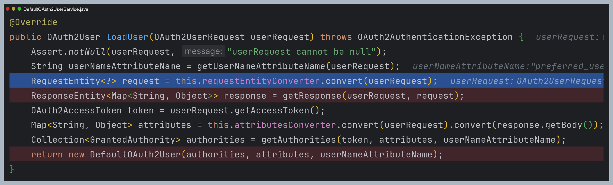

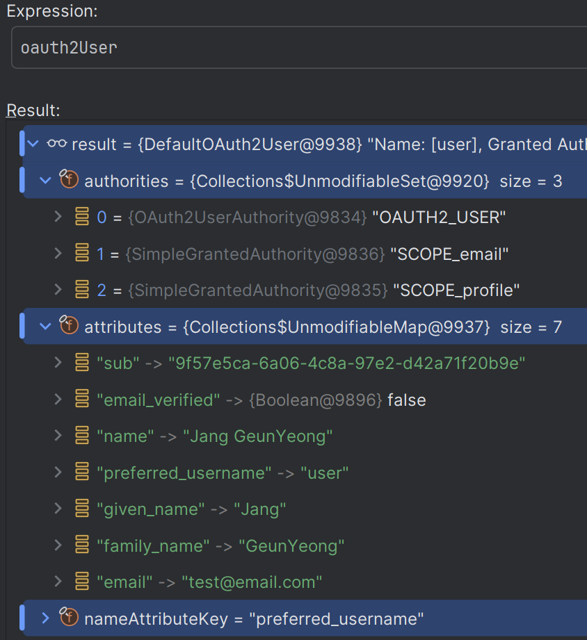

## 8. OAuth2LoginAuthenticationProvider

- `OAuth2LoginAuthenticationToken` 생성 후 반환

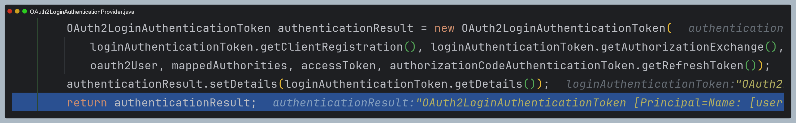

## 9. OAuth2LoginAuthenticationFilter

- 인증 받은 객체 정보를 저장

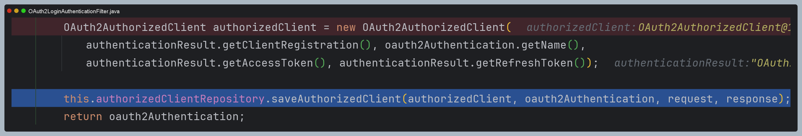

## 10. AbstractAuthenticationProcessingFilter

- 인증 객체를 `SecurityContext`에 저장

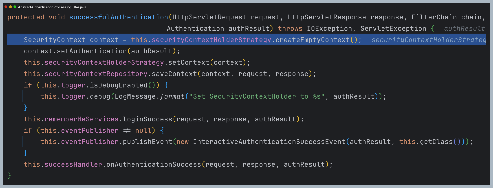

---

# OpenID Connect Provider UserInfo

## 주요 클래스

### OidcUserService

- `public OidcUser loadUser(OidcUserRequest userRequest)`

- 내부에 **DefaultOAuth2UserService**를 가지고 있어 OIDC 사양에 부합할 경우 `OidcUserRequest` 를 넘겨 주어 인가 서버와 통신한다.
- `OidcUser` 타입의 객체를 반환한다.

**요청 URI**

- `POST`, `/userinfo`

---

# 과정 디버깅

⬇️

## 1. OAuth2LoginAuthenticationFilter

- `AuthenticationManager(ProviderManager)`에게 인증 요청 위임

## 2. OidcAuthorizationCodeAuthenticationProvider

- 스코프에 `openid`가 포함되어 있는지 확인

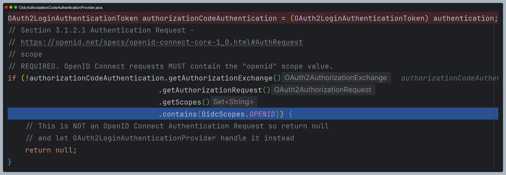

- 인가 서버와 통신하기 위해 `DefaultAuthorizationCodeTokenResponseClient` 호출

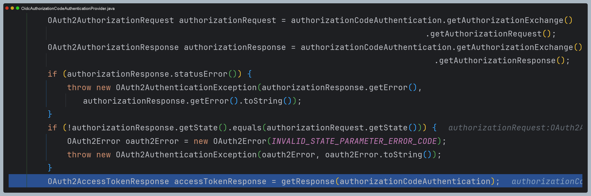

## 3. DefaultAuthorizationCodeTokenResponseClient

- 인가 서버와 통신 후 `OAuth2AccessTokenResponse`를 반환

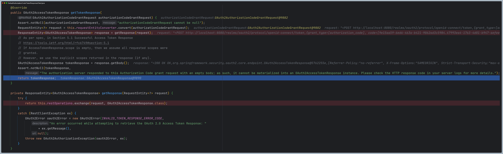

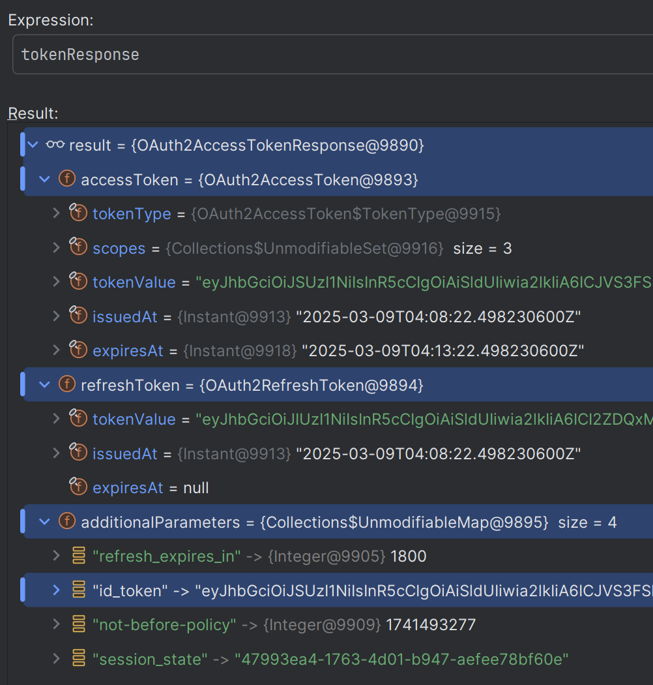

## 4. OidcAuthorizationCodeAuthenticationProvider

- 반환 받은 `OAuth2AccessTokenResponse`로 `OidcIdToken`을 생성 후
해당 토큰을 검증

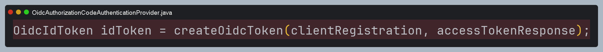

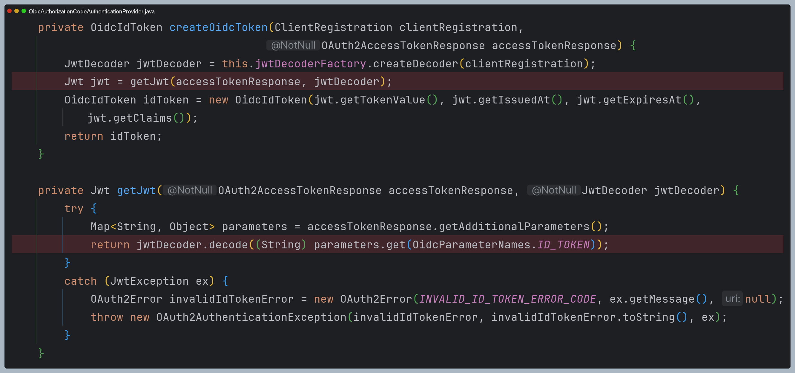

- 생성된 `OidcIdToken`을 이용해 `OidcUserRequest`를 생성 후
  `OidcUserService`에게 **UserInfo** 엔드포인트 요청

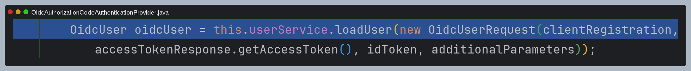

### 5. OidcUserService

- 특정 조건이 참이 아니면 추가적으로 인가 서버와 통신할 필요
없이 바로 `IdToken`만으로 인증 처리를 해버릴 수 있는지 판단한다.

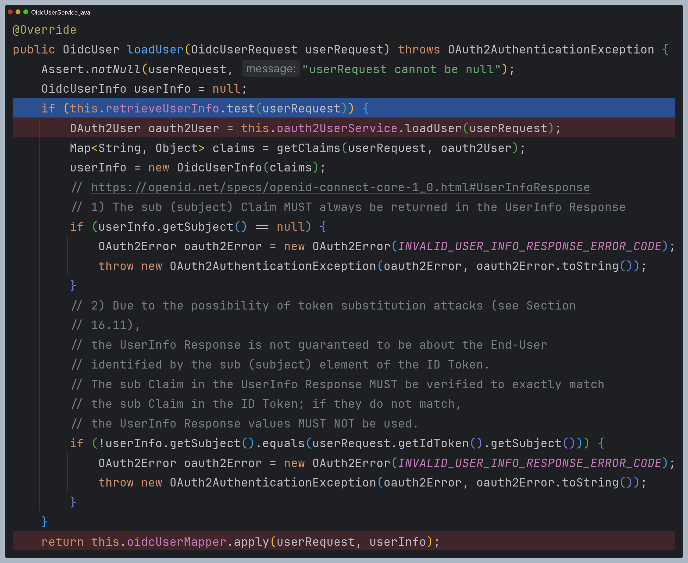

- 그렇다면 어떤 조건을 보는지 확인해보자.

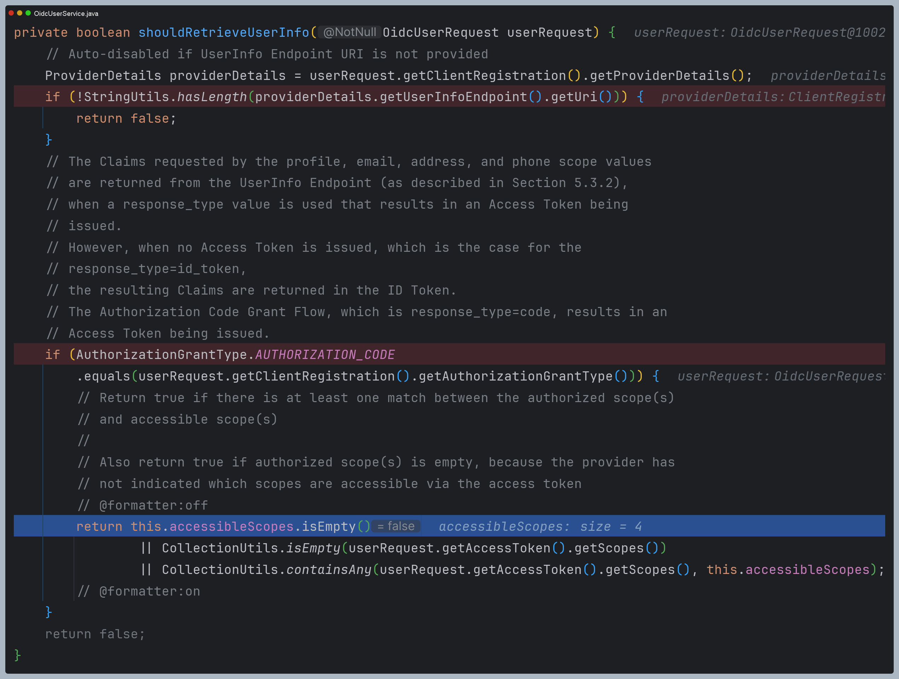

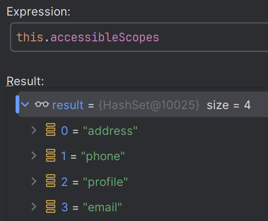

- **UserInfo** 엔드포인트, 권한 부여 유형, 그리고 요청 스코프가
`accessibleScopes`에 하나라도 포함되어 있는지 확인한다.
- 만약 요청 스코프가 `openid` 하나만 있는 경우 `false`를 반환한다.

추가적인 통신이 필요하면 `DefaultOAuth2UserService`에게 요청 후 클레임 정보를
반환받아 그 클레임 정보를 `OidcUserInfo`에 추가로 저장한 후 다음 공통 처리를 수행한다.

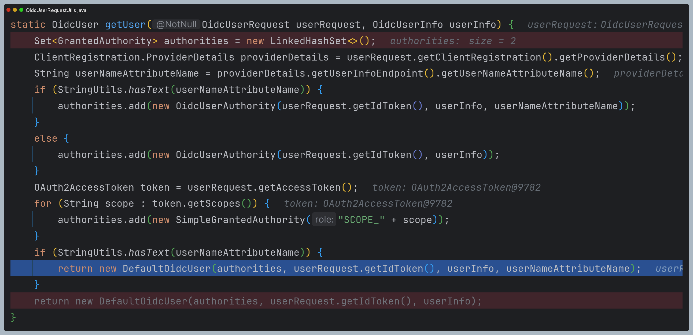

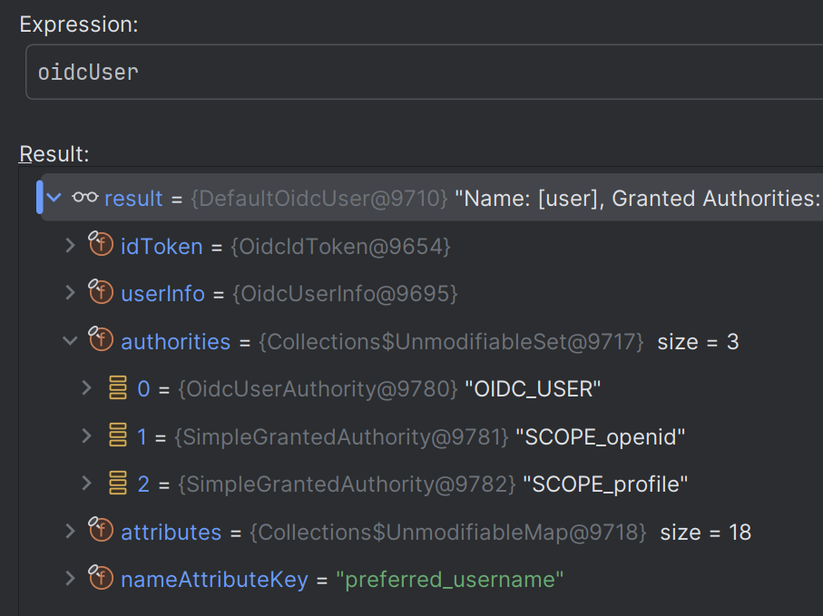

### 6. OidcAuthorizationCodeAuthenticationProvider

- 반환 받은 `OidcUser` 정보를 이용해 `OAuth2LoginAuthenticationToken`을
생성해 반환한다.

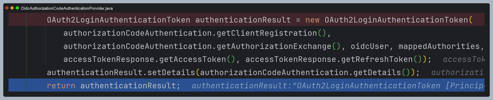

## 7. OAuth2LoginAuthenticationFilter

- 인증 받은 객체 정보를 저장

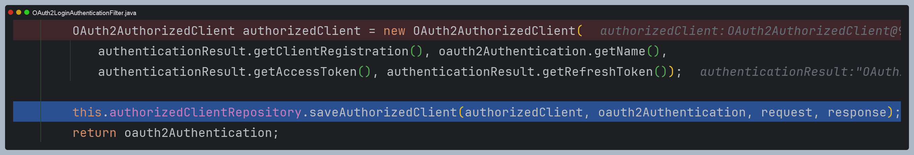

## 8. AbstractAuthenticationProcessingFilter

- 인증 객체를 `SecurityContext`에 저장

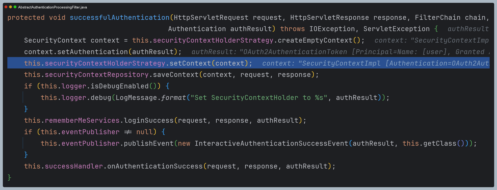

---

[이전 ↩️ - OAuth 2.0 Client(oauth2Login) - OAuth 2.0 User 모델](https://github.com/genesis12345678/TIL/blob/main/Spring/security/oauth/OAuth2Login/OAuthUser.md)

[메인 ⏫](https://github.com/genesis12345678/TIL/blob/main/Spring/security/oauth/main.md)

[다음 ↪️ - OAuth 2.0 Client(oauth2Login) - OpenID Connect 로그아웃](https://github.com/genesis12345678/TIL/blob/main/Spring/security/oauth/OAuth2Login/OpenID%20Connect%20%EB%A1%9C%EA%B7%B8%EC%95%84%EC%9B%83.md)