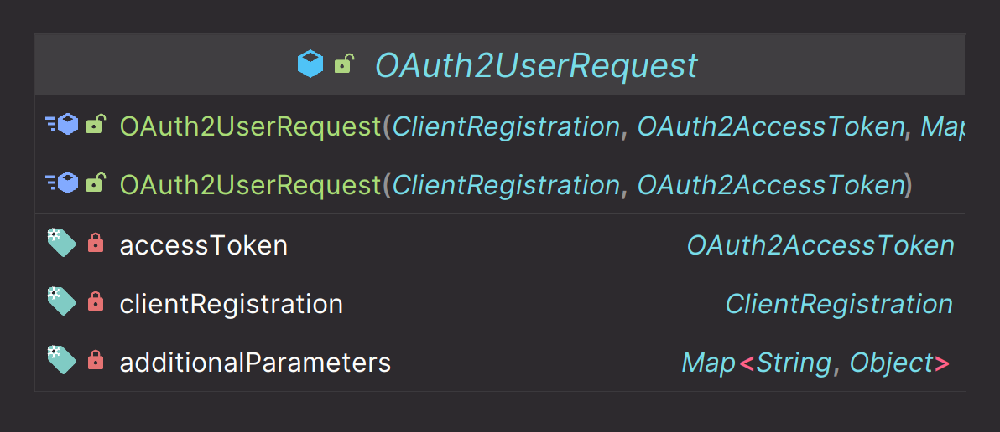
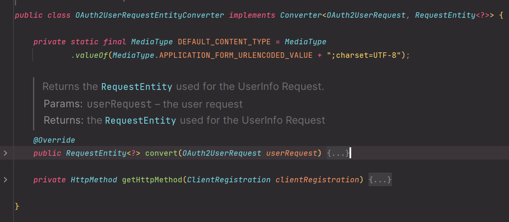
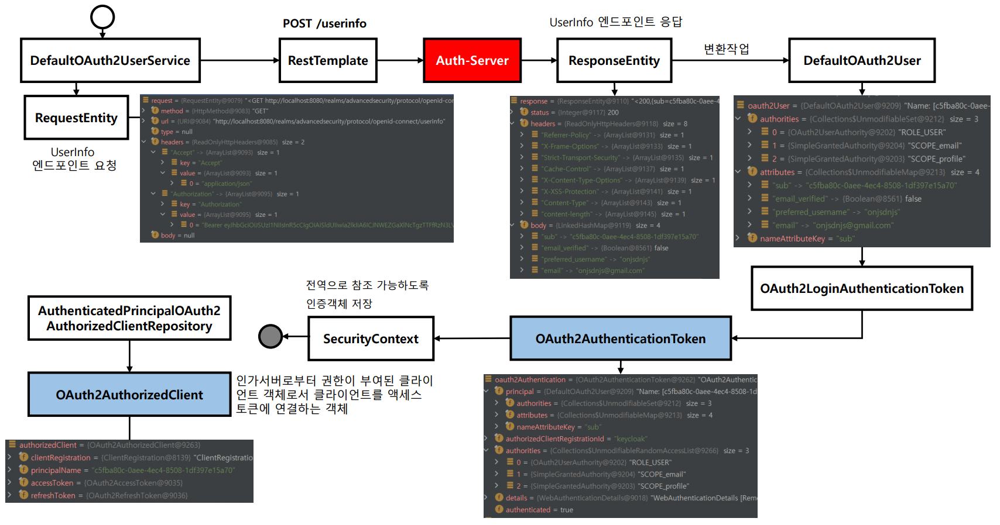
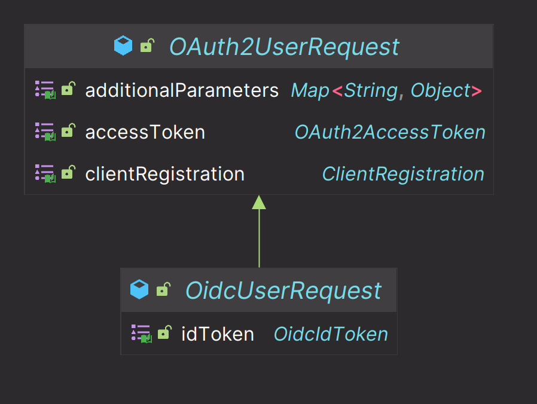
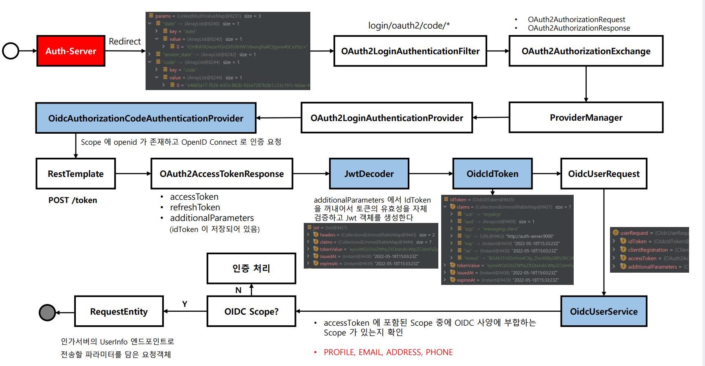
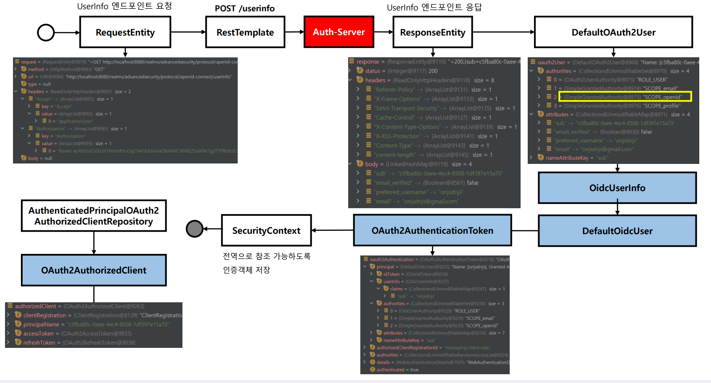

# oauth2Login() - UserInfo 엔드포인트 요청하기

# OAuth 2.0 Provider UserInfo

## 주요 클래스

### DefaultOAuth2UserService

- `public OAuth2User loadUser(OAuth2UserRequest userRequest)`

### OAuth2UserRequestEntityConverter

- `OAuth2UserRequest`를 **RequestEntity**로 컨버터 한다.

### RestOperations

- `RequestEntity`로 인가 서버에 요청하고 `ResponseEntity`로 응답 받는다.
- `OAuth2User` 타입의 객체를 반환한다.

**요청 URI**

- `POST`, `/userinfo`

---

## 흐름

---

# OpenID Connect Provider UserInfo

## 주요 클래스

### OidcUserService

- `public OidcUser loadUser(OidcUserRequest userRequest)`

- 내부에 **DefaultOAuth2UserService**를 가지고 있어 OIDC 사양에 부합할 경우 `OidcUserRequest` 를 넘겨 주어 인가 서버와 통신한다.
- `OidcUser` 타입의 객체를 반환한다.

**요청 URI**

- `POST`, `/userinfo`

---

## 흐름

⬇️

---

[이전 ↩️ - OAuth 2.0 Client(oauth2Login) - OAuth 2.0 User 모델]()

[메인 ⏫](https://github.com/genesis12345678/TIL/blob/main/Spring/security/oauth/main.md)

[다음 ↪️ - OAuth 2.0 Client(oauth2Login) - OpenID Connect 로그아웃]()