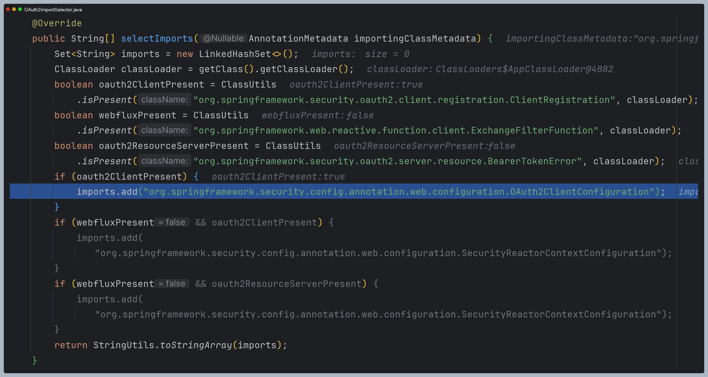

# OAuth 2.0 Client - 자동 설정에 의한 초기화 과정

---

# 초기화 과정 디버깅

## OAuth2ImportSelector

## OAuth2WebSecurityConfiguration

## OAuth2ClientRegistrationRepositoryConfiguration

## OAuth2ClientWebMvcSecurityConfiguration

---

[이전 ↩️ - OAuth 2.0 Client - ClientRegistrationRepository](https://github.com/genesis12345678/TIL/blob/main/Spring/security/oauth/OAuthClient/ClientRegistrationRepository.md)

[메인 ⏫](https://github.com/genesis12345678/TIL/blob/main/Spring/security/oauth/main.md)
