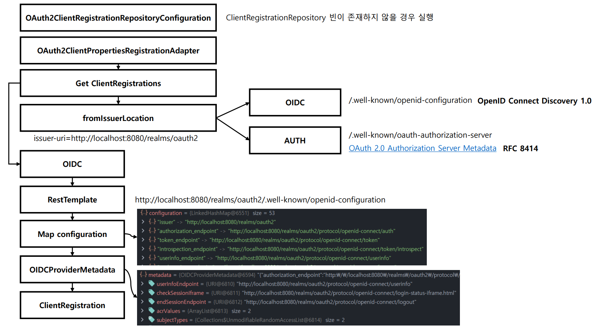
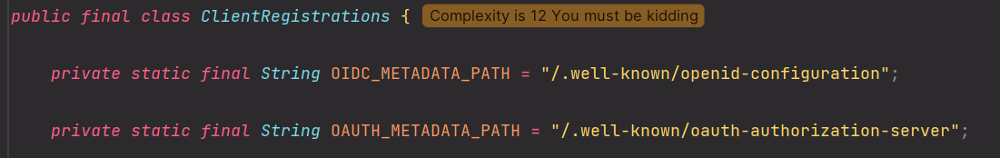

# OAuth 2.0 Client - ClientRegistration

- `OAuth 2.0` 또는 `OpenID Connect 1.0 Provider` 에서 클라이언트의 등록 정보를 나타낸다.
- **ClientRegistration**은 `OpenID Connect 1.0 Provider`의 설정 엔드포인트나 인가 서버의 메타데이터 엔드포인트를 찾아 초기화할 수 있다.

> - **registrationId**
>   - **ClientRegistration**을 식별할 수 있는 유니크한 ID
> - **clientId**
>   - 클라이언트 식별자
> - **clientSecret**
>   - 클라이언트 secret
> - **clientAuthenticationMethod**
>   - `provider`에서 클라이언트를 인증할 때 사용할 메서드로서 `basic`, `post`, `none`(public 클라이언트)을 지원한다.
> - **authorizationGrantType**
>   - OAuth 2.0 인가 프레임워크는 네 가지 권한 부여 타입을 정의하고 있다.
>   - 지원하는 값은 `authorization_code`, `implicit`, `client_credentials`, `password` 이다.
> - **redirectUri**
>   - 클라이언트에 등록한 리다이렉트 URL로, 사용자의 인증으로 클라이언트에 접근 권한을 부여하고 나면 인가 서버가 이 URL로 최종 사용자의 브라우저를 리다이렉트 시킨다.
> - **scopes**
>   - 인가 요청 흐름에서 클라이언트가 요청한 openid, email, profile 등의 scope
> - **authorizationUri**
>   - 인가 서버의 인가 엔드포인트 URI
> - **tokenUri**
>   - 인가 서버의 토큰 엔드포인트 URI
> - **(userInfoEndpoint) uri**
>   - 인증된 최종 사용자의 클레임 / 속성에 접근할 때 사용하는 `UserInfo` 엔드포인트 URI
> - **(userInfoEndpoint) authenticationMethod**
>   - `UserInfo` 엔드포인트로 액세스 토큰을 전송할 때 사용할 인증 메서드
>   - `header`, `form`, `query` 를 지원한다.
> - **(userInfoEndpoint) userNameAttributeName**
>   - `UserInfo` 응답에 있는 속성 이름으로, 최종 사용자의 이름이나 식별자에 접근할 때 사용한다.
>   - 인가 서버마다 값이 다르다.
> - **jwtSetUri**
>   - 인가 서버에서 JSON 웹 키(`JWK`) 셋을 가져올 때 사용할 URI.
>   - 이 키 셋엔 ID 토큰의 JSON Web Signature(`JWS`)를 검증할 때 사용할 암호키가 있으며, `UserInfo` 응답을 검증할 때도 사용할 수 있다.
> - **configurationMetadata**
>   - `OpenId Provider` 설정 정보로서 `application.yml`에 `provider.issuerUri`를 설정했을 때만 사용할 수 있다.

---

## CommonOAuth2Provider

- **OAuth 2.0** 공급자 정보를 제공하는 클래스로서 글로벌 서비스 제공자 일부는 기본으로 제공되어진다.
- `Client ID`와 `Client Secret`은 별도로 `application.yml`에 작성해야 한다.
- **Naver**나 **Kakao** 같은 국내 공급자 정보는 위의 모든 항목을 수동으로 작성해서 사용해야 한다.
- 클라이언트 기준인 `Registration` 항목과 서비스 제공자 기준인 `Provider` 항목으로 구분하여 설정한다.
- `application.yml`이 아닌 **Java Config** 방식으로도 `ClientRegistration` 등록을 설정할 수 있다.
- **ClientRegistration** 객체를 생성할 수 있는 빌더 클래스를 반환한다.

---

> 현재 **OAuth2ClientPropertiesRegistrationAdapter**는 Deprecated 되었고, 현재는 `OAuth2ClientPropertiesMapper` 을 사용한다.
> 
> 

> **ClientRegistrations**는 유틸 클래스로, `issuer-uri`를 지정하면 `fromIssuerLocation` 메서드를 통해 **OIDC** 또는 **AUTH** 방식으로 인가 서버로부터 메타 데이터를 가져온다.

---

[이전 ↩️ - OAuth 2.0 Client - `application.yml`, `OAuth2ClientProperties`](https://github.com/genesis12345678/TIL/blob/main/Spring/security/oauth/OAuthClient/YmlProperties.md)

[메인 ⏫](https://github.com/genesis12345678/TIL/blob/main/Spring/security/oauth/main.md)

[다음 ↪️ - OAuth 2.0 Client - `ClientRegistrationRepository`](https://github.com/genesis12345678/TIL/blob/main/Spring/security/oauth/OAuthClient/ClientRegistrationRepository.md)
