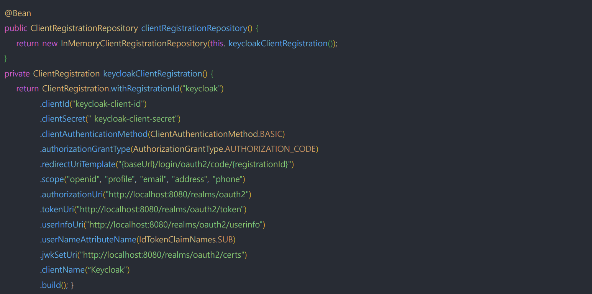

# OAuth 2.0 Client - ClientRegistrationRepository

- **ClientRegistrationRepository** 는 `OAuth 2.0`, `Open Id Connect 1.0`의 **ClientRegistration** 저장소 역할을 한다.
- 클라이언트 등록 정보는 궁극적으로 인가 서버가 저장하고 관리하는데 이 레포지토리는 인가 서버에 일차적으로 저장된 클라이언트 등록 정보의 일부를 검색하는 기능을 제공한다.
- 스프링 부트 자동 설정으로 `spring.security.oauth2.client.registration.[registrationId]` 하위 정보를 **ClientRegistration** 인스턴스에 바인딩하며, 각 **ClientRegistration** 객체를
 `ClientRegistrationRepository` 안에 구성한다.
- `ClientRegistrationRepository`의 기본 구현체는 **InMemoryClientRegistrationRepository** 이다.
- 자동 설정을 사용하면 `ClientRegistrationRepository`도 빈으로 등록되므로 원하는 곳에 의존성을 주입할 수 있다.


---

## ClientRegistration / ClientRegistrationRepository 수동 빈 등록



---

```java
@Configuration
public class OAuth2ClientConfig {

    @Bean
    public ClientRegistrationRepository clientRegistrationRepository() {
        return new InMemoryClientRegistrationRepository(keyCloakClientRegistration());
    }

    private ClientRegistration keyCloakClientRegistration() {
        return ClientRegistrations.fromIssuerLocation("http://localhost:8080/realms/oauth2")
                .registrationId("keycloak")
                .scope("openid")
                .clientId("oauth2-client-app")
                .clientSecret("ANwKmYvCcxiQbjsi4jh1JHqUWikngjec")
                .redirectUri("http://localhost:8081/login/oauth2/code/keycloak")
                .build();
    }
}
```
```java
@RestController
@RequiredArgsConstructor
public class IndexController {

    private final ClientRegistrationRepository clientRegistrationRepository;

    @GetMapping("/")
    public String index() {
        ClientRegistration clientRegistration = clientRegistrationRepository.findByRegistrationId("keycloak");

        String clientId = clientRegistration.getClientId();
        System.out.println("clientId = " + clientId);

        String registrationId = clientRegistration.getRegistrationId();
        System.out.println("registrationId = " + registrationId);

        String redirectUri = clientRegistration.getRedirectUri();
        System.out.println("redirectUri = " + redirectUri);
        return "index";
    }
}
```

---

[이전 ↩️ - OAuth 2.0 Client - ClientRegistration]()

[메인 ⏫](https://github.com/genesis12345678/TIL/blob/main/Spring/security/oauth/main.md)

[다음 ↪️ - OAuth 2.0 Client - 자동 설정에 의한 초기화 과정]()
