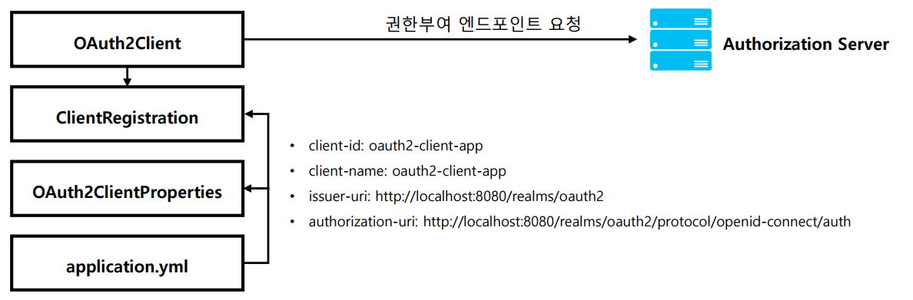
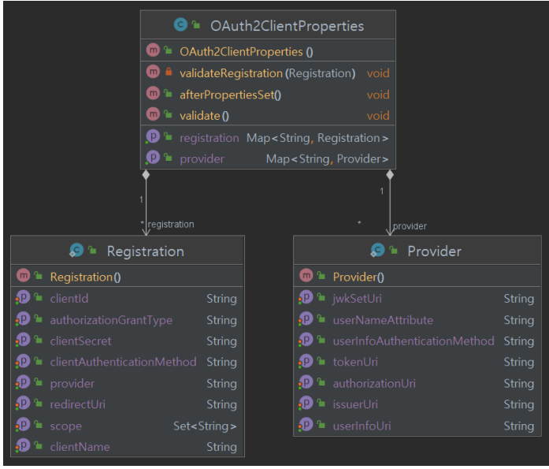

# OAuth 2.0 Client - `application.yml`, `OAuth2ClientProperties`

## 클라이언트 권한 부여 요청 시작

1. 클라이언트가 인가 서버로 권한 부여 요청을 하거나 토큰 요청을 할 경우 클라이언트 정보 및 엔드포인트 정보를 참조해서 전달한다.
2. `application.yml` 환경설정 파일에 클라이언트 설정과 인가 서버 엔드포이트 설정을 한다.
3. 초기화가 진행되면 `applcation.yml`에 클라이언트 및 엔드포인트 정보가 `OAuth2ClientProperties` 의 각 속성에 바인딩 된다.
4. `OAuth2ClientProperties` 에 바인딩 되어 있는 속성의 값은 인가 서버로 권한 부여 요청을 하기 위한 **ClientRegistration** 클래스의 필드에 저장된다.
5. `OAuth2Client`는 **ClientRegistration** 을 참조해서 권한 부여 요청을 위한 매개변수를 구성하고 인가 서버와 통신한다.



---

## application.yml


---

## OAuth2ClientProperties




- **Registration** 은 인가 서버에 등록된 클라이언트 및 요청 파라미터 정보를 나타낸다.
- **Provider** 는 공급자에게 제공하는 엔드포인트 등의 정보를 나타낸다.
- 클라이언트 및 공급자의 정보를 각각 `registration`, `provider` 맵에 저장하고 인가 서버와의 통신 시 각 항목을 참조하여 사용한다.

---

```yaml
spring:
  security:
    oauth2:
      client:
        registration:
          keycloak:
            client-id: oauth2-client-app
            client-name: oauth2-client-app
            client-secret: ANwKmYvCcxiQbjsi4jh1JHqUWikngjec
            redirect-uri: http://localhost:8081/login/oauth2/code/keycloak # /login/oauth2/code 는 스프링 시큐리티에서 정해놓은 기본값
            authorization-grant-type: authorization_code
            client-authentication-method: client_secret_basic
            scope:
              - openid
              - email
              - profile
        provider:
          keycloak:
            authorization-uri: http://localhost:8080/realms/oauth2/protocol/openid-connect/auth
            token-uri: http://localhost:8080/realms/oauth2/protocol/openid-connect/token
            issuer-uri: http://localhost:8080/realms/oauth2
            user-info-uri: http://localhost:8080/realms/oauth2/protocol/openid-connect/userinfo
            jwk-set-uri: http://localhost:8080/realms/oauth2/protocol/openid-connect/certs
            user-name-attribute: preferred_username
```
> `key`를 **keycloak**으로 하는 `registration`과 `provider`가 각각 Map에 저장된다.

---

[이전 ↩️ - OAuth 2.0 Client - OAuth 2.0 Client](https://github.com/genesis12345678/TIL/blob/main/Spring/security/oauth/OAuthClient/OAuthClient.md)

[메인 ⏫](https://github.com/genesis12345678/TIL/blob/main/Spring/security/oauth/main.md)

[다음 ↪️ - OAuth 2.0 Client - ClientRegistration](https://github.com/genesis12345678/TIL/blob/main/Spring/security/oauth/OAuthClient/ClientRegistration.md)
