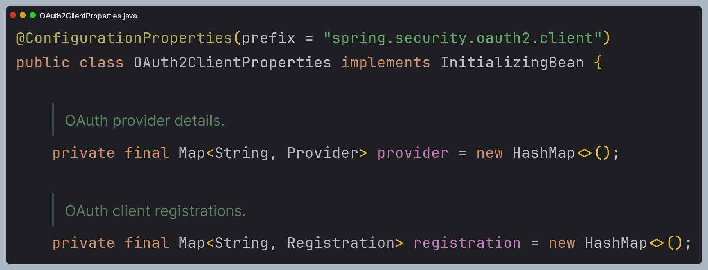
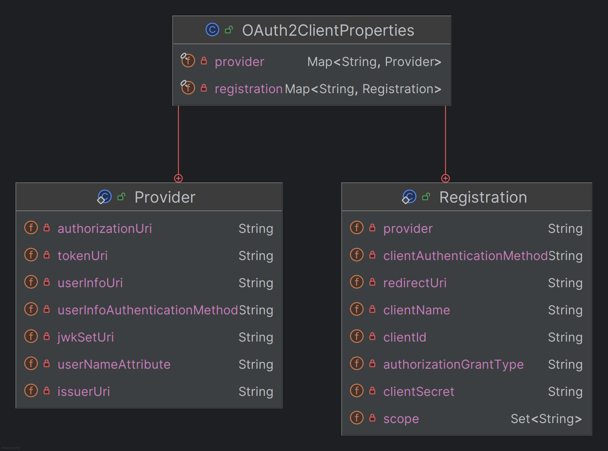

# OAuth 2.0 Client - `application.yml`, `OAuth2ClientProperties`

## 클라이언트 권한 부여 요청 시작

1. 클라이언트가 인가 서버로 권한 부여 요청을 하거나 토큰 요청을 할 경우 클라이언트 정보 및 엔드포인트 정보를 참조해서 전달한다.
2. `application.yml` 환경설정 파일에 클라이언트 설정과 인가 서버 엔드포인트 설정을 한다.
3. 초기화가 진행되면 `applcation.yml`에 클라이언트 및 엔드포인트 정보가 `OAuth2ClientProperties` 의 각 속성에 바인딩 된다.
4. `OAuth2ClientProperties` 에 바인딩 되어 있는 속성의 값은 인가 서버로 권한 부여 요청을 하기 위한 **ClientRegistration** 클래스의 필드에 저장된다.
5. `OAuth2Client`는 **ClientRegistration** 을 참조해서 권한 부여 요청을 위한 매개변수를 구성하고 인가 서버와 통신한다.


---

## application.yml

```yaml
spring:
  security:
    oauth2:
      client:
        registration: # 클라이언트 설정
          keycloak:
            client-id: oauth2-client-app                                    # 서비스 공급자에 등록된 클라이언트 아이디
            client-name: oauth2-client-app                                  # 클라이언트 이름
            client-secret: ANwKmYvCcxiQbjsi4jh1JHqUWikngjec                 # 서비스 공급자에 등록된 클라이언트 비밀번호
            redirect-uri: http://localhost:8081/login/oauth2/code/keycloak  # 인가 서버에서 권한 코드 부여 후 클라이언트로 리다이렉트 하는 위치
            # "/login/oauth2/code" 는 스프링 시큐리티에서 정해놓은 기본값
            authorization-grant-type: authorization_code                    # OAuth 2.0 권한 부여 타입
            client-authentication-method: client_secret_basic               # 클라이언트 자격 증명 전송 방식
            scope:                                                          # 리소스에 접근 제한 범위
              - openid
              - email
              - profile
        provider: # 공급자 설정
          keycloak:
            authorization-uri: http://localhost:8080/realms/oauth2/protocol/openid-connect/auth # OAuth 2.0 권한 코드 부여 엔드포인트
            token-uri: http://localhost:8080/realms/oauth2/protocol/openid-connect/token        # OAuth 2.0 토큰 엔드포인트
            issuer-uri: http://localhost:8080/realms/oauth2                                     # 서비스 공급자 위치
            user-info-uri: http://localhost:8080/realms/oauth2/protocol/openid-connect/userinfo # OAuth 2.0 UserInfo 엔드포인트
            jwk-set-uri: http://localhost:8080/realms/oauth2/protocol/openid-connect/certs      # OAuth 2.0 JwkSetUri 엔드포인트
            user-name-attribute: preferred_username                                             # OAuth 2.0 사용자명을 추출하는 클레임명
```

> **클라이언트 자격 증명 전송 방식 종류**
> 
> - **client_secret_basic**
>   - 클라이언트가 `client_id`와 `client_secret`을 HTTP 기본 인증 헤더에 포함하여 서버에 인증 요청을 보낸다.
>   - HTTP 요청의 `Authorization` 헤더에 `client_id`와 `client_secret`을 Base64로 인코딩하여 **Basic** 방식으로 전송한다.
> - **client_secret_post**
>   - 클라이언트가 `client_id`와 `client_secret`을 요청 본문에 포함하여 서버에 인증 요청을 보낸다. 
>   - `client_id`와 `client_secret`을 **application/x-www-form-urlencoded** 형식의 요청 본문에 포함하여 전송한다.
> - **client_secret_jwt**
>   - 클라이언트가 `client_secret`을 사용하여 JWT를 생성하고 이를 인증 토큰으로 사용한다.
>   - JWT는 `client_id`와 기타 클레임을 포함하여, `client_secret`으로 서명된다.
> - **private_key_jwt**
>   - 클라이언트가 공개 키와 개인 키 쌍을 사용하여 JWT를 생성하고, 이를 인증 토큰으로 사용한다.
>   - JWT는 `client_id`와 기타 클레임을 포함하며, 클라이언트의 개인 키로 서명된다.
> - **none**
>   - 클라이언트 인증을 사용하지 않으며, 클라이언트가 공개 자원에 접근할 때 사용된다.
>   - `client_id`만을 사용하며, `client_secret`이 필요하지 않는다.

---

## OAuth2ClientProperties





- **Registration** 은 인가 서버에 등록된 클라이언트 및 요청 파라미터 정보를 나타낸다.
- **Provider** 는 공급자에게 제공하는 엔드포인트 등의 정보를 나타낸다.
- 클라이언트 및 공급자의 정보를 각각 `registration`, `provider` 맵에 저장하고 인가 서버와의 통신 시 각 항목을 참조하여 사용한다.

---

[이전 ↩️ - OAuth 2.0 Client - OAuth 2.0 Client](https://github.com/genesis12345678/TIL/blob/main/Spring/security/oauth/OAuthClient/OAuthClient.md)

[메인 ⏫](https://github.com/genesis12345678/TIL/blob/main/Spring/security/oauth/main.md)

[다음 ↪️ - OAuth 2.0 Client - ClientRegistration](https://github.com/genesis12345678/TIL/blob/main/Spring/security/oauth/OAuthClient/ClientRegistration.md)
