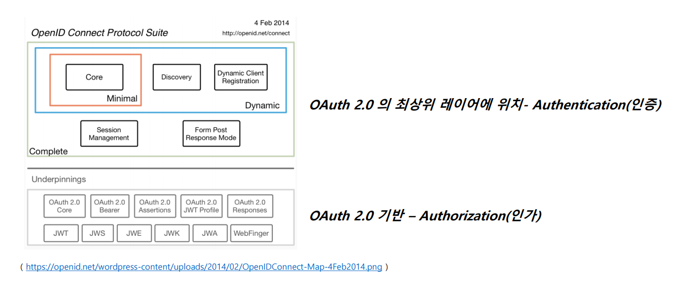
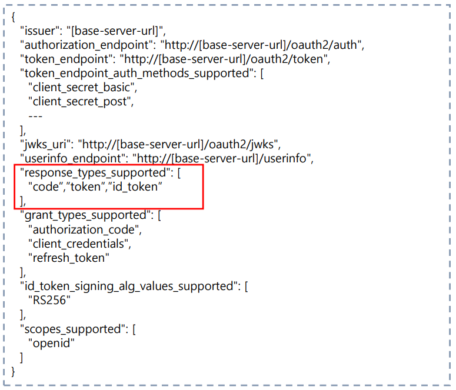
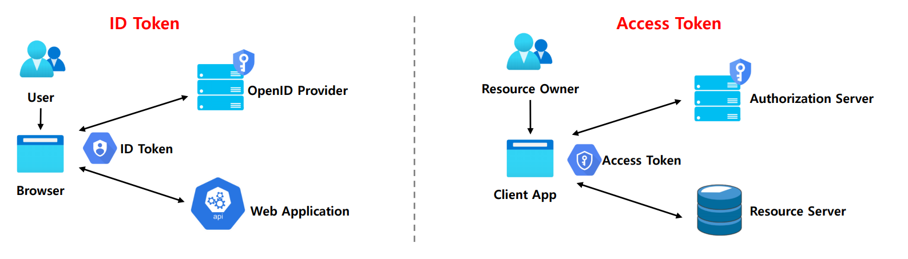
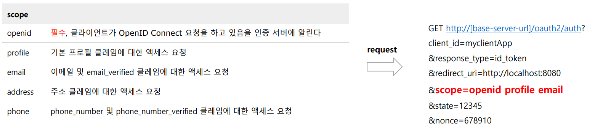
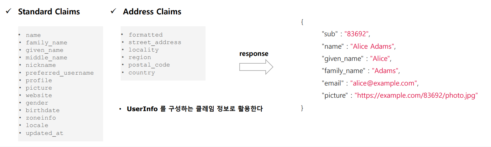
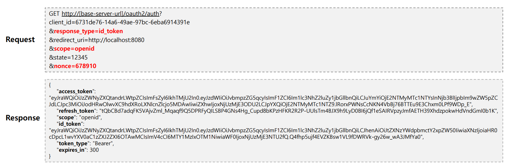

# OAuth 2.0 Open ID Connect

## Open ID Connect 란

- **OpenID Connect 1.0은 OAuth 2.0 프로토콜 위에 구축된 ID 계층으로 OAuth 2.0을 확장하여 인증 방식을 표준화 한 OAuth 2.0 기반의 인증 프로토콜이다.**
- **scope** 지정시 `openid`를 포함하면 **OpenID Connect** 사용이 가능하며 인증에 대한 정보는 ID 토큰(`ID Token`)이라고 하는 JSON 웹 토큰(`JWT`)으로 반환된다.
- **OpenID Connect**는 클라이언트가 사용자 ID를 확인할 수 있게 하는 보안 토큰은 `ID Token`을 제공한다.

> **OpenID Connect Discovery 1.0 Provider Metadata**
> 
> - **OpenID Connect**를 사용하기 위해 필요한 모든 엔드 포인트 및 공개 키 위치 정보를 포함하여 `OpenID` 공급자의 구성에 대한 클레임 집합을 나타낸다.
> - `http://[base-server-url]/.well-known/openid-configuration` 에서 검색할 수 있다.
> 
> 

---

## ID Token & Scope

### ID Token

- **ID 토큰**은 사용자가 인증 되었음을 증명하는 결과물로서 OIDC(Open ID Connect) 요청 시 `access token`과 함께 클라이언트에게 전달되는 토큰이다.
- **ID 토큰**은 JWT로 표현되며 헤더, 페이로드 및 서명으로 구성된다.
- **ID 토큰**은 발급자가 개인 키로 서명하는 것으로서 토큰의 출처를 보장하고 변조되지 않았음을 보장한다.
- 애플리케이션은 공개 키로 ID 토큰을 검증 및 유효성을 검증하고 만료 여부 등 토큰의 클레임을 확인한다.
- 클라이언트는 클레임 정보에 포함되어 있는 사용자명, 이메일 등을 활용하여 인증 관리를 할 수 있다.

### ID Token vs Access Token

- `ID Token`은 API 요청에 사용해서는 안되며, 사용자의 신원 확인을 위해 사용되어져야 한다.
- `Access Token`은 인증을 위해 사용해서는 안되며, 리소스에 접근하기 위해 사용되어져야 한다.

### OIDC Scope

### OIDC 로그인 요청

- **OIDC 상호 작용 행위자**
  1. **OpenID Provider**
     - 줄여서 `OP`라고 하며 OpenID 제공자로서 최종 사용자를 인증하고 인증 결과와 사용자에 대한 정보를 신뢰 당사자(클라이언트)에게 제공할 수 있는 OAuth 2.0 서버를 의미한다.
  2. **Relying Party**
     - 줄여서 `RP`라고 하며 신뢰 당사자로서 인증 요청을 처리하기 위해 `OP`에 의존하는 OAuth 2.0 애플리케이션을 의미한다.

- **흐름**
1. `RP`는 `OP`에 권한 부여 요청을 보낸다.
2. `OP`는 최종 사용자를 인증하고 권한을 얻는다.
3. `OP`는 **ID 토큰**과 **액세스 토큰**으로 응답한다.
4. `RP`는 **액세스 토큰**을 사용하여 `UserInfo` 엔드포인트에 요청을 보낼 수 있다.
5. `UserInfo` 엔드포인트는 최종 사용자에 대한 클레임을 반환한다.

- **매개변수 요청 및 응답**
  - 요청 시 `openid` 범위를 `scope` 매개 변수에 포함해야 한다.
  - `response_type` 매개 변수는 `id_token`을 포함한다. (`response_type`이 해당 토큰을 지원해야 한다.)
  - 요청은 `nonce` 매개 변수를 포함해야 한다.(Implicit Flow 인 경우 필수)
    - 요청에 포함되는 값으로서 결과 `id_token` 값에 클레임으로 포함되며 이것은 토큰의 재생 공격을 방지하고 요청의 출처를 식별하는 데 사용할 수 있는 임의의 고유 문자열이다.
    - 해당 `nonce` 클레임에는 요청에서 전송된 것과 정확히 동일한 값이 포함되어야 한다. 그렇지 않은 경우 애플리케이션에서 인증을 거부해야 한다.

---

[메인 ⏫](https://github.com/genesis12345678/TIL/blob/main/Spring/security/oauth/main.md)