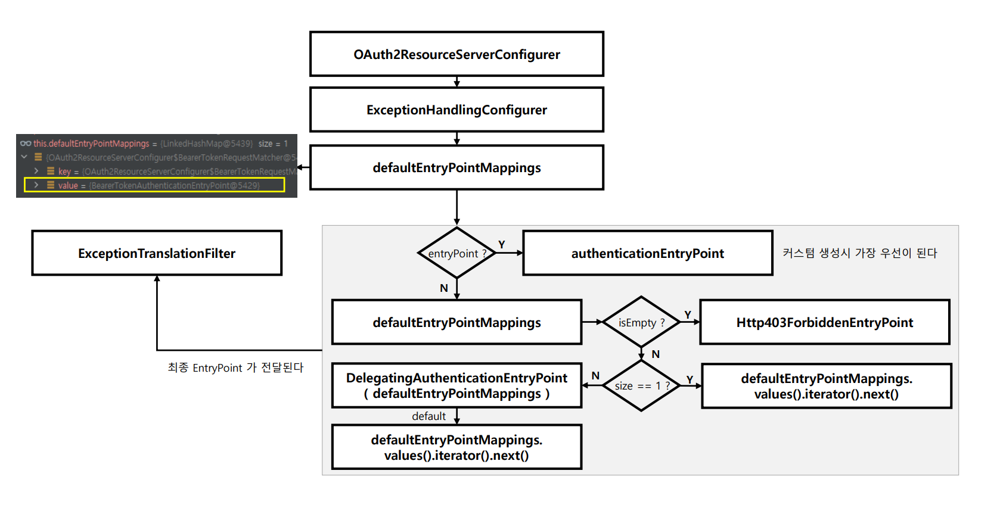

# OAuth 2.0 Resource Server - AuthenticationEntryPoint

- [AuthenticationEntryPoint](https://github.com/genesis12345678/TIL/blob/main/Spring/security/security/exception/ExceptionHandling.md)의 구현체는 여러 개가 있을 수 있으며, 인증 프로세스마다 실행되는 클래스들이 다르다.
- `application.yml`에 리소스 서버 설정을 하면  **ExceptionHandingConfigurer** 초기화 과정에서 디폴트로 `BearerTokenAuthenticationEntryPoint`가 저장되고,
  리소스 서버 설정을 하지 않으면 디폴트로 `LoginUrlAuthenticationEntryPoint`와 `BasicAuthenticationEntryPoint`가 저장된다.
---

[이전 ↩️ - OAuth 2.0 Resource Server - Resource Server 시작(`application.yml`,`OAuth2ResourceServerProperties`)](https://github.com/genesis12345678/TIL/blob/main/Spring/security/oauth/ResourceServer/Properties.md)

[메인 ⏫](https://github.com/genesis12345678/TIL/blob/main/Spring/security/oauth/main.md)

[다음 ↪️ - OAuth 2.0 Resource Server - 자동 설정에 의한 초기화 과정](https://github.com/genesis12345678/TIL/blob/main/Spring/security/oauth/ResourceServer/%EC%9E%90%EB%8F%99%EC%84%A4%EC%A0%95%EC%B4%88%EA%B8%B0%ED%99%94.md)