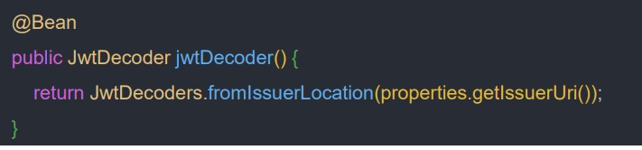

# OAuth 2.0 Resource Server(jwt()) - JwtDecoder 생성 방법

## JwtDecoders.fromIssuerLocation()



- `JwtDecoders.fromIssuerLocation()`을 호출하면 Provider 설정 또는 인가 서버 메타데이터 엔드포인트로 `jwk-set-uri`를 요청한다.
- 애플리케이션에서 따로 정의한 `JwtDecoder` 빈이 없다면 스프링 부트가 위에 있는 디폴트 빈을 등록한다.

## NimbusJwtDecoder.withJwkSetUri()

- 기본적으로 스프링 부트에 의해 `NimbusJwtDecoder`가 자동 생성될 경우, 리소스 서버는 `RS256` 을 사용한 토큰만 신뢰하고 이 토큰만 검증할 수 있다.
- `JwtSetUri`에 의한 검증 방식으로 `NimbusJwtDecoder`를 생성할 경우, 알고리즘의 종류를 변경할 수 있지만 `RSA` 알고리즘(비대칭)에 한해 변경이 가능하고 `HMAC`은 지원하지 않는다.

---

### SecurityConfig

```java
@Configuration
@EnableWebSecurity
@RequiredArgsConstructor
public class SecurityConfig {

    private final OAuth2ResourceServerProperties properties;

    @Bean
    public SecurityFilterChain securityFilterChain(HttpSecurity http) throws Exception {

        http
                .authorizeHttpRequests(request -> request.anyRequest().authenticated())
                .oauth2ResourceServer(resource -> resource.jwt(Customizer.withDefaults()));

        return http.build();
    }

//    @Bean
//    public JwtDecoder jwtDecoder1() {
//        return JwtDecoders.fromIssuerLocation(properties.getJwt().getIssuerUri());
//    }

    @Bean
    public JwtDecoder jwtDecoder2() {
        return NimbusJwtDecoder.withJwkSetUri(properties.getJwt().getJwkSetUri())
                .jwsAlgorithm(SignatureAlgorithm.RS512)
                .build();
    }
}
```

### application.yml

```yaml
server:
  port: 8081

spring:
  security:
    oauth2:
      resourceserver:
        jwt:
#          issuer-uri: http://localhost:8080/realms/oauth2
          jwk-set-uri: http://localhost:8080/realms/oauth2/protocol/openid-connect/certs
```

- `JwtDecoder`를 생성하는 방식에 따라서 `application.yml`과 값을 맞춰줘야 한다.
- `application.yml`에도 `jws-algorithms`를 설정할 수 있고, 빈을 직접 등록할 경우 빈이 우선이다.
- 직접 빈으로 등록하면서 `jws-algorithms`를 지정할 경우, 인가 서버에서도 해당 알고리즘을 지원 및 변경해야 한다.

---

[이전 ↩️ - OAuth 2.0 Resource Server(jwt()) - JwtDecoder 세부 흐름]()

[메인 ⏫](https://github.com/genesis12345678/TIL/blob/main/Spring/security/oauth/main.md)