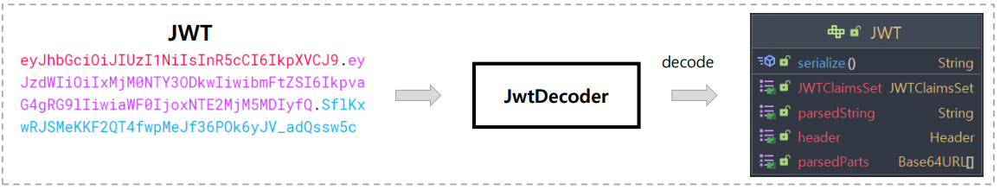
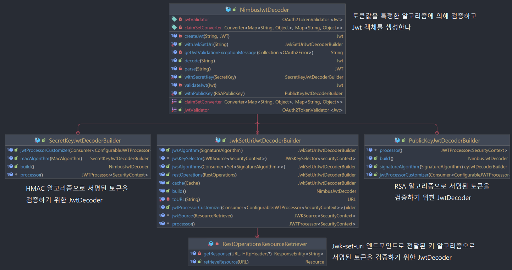
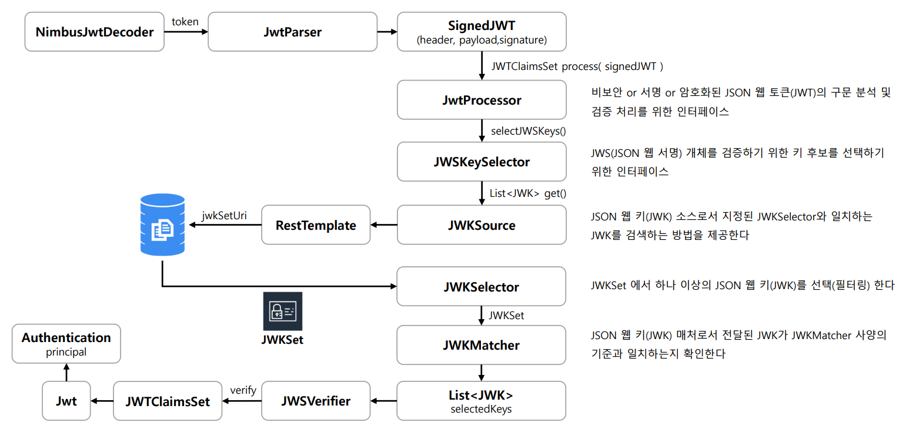

# OAuth 2.0 Resource Server(jwt()) - JwtDecoder 세부 흐름

## JwtDecoder

- **JwtDecdoer**는 문자열로 된 JWT(JSON Web Token)를 컴팩트 클레임 표현 방식에서 **Jwt 인스턴스로 디코딩** 하는 역할을 한다.

- **JwtDecoder**는 JWT가 아닌 JSON 웹 서명(`JWS`) 구조로 생성된 경우 **JWS 서명에 대한 검증의 책임**이 있다.

- **JwtDecoder**의 기본 구현체로 `NimbusJwtDecoder`가 있다.

---

## NimbusJwtDecoder

### 검증 세부 흐름

---

[이전 ↩️ - OAuth 2.0 Resource Server(jwt()) - JWT API]()

[메인 ⏫](https://github.com/genesis12345678/TIL/blob/main/Spring/security/oauth/main.md)

[다음 ↪️ - OAuth 2.0 Resource Server(jwt()) - JwtDecoder 생성 방법]()