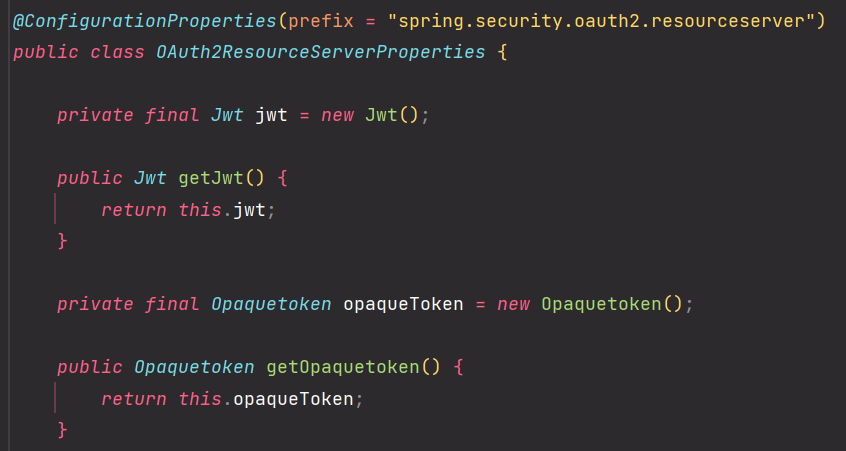
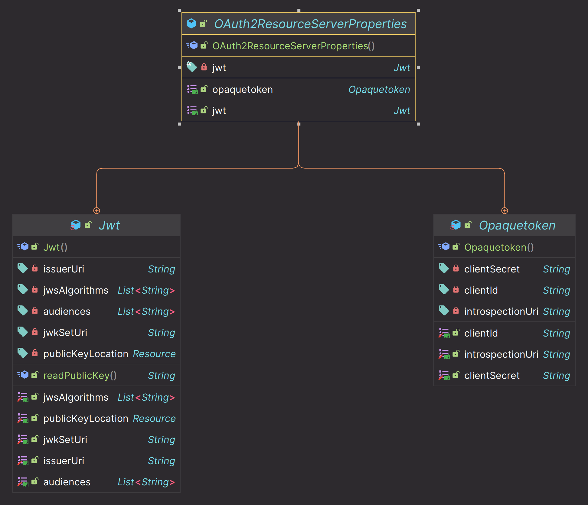
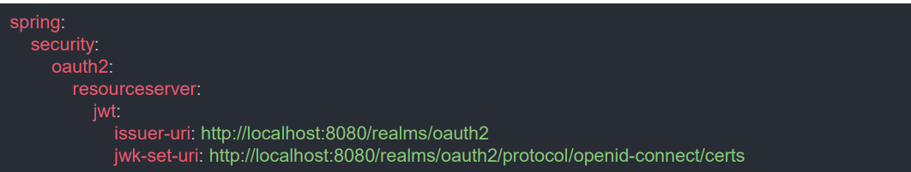
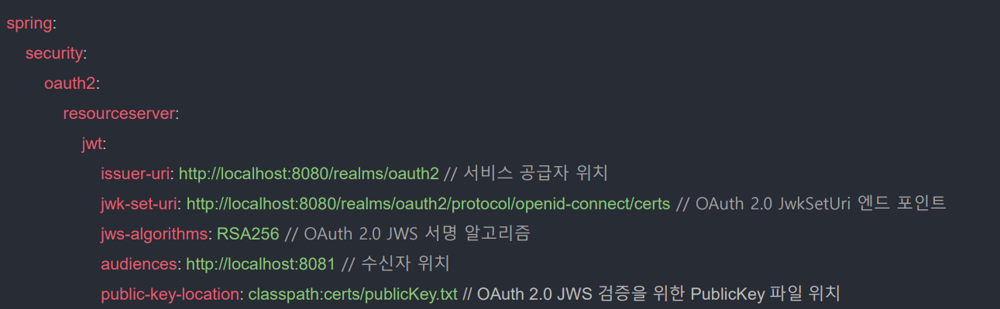
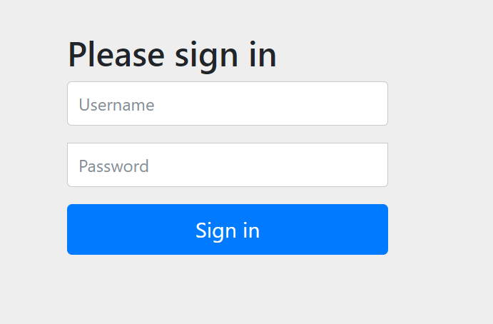
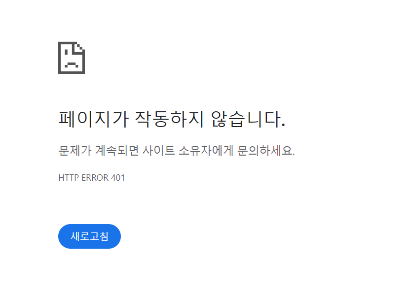
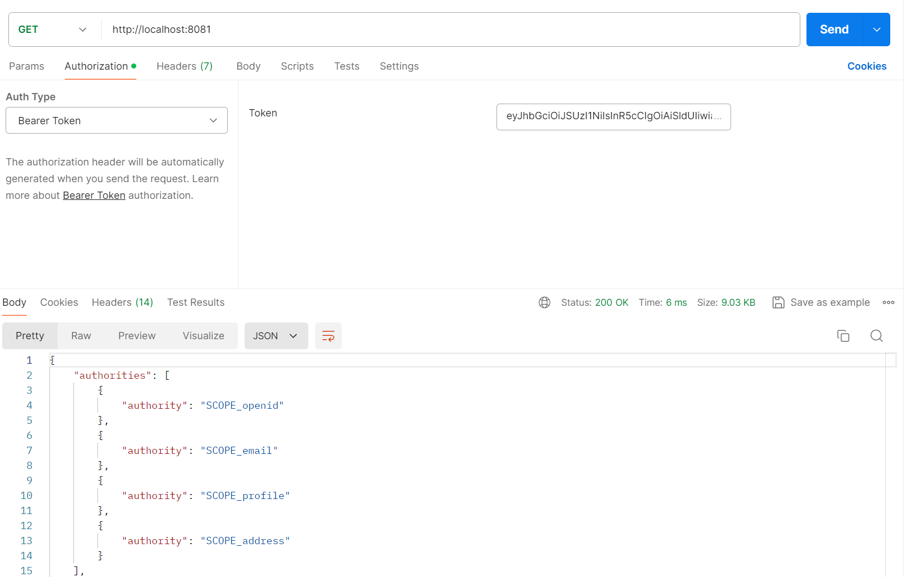

# OAuth 2.0 Resource Server - Resource Server 시작(`application.yml`,`OAuth2ResourceServerProperties`)

## OAuth2ResourceServerProperties





- **jwkSetUri**
  - 인가 서버에서 서명한 토큰의 위치를 나타낸다.
- **issuerUri**
  - 인가 서버의 위치를 나타낸다.
- **publicKeyLocation**
  - 공개키를 가지고 있는 파일의 위치를 나타낸다.
- **jwsAlgorithm**
  - JWT를 서명하기 위한 알고리즘을 나타낸다.
- **introspectionUri**
  - 토큰을 검증하기 위한 `introspection` 엔드 포인트를 나타낸다.

---

## application.yml 설정



- 일반적으로 위의 5가지 설정 중 이 두 가지나 두 가지중 하나를 설정하면 리소스 서버가 검증하는 데에 필요한 처리를 할 수 있다.
- **issuer-uri**
  - 인가 서버가 발급할 JWT의 `iss` 클레임에 추가되는 값으로, 발급자를 나타낸다.
- **jwk-set-uri**
  - 인가 서버가 발급한 JWT의 공개키 정보를 검색할 수 있는 엔드 포인트를 나타낸다.
- 리소스 서버는 자체 검증 설정에도 이 속성을 사용하며, 이 속성으로 인가 서버의 공개키를 찾고, 건네 받은 JWT의 유효성을 검사한다.

---

## 인가 서버 메타데이터 엔드포인트

**`issuer-uri` 프로퍼티를 사용하려면 인가 서버가 지원하는 엔드포인트는 반드시 셋 중 하나여야 한다.**

1. `/issuer/.well-known/openid-configuration`
2. `/.well-known/openid-configuration/issuer`
3. `/.well-known/oauth-authorization-server/issuer`

이 엔드포인트는 **Provider 설정 엔드포인트** 또는 **인가 서버 메타데이터 엔드포인트** 라고 한다.



- 위 속성 중에 `issuer-uri` 또는 `jwk-set-uri` 중 한 개는 반드시 필요하고 나머지 속성은 필요시 설정하면 된다.

---

### application.yml 미설정
 
```yaml
server:
  port: 8081

spring:
  security:
    user:
      name: user
      password: 1234
```


스프링 시큐리티가 기본적으로 제공하는 폼 인증을 위한 화면이 출력된다.

### application.yml 설정

```yaml
server:
  port: 8081

spring:
  security:
    user:
      name: user
      password: 1234

    oauth2:
      resourceserver:
        jwt:
          issuer-uri: http://localhost:8080/realms/oauth2
          jwk-set-uri: http://localhost:8080/realms/oauth2/protocol/openid-connect/certs
```
- 인가 서버 메타데이터 엔드포인트를 통해 각 uri를 입력했다.



- 인증을 위한 화면도 나오지 않고, **401 에러**가 발생한다.
- 이제는 리소스 서버가 토큰을 검증하는 방식이기 때문에 클라이언트가 액세스 토큰을 제출해야 자원에 대한 접근이 허용된다.


이렇게 인가 서버에게 액세스 토큰을 요청한 다음 이 액세스 토큰으로 요청을 하면 자원에 대한 접근이 가능하다.



---

[이전 ↩️ - OAuth 2.0 Resource Server - OAuth 2.0 Resource Server](https://github.com/genesis12345678/TIL/blob/main/Spring/security/oauth/ResourceServer/Resource%20Server.md)

[메인 ⏫](https://github.com/genesis12345678/TIL/blob/main/Spring/security/oauth/main.md)

[다음 ↪️ - OAuth 2.0 Resource Server - AuthenticationEntryPoint](https://github.com/genesis12345678/TIL/blob/main/Spring/security/oauth/ResourceServer/AuthenticationEntryPoint.md)