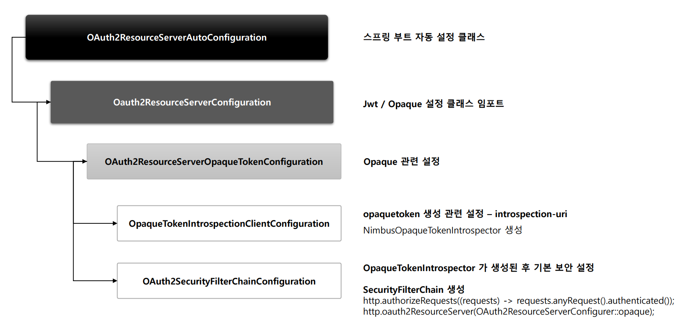
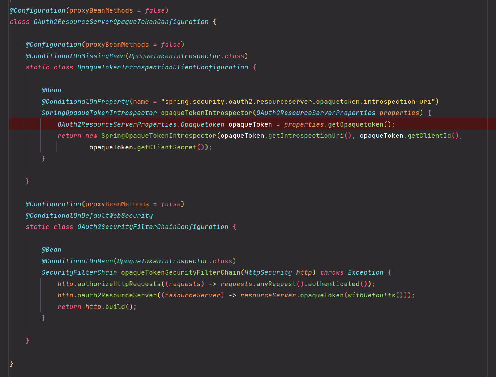
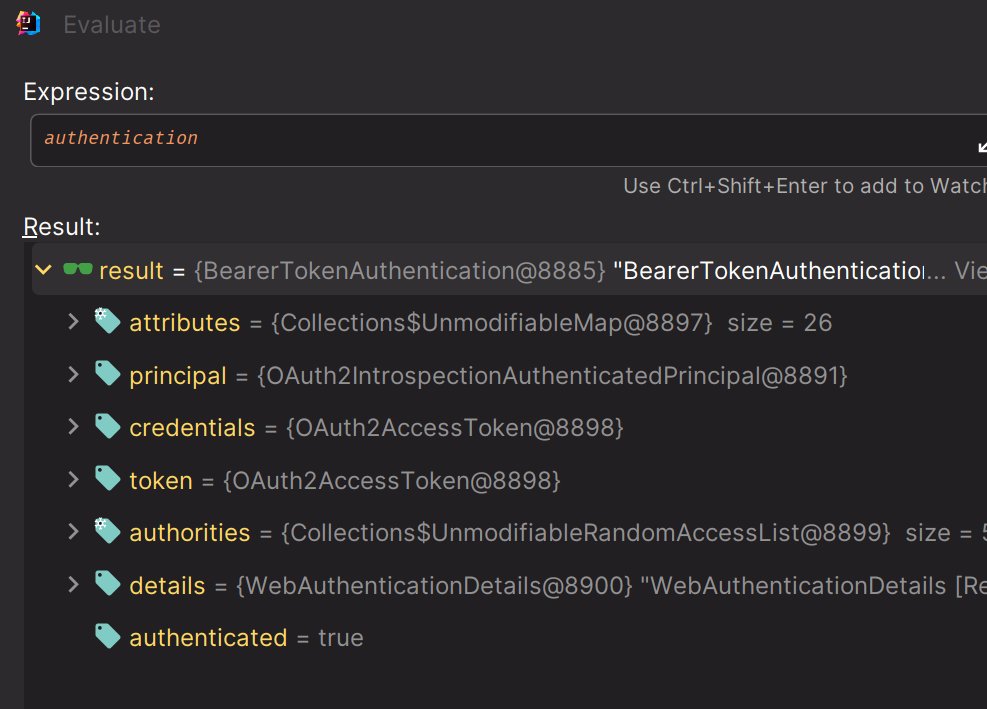
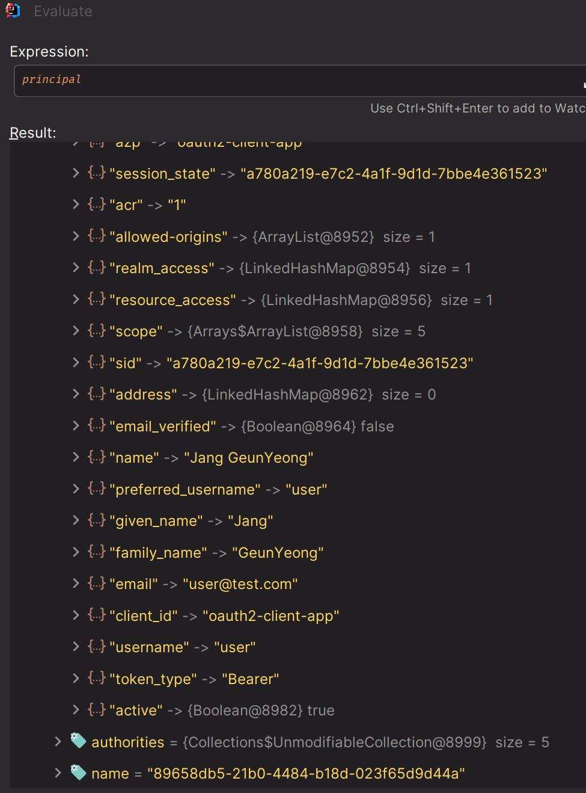

# OAuth 2.0 Resource Server - Opaque 개념

- `Opaque` 토큰은 인가 서버에서 호스트하는 **OAuth 2.0 Introspection** 엔드포인트로 검증한다.
- `Bearer 토큰`이 리소스 서버에서 처리하는 자체 검증이라면 `Opaque 토큰`은 인가 서버에서 처리하는 원격 검증이라고 볼 수 있다.

### 환경 설정

- 두 가지 설정을 하면 인가 서버와의 `Introspection` 검증이 가능하다.

1. 의존성 추가

```text
runtimeOnly 'com.nimbusds:oauth2-oidc-sdk:11.10.1'
```

2. `introspection` 엔드포인트 상세 정보 설정

```yaml
spring:
  security:
    oauth2:
      resourceserver:
        opaquetoken:
          introspection-uri: http://localhost:8080/realms/oauth2/protocol/openid-connect/token/introspect
          client-id: oauth2-client-app
          client-secret: ANwKmYvCcxiQbjsi4jh1JHqUWikngjec
```

- `introspection-uri` : 인가 서버가 호스트하는 `introspection` 엔드포인트
- `client-id`와 `client-secret`은 엔드포인트 요청에 사용할 클라이언트 자격증명

### 설정 클래스

```java
@Configuration
@EnableWebSecurity
public class SecurityConfig {

    @Bean
    public SecurityFilterChain securityFilterChain(HttpSecurity http) throws Exception {

        http
                .authorizeHttpRequests(auth -> auth.anyRequest().authenticated())
                .oauth2ResourceServer(oauth2 -> oauth2.opaqueToken(Customizer.withDefaults()))
        ;
        return http.build();
    }
}
```

---

## 초기화 과정





- 직접 정의한 `OpaqueTokenIntrospector` 빈이 없을 경우 스프링에서 기본적으로 생성하는 빈이 있다.

## 빈 직접 정의

```java
@Configuration
@EnableWebSecurity
public class SecurityConfig {
    
    @Bean
    public SecurityFilterChain securityFilterChain(HttpSecurity http) throws Exception {

        http
                .authorizeHttpRequests(auth -> auth.anyRequest().authenticated())
                .oauth2ResourceServer(oauth2 -> oauth2.opaqueToken(Customizer.withDefaults()))
        ;
        return http.build();
    }

    //추가
    @Bean
    public OpaqueTokenIntrospector opaqueTokenIntrospector(OAuth2ResourceServerProperties properties) {
        OAuth2ResourceServerProperties.Opaquetoken opaquetoken = properties.getOpaquetoken();
        return new NimbusOpaqueTokenIntrospector(
                opaquetoken.getIntrospectionUri(),
                opaquetoken.getClientId(),
                opaquetoken.getClientSecret()
        );
    }
}
```

---

```java
@RestController
public class IndexController {

    @GetMapping("/")
    public OpaqueDto index(Authentication authentication, @AuthenticationPrincipal OAuth2AuthenticatedPrincipal principal) {

        BearerTokenAuthentication bearerTokenAuthentication = (BearerTokenAuthentication) authentication;

        Map<String, Object> tokenAttributes = bearerTokenAuthentication.getTokenAttributes();
        boolean active = (boolean) tokenAttributes.get("active");

        OpaqueDto opaqueDto = new OpaqueDto();
        opaqueDto.setActive(active);
        opaqueDto.setAuthentication(authentication);
        opaqueDto.setPrincipal(principal);
        
        return opaqueDto;
    }
}
```





> - `Opaque 토큰`은 인증 여부 활성화 상태를 나타내는 `active` 속성을 가지는 것이 특징이다.
> - 인증 객체에 `principal`에는 `OAuth2AuthenticatedPrincipal`의 구현체인 `OAuth2IntrospectionAuthenticatedPrincipal`이 저장된다.

---

[메인 ⏫](https://github.com/genesis12345678/TIL/blob/main/Spring/security/oauth/main.md)

[다음 ↪️ - OAuth 2.0 Resource Server Opaque - 토큰 검사 및 프로세스](https://github.com/genesis12345678/TIL/blob/main/Spring/security/oauth/ResourceServer/opaque/Process.md)