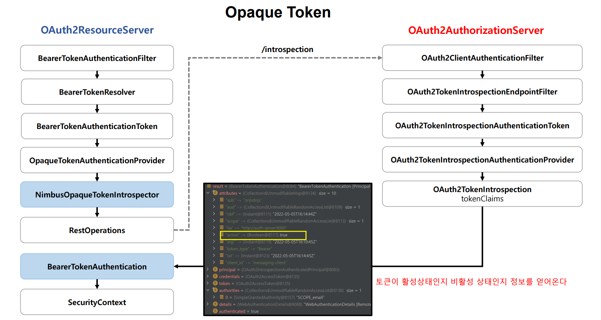

# OAuth 2.0 Resource Server Opaque - 토큰 검사 프로세스



---

## OpaqueTokenIntrospector

- 문자열 토큰을 `RestTemplate`을 사용하여 인가 서버 엔드포인트로 요청한다.
- 토큰이 검증되면 최종 `OAuth2AuthenticatedPrincipal` 타입의 객체로 디코딩하여 반환한다.
- `OAuth2AuthenticatedPrincipal`은 `BearerTokenAuthentication`의 **principal** 속성에 저장된다.

> **CustomOpaqueTokenIntrospector**
> 
> - `OpaqueTokenIntrospector` 인터페이스를 구현하여 커스텀한 구현체를 만들어 재정의 할 수 있다.
> - 검증 후 리턴 타입이 `OAuth2AuthenticatedPrincipal` 이기 때문에 인가 서버에서 받아온 클레임 정보를 활용해서 여러가지 커스텀한 작업이 가능하다.

---

### SecurityConfig

```java
@Configuration
@EnableWebSecurity
public class SecurityConfig {

    @Bean
    public SecurityFilterChain securityFilterChain(HttpSecurity http) throws Exception {

        http
                .authorizeHttpRequests(auth -> auth.anyRequest().authenticated())
                .oauth2ResourceServer(oauth2 -> oauth2.opaqueToken(Customizer.withDefaults()))
        ;
        return http.build();
    }
    
    @Bean
    public OpaqueTokenIntrospector opaqueTokenIntrospector(OAuth2ResourceServerProperties properties) {
        return new CustomOpaqueTokenIntrospector(properties);
    }
}
```

### CustomOpaqueTokenIntrospector

```java
public class CustomOpaqueTokenIntrospector implements OpaqueTokenIntrospector {

    private OpaqueTokenIntrospector delegate;

    public CustomOpaqueTokenIntrospector(OAuth2ResourceServerProperties properties) {
        delegate = new NimbusOpaqueTokenIntrospector(
                properties.getOpaquetoken().getIntrospectionUri(),
                properties.getOpaquetoken().getClientId(),
                properties.getOpaquetoken().getClientSecret()
        );
    }

    @Override
    public OAuth2AuthenticatedPrincipal introspect(String token) {
        OAuth2AuthenticatedPrincipal principal = delegate.introspect(token);
        return new DefaultOAuth2AuthenticatedPrincipal(
                principal.getName(),
                principal.getAttributes(),
                extractAuthorities(principal)
        );
    }

    private Collection<GrantedAuthority> extractAuthorities(OAuth2AuthenticatedPrincipal principal) {
        List<String> scopes = principal.getAttribute(OAuth2TokenIntrospectionClaimNames.SCOPE);

        return scopes.stream()
                .map(scope -> "ROLE_" + scope.toUpperCase())
                .map(SimpleGrantedAuthority::new)
                .collect(Collectors.toList());
    }
}
```

> - 실제 인가 서버와의 통신은 스프링의 기본 구현체로 있는 `NimbusOpaqueTokenIntrospector`에게 위임한다.
> - 이 클래스에서는 인가 서버와 통신 후 넘겨받은 객체 정보를 이용해 권한 매핑을 재정의 한다.

---

[이전 ↩️ - OAuth 2.0 Resource Server Opaque - 개념]()

[메인 ⏫](https://github.com/genesis12345678/TIL/blob/main/Spring/security/oauth/main.md)