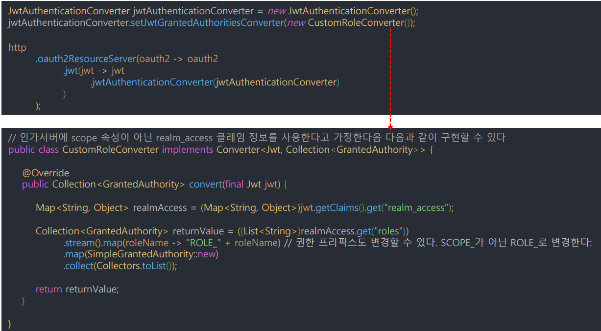
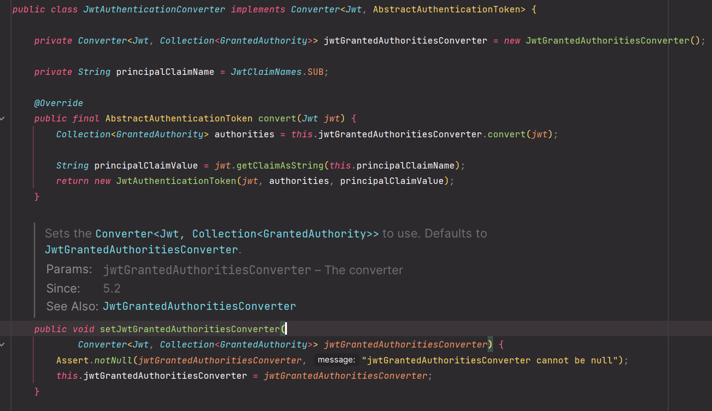
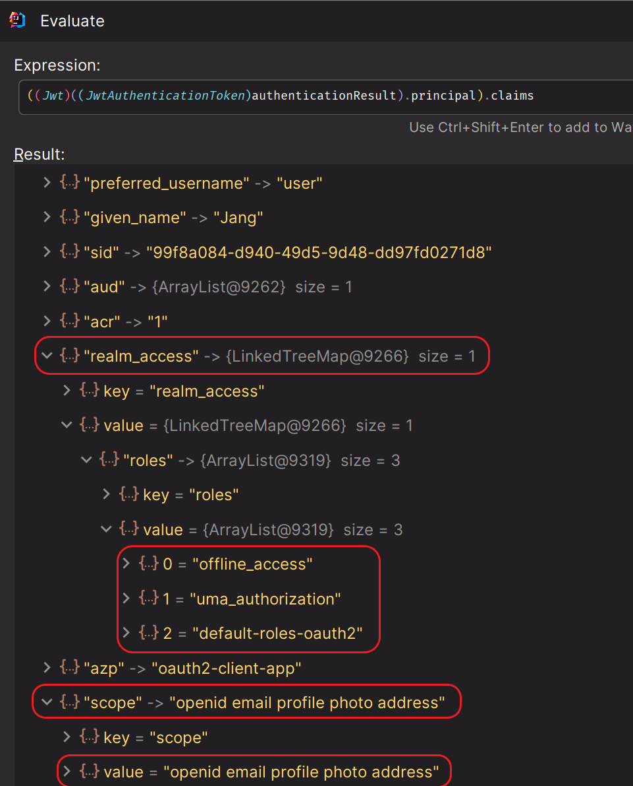
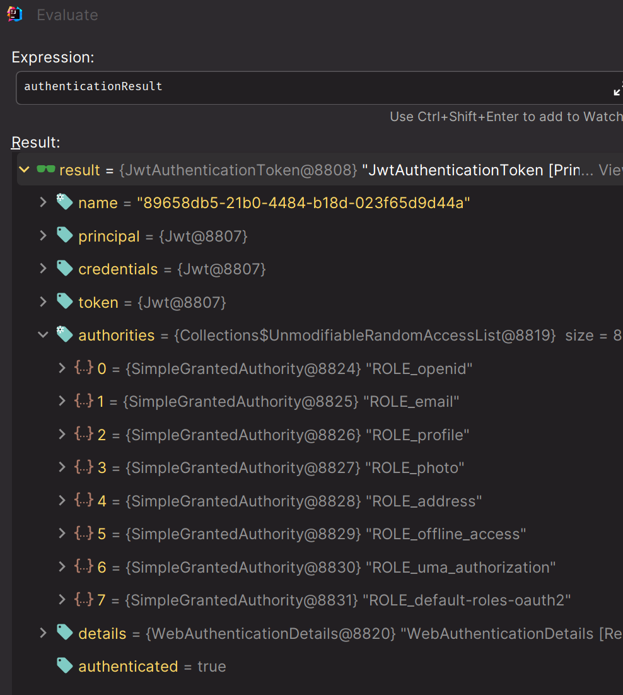

# OAuth 2.0 Resource Server 권한 구현 - 권한 구성 커스터마이징

- 인가 서버가 `scope` 속성 대신 자체 커스텀 속성을 사용하거나 리소스 서버에서 속성을 내부 권한에 맞게 조정해야 할 경우 사용한다.
- `JwtAuthenticationConverter` 는 **Jwt** 객체를 `Authentication` 으로 변환하는 클래스이며, 권한을 변환하는 `JwtGrantedAuthoritiesConverter`를 가지고 있다.



---

### JwtAuthenticationConverter



> 스프링 시큐리티의 `JwtAuthenticationConverter`는 기본적으로 `JwtGrantedAuthoritiesConverter`를 통해 권한 매핑을 하며, `setter`를 통해 커스텀한 컨버터를 지정할 수 있다.



> 스프링 시큐리티는 기본적으로 클레임 정보 중에서 `scope` 정보를 가지고 `SCOPE_` Prefix를 붙여 권한 매핑을 한다. 권한 매핑을 커스터마이징 하기 위해 여기서는 
> 키클록에서 주는 정보인 `realm_access`에 `roles`를 권한 매핑을 해본다.

### SecurityConfig

```java
@Configuration
@EnableWebSecurity
@EnableMethodSecurity
public class SecurityConfig {


    @Bean
    public SecurityFilterChain securityFilterChain1(HttpSecurity http) throws Exception {

        JwtAuthenticationConverter converter = new JwtAuthenticationConverter();
        converter.setJwtGrantedAuthoritiesConverter(new CustomRoleConverter());
        http
                .authorizeHttpRequests(auth -> auth
                        .requestMatchers("/photos/1").hasAuthority("ROLE_photo")
                        .requestMatchers("/photos/3").hasAuthority("ROLE_default-roles-oauth2")
                        .anyRequest().authenticated()
                )
                .oauth2ResourceServer(config -> config
                        .jwt(jwt -> jwt
                                .jwtAuthenticationConverter(converter)))
        ;
        return http.build();
    }

    @Bean
    @Order(1)
    public SecurityFilterChain securityFilterChain2(HttpSecurity http) throws Exception {

        http
                .securityMatchers(matchers -> matchers.requestMatchers("/photos/2"))
                .authorizeHttpRequests(auth -> auth
                        .requestMatchers("/photos/2").hasAuthority("SCOPE_photo")
                        .anyRequest().authenticated()
                )
                .oauth2ResourceServer(config -> config.jwt(Customizer.withDefaults()))
        ;
        return http.build();
    }
}
```
> `/photos/2` 로 오는 요청에 대해서는 커스텀 권한 매핑을 하지 않고 스프링 시큐리티에 맡기도록 설정

### CustomRoleConverter

```java
public class CustomRoleConverter implements Converter<Jwt, Collection<GrantedAuthority>> {

    private final String ROLE_PREFIX = "ROLE_";
    
    @Override
    public Collection<GrantedAuthority> convert(Jwt jwt) {
        String scopes = jwt.getClaimAsString("scope");
        Map<String, Object> realmAccess = jwt.getClaimAsMap("realm_access");

        if (scopes == null || realmAccess == null) {
            return Collections.emptyList();
        }

        //기존 scope 정보에 ROLE_ 접두사 추가
        Collection<GrantedAuthority> authorities1 = Arrays.stream(scopes.split(" "))
                .map(roleName -> ROLE_PREFIX + roleName)
                .map(SimpleGrantedAuthority::new)
                .collect(Collectors.toList());

        //추가적으로 roles 정보로 새로운 권한 추가
        Collection<GrantedAuthority> authorities2 = ((List<String>) realmAccess.get("roles")).stream()
                .map(roleName -> ROLE_PREFIX + roleName)
                .map(SimpleGrantedAuthority::new)
                .collect(Collectors.toList());

        authorities1.addAll(authorities2);

        return authorities1;
    }
}
```

---

[이전 ↩️ - OAuth 2.0 Resource Server 권한 구현 - Scope 기반 권한 매핑]()

[메인 ⏫](https://github.com/genesis12345678/TIL/blob/main/Spring/security/oauth/main.md)