# OAuth 2.0 Resource Server 권한 구현 - Scope 기반 권한 매핑

## Scope

- 클라이언트가 인가 서버로 OAuth 2.0 권한 부여 요청을 할 때 사용자의 리소스에 대한 접근 범위를 제한하기 위해 마련해 놓은 장치
- 클라이언트는 하나 이상의 `scope`를 요청할 수 있으며 동의 화면에서 사용자가 `scope`를 지정하게 되면 `scope` 범위에 제한된 토큰이 발행된다.

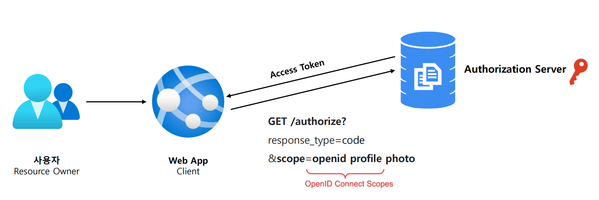

---

## Scope 리소스 접근 제어

- 권한 부여 요청 시 인가 서버에 지정했던 `scope`가 리소스 서버의 권한 범위에 포함하지 않으면 접근이 거부된다.
- 권한 부여 요청 시 인가 서버에 지정했던 `scope`가 리소스 서버의 권한 범위에 포함되면 접근이 허용된다.

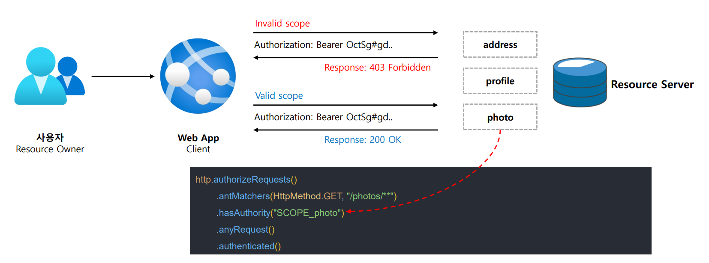

- 리소스 서버는 각 스코프에 `SCOPE_` Prefix 를 달아 승인된 권한 리스트를 만든다.
- **JWT**의 `scope`로 특정 엔드포인트나 메서드를 보호하려면, Prefix 를 포함한 적절한 표현식을 사용해야 한다.

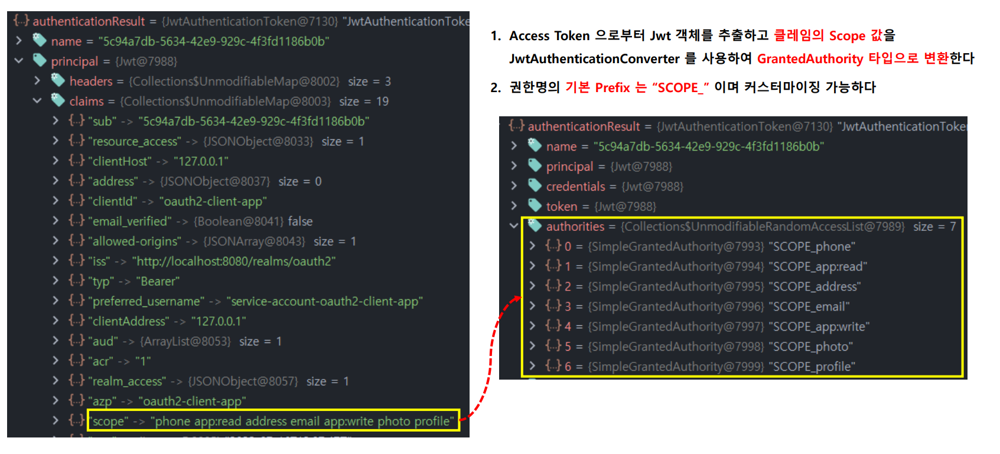

---

### SecurityConfig

```java
@Configuration
@EnableWebSecurity
public class SecurityConfig {

    @Bean
    public SecurityFilterChain securityFilterChain1(HttpSecurity http) throws Exception {
        http
                .authorizeHttpRequests(auth -> auth
                        .requestMatchers("/photos/1").hasAuthority("SCOPE_photo")
                        .requestMatchers("/photos/2").permitAll()
                        .anyRequest().authenticated()
                )
                .oauth2ResourceServer(config -> config.jwt(Customizer.withDefaults()))
        ;
        return http.build();
    }
}
```
> `/photos/1` 경로에는 `scope`에 **photo**가 있어야 허용

### PhotoController

```java
@RestController
public class PhotoController {

    @GetMapping("/photos/1")
    public Photo photo1() {
        return Photo.builder()
                .photoId("1")
                .photoTitle("Photo 1 Title")
                .photoDescription("Photo is nice")
                .userId("user1")
                .build();
    }

    @GetMapping("/photos/2")
    public Photo photo2() {
        return Photo.builder()
                .photoId("2")
                .photoTitle("Photo 2 Title")
                .photoDescription("Photo is nice")
                .userId("user2")
                .build();
    }
}
```
```java
@Data
@Builder
public class Photo {
    private String userId;
    private String photoId;
    private String photoTitle;
    private String photoDescription;
}
```

## photo가 없는 토큰으로 요청

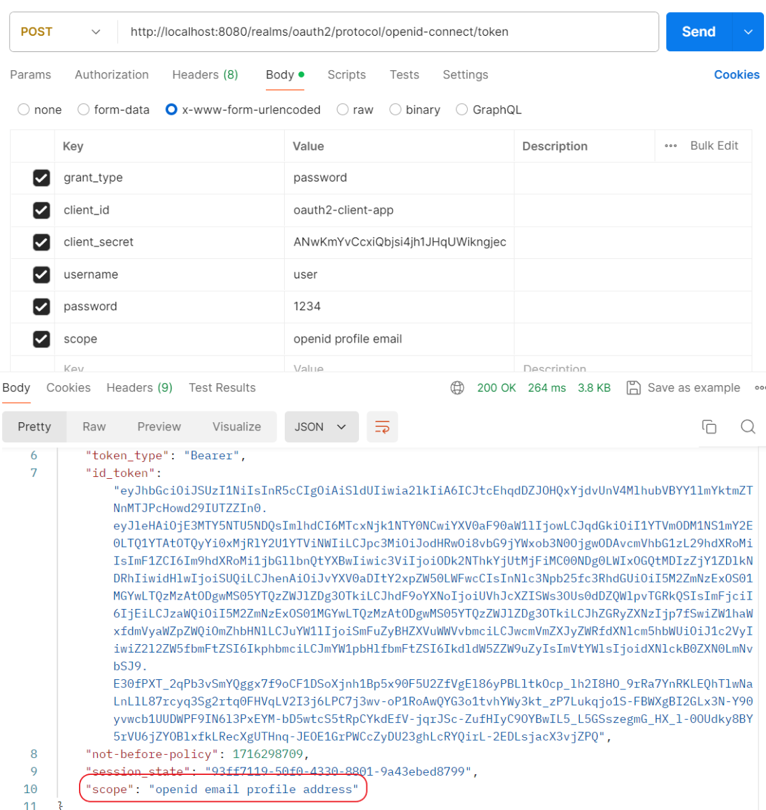

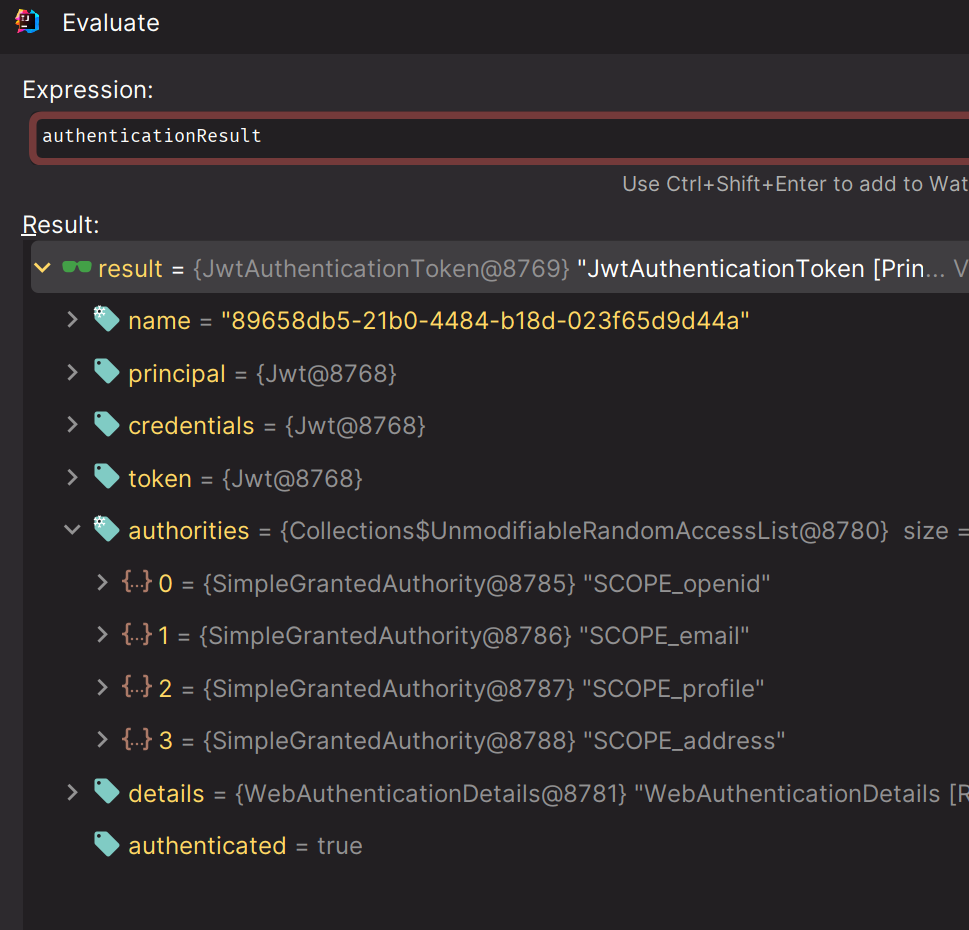

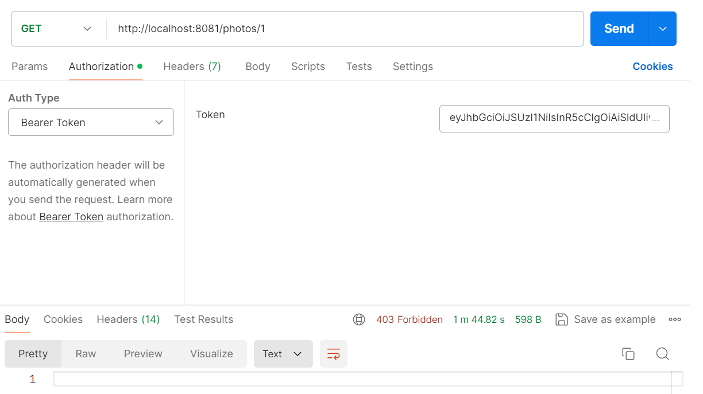

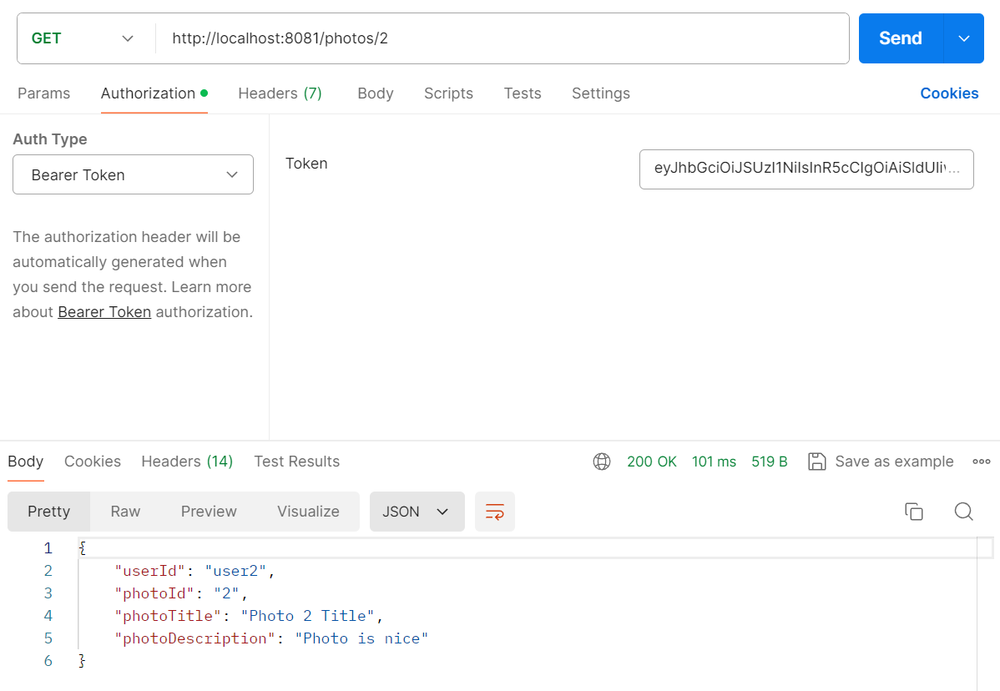

## photo가 있는 토큰으로 요청

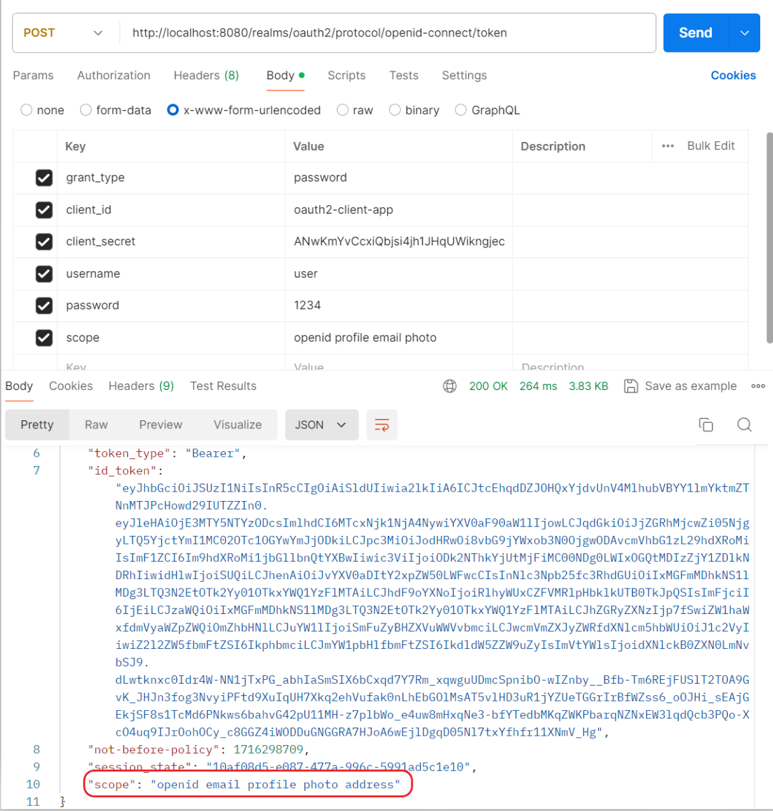

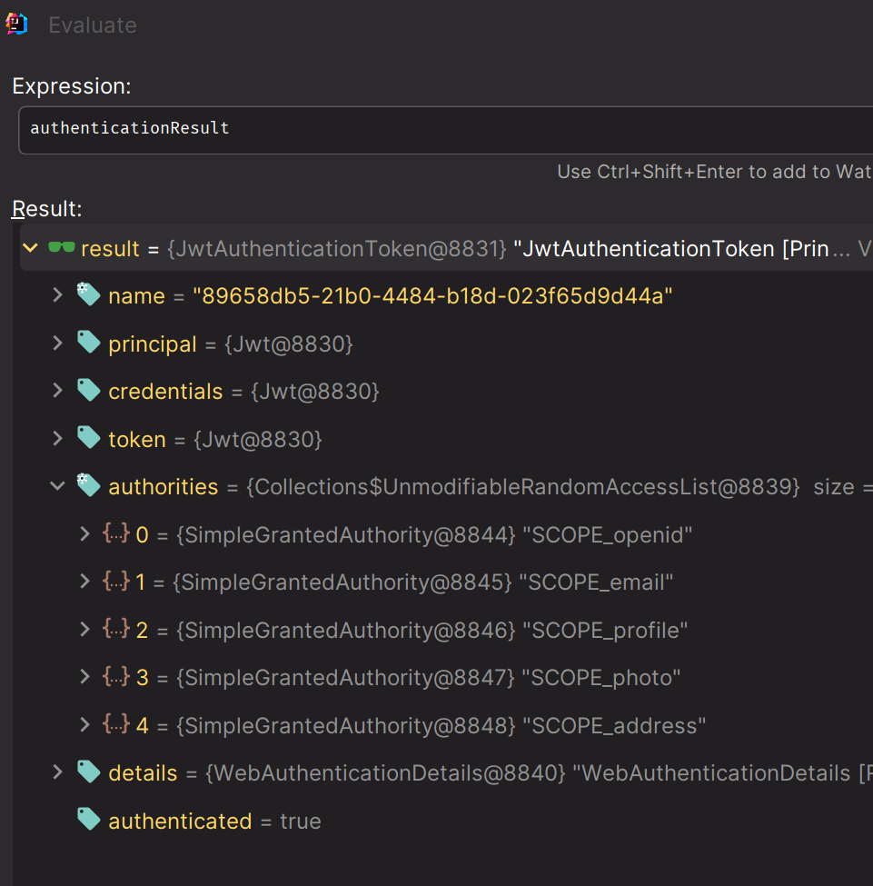

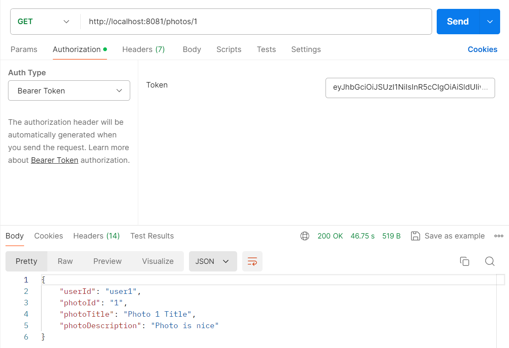

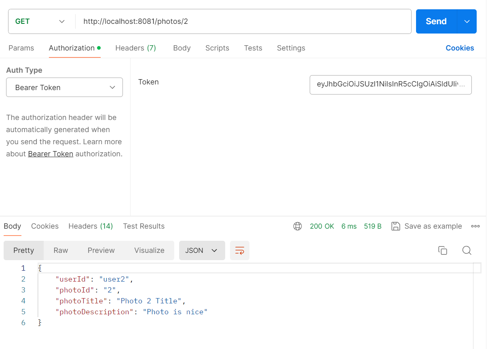

## 메소드 기반 권한 부여

### SecurityConfig 추가

```java
@Configuration
@EnableWebSecurity
@EnableMethodSecurity //추가
public class SecurityConfig {...}
```

### PhotoController 추가

```java
@RestController
public class PhotoController {

    @GetMapping("/photos/1")
    public Photo photo1() {
        ...
    }

    @GetMapping("/photos/2")
    @PreAuthorize("hasAnyAuthority('SCOPE_photo')") //추가
    public Photo photo2() {
        ...
    }
}
```
> 설정 클래스에서 `permitAll()`을 설정했더라도 메서드 지정이 더 우선이다.
---

[메인 ⏫](https://github.com/genesis12345678/TIL/blob/main/Spring/security/oauth/main.md)

[다음 ↪️ - OAuth 2.0 Resource Server 권한 구현 - 권한 구성 커스터마이징](https://github.com/genesis12345678/TIL/blob/main/Spring/security/oauth/ResourceServer/%EA%B6%8C%ED%95%9C%EB%A7%A4%ED%95%91/Custom.md)