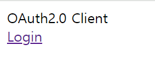
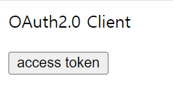
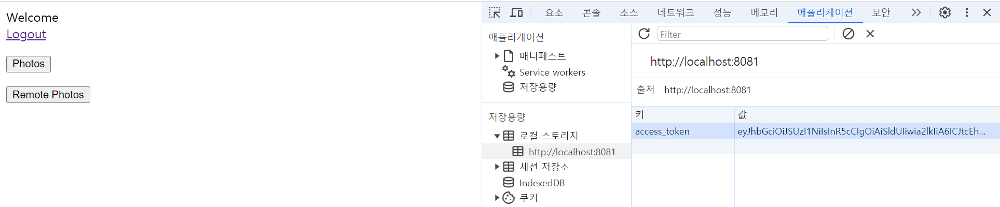

# OAuth 2.0 Client + OAuth 2.0 Resource Server 연동

## Client

### 의존성

```text
dependencies {
    implementation 'org.springframework.boot:spring-boot-starter-oauth2-client' //Client
    implementation 'org.springframework.boot:spring-boot-starter-security'
    implementation 'org.springframework.boot:spring-boot-starter-web'
    
    implementation 'org.springframework.boot:spring-boot-starter-thymeleaf'
    implementation 'org.thymeleaf.extras:thymeleaf-extras-springsecurity6'
    
    compileOnly 'org.projectlombok:lombok'
    annotationProcessor 'org.projectlombok:lombok'
    
    testImplementation 'org.springframework.boot:spring-boot-starter-test'
    testImplementation 'org.springframework.security:spring-security-test'
}
```
> 클라이언트는 화면을 보여줘야 하기 때문에 템플릿 엔진(타임리프)이 필요하다.

### application.yml

```yaml
server:
  port: 8081

spring:
  security:
    oauth2:
      client:
        provider:
          keycloak:
            authorization-uri: http://localhost:8080/realms/oauth2/protocol/openid-connect/auth
            issuer-uri: http://localhost:8080/realms/oauth2
            jwk-set-uri: http://localhost:8080/realms/oauth2/protocol/openid-connect/certs
            token-uri: http://localhost:8080/realms/oauth2/protocol/openid-connect/token
            user-info-uri: http://localhost:8080/realms/oauth2/protocol/openid-connect/userinfo
            user-name-attribute: preferred_username
        registration:
          keycloak:
            authorization-grant-type: authorization_code
            client-id: oauth2-client-app
            client-name: oauth2-client-app
            client-secret: ANwKmYvCcxiQbjsi4jh1JHqUWikngjec
            redirect-uri: http://localhost:8081/login/oauth2/code/keycloak
            scope:
              - openid
              - email
              - photo
```

> 클라이언트에서 인가 서버로 임시 토큰을 요청하고 발급받기 위해 필요한 엔드포인트 및 설정 정보

### IndexController

```java
@Controller
public class IndexController {

    @GetMapping("/")
    public String index() {
        return "index";
    }

    @GetMapping("/home")
    public String home() {
        return "home";
    }
}
```

### index.html

```html
<!DOCTYPE html SYSTEM "http://www.thymeleaf.org/dtd/xhtml1-strict-thymeleaf-4.dtd">
<html xmlns="http://www.w3.org/1999/xhtml"
      xmlns:th="http://www.thymeleaf.org"
      xmlns:sec="http://www.thymeleaf.org/extras/spring-security">
<head>
    <meta charset="UTF-8">
    <title>Insert title here</title>
    <script>
        function token(){
            fetch("/token")
                .then(response => {
                    response.json().then(function(data){
                        console.log("text 안에 데이터 = " + data.tokenValue);
                        window.localStorage.setItem("access_token", data.tokenValue);
                        location.href = "/home";
                    })
                })
        }
    </script>
</head>
<body>
<div>OAuth2.0 Client</div>
<div sec:authorize="isAnonymous()"><a th:href="@{/oauth2/authorization/keycloak}">Login</a></div>
<div sec:authorize="isAuthenticated()">
    <form action="#">
        <p><input type="button" onclick="token()" value="access token" />
    </form>
</div>
</body>
</html>
```

> - 인증을 받지 못하면 화면에 Login 이 나오고, [링크](https://github.com/genesis12345678/TIL/blob/main/Spring/security/oauth/OAuth2Login/Authorization%20Code.md)는 인가 서버에게 임시 코드를 받도록 요청하는 링크이다.
> - 인증을 받은 상태에서는 `token()` 함수를 호출하는 버튼이 보인다.
>   - 이 함수는 응답으로 받은 액세스 토큰을 로컬 스토리지에 저장하고 `/home`으로 이동한다.
>   - 이 액세스 토큰은 `Authorization` 헤더에 보낼 토큰이 된다.

### home.html

```html
<!DOCTYPE html SYSTEM "http://www.thymeleaf.org/dtd/xhtml1-strict-thymeleaf-4.dtd">
<html xmlns="http://www.w3.org/1999/xhtml"
      xmlns:th="http://www.thymeleaf.org"
      xmlns:sec="http://www.thymeleaf.org/extras/spring-security">

<head>
    <meta charset="UTF-8">
    <title>Insert title here</title>
    <script>
        function remotePhotos(){
            fetch("http://localhost:8082/remotePhotos",{
                method : "GET",
                headers : {
                    Authorization : "Bearer "+ localStorage.getItem("access_token")
                }
            })
                .then(response => {
                    response.json().then(function(data){
                        for(const prop in data) {
                            document.querySelector("#remotePhotos").append(data[prop].userId);
                            document.querySelector("#remotePhotos").append(data[prop].photoId);
                            document.querySelector("#remotePhotos").append(data[prop].photoTitle);
                            document.querySelector("#remotePhotos").append(data[prop].photoDescription);
                            document.querySelector("#remotePhotos").append(document.createElement('br'));
                        }
                    })
                })
        }

        function photos(){
            fetch("/photos?token=" + localStorage.getItem("access_token"),
                {
                    method : "GET",
                    headers : {
                        "Content-Type": "application/json",
                    },
                })
                .then(response => {
                    response.json().then(function(data){
                        for(const prop in data) {
                            document.querySelector("#photos").append(data[prop].userId);
                            document.querySelector("#photos").append(data[prop].photoId);
                            document.querySelector("#photos").append(data[prop].photoTitle);
                            document.querySelector("#photos").append(data[prop].photoDescription);
                            document.querySelector("#photos").append(document.createElement('br'));
                        }
                    })
                })
                .catch((error) => console.log("error:", error));
        }

    </script>
</head>
<body>
<div>Welcome</div>
<div sec:authorize="isAuthenticated()"><a th:href="@{/logout}">Logout</a></div>
<form action="#">
    <p><input type="button" onclick="photos()" value="Photos" />
    <p><input type="button" onclick="remotePhotos()" value="Remote Photos" />
</form>
<div id="photos"></div>
<p></p>
<div id="remotePhotos"></div>
</body>
</html>
```
> 로그아웃 버튼과 각 함수를 실행하는 `Photos` 버튼과 `Remote Photos` 버튼이 있다.
> - `photos()`
>   - 내부적으로 `RestTemplate`을 사용해 리소스 서버와 통신하여 데이터를 받아오는 함수
> - `remotePhotos()`
>   - 바로 리소스 서버에 요청을 보내 데이터를 받아오는 함수

### SecurityConfig

```java
@Configuration
@EnableWebSecurity
public class OAuth2ClientConfig {

    @Bean
    public SecurityFilterChain securityFilterChain(HttpSecurity http) throws Exception {

        http
                .authorizeHttpRequests(auth -> auth
                        .requestMatchers("/").permitAll()
                        .anyRequest().authenticated())
                .oauth2Login(authLogin -> authLogin.defaultSuccessUrl("/"));

        return http.build();
    }

    @Bean
    public RestTemplate restTemplate() {
        return new RestTemplate();
    }
}
```
> 기본 인가 설정과 통신에 필요한 `RestTemplate` 빈 등록


### RestApiController

```java
@RestController
@RequiredArgsConstructor
public class RestApiController {

    private final RestTemplate restTemplate;

    @GetMapping("/token")
    public OAuth2AccessToken token(@RegisteredOAuth2AuthorizedClient("keycloak") OAuth2AuthorizedClient client) {
        return client.getAccessToken();
    }

    @GetMapping("/photos")
    public List<Photo> photos(@RequestParam("token") String accessToken) {
        HttpHeaders headers = new HttpHeaders();
        headers.add("Authorization", "Bearer " + accessToken);
        HttpEntity<?> entity = new HttpEntity<>(headers);

        String url = "http://localhost:8082/photos";

        ResponseEntity<List<Photo>> response = //리소스 서버와 통신
                restTemplate.exchange(url, HttpMethod.GET, entity, new ParameterizedTypeReference<>() {});

        return response.getBody();
    }
}
```

### http://localhost:8081



### Login 클릭



- 인증이 되었기 때문에 Login 링크 대신 `access token` 버튼이 보임.

### access token 클릭



- `http://localhost:8081/home` 으로 이동하고 로컬 스토리지에 액세스 토큰이 저장되어 있다.