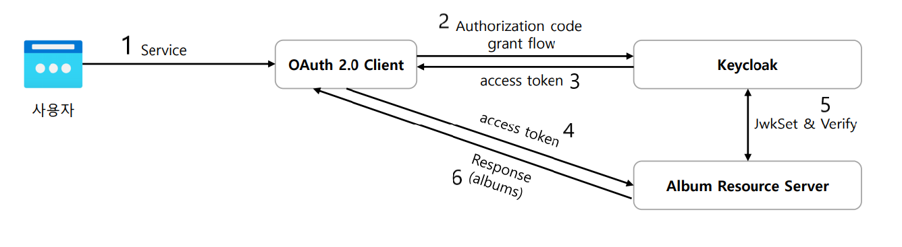

# OAuth 2.0 Client + OAuth 2.0 Resource Server 연동

### 연동 구성

- **OAuth 2.0 Client** : 애플리케이션
- **OAuth 2.0 Resource Server** : 보호된 자원 서버
- **Keycloak** : 인가 서버

### 처리 순서

1. 클라이언트에서 인가 서버로 `Authorization Code Grant` 타입으로 토큰을 발급받고 이후 사용자 엔드포인트 요청으로 인증을 진행한다.
2. 클라이언트에서 인증에 성공하면 백단에서 `RestTemplate`으로 리소스 서버로 자원 요청을 한다.
3. 최종적으로 반환 받은 리소스를 클라이언트로 응답한다.

---

### [모듈 1 - OAuth2 Client]()
### [모듈 2 - OAuth2 Resource Server]()