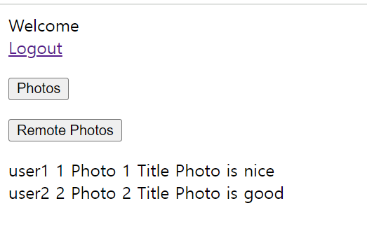
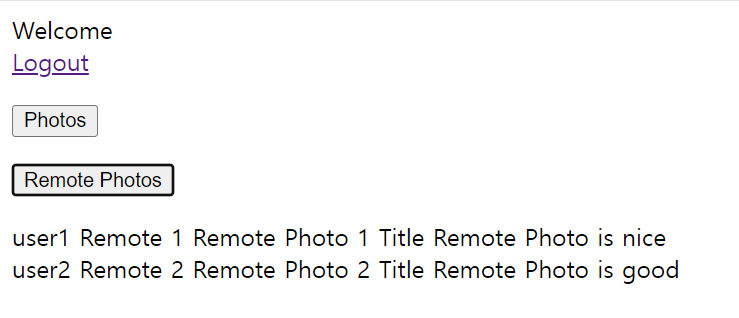

# OAuth 2.0 Client + OAuth 2.0 Resource Server 연동

## Resource Server

### 의존성

```text
dependencies {
    implementation 'org.springframework.boot:spring-boot-starter-oauth2-resource-server' //Resource Server
    implementation 'org.springframework.boot:spring-boot-starter-security'
    implementation 'org.springframework.boot:spring-boot-starter-web'
    
    compileOnly 'org.projectlombok:lombok'
    annotationProcessor 'org.projectlombok:lombok'
    
    testImplementation 'org.springframework.boot:spring-boot-starter-test'
    testImplementation 'org.springframework.security:spring-security-test'
}
```

### application.yml

```yaml
server:
  port: 8082

spring:
  security:
    oauth2:
      resourceserver:
        jwt:
          jwk-set-uri: http://localhost:8080/realms/oauth2/protocol/openid-connect/certs
```

### SecurityConfig

```java
@Configuration
@EnableWebSecurity
public class OAuth2ResourceServer {

    @Bean
    public SecurityFilterChain securityFilterChain(HttpSecurity http) throws Exception {

        http
                .authorizeHttpRequests(auth -> auth
                        .requestMatchers("/photos").hasAnyAuthority("SCOPE_photo")
                        .anyRequest().authenticated()
                ).oauth2ResourceServer(oauth2 -> oauth2.jwt(Customizer.withDefaults()))
                .cors(cors -> cors.configurationSource(corsConfigurationSource()));

        return http.build();
    }

    @Bean
    public CorsConfigurationSource corsConfigurationSource() {
        CorsConfiguration configuration = new CorsConfiguration();
        configuration.addAllowedOrigin("*");
        configuration.addAllowedMethod("*");
        configuration.addAllowedHeader("*");
        configuration.setMaxAge(3600L);

        UrlBasedCorsConfigurationSource source = new UrlBasedCorsConfigurationSource();
        source.registerCorsConfiguration("/**", configuration);

        return source;
    }
}
```

> - [CORS](https://github.com/genesis12345678/TIL/blob/main/Spring/security/security/Cors_Csrf/Cors.md)
> - 클라이언트와 리소스 서버는 서로 다른 포트이기 때문에 `CORS` 정책에 의해 통신이 제한된다.
> - 이때 클라이언트에서 `photos` 를 요청할 때는 서버 간의 요청이기 때문에 `CORS` 정책에 영향을 받지 않는다.
> - `remotePhotos` 요청은 자바스크립트 요청이기 때문에 `CORS` 정책에 영향을 받는다.

### PhotoController

```java
@RestController
public class PhotoController {

    @GetMapping("/photos")
    public List<Photo> photos() {
        Photo photo1 = getPhoto("1 ", " Photo 1 Title ", " Photo is nice ", " user1 ");
        Photo photo2 = getPhoto("2 ", " Photo 2 Title ", " Photo is good ", " user2 ");

        return Arrays.asList(photo1, photo2);
    }

    @GetMapping("/remotePhotos")
    public List<Photo> remotePhotos() {
        Photo photo1 = getPhoto("Remote 1 ", " Remote Photo 1 Title ", " Remote Photo is nice ", " user1 ");
        Photo photo2 = getPhoto("Remote 2 ", " Remote Photo 2 Title ", " Remote Photo is good ", " user2 ");

        return Arrays.asList(photo1, photo2);
    }

    private Photo getPhoto(String photoId, String title, String description, String userId) {
        return Photo.builder()
                .photoId(photoId)
                .photoTitle(title)
                .photoDescription(description)
                .userId(userId)
                .build();
    }
}
```
```java
@Data
@Builder
public class Photo {

    private String photoId;
    private String photoTitle;
    private String photoDescription;
    private String userId;
}
```

### Photos - RestTemplate 요청



### Remote Photos - 자바스크립트 요청

