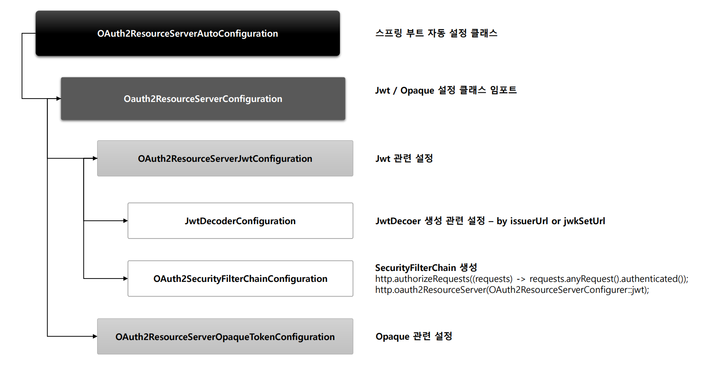
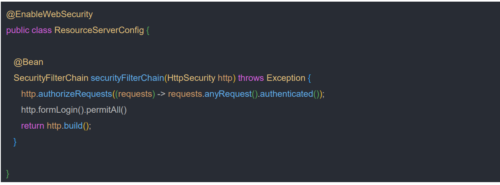
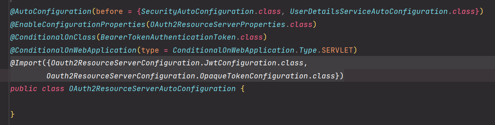
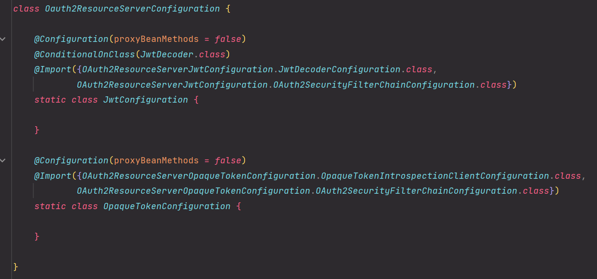
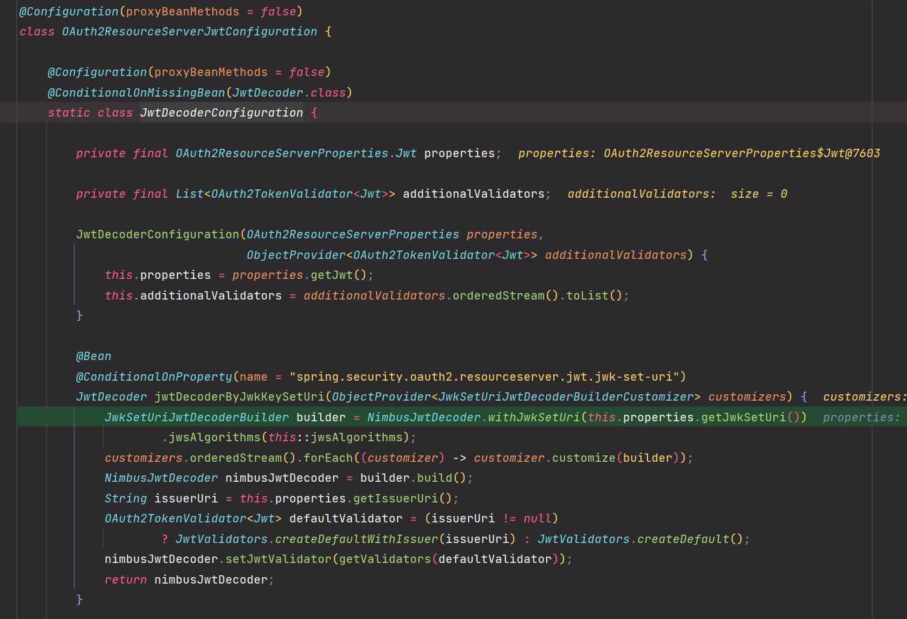
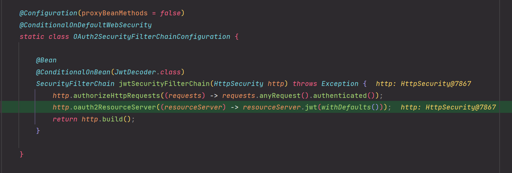

# OAuth 2.0 Resource Server - 자동 설정에 의한 초기화 과정

- 모든 요청에 대해 인증을 받아야 리소스 접근이 가능하다.
- 사용자가 폼 로그인을 통해 인증하게 되면 리소스 접근이 가능하다.
- 사용자가 폼 로그인을 통해 인증과정 없이 리소스 접근이 가능하도록 할려면 요청시 `Access Token`을 가지고 자체 검증 후 인증 과정을 거치도록 한다.

---

### OAuth2ResourceServerAutoConfiguration

### Oauth2ResourceServerConfiguration

### OAuth2ResourceServerJwtConfiguration.JwtDecoderConfiguration

- 직접 만든 `JwtDecoder`가 빈으로 등록되어 있지 않으면 기본적으로 `JwtDecoder`의 구현헤 중 하나인 **NimbusJwtDecoder**가 생성된다.

- 커스텀한 `SecurityFilterChain`을 빈으로 등록하지 않고, `JwtDecoder`가 빈으로 등록되어 있으면 기본 `SecurityFilterChain`을 빈으로 등록한다.
---

[이전 ↩️ - OAuth 2.0 Resource Server - AuthenticationEntryPoint]()

[메인 ⏫](https://github.com/genesis12345678/TIL/blob/main/Spring/security/oauth/main.md)