# Social Login - 구글, 네이버 애플리케이션 등록

## Google

- [https://console.cloud.google.com](https://console.cloud.google.com)

**프로젝트 생성**

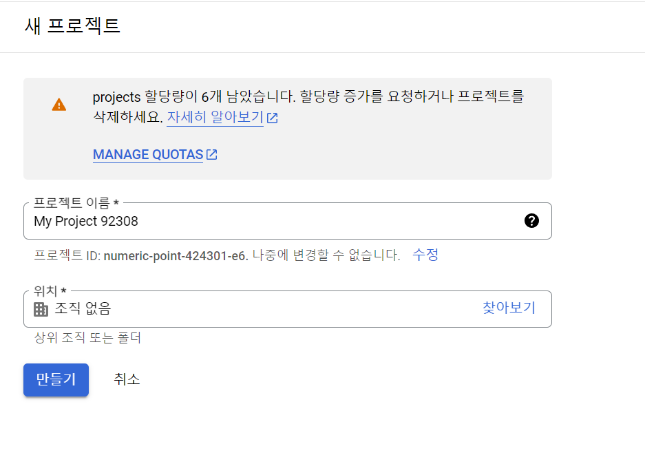

**메뉴 -> 모든 제품 보기 -> API 및 서비스 -> OAuth 동의 화면**

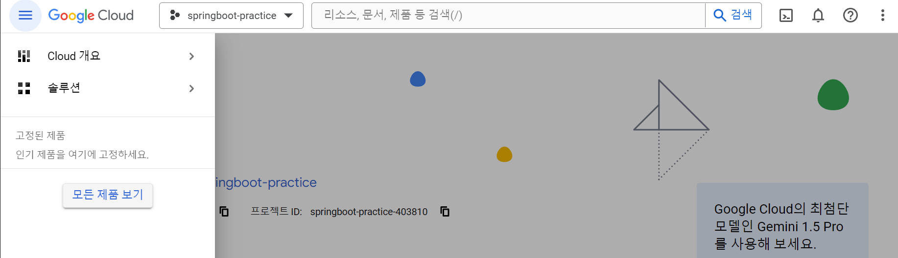

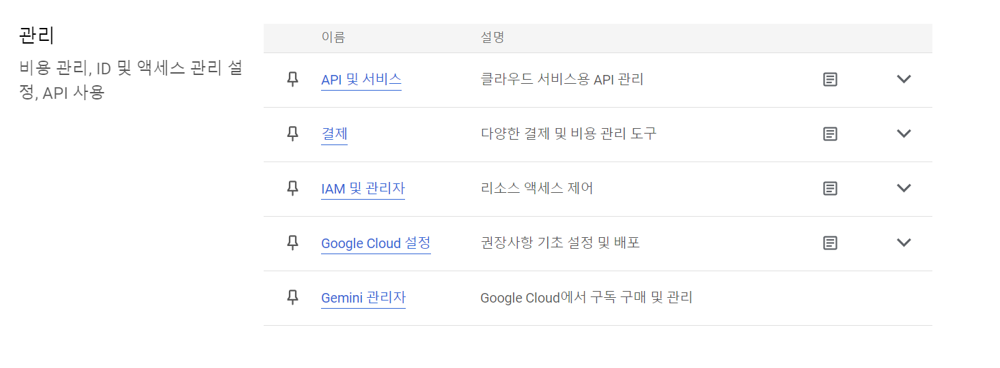

**외부 선택**

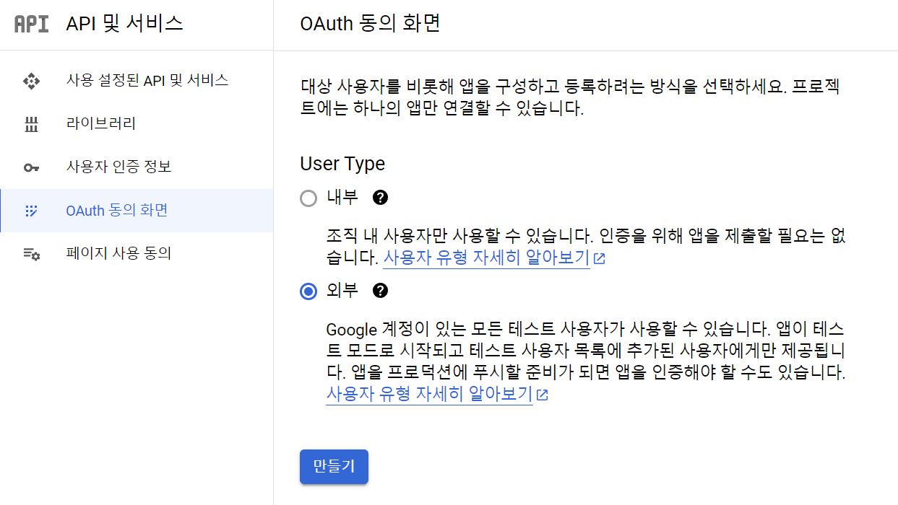

**필수 항목 입력**(앱 이름과 프로젝트 이름 다르게)

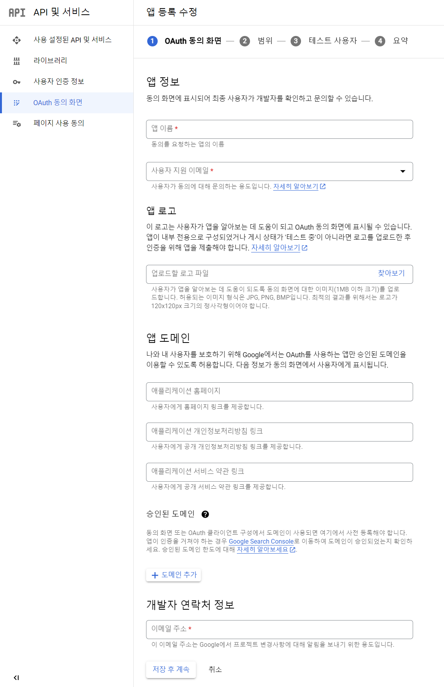

**스코프 선택**

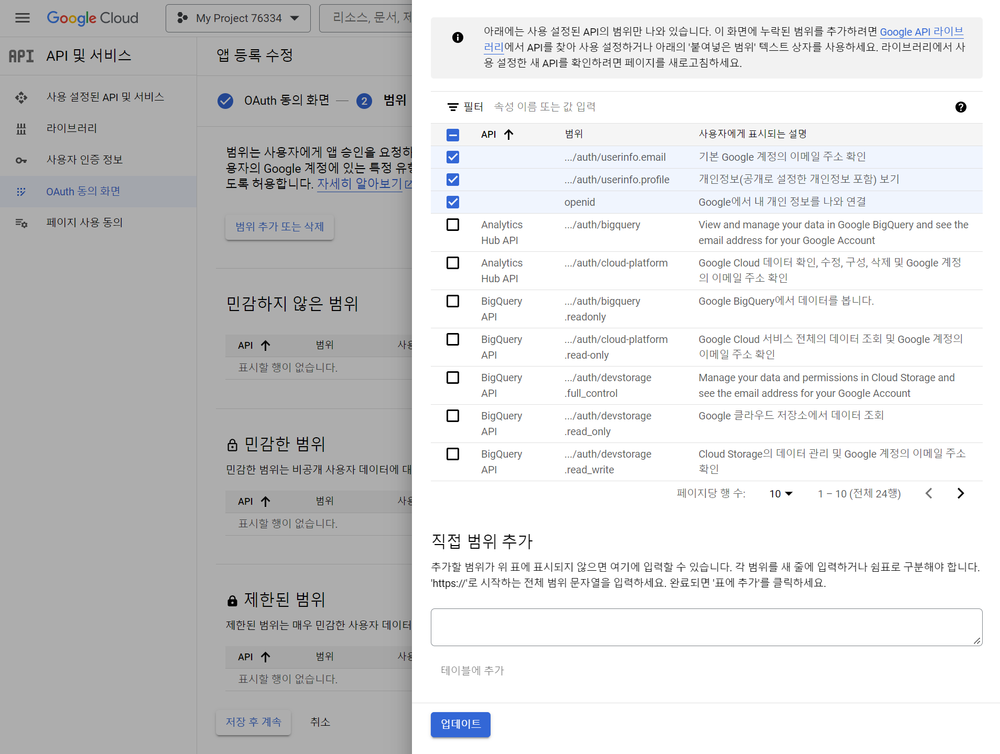

**테스트 사용자 건너뛰고 사용자 인증 정보 -> 사용자 인증 정보 만들기 -> OAuth2 클라이언트 ID**

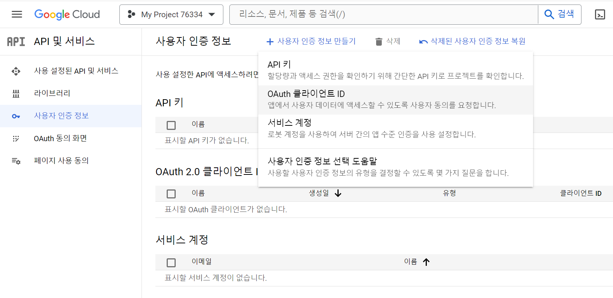

- **애플리케이션 유형** : 웹 애플리케이션
- 이름 : 원하는대로
- **승인된 리디렉션 URI** : `/login/oauth2/code/`(별도 설정 없으면 고정) + `{registrationId}`

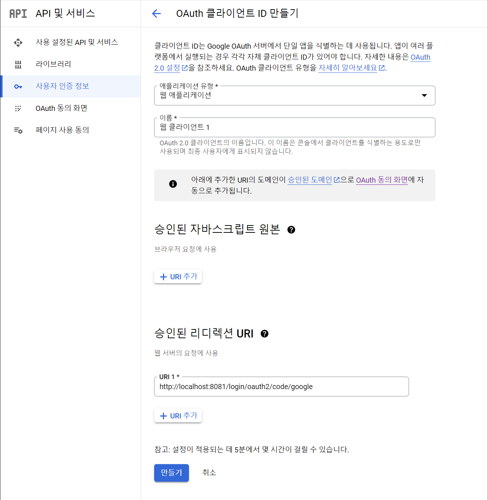

이후 만들어진 OAuth2 클라이언트 ID에 들어가면 `client_id`와 `client_secret` 확인 가능

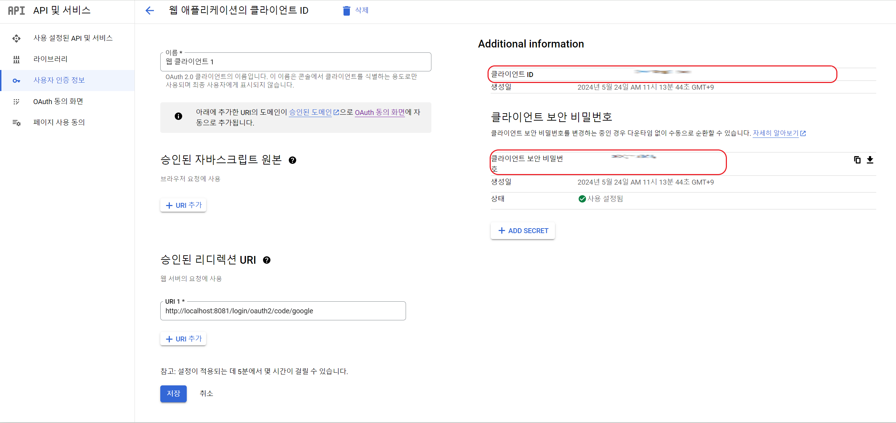

---

## Naver

- [https://developers.naver.com/apps/#/register](https://developers.naver.com/apps/#/register)

**애플리케이션 이름, 사용 API(네이버 로그인), 스코프, 서비스 URL과 리디렉션 URL** 선택, 지정

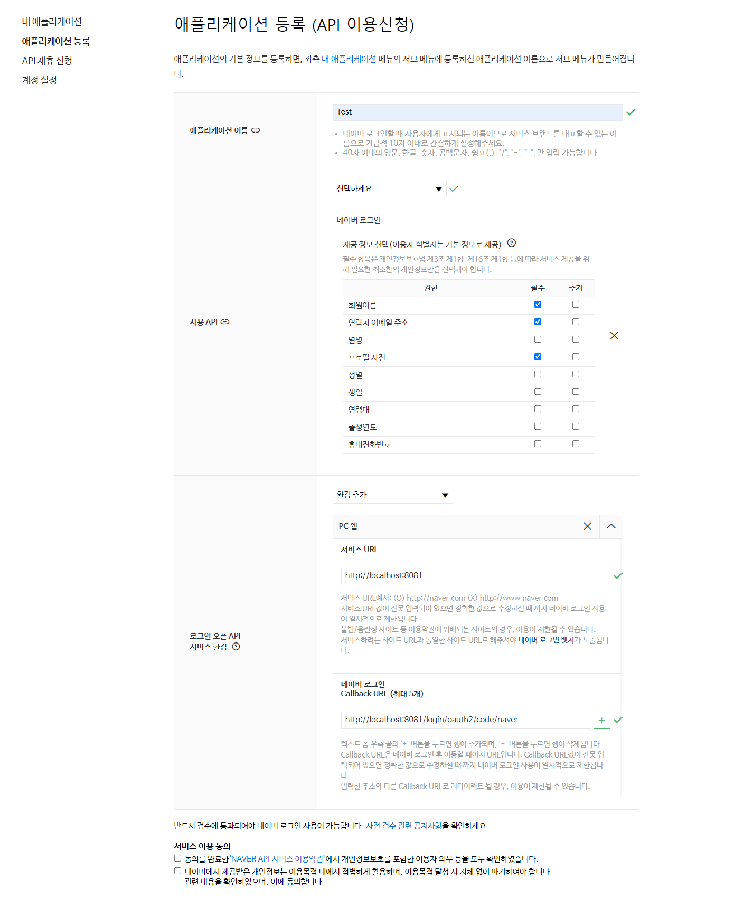

**동의 후 등록하면 `client_id`와 `client_secret` 확인 가능**

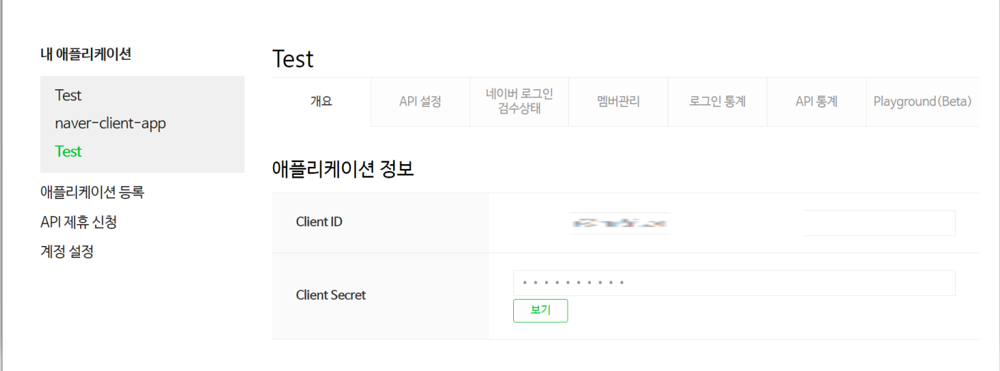

---

[메인 ⏫](https://github.com/genesis12345678/TIL/blob/main/Spring/security/oauth/main.md)

[다음 ↪️ - OAuth 2.0 Client(Social Login) - 코드 구현](https://github.com/genesis12345678/TIL/blob/main/Spring/security/oauth/SocialLogin/code/Main.md)