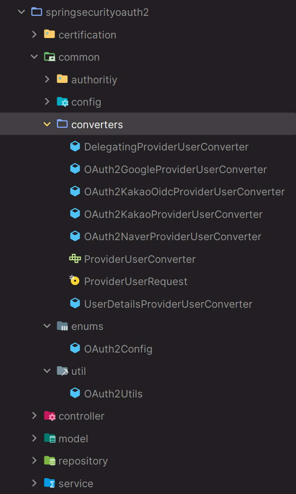
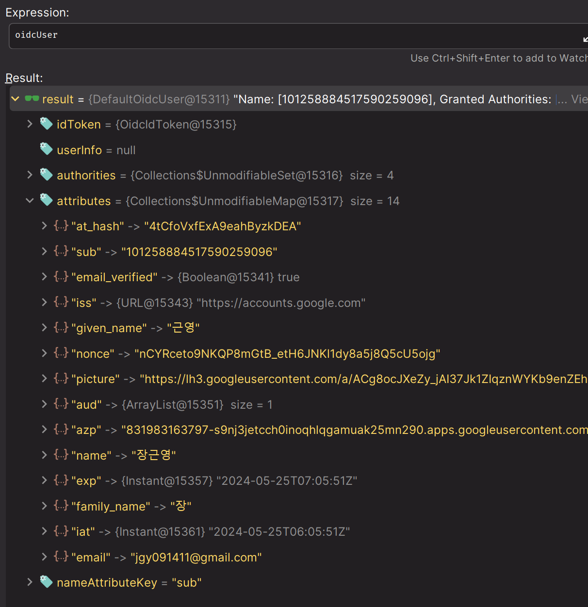
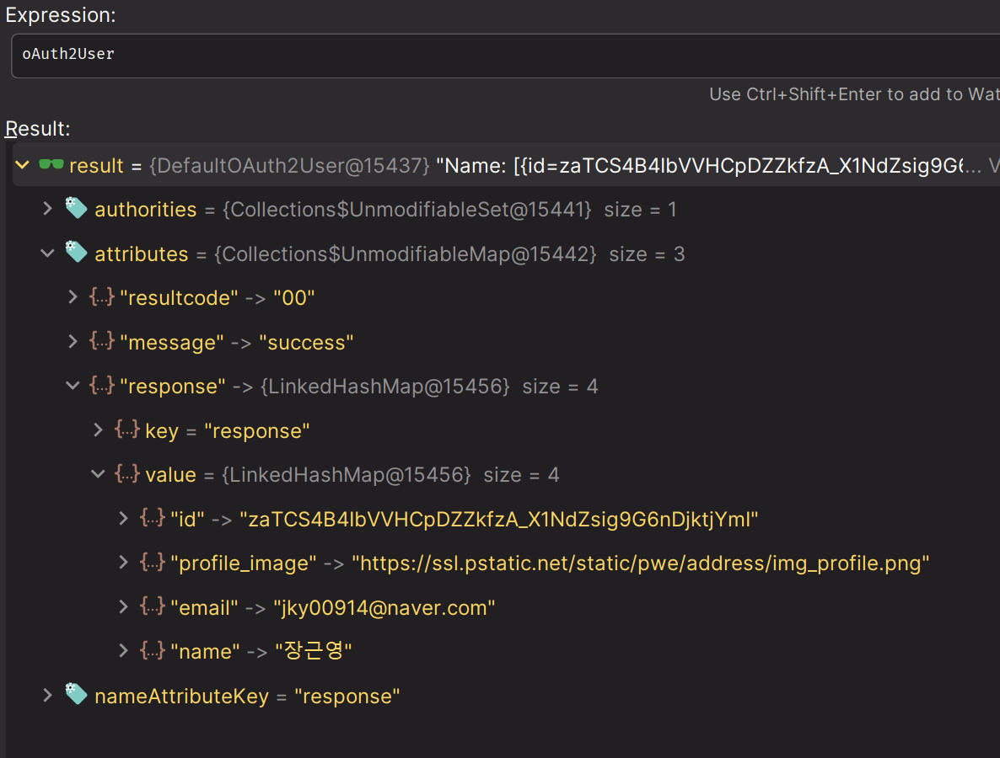
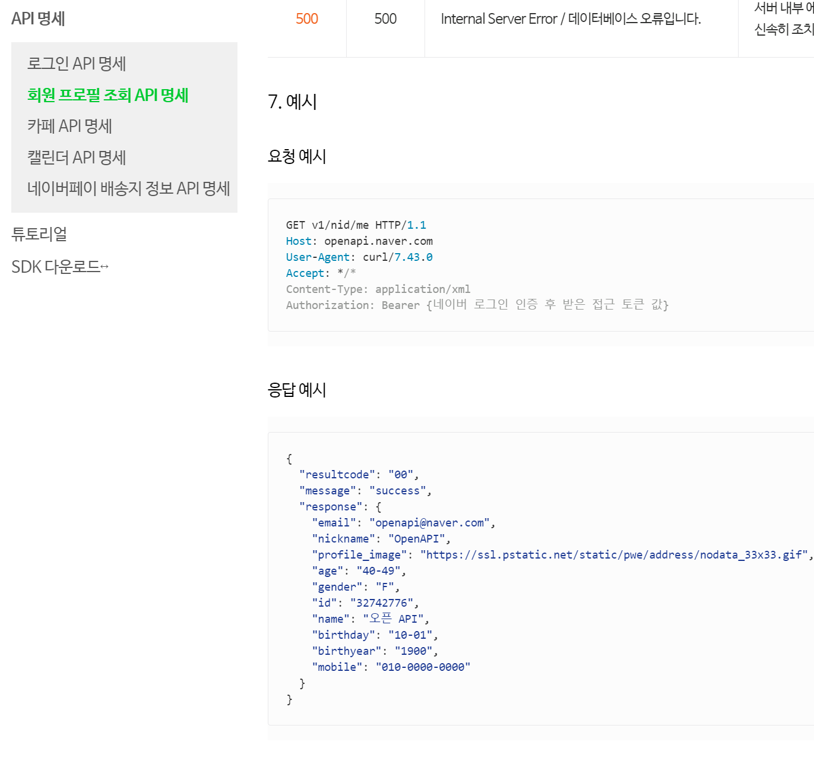
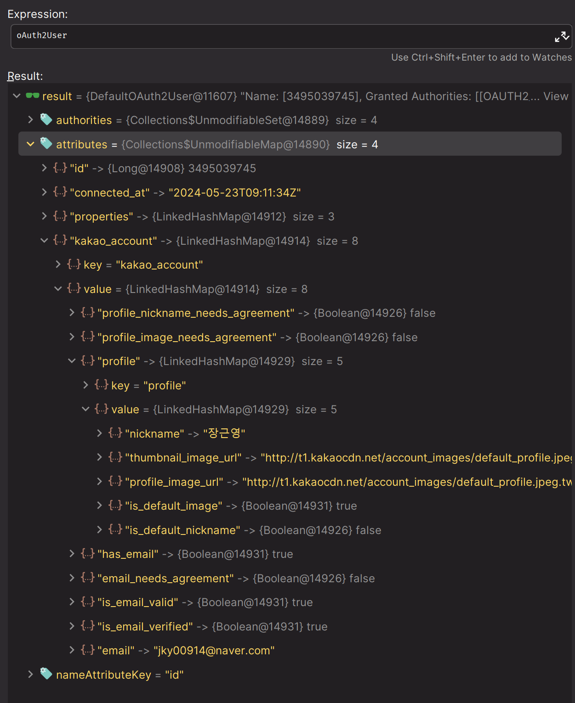
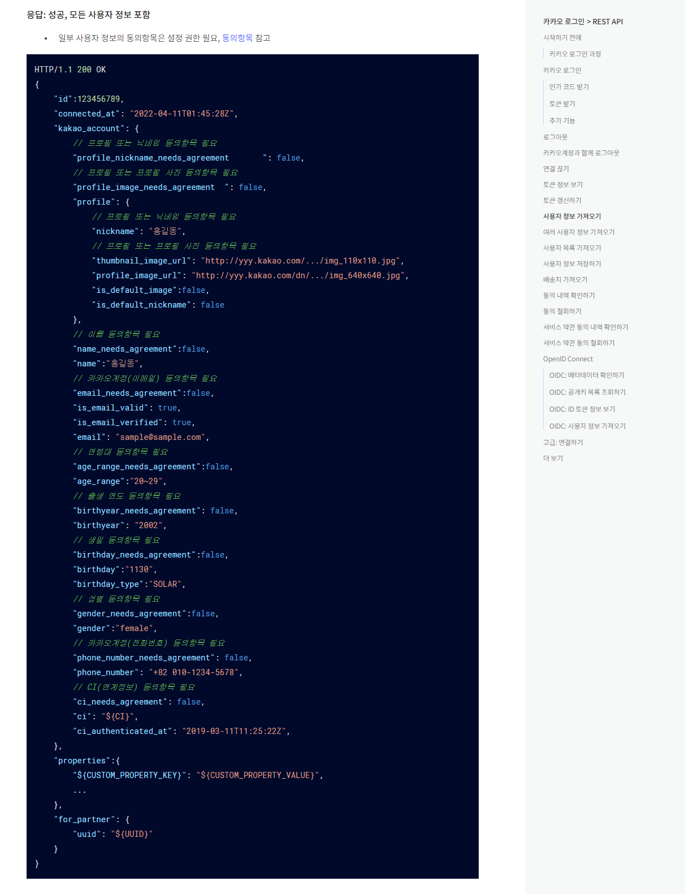
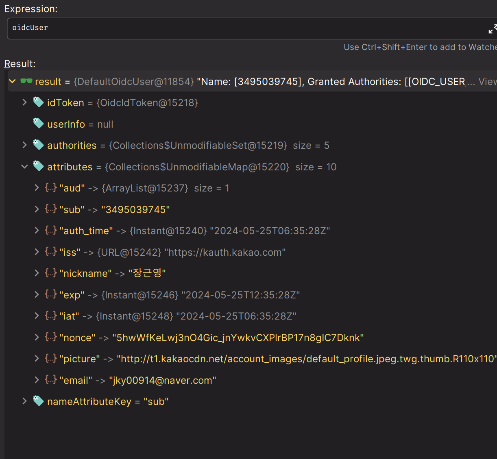
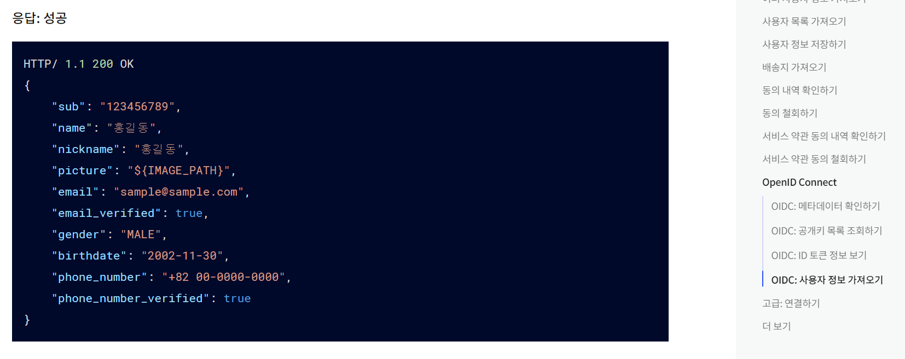

# Social Login - 폼 인증 & 카카오 추가 및 리팩토링 - Converter



---

### ProviderUserRequest

```java
public record ProviderUserRequest(
        ClientRegistration clientRegistration,
        OAuth2User oAuth2User,
        User user) {

    //OAuth2 인증을 위한 생성자
    public ProviderUserRequest(ClientRegistration clientRegistration, OAuth2User oAuth2User) {
        this(clientRegistration, oAuth2User, null);
    }
    
    //폼 인증을 위한 생성자
    public ProviderUserRequest(User user) {
        this(null, null, user);
    }
}
```
> [참고 - 레코드 특징](https://github.com/genesis12345678/TIL/blob/main/Java/Record/record.md)
---

### ProviderUserConverter

```java
public interface ProviderUserConverter<T, R> {
    R converter(T t);
}
```
> `T` 타입 받아서 `R` 타입으로 변환 기능을 하는 인터페이스

---

### DelegatingProviderUserConverter

```java
@Component
public class DelegatingProviderUserConverter implements ProviderUserConverter<ProviderUserRequest, ProviderUser> {

    private List<ProviderUserConverter<ProviderUserRequest, ProviderUser>> converters;

    public DelegatingProviderUserConverter() {
        List<ProviderUserConverter<ProviderUserRequest, ProviderUser>> providerUserConverters =
                Arrays.asList(
                        new UserDetailsProviderUserConverter(),
                        new OAuth2GoogleProviderUserConverter(),
                        new OAuth2NaverProviderUserConverter(),
                        new OAuth2KakaoProviderUserConverter(),
                        new OAuth2KakaoOidcProviderUserConverter()
                );

        this.converters = Collections.unmodifiableList(new LinkedList<>(providerUserConverters));
    }

    @Override
    public ProviderUser converter(ProviderUserRequest providerUserRequest) {

        Assert.notNull(providerUserRequest, "providerUserRequest cannot be null");

        for (ProviderUserConverter<ProviderUserRequest, ProviderUser> converter : converters) {
            ProviderUser providerUser = converter.converter(providerUserRequest);

            if (providerUser != null) {
                return providerUser;
            }
        }

        return null;
    }
}
```
> - 스프링 빈으로 등록한다. 생성 되면서 각 컨터버들의 구현체를 가지게 되며, 이 클래스의 역할은 각 구현체에게 위임하는 역할이다.
> - **OAuth2UserService** 나 **OidcUserService** 에서 이 클래스를 주입 받고 각 서버에 맞는 `ProviderUser`를 반환 받는다.
> - `Collections.unmodifiableList`
>   - 전달된 List를 수정 불가능 하도록 만드는 메서드. (읽기 전용 리스트 생성)

---

### SocialType

```java
public class OAuth2Config {
    public enum SocialType{
        GOOGLE("google"),
        NAVER("naver"),
        KAKAO("kakao");

        private final String socialName;

        SocialType(String socialName) {
            this.socialName = socialName;
        }

        public String getSocialName() {
            return socialName;
        }
    }
}
```
> 각 컨버터별로 이 클래스를 이용해 소셜 타입을 확인한다.

---

### OAuth2Utils

```java
public class OAuth2Utils {

    public static Attributes getMainAttributes(OAuth2User oAuth2User) {
        return Attributes.builder()
                .mainAttributes(oAuth2User.getAttributes())
                .build();
    }

    public static Attributes getSubAttributes(OAuth2User oAuth2User, String subAttributesKey) {
        Map<String, Object> subAttributes = (Map<String, Object>) oAuth2User.getAttributes().get(subAttributesKey);
        return Attributes.builder()
                .subAttributes(subAttributes)
                .build();
    }

    public static Attributes getOtherAttributes(OAuth2User oAuth2User, String subAttributesKey, String otherAttributesKey) {
        Map<String, Object> subAttributes = (Map<String, Object>) oAuth2User.getAttributes().get(subAttributesKey);
        Map<String, Object> otherAttributes = (Map<String, Object>) subAttributes.get(otherAttributesKey);

        return Attributes.builder()
                .subAttributes(subAttributes)
                .otherAttributes(otherAttributes)
                .build();
    }
}
```
> - 구글, 네이버, 카카오 모두 응답의 JSON 형태가 다르다.
> - 1단계에서 바로 얻을 수 있는 정보들이면 `mainAttribute`, 2단계에서 얻을 수 있는 정보들은 `subAttribute`, 카카오 같은 경우 3단계까지 가야 
>   얻을 수 있는 정보들이 있기 때문에 `otherAttribute`까지 확인해야 한다.
---

### OAuth2GoogleProviderUserConverter

```java
public class OAuth2GoogleProviderUserConverter implements ProviderUserConverter<ProviderUserRequest, ProviderUser> {

    @Override
    public ProviderUser converter(ProviderUserRequest providerUserRequest) {

        if (!providerUserRequest.clientRegistration().getRegistrationId().equals(OAuth2Config.SocialType.GOOGLE.getSocialName())) {
            return null;
        }
        return new GoogleUser(
                OAuth2Utils.getMainAttributes(providerUserRequest.oAuth2User()),
                providerUserRequest.oAuth2User(),
                providerUserRequest.clientRegistration()
        );
    }
}
```

> - **registrationId가 `google`일 때 실행된다.**
> 
> 
> 
> 구글은 1단계에서 정보를 바로 얻을 수 있기 때문에 `mainAttribute`를 생성한다.

---

### OAuth2NaverProviderUserConverter

```java
public class OAuth2NaverProviderUserConverter implements ProviderUserConverter<ProviderUserRequest, ProviderUser> {
    
    @Override
    public ProviderUser converter(ProviderUserRequest providerUserRequest) {
        if (!providerUserRequest.clientRegistration().getRegistrationId().equals(OAuth2Config.SocialType.NAVER.getSocialName())) {
            return null;
        }
        return new NaverUser(
                OAuth2Utils.getSubAttributes(providerUserRequest.oAuth2User(), "response"),
                providerUserRequest.oAuth2User(),
                providerUserRequest.clientRegistration());
    }
}
```
> - **registrationId가 `naver`일 때 실행된다.**
> 
> 
> 
> 네이버는 `response`로 한 번 감싸져 있기 때문에 `subAttribute`를 생성한다.
> 
> **참고(네이버 API 명세)**
> 
> 

---

### OAuth2KakaoProviderUserConverter & OAuth2KakaoOidcProviderUserConverter

```java
public class OAuth2KakaoProviderUserConverter implements ProviderUserConverter<ProviderUserRequest, ProviderUser> {
    
    @Override
    public ProviderUser converter(ProviderUserRequest providerUserRequest) {
        if (!providerUserRequest.clientRegistration().getRegistrationId().equals(OAuth2Config.SocialType.KAKAO.getSocialName())) {
            return null;
        }
        if (providerUserRequest.oAuth2User() instanceof OidcUser) {
            return null;
        }

        return new KakaoUser(
                OAuth2Utils.getOtherAttributes(providerUserRequest.oAuth2User(),
                "kakao_account",
                "profile"),
                providerUserRequest.oAuth2User(),
                providerUserRequest.clientRegistration());
    }
}
```
```java
public class OAuth2KakaoOidcProviderUserConverter implements ProviderUserConverter<ProviderUserRequest, ProviderUser> {
    
    @Override
    public ProviderUser converter(ProviderUserRequest providerUserRequest) {
        if (!providerUserRequest.clientRegistration().getRegistrationId().equals(OAuth2Config.SocialType.KAKAO.getSocialName())) {
            return null;
        }

        if (!(providerUserRequest.oAuth2User() instanceof OidcUser)) {
            return null;
        }
        return new KakaoOidcUser(
                OAuth2Utils.getMainAttributes(providerUserRequest.oAuth2User()),
                providerUserRequest.oAuth2User(),
                providerUserRequest.clientRegistration()
        );
    }
}
```
> - **registrationId가 `kakao`일 때 실행된다.**
> 
> 카카오의 경우 **OpenID**를 지원하며 선택적으로 사용할 수 있기 때문에 `OAuth` 인증과 `Oidc` 인증을 구분해야 한다. 그리고 이 둘은 응답 형태가 다르다.
> 
> **OAuth 인증의 경우 기본 정보가 `kakao_account`로 묶여 있으며 profile 정보는 `profile`로 한 번 더 묶여 있는 것을 볼 수 있다.**
> 
> 
> 
> **참고(카카오 API 명세)**
> 
> 
> 
> **반면 OpenID 인증의 경우 구글처럼 1단계에서 바로 정보를 가져올 수 있는 것을 확인할 수 있다.**
> 
> 
> 
> **참고(카카오 API 명세)**
> 
> 

---

### UserDetailsProviderUserConverter

```java
public class UserDetailsProviderUserConverter implements ProviderUserConverter<ProviderUserRequest, ProviderUser> {

    @Override
    public ProviderUser converter(ProviderUserRequest providerUserRequest) {
        if (providerUserRequest.user() == null) {
            return null;
        }

        User user = providerUserRequest.user();

        return FormUser.builder()
                .id(user.getId())
                .username(user.getUsername())
                .password(user.getPassword())
                .email(user.getEmail())
                .authorities(user.getAuthorities())
                .provider("none")
                .build();
    }
}
```
> 소셜 인증이 아닌 일반적인 폼 인증 방식일 때 사용되는 컨터버