# Social Login - 카카오 애플리케이션 등록

- [https://developers.kakao.com/console/app](https://developers.kakao.com/console/app)

**애플리케이션 추가하고 저장**

**REST API 키가 `client_id`가 된다.**

**플랫폼 설정하기 -> Web 플랫폼 등록**

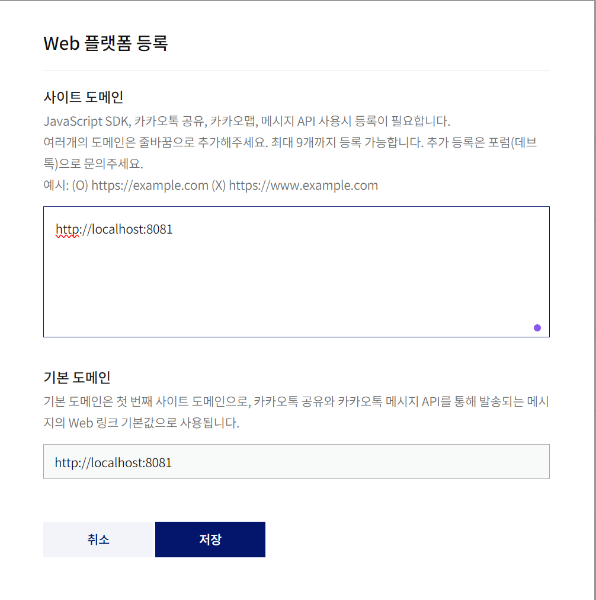

**저장 후 `Redirect URI` 등록하러 가기**

**카카오 로그인, OpenID Connect 활성화(선택사항) 하고 Redirect URI 등록**
- 카카오는 **OpenID** 를 지원하는 것을 알 수 있다.

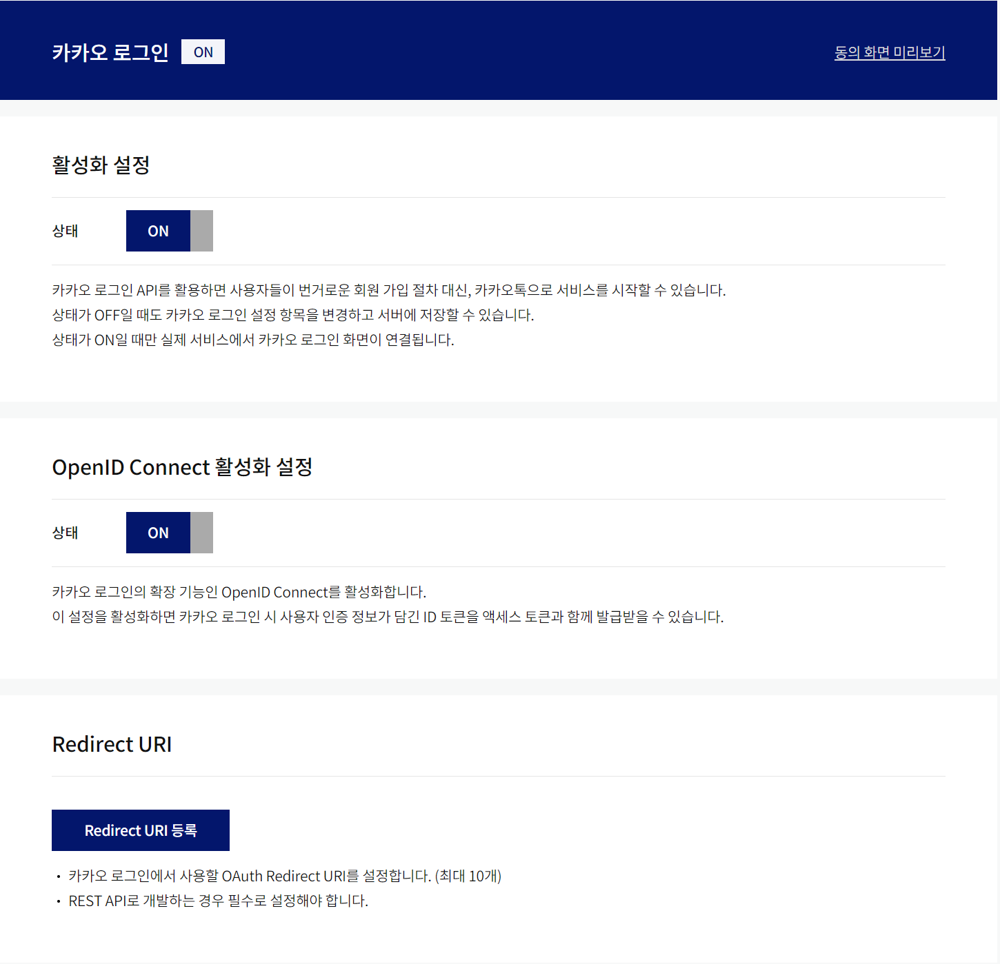

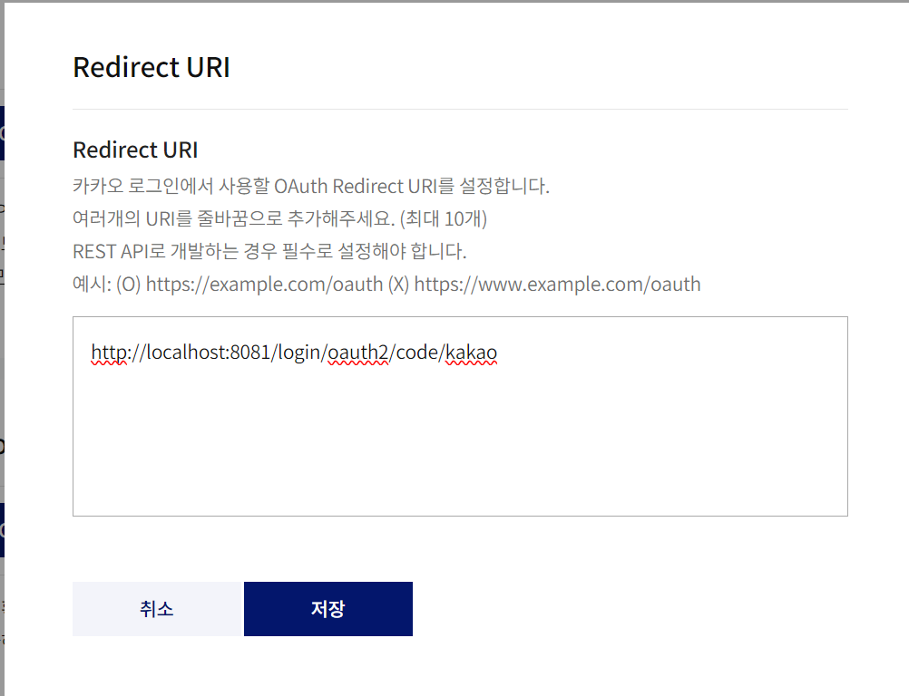

**왼쪽 메뉴 -> 카카오 로그인 -> 동의항목**

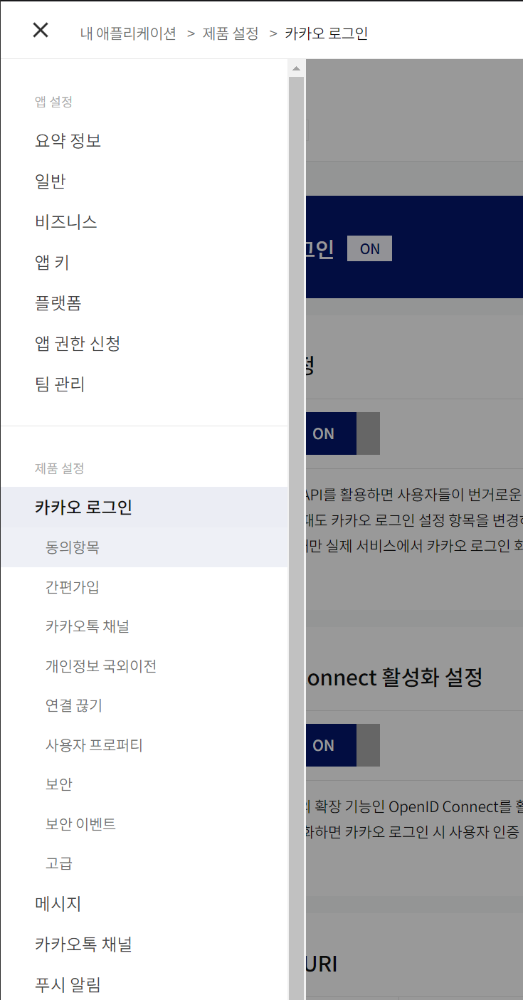

**이메일 권한을 얻기 위해서는 등록한 애플리케이션을 비즈 앱으로 전환해야 한다.**

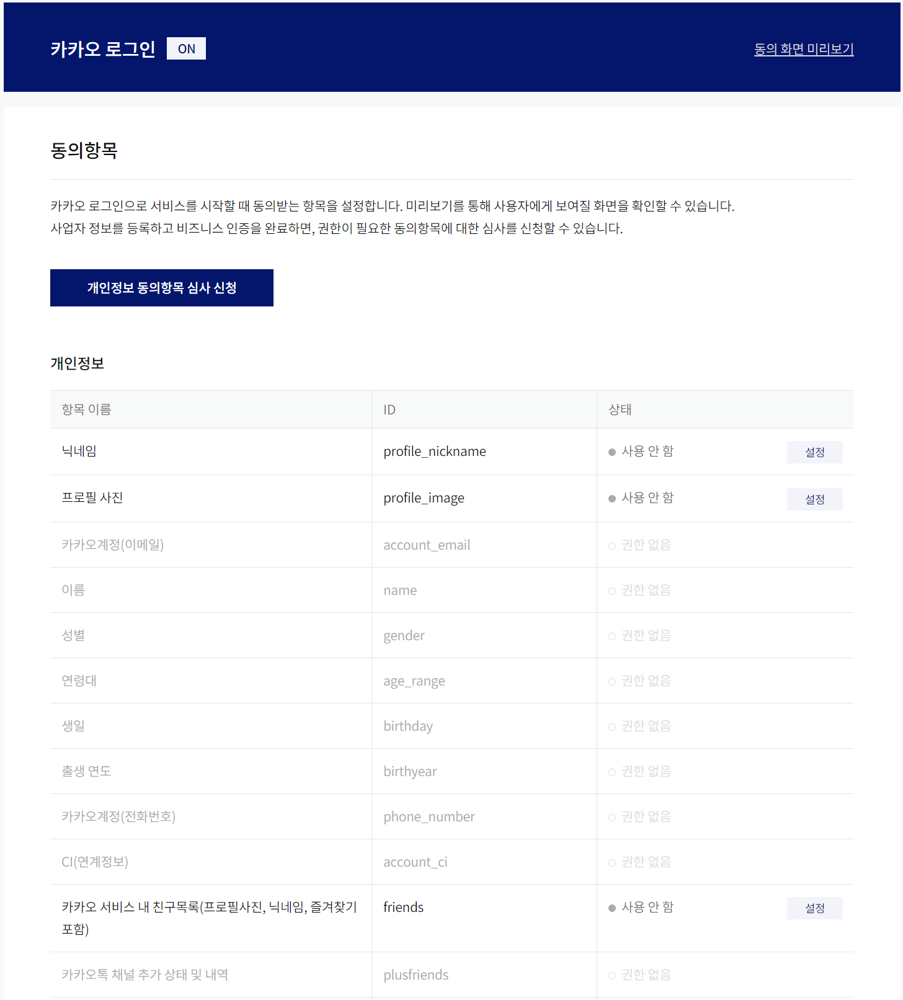

**왼쪽 메뉴 -> 앱 설정 -> 비즈니스**

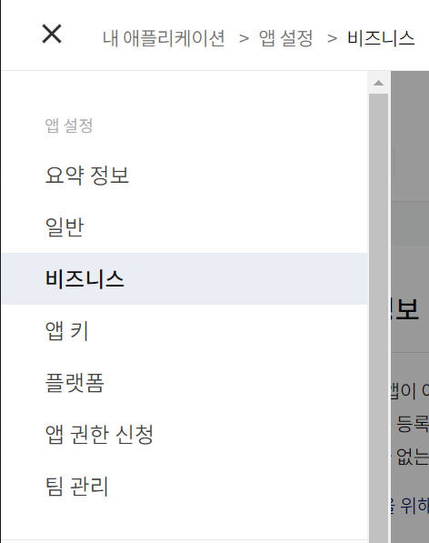

**앱 아이콘(이미지) 등록 후 테스트 앱 정보 -> 개인 개발자 비즈 앱 전환**

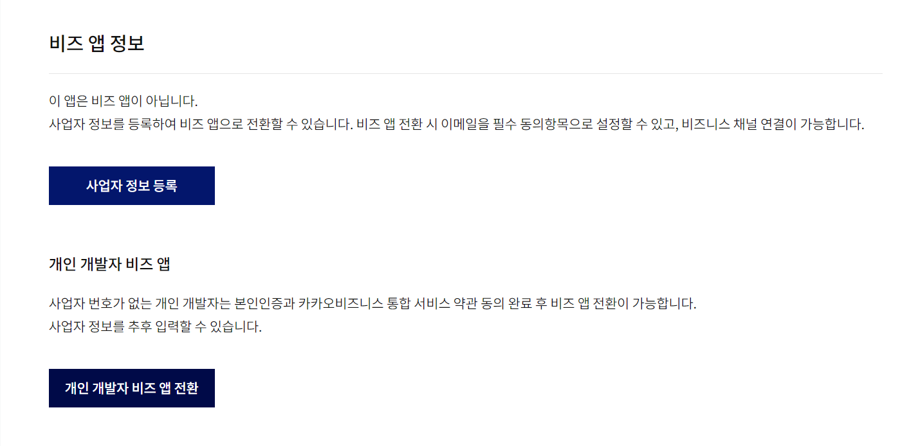

**비즈 앱 전환 목적 입력 후 전환 후 다시 동의항목**

**이메일 사용 가능**

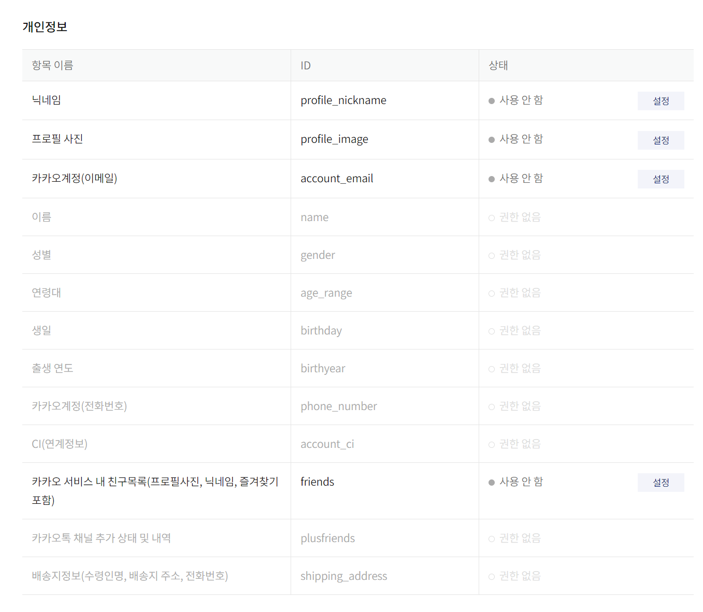

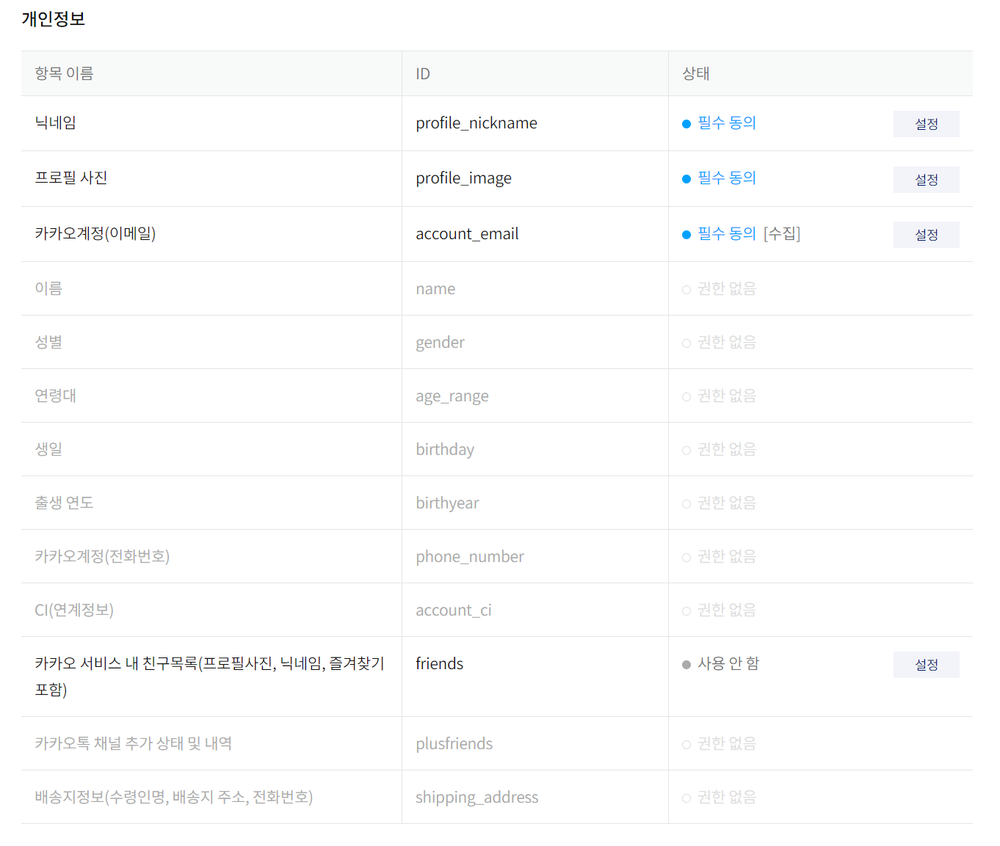

**왼쪽 메뉴 -> 제품 설정 -> 카카오 로그인 -> 보안**

**`client_secret` 생성(선택 사항)**

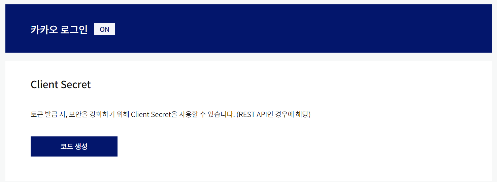

**활성화 상태 사용함 설정, 코드가 `client_secret`**

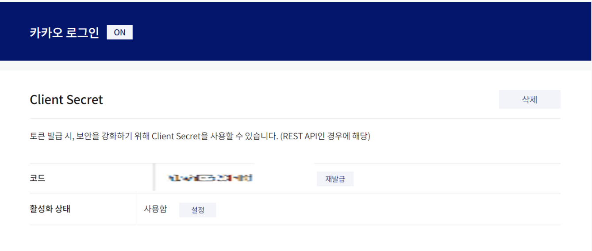