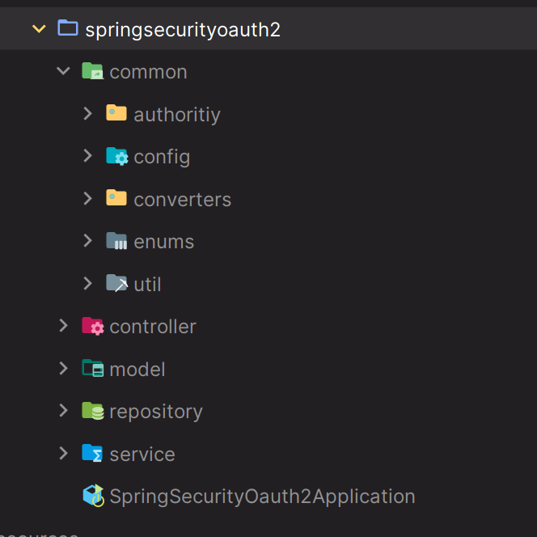

# Social Login - 폼 인증 & 카카오 추가 및 리팩토링



### [카카오 애플리케이션 등록]()

---

### [converter]()

[기존 `registrationId`에 따라 if문으로 분기하던 AbstractOAuth2UserService]()의 로직을 좀 더 유연하고 확장성 있게 변경하도록 한다.

---

### [model]()

---

### [service]()

---

### application.yml

```yaml
server:
  port: 8081

spring:
  security:
    oauth2:
      client:
        registration:
          kakao:
            client-id: b170033e2933d7359f9d757a0da6b67d
            client-secret: s6euKpKvFTIqpXtDSHHgybUeIVnydR4S
            redirect-uri: http://localhost:8081/login/oauth2/code/kakao # /login/oauth2/code 는 스프링 시큐리티에서 정해놓은 기본값
            client-name: client-app
            authorization-grant-type: authorization_code
            client-authentication-method: client_secret_post
            scope:
              - openid
              - profile_nickname
              - profile_image
              - account_email
            provider: kakao

          google:
            ...
          naver:
            ...

        provider:
          kakao:  # issuer-uri 정보만 있으면 나머지 uri 정보들은 필요 없다.
            issuer-uri: https://kauth.kakao.com
            authorization-uri: https://kauth.kakao.com/oauth/authorize
            token-uri: https://kauth.kakao.com/oauth/token
            user-info-uri: https://kapi.kakao.com/v2/user/me
            jwk-set-uri: https://kauth.kakao.com/.well-known/jwks.json
            user-name-attribute: id
          naver:
            ...
```

> - 각 엔드 포인트 정보
>   - 메타데이터 확인 - [https://kauth.kakao.com/.well-known/openid-configuration](https://kauth.kakao.com/.well-known/openid-configuration)
>   - [https://developers.kakao.com/docs/latest/ko/kakaologin/rest-api#kakaologin](https://developers.kakao.com/docs/latest/ko/kakaologin/rest-api#kakaologin)


---
[이전 ↩️ - OAuth 2.0 Client(Social Login) - 소셜 인증 내부 프로세스]()

[메인 ⏫](https://github.com/genesis12345678/TIL/blob/main/Spring/security/oauth/main.md)