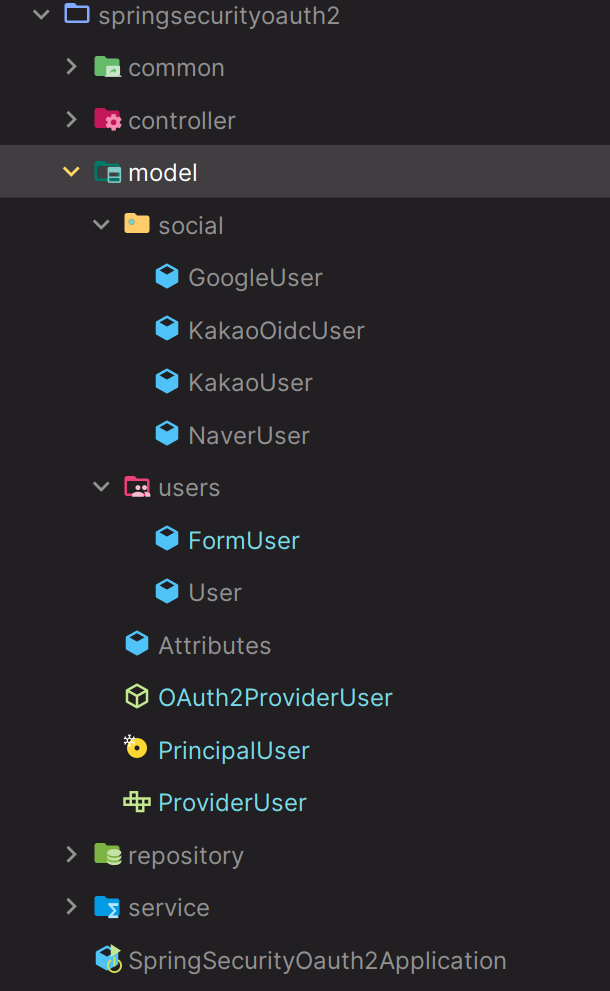

# Social Login - 폼 인증 & 카카오 추가 및 리팩토링 - Model



---

### Attributes

```java
@Data
@Builder
public class Attributes {
    private Map<String, Object> mainAttributes; //1단계
    private Map<String, Object> subAttributes; //2단계
    private Map<String, Object> otherAttributes; //3단계
}
```
> 소셜 별로 사용자 정보 응답 JSON 형태가 조금씩 다르다. 각각 적절한 **Attribute**를 생성하여 이 클래스를 통해 참조한다.

---

### ProviderUser

```java
public interface ProviderUser {

    String getId();
    String getUsername();
    String getPassword();
    String getEmail();
    String getPicture();
    List<? extends GrantedAuthority> getAuthorities();
        
    default String getProvider(){
        return "none";
    }
    
    default Map<String, Object> getAttributes(){
        return null;
    }

    default OAuth2User getOAuth2User(){
        return null;
    }
}
```
> 소셜 별로 사용자 정보를 얻을 수 있는 방식이 다르기 때문에 공통화 하기 위해 인터페이스로 정의한다.
> 
> 일반 폼 인증 같은 경우 `provider`, `attributes`, `oAuth2User` 정보는 필요없기 때문에 **default**로 만들었다.
---

### OAuth2ProviderUser

```java
public abstract class OAuth2ProviderUser implements ProviderUser{

    protected Map<String, Object> attributes;
    protected OAuth2User oAuth2User;
    protected ClientRegistration clientRegistration;

    public OAuth2ProviderUser(Map<String, Object> attributes, OAuth2User oAuth2User, ClientRegistration clientRegistration) {
        this.attributes = attributes;
        this.oAuth2User = oAuth2User;
        this.clientRegistration = clientRegistration;
    }

    @Override
    public String getPassword() {
        return UUID.randomUUID().toString().substring(0, 8);
    }

    @Override
    public String getProvider() {
        return clientRegistration.getRegistrationId();
    }

    @Override
    public String getEmail() {
        return (String) getAttributes().get("email");
    }

    @Override
    public List<? extends GrantedAuthority> getAuthorities() {
        return oAuth2User.getAuthorities()
                .stream()
                .map(authority -> new SimpleGrantedAuthority(authority.getAuthority()))
                .toList();
    }
    
    @Override
    public OAuth2User getOAuth2User() {
        return oAuth2User;
    }

    @Override
    public Map<String, Object> getAttributes() {
        return attributes;
    }
}
```
> 소셜 별로 공통적으로 가져올 수 있는 부분을 추상화한 클래스로, 이 클래스를 상속받은 클래스의 생성자에서 적절한 `attribute`를 넘겨주게 된다.

---

### PrincipalUser

```java
public record PrincipalUser(ProviderUser providerUser) implements UserDetails, OidcUser, OAuth2User {
    
    @Override
    public String getName() {
        return providerUser.getUsername();
    }

    @Override
    public Map<String, Object> getAttributes() {
        return providerUser.getAttributes();
    }

    @Override
    public Collection<? extends GrantedAuthority> getAuthorities() {
        return providerUser.getAuthorities();
    }

    @Override
    public String getPassword() {
        return providerUser.getPassword();
    }

    @Override
    public String getUsername() {
        return providerUser.getUsername();
    }

    @Override
    public boolean isAccountNonExpired() {
        return true;
    }

    @Override
    public boolean isAccountNonLocked() {
        return true;
    }

    @Override
    public boolean isCredentialsNonExpired() {
        return true;
    }

    @Override
    public boolean isEnabled() {
        return true;
    }
    
    @Override
    public Map<String, Object> getClaims() {
        return null;
    }

    @Override
    public OidcUserInfo getUserInfo() {
        return null;
    }

    @Override
    public OidcIdToken getIdToken() {
        return null;
    }
}
```
> 인증 수단으로 **OAuth 인증, Oidc 인증, 폼 인증** 이 있고 최종 `SecurityContext`에 저장되는 `principal`을 공통화 하기 위한 클래스다.
> 
> **OAuth2UserService** 의 `loadUser()` 메서드에서 이 객체를 반환하면 `SecurityContext`에 저장된다.

---

## social

### GoogleUSer

```java
public class GoogleUser extends OAuth2ProviderUser {

    public GoogleUser(Attributes mainAttributes, OAuth2User oAuth2User, ClientRegistration clientRegistration) {
        super(mainAttributes.getMainAttributes(), oAuth2User, clientRegistration);
    }

    @Override
    public String getId() {
        return (String) getAttributes().get("sub");
    }

    @Override
    public String getUsername() {
        return (String) getAttributes().get("name");
    }

    @Override
    public String getPicture() {
        return null;
    }
}
```
> **Attributes에 대한 정보는 [converter]()에서 확인할 수 있다.**
---

### KakaoUser

```java
public class KakaoUser extends OAuth2ProviderUser {

    private Map<String, Object> otherAttributes;

    public KakaoUser(Attributes attributes, OAuth2User oAuth2User, ClientRegistration clientRegistration) {
        super(attributes.getSubAttributes(), oAuth2User, clientRegistration);
        this.otherAttributes = attributes.getOtherAttributes();
    }

    @Override
    public String getId() {
        return (String) getAttributes().get("id");
    }

    @Override
    public String getUsername() {
        return (String) otherAttributes.get("nickname");
    }

    @Override
    public String getPicture() {
        return (String) otherAttributes.get("profile_image_url");
    }
}
```
> **Attributes에 대한 정보는 [converter]()에서 확인할 수 있다.**
---

### KakaoOidcUSer

```java
public class KakaoOidcUser extends OAuth2ProviderUser {

    public KakaoOidcUser(Attributes attributes, OAuth2User oAuth2User, ClientRegistration clientRegistration) {
        super(attributes.getMainAttributes(), oAuth2User, clientRegistration);
    }

    @Override
    public String getId() {
        return (String) getAttributes().get("sub");
    }

    @Override
    public String getUsername() {
        return (String) getAttributes().get("nickname");
    }

    @Override
    public String getPicture() {
        return (String) getAttributes().get("picture");
    }
}
```
> **Attributes에 대한 정보는 [converter]()에서 확인할 수 있다.**
---

### NaverUSer

```java
public class NaverUser extends OAuth2ProviderUser {

    public NaverUser(Attributes attributes, OAuth2User oAuth2User, ClientRegistration clientRegistration) {
        super(attributes.getSubAttributes(), oAuth2User, clientRegistration);
    }

    @Override
    public String getId() {
        return (String) getAttributes().get("id");
    }

    @Override
    public String getUsername() {
        return (String) getAttributes().get("name");
    }

    @Override
    public String getPicture() {
        return (String) getAttributes().get("profile_image");
    }
}
```
> **Attributes에 대한 정보는 [converter]()에서 확인할 수 있다.**

---

### FormUser

```java
@Data
@Builder
public class FormUser implements ProviderUser {

    private String id;
    private String username;
    private String password;
    private String email;
    private String provider;
    private List<? extends GrantedAuthority> authorities;

    @Override
    public String getId() {
        return id;
    }

    @Override
    public String getUsername() {
        return username;
    }

    @Override
    public String getPassword() {
        return password;
    }

    @Override
    public String getEmail() {
        return email;
    }

    @Override
    public String getPicture() {
        return null;
    }

    @Override
    public List<? extends GrantedAuthority> getAuthorities() {
        return authorities;
    }
}
```
> 일반적인 폼 인증 객체

---

### User

```java
@Data
@Builder
public class User {

    private String registrationId;
    private String id;
    private String username;
    private String password;
    private String provider;
    private String email;
    private String picture;
    private List<? extends GrantedAuthority> authorities;
}
```

> 최종 데이터베이스에 저장될 객체