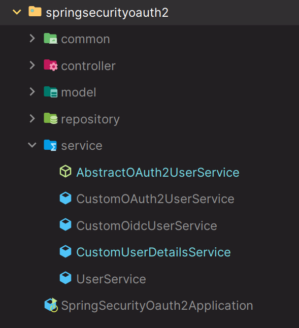

# Social Login - 폼 인증 & 카카오 추가 및 리팩토링 - Service



---

### AbstractOAuth2UserService

```java
@Slf4j
@Getter
@Service
@RequiredArgsConstructor
public abstract class AbstractOAuth2UserService {

    private final UserService userService;
    private final UserRepository userRepository;
    private final ProviderUserConverter<ProviderUserRequest, ProviderUser> providerUserConverter;

    protected ProviderUser providerUser(ProviderUserRequest providerUserRequest) {
       return providerUserConverter.converter(providerUserRequest);
    }

    //OAuth2 인증 가입 메서드
    protected void register(ProviderUser providerUser, OAuth2UserRequest userRequest) {

        User user = userRepository.findByUsername(providerUser.getUsername());

        if (user == null) {
            String registrationId = userRequest.getClientRegistration().getRegistrationId();
            userService.register(registrationId, providerUser);
        } else {
            log.info("user = {}", user);
        }
    }

    //폼 인증 가입 메서드
    protected void register(ProviderUser providerUser) {

        User user = userRepository.findByUsername(providerUser.getUsername());

        if (user == null) {
            userService.register("none", providerUser);
        } else {
            log.info("user = {}", user);
        }
    }
}
```
> **OAuth 인증 및 폼 인증**을 추상화한 클래스로, `provider()` 메서드를 통해 [컨버터]를 실행시켜 소셜 타입에 맞는 `ProviderUser`를 반환한다.

---

### CustomOAuth2UserService

```java
@Service
public class CustomOAuth2UserService extends AbstractOAuth2UserService
                                    implements OAuth2UserService<OAuth2UserRequest, OAuth2User> {

    public CustomOAuth2UserService(UserService userService, UserRepository userRepository, ProviderUserConverter<ProviderUserRequest, ProviderUser> converter) {
        super(userService, userRepository, converter);
    }

    @Override
    public OAuth2User loadUser(OAuth2UserRequest userRequest) throws OAuth2AuthenticationException {

        ClientRegistration clientRegistration = userRequest.getClientRegistration();

        OAuth2UserService<OAuth2UserRequest, OAuth2User> oAuth2UserService = new DefaultOAuth2UserService();
        OAuth2User oAuth2User = oAuth2UserService.loadUser(userRequest);

        ProviderUserRequest providerUserRequest = new ProviderUserRequest(clientRegistration, oAuth2User);

        ProviderUser providerUser = super.providerUser(providerUserRequest);

        //회원가입
        super.register(providerUser, userRequest);

        return new PrincipalUser(providerUser);
    }
}
```
> **OAuth 인증**을 위한 클래스로, `loadUser()`를 통해 얻은 `OAuth2User`로 추상화된 `ProviderUser`를 생성한다.

---

### CustomOidcUserService

```java
@Service
public class CustomOidcUserService extends AbstractOAuth2UserService
                                implements OAuth2UserService<OidcUserRequest, OidcUser> {

    public CustomOidcUserService(UserService userService, UserRepository userRepository, ProviderUserConverter<ProviderUserRequest, ProviderUser> converter) {
        super(userService, userRepository, converter);
    }

    @Override
    public OidcUser loadUser(OidcUserRequest userRequest) throws OAuth2AuthenticationException {

        ClientRegistration clientRegistration = ClientRegistration
                .withClientRegistration(userRequest.getClientRegistration()) //기존에 정의한 설정은 그대로
                .userNameAttributeName("sub") //필요한 부분은 재정의
                .build();

        //Oidc 인증의 UserInfo 엔드 포인트 요청을 위한 객체 재정의
        OidcUserRequest oidcUserRequest = new OidcUserRequest(
                clientRegistration,
                userRequest.getAccessToken(),
                userRequest.getIdToken(),
                userRequest.getAdditionalParameters()
        );

        OAuth2UserService<OidcUserRequest, OidcUser> oidcUserService = new OidcUserService();
        OidcUser oidcUser = oidcUserService.loadUser(oidcUserRequest);

        ProviderUserRequest providerUserRequest = new ProviderUserRequest(clientRegistration, oidcUser);

        ProviderUser providerUser = super.providerUser(providerUserRequest);

        //회원가입
        super.register(providerUser, userRequest);

        return new PrincipalUser(providerUser);
    }
}
```

> - **Oidc 인증**을 위한 클래스
> - 카카오의 경우 `openid`를 선택적으로 사용할 수 있고, `openid`일 경우와 아닐 경우에 `application.yml`에 `user-name-attribute` 속성이 다르기 때문에
>   재정의 해서 `loadUser()`를 호출한다.

---

###

```java
@Service
public class CustomUserDetailsService extends AbstractOAuth2UserService implements UserDetailsService {

    private final UserRepository userRepository;

    public CustomUserDetailsService(UserService userService, UserRepository userRepository, ProviderUserConverter<ProviderUserRequest, ProviderUser> providerUserConverter, UserRepository userRepository1) {
        super(userService, userRepository, providerUserConverter);
        this.userRepository = userRepository;
    }

    @Override
    public UserDetails loadUserByUsername(String username) throws UsernameNotFoundException {

        User user = userRepository.findByUsername(username);
        if (user == null) {
            user = User.builder()
                    .id("1")
                    .username("user1")
                    .password("{noop}1234")
                    .authorities(AuthorityUtils.createAuthorityList("ROLE_USER"))
                    .email("user@aaa.com")
                    .build();
        }

        ProviderUserRequest providerUserRequest = new ProviderUserRequest(user);
        ProviderUser providerUser = super.providerUser(providerUserRequest);

        super.register(providerUser);
        return new PrincipalUser(providerUser);
    }
}
```
> 일반 폼 인증을 위한 클래스

---

### UserService

```java
@Service
@RequiredArgsConstructor
public class UserService {

    private final UserRepository userRepository;

    public void register(String registrationId, ProviderUser providerUser) {

        User user = User.builder()
                .registrationId(registrationId)
                .id(providerUser.getId())
                .username(providerUser.getUsername())
                .password(providerUser.getPassword())
                .provider(providerUser.getProvider())
                .email(providerUser.getEmail())
                .picture(providerUser.getPicture())
                .authorities(providerUser.getAuthorities())
                .build();

        userRepository.register(user);
    }
}
```