# Social Login - 내부 프로세스

**사용자가 `/oauth2/authorization/{registartionId}`를 누르면**

## Google

### 1. [OAuth2AuthorizationRequestRedirectFilter](https://github.com/genesis12345678/TIL/blob/main/Spring/security/oauth/OAuth2Login/Authorization%20Code.md)

> 인가 서버로부터 임시 코드를 발급받는 요청 하는 필터

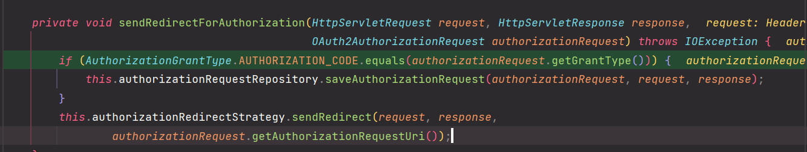

> - 권한 부여 코드 타입 체크
> - 인가 서버에게 코드를 발급받기 위해 요청하는 객체 [OAuth2AuthorizationRequest](https://github.com/genesis12345678/TIL/blob/main/Spring/security/oauth/OAuth2Login/Authorization%20Code.md#oauth2authorizationrequest) 를 저장하는 것을 볼 수 있다.
> 
> 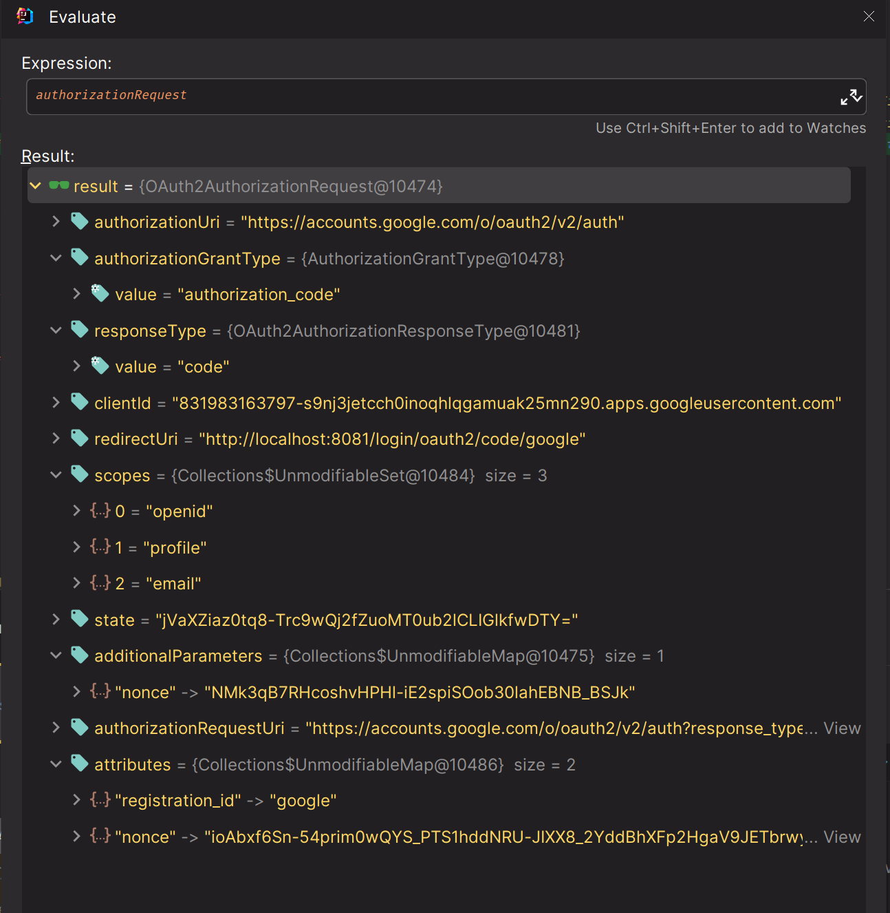
> 
> - `nonce` : **OpenID** 요청을 위해 필요한 매개 변수
> - `authorizationRequestUri` : 인가 서버에게 보낼 최종 Uri
> 
> **이후 `sendRedirec()`를 실행하면 실제 구글에 요청을 보내게 되고, 화면에는 사용자가 인증(로그인) 하기 위한 화면이 나온다.**
> 
> **사용자가 인증을 마치면 지정한 리디렉션 Uri를 다시 이 필터가 받는다.**
> 
> 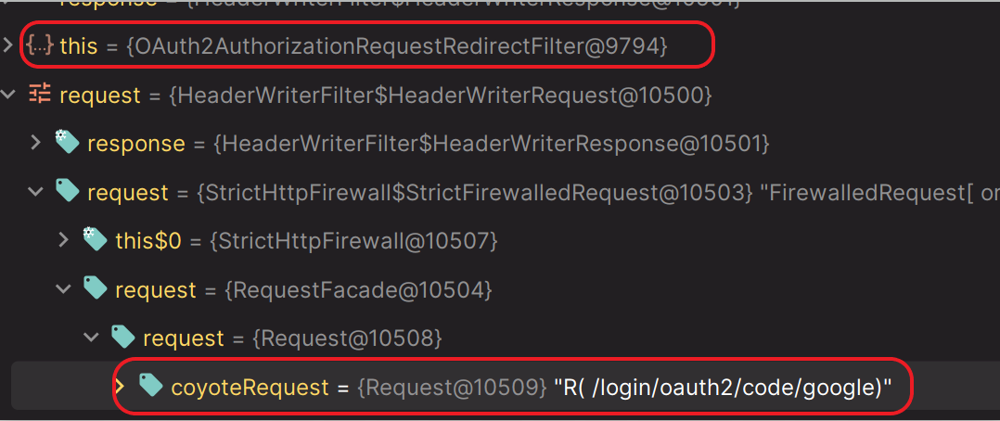
> 
> **이 필터는 액세스 토큰 교환 요청을 위해 `OAuth2LoginAuthenticationFilter` 를 호출한다.**

### 2. [OAuth2LoginAuthenticationFilter](https://github.com/genesis12345678/TIL/blob/main/Spring/security/oauth/OAuth2Login/Access%20Token.md#oauth2login---access-token-%EA%B5%90%ED%99%98%ED%95%98%EA%B8%B0)

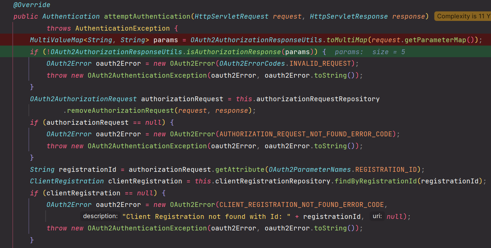

> **param에는 임시 코드를 요청하고 인가 서버에서 보낸 `redirect_uri`로 보낸 정보들이 담겨있다.**
> 
> 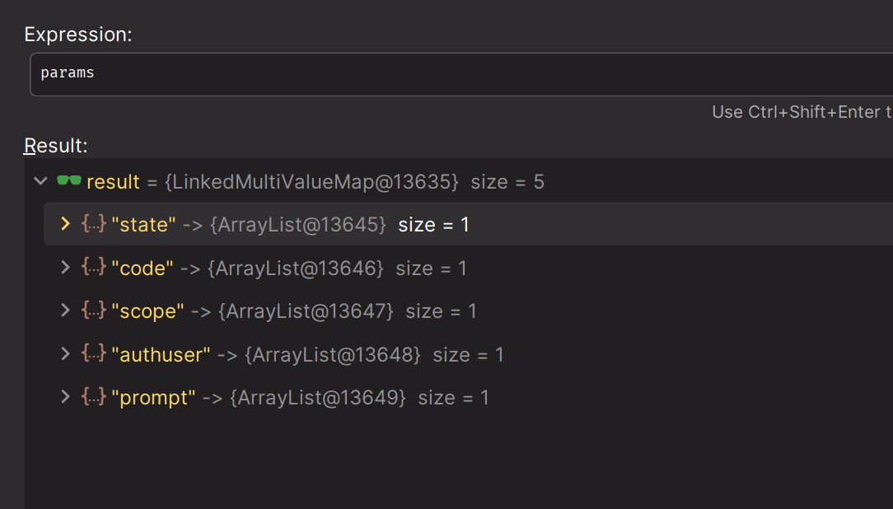
> 
> - `code` : 액세스 토큰을 발급받기 위해서 받은 `code` 값으로 그대로 요청해야 한다.

### 3. [OAuth2LoginAuthenticationProvider](https://github.com/genesis12345678/TIL/blob/main/Spring/security/oauth/OAuth2Login/Access%20Token.md#oauth2loginauthenticationprovider)

> **스코프에 `openid`가 있는지 확인한다. `openid`가 있기 때문에 다음 provider 를 호출한다.**
>
> 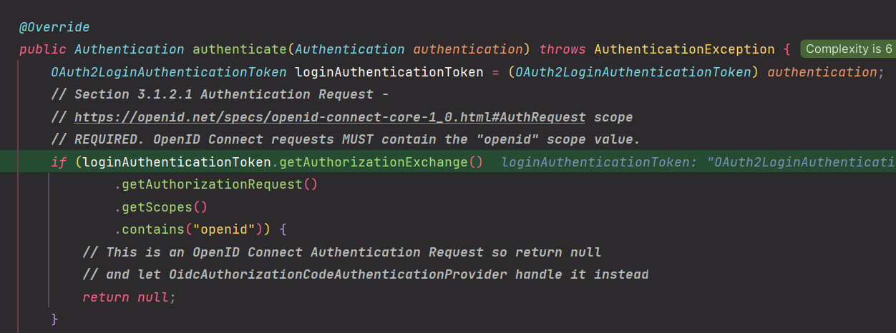
>
> 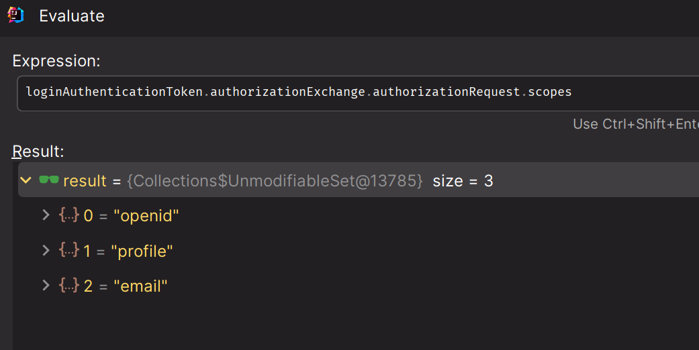
> 
> 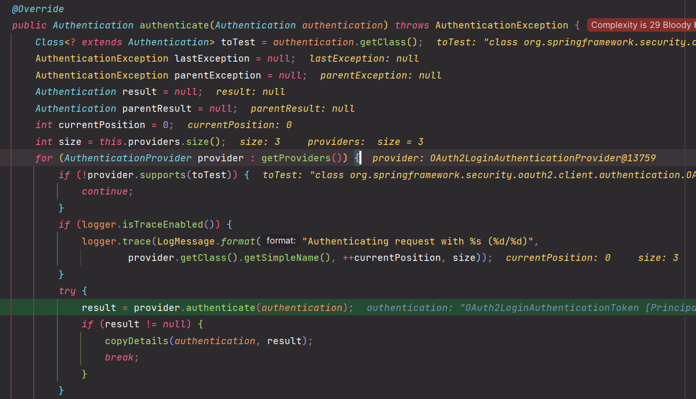
> 
> 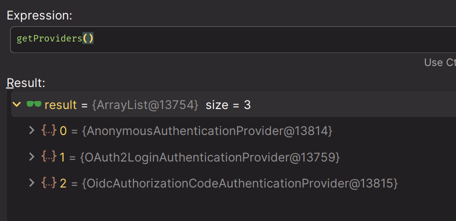
> 
> **Oidc 요청을 처리할 수 있는 `OidcAuthorizationCodeAuthenticationProvider`로 넘어간다.**

### 4. [OidcAuthorizationCodeAuthenticationProvider](https://github.com/genesis12345678/TIL/blob/main/Spring/security/oauth/OAuth2Login/Access%20Token.md#oidcauthorizationcodeauthenticationprovider)

> - **OAuth2AccessTokenResponse를 얻어오는 과정에서 구글은 기본적으로 `Basic` 방식으로 전달한다.**
>
> **openid를 지원하는 구글은 `id_token` 도 함께 응답한다.**
> 
> 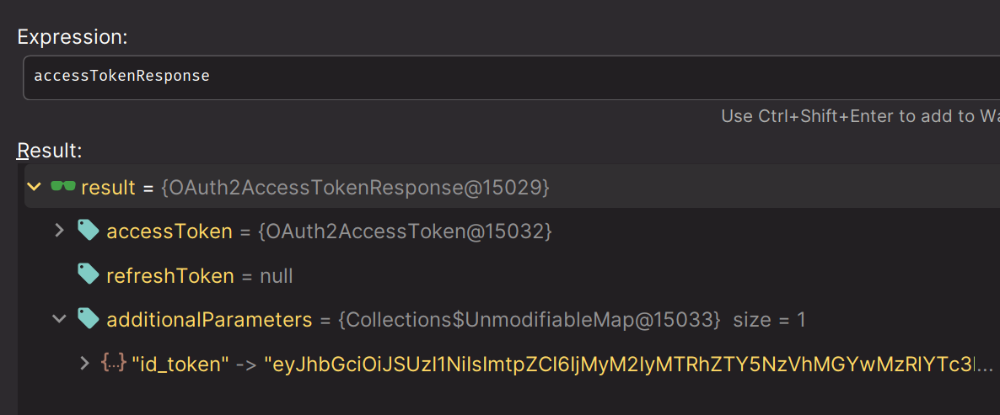
>
> **OidcToken 은 내부적으로 `JwtDecoder`에 의해 세세한 검증을 통과해야 생성된다.**
> 
> **여기서 실행하는 `loadUser()`는 직접 만든 `CustomOidcUserService` 에서 실행된다. `loadUser()` 내부적인 과정에서 `id_token` 만으로 인증이 되기 때문에
> 다시 인가 서버와 통신은 건너뛰게 된다.**
> 
> **mapAuthorities() 과정은 직접 정의한 `CustomAuthorityMapper`에 의해 매핑된다.**

### 4. Spring MVC

**수 많은 필터들을 거쳐 `SecurityContext`에 저장되고, 우리는 스프링 MVC에서 `Authentication`을 참조할 수 있다.**

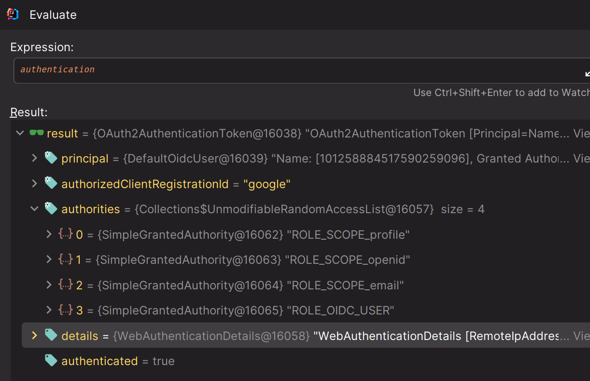

> **`OAuth2AuthenticationToken` 타입으로 `principal = OidcUser` 외에 정보를 저장한다.**

---

## Naver

**네이버도 구글과 초반 과정은 똑같고, 네이버는 `openid`를 지원하지 않으므로 `OidcAuthorizationCodeAuthenticationProvider`가 아니라 `OAuth2AuthorizationCodeAuthenticationProvider`로 넘어간다.**

### OAuth2AuthorizationCodeAuthenticationProvider

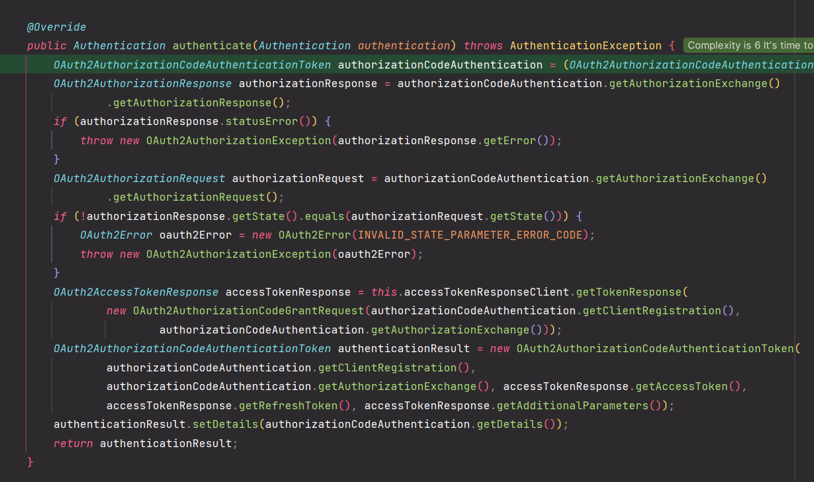

> **`OAuth2LoginAuthenticationProvider` 에서는 `CustomOAuth2UserService`에서 `loadUser()` 처리를 하게 된다.**

> **네이버는 `principal = OAuth2User`로 저장되며, `attributes`의 사용자 정보가 `response`로 묶여있는 것을 확인할 수 있다.**

---

> 참고로 **OpenID** 인증의 경우 권한이 `ROLE_` 대신 `OIDC_`로 되고, **OAuth 2.0** 인증의 경우 `ROLE_`대신 `OAUTH2_`로 된다.

---

[이전 ↩️ - OAuth 2.0 Client(Social Login) - 코드 구현](https://github.com/genesis12345678/TIL/blob/main/Spring/security/oauth/OAuth2Login/Access%20Token.md#oauth2loginauthenticationprovider)

[메인 ⏫](https://github.com/genesis12345678/TIL/blob/main/Spring/security/oauth/main.md)

[다음 ↪️ - OAuth 2.0 Client(Social Login) - ]()