# Spring Authorization Server - 주요 클래스

## OAuth2Authorization

- 리소스 소유자의 역할이 있는 권한 부여 방식(`authorization_code`, `resource_owner_password`, `client_credentails`)인 경우 클라이언트에 부여된
    권한 부여, 즉 인가 상태를 유지하는 클래스
  - **Spring Security 의 OAuth2 Client** 모델 [OAuth2AuthorizedClient](https://github.com/genesis12345678/TIL/blob/main/Spring/security/oauth/OAuth2Client/OAuth2AuthorizedClient.md)와 서로 대응하는 개념이다.
- 권한 부여 흐름이 성공적으로 완료되면 `OAuth2Authorization`이 생성되고 `AccessToken`이 저장되며 선택적으로 `RefreshToken`, `IDToken` 등이 저장된다.
- 생성된 `OAuth2Authorization`은 `OAuth2AuthorizationService`에 의해 메모리나 DB에 저장된다.
- `OAuth2Authorization`에 저장되는 `OAuth2Token` 타입들은 권한 부여 유형 및 `scope`에 따라 다르다.
  - `authorization_code` 의 경우
    - **OAuth2AuthorizationCode**
    - **OAuth2AccessToken**
    - **OAuth2RefreshToken**(Optional)
  - `OpenID Connect 1.0`의 경우
    - **OAuth2AuthorizationCode**
    - **OidcIdToken**
    - **OAuth2AccessToken**
    - **OAuth2RefreshToken**(Optional)
  - `Client_Credentials`의 경우
    - **OAuth2AccessToken**

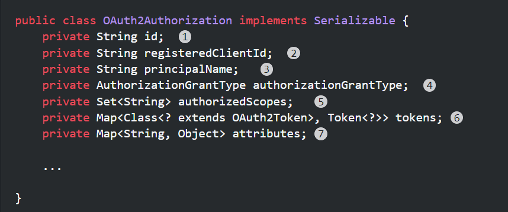

1. **id** : `OAuth2Authorization`을 고유하게 식별하는 ID
2. **registeredClientId** : `RegisteredClient`를 고유하게 식별하는 ID
3. **principalName** : 리소스 소유자(또는 클라이언트)의 주체 이름
4. **authorizationGrantType** : 사용된 권한 부여 유형
5. **authorizedScopes** : 클라이언트에 대해 승인된 범위
6. **tokens** : 실행된 인가 유형에 특정한 OAuth2Token 인스턴스
7. **attributes** : 실행된 권한 부여 유형과 관련된 추가 속성

**Token은 `OAuth2Authorization`의 내부 클래스로 있다.**

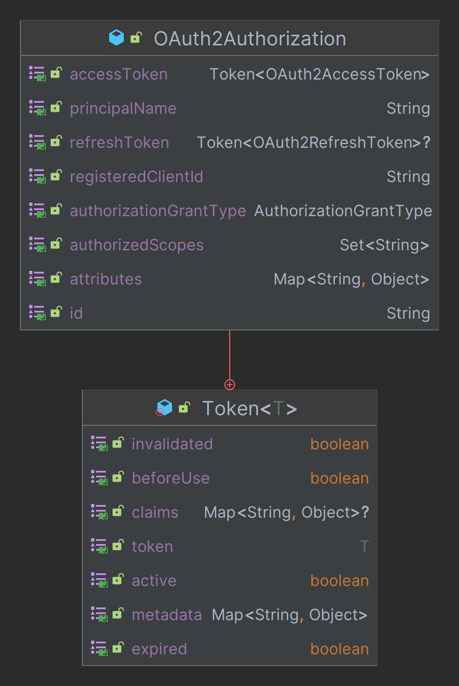

- 각 `OAuth2Token`은 **OAuth2Authorization.Token** 에 속한다.
- **OAuth2Authorization.Token**은 `isExpired()`, `isInvalidated()`, `isActive()` 에 대한 접근자를 제공한다.
- **OAuth2Authorization.Token**은 `OAuth2Token`과 관련된 클레임이 있는 경우 `getClaims()`를 제공한다.

---

## OAuth2AuthorizationService

- `OAuth2AuthorizationService`는 새로운 `OAuth2Authorization`을 저장하고 기존 `OAuth2Authorization`을 검색하는 구성 요소이다.
- 특정 엔드포인트 프로토콜 흐름을 따를 때 다른 구성 요소에서 사용된다.(클라이언트 인증, 권한 부여 처리, 토큰 검사, 토큰 취소, 동적 클라이언트 등록 등)
- `OAuth2AuthorizationService`의 기본 구현체로는 `InMemoryOAuth2AuthorizationService`와 `JdbcOAuth2AuthorizationService`가 있다.
- `OAuth2AuthorizationService` 구성은 선택 사항이며, 디폴트는 `InMemoryOAuth2AuthorizationService`이다.

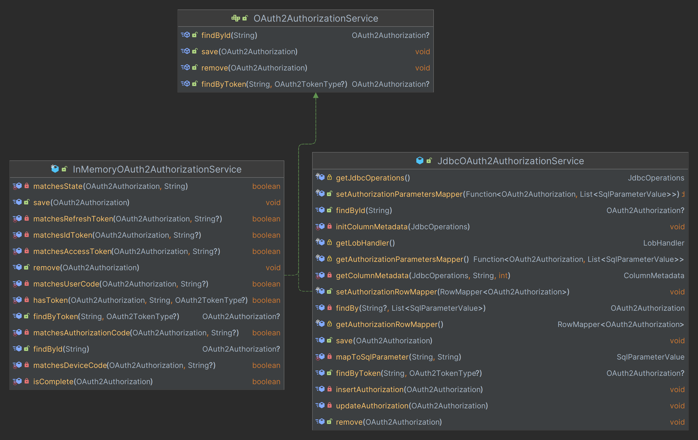

---

## 동작 흐름

**여기서 `Submit Consent` 버튼을 클릭하면 인가 서버에서 보낸 임시 코드를 확인할 수 있다. 이때 인가 서버가 임시 코드를 보내기 전에 
어떤 처리를 먼저 하는지 살펴보자.**

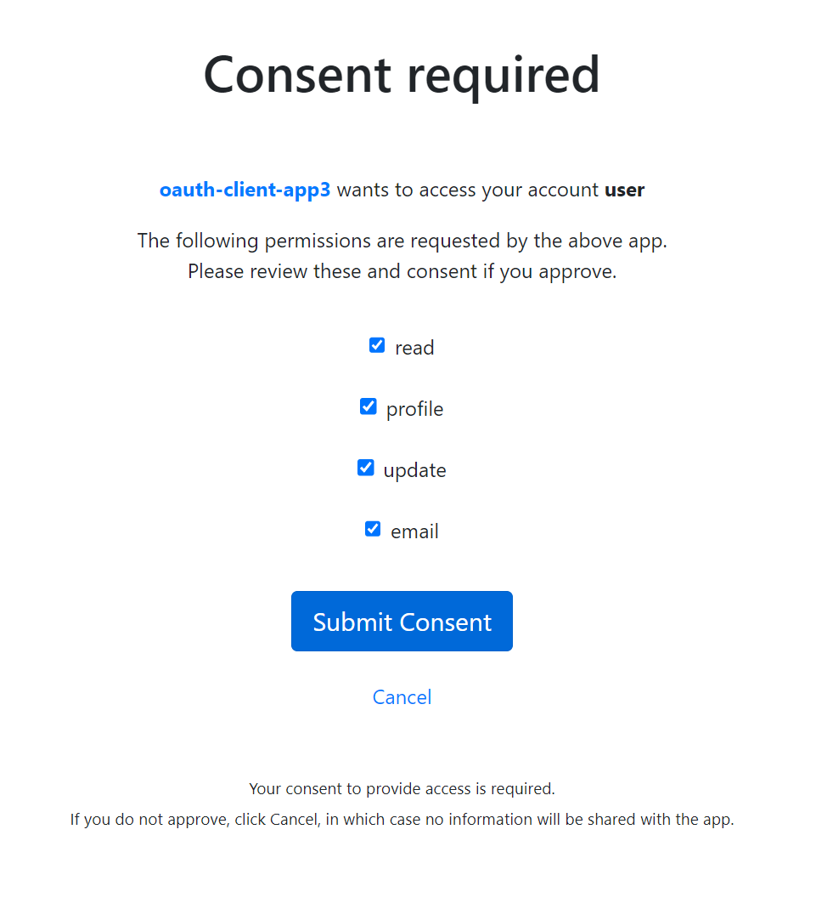

**요청을 처리하는 프로바이더의 내부 코드를 보면 임시 코드를 저장하는 클래스인 `OAuth2AuthorizationCode`를 생성해 `OAuth2Authorization`에 저장하는 것을 확인할 수 있다.**

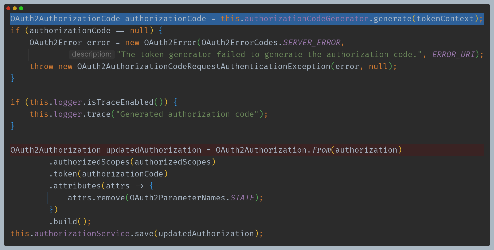

> **저장하는 이유**
> 
> - 클라이언트는 액세스 토큰을 요청하기 위해 임시 코드를 다시 인가 서버에게 요청할 것이다.
> - 인가 서버는 요청으로 온 임시 코드와 저장되어 있는 임시 코드 중에 같은 정보가 저장되어 있는 `OAuth2Authorization`를 찾아야 한다.
> - 클라이언트와 인가 서버 간의 상호 작용이 이루어지도록 인가 서버는 이런 정보들을 지속적으로 저장하여 계속 참조할 수 있게 된다.
> 
> **해당 클라이언트는 한번 접속해서 임시 코드를 저장했다는 상태를 유지하는 것이다.**

**임시 코드로 액세스 토큰 요청**

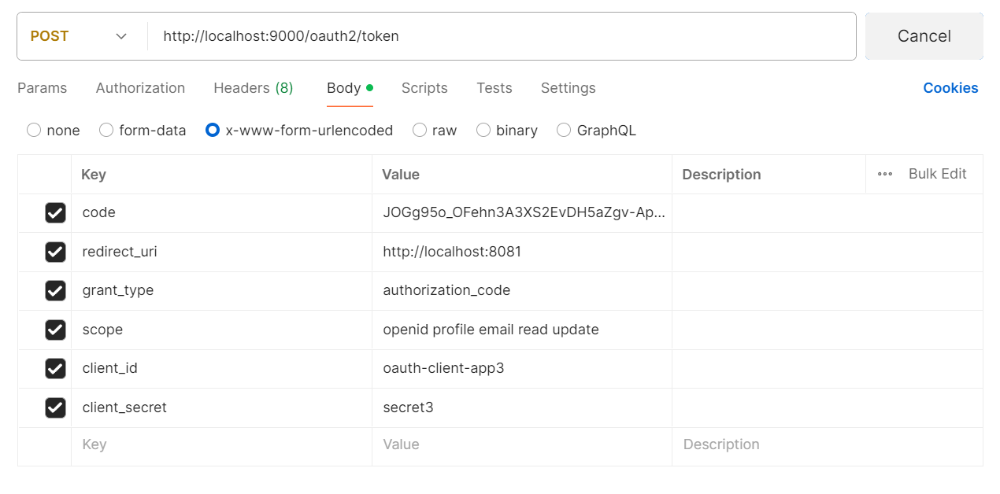

**그러면 아래와 같이 `code` 파라미터 값으로 `OAuth2AuthorizationService`에서 `OAuth2Authorization`을 찾는다.**

**`authorizationBuilder`에다가 권한 부여 유형에 따라 알맞은 `OAuth2Token`을 저장시켜 최종 `build()`를 하여 `OAuth2Authorization`를 저장시킨다.**

**이 과정에서 `invalidate()` 에서 영어 설명처럼 `authorization_code`, 임시 코드는 한 번만 사용할 수 있으므로 무효화 시킨다.**

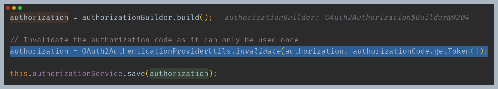

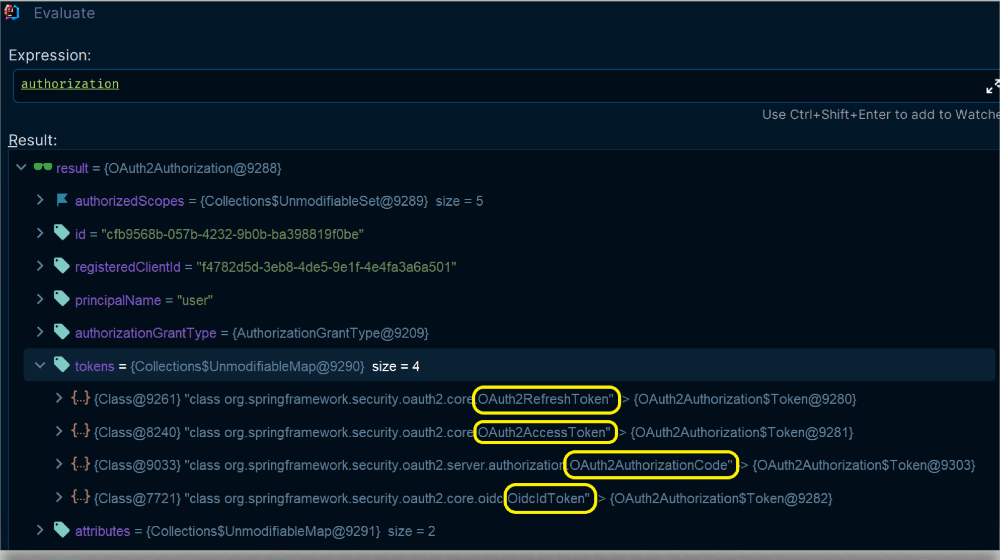

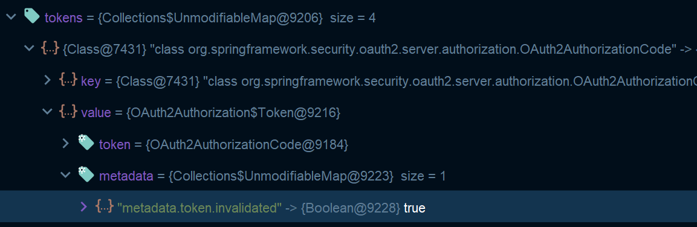

**만약 여기서 동일한 클라이언트 정보로 다시 액세스 토큰 요청을 한다면?**

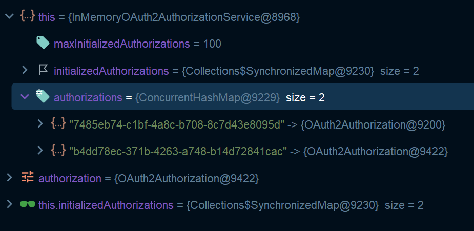

**메모리로 저장하고 있어 계속해서 상태 정보가 쌓이고만 있다. 때문에 실제 운영 환경에서는 DB를 사용해야 한다.**

---

## 토큰을 사용하여 현재 인가 상태 응답하기

### OAuth2AuthorizationService 빈 등록 후 요청

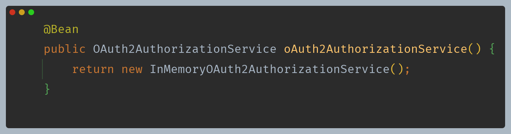

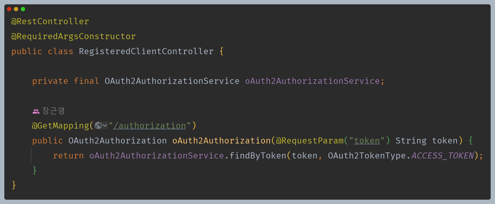

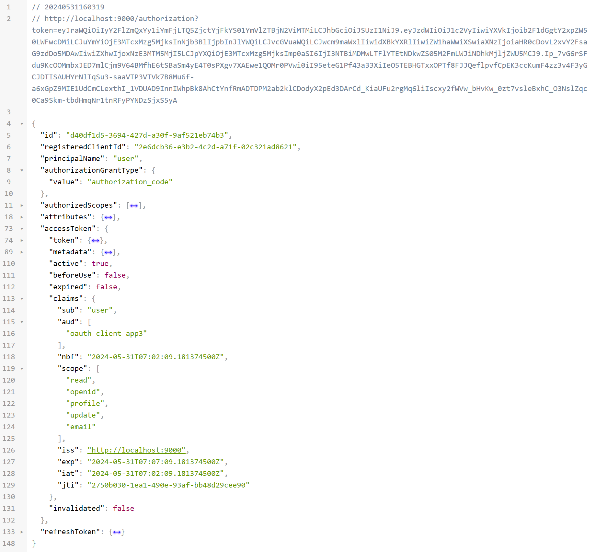

---

[이전 ↩️ - Spring Authorization Server - 주요 클래스(`RegisteredClient`)](https://github.com/genesis12345678/TIL/blob/main/Spring/security/oauth/SpringServer/Class/RegisteredClient.md)

[메인 ⏫](https://github.com/genesis12345678/TIL/blob/main/Spring/security/oauth/main.md)