# OAuth 2.0 Token Endpoint

# Authorization Code 흐름

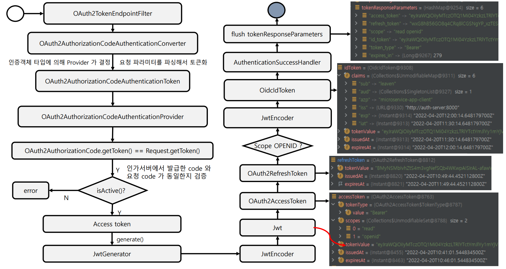

## Access Token Response

### Successful Response

인가 서버는 액세스 토큰과 (선택적으로) 리프레시 토큰을 발급하며, 다음 파라미터를 엔티티 바디에 추가하여 200 OK 상태 코드를 가진 HTTP 응답으로 응답을 구성한다.

- **access_token**, 필수
  - 인가 서버에서 발급한 액세스 토큰 문자열
- **token_type**, 필수
  - 토큰 유형은 일반적으로 `Bearer` 문자열
- **expires_in**, 권장
  - 토큰의 만료시간
- **refresh_token**, 선택 사항
  - 액세스 토큰이 만료되면 응용 프로그램이 다른 액세스 토큰을 얻는 데 사용할 수 있는 `refresh_token`을 반환하는 것이 유용하다.
  - `implicit` 권한 부여로 발행된 토큰은 `refresh_token`을 발행할 수 없다.
- **scope**, 선택 사항
  - 사용자가 부여한 범위가 앱이 요청한 범위와 동일한 경우 선택사항
  - 사용자가 부여한 범위가 요청된 범위와 다른 경우 필요하다.

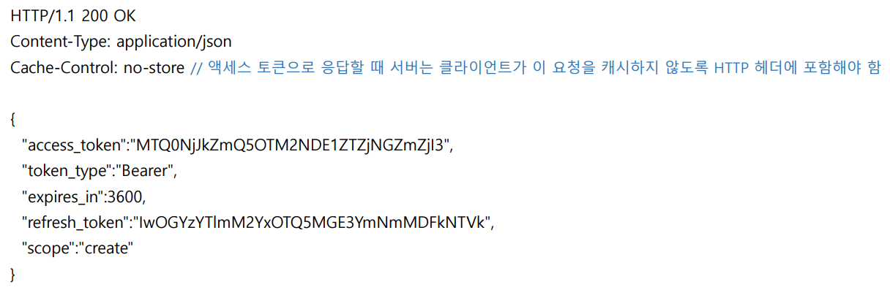

### Unsuccessful Response

- **error**
  - `invalid_request`
    - 요청에 매개변수가 누락되거나, 지원되지 않는 매개변수로 서버가 요청을 진행할 수 없음
  - `invalid_client`
    - 요청에 잘못된 `client_id` 또는 `client_secret` 이 포함된 경우 클라이언트 인증에 실패(HTTP 401 응답)
  - `invalid_grant`
    - 인증 코드가 유효하지 않거나 만료됨
    - 권한 부여에 제공된 `redirect_uri`와 액세스 토큰 요청에 제공된 `redirect_uri`가 일치하지 않는 경우
  - `invalid_scope`
    - 범위를 포함하는 액세스 토큰 요청의 경우 요청의 유효하지 않은 범위를 입력한 경우
  - `unauthorized_client`
    - 이 클라이언트는 요청된 권한 부여 요청을 사용할 권한이 없음
    - `RegisteredCleitn`에 정의하지 않은 권한 부여 유형으로 요청한 경우
  - `unsupported_grant_type`
    - 권한 부여 서버가 인식하지 못하는 승인 유형을 요청하는 경우

---

# 코드 흐름

## 1. 액세스 토큰 요청

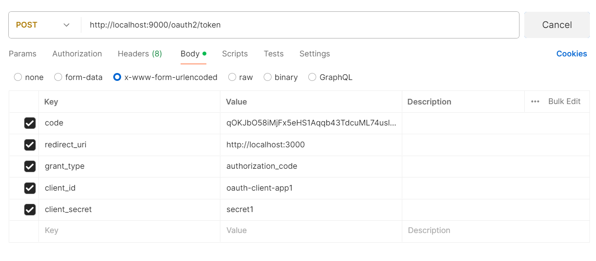

- 클라이언트 인증을 마치고 `AuthorizationFilter`를 거쳐 `OAuth2TokenEndpointFilter`로 이동

## 2. OAuth2TokenEndpointFilter -> OAuth2AuthorizationCodeAuthenticationConverter

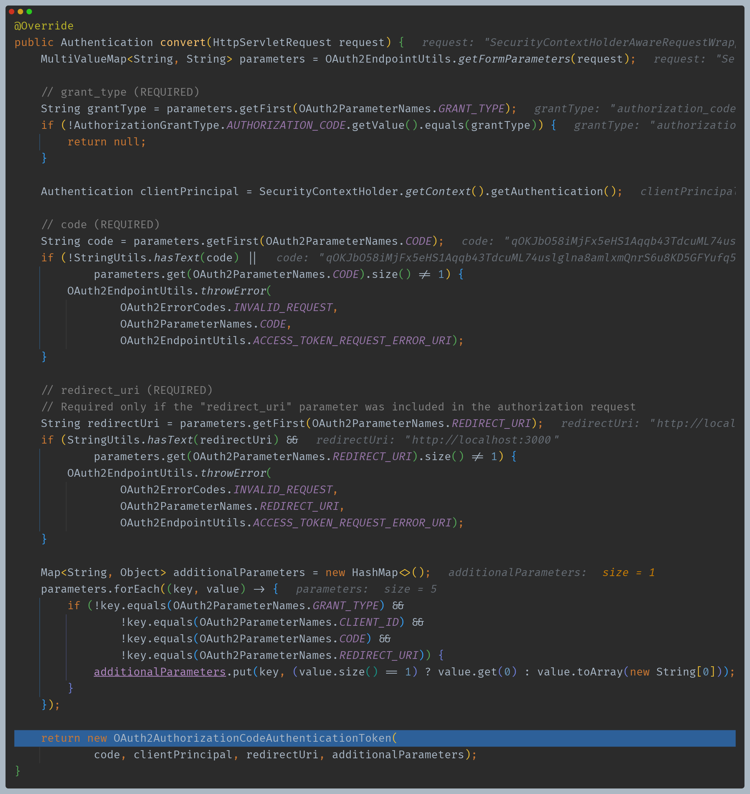

- 요청 파라미터에서 필수로 필요한 정보들을 이용해 `OAuth2AuthorizationCodeAuthenticationToken`을 반환한다.

## 3. ProviderManager -> OAuth2AuthorizationCodeAuthenticationProvider

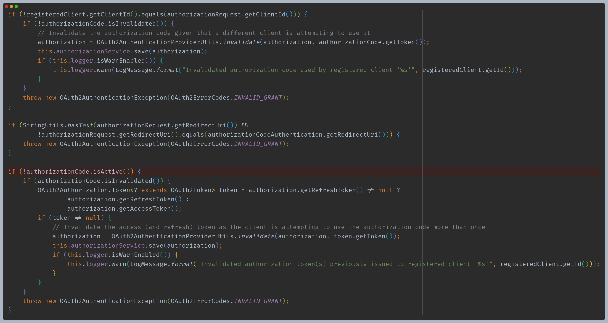

- `client_id`, `redirect_uri`, 활성화 상태 등을 확인한 뒤 이후 로직으로 넘어갈 수 있다.

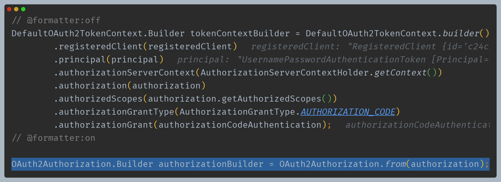

- 토큰을 발행할 준비를 한다.

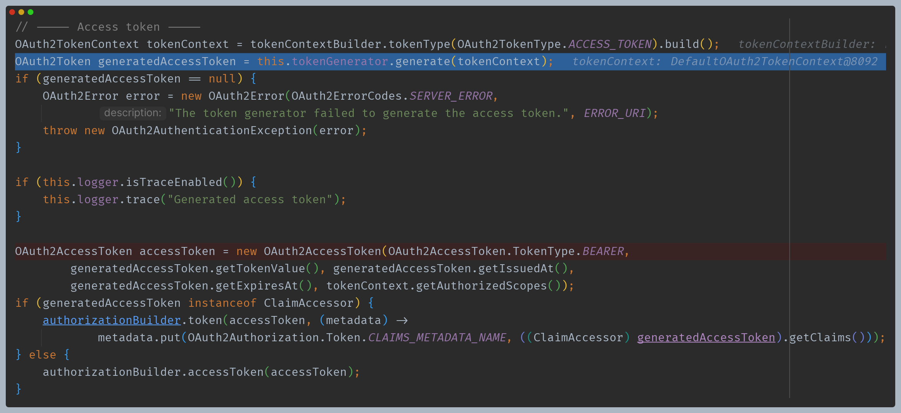

- 액세스 토큰을 만든다.
- `DelegatingOAuth2TokenGenerator` -> `JwtGenerator`

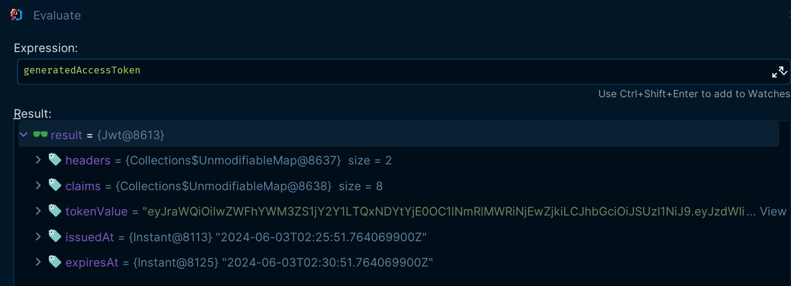

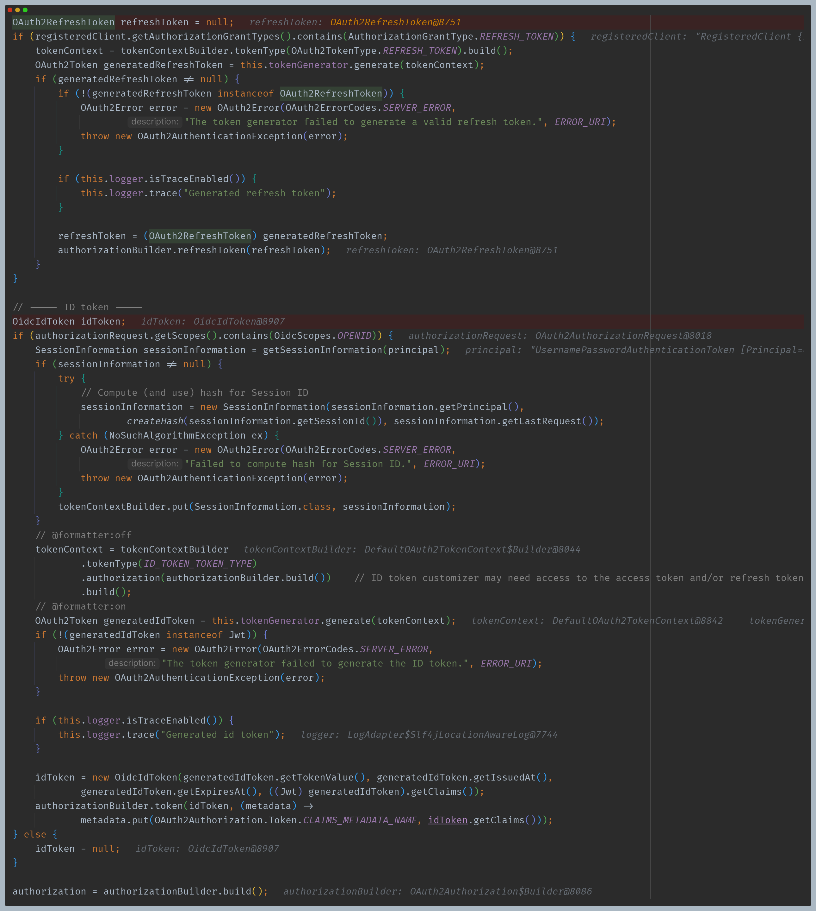

- 조건에 따라 `refresh_token`과 `id_token`을 생성한다.

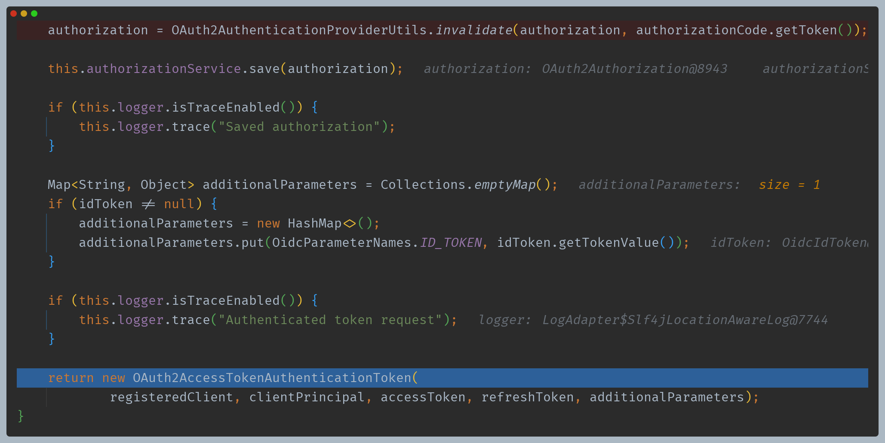

- 임시 코드는 무효화 처리하고 최종 `OAuth2AccessTokenAuthenticationToken`을 반환한다.

## 4. OAuth2TokenEndpointFilter -> sendAccessTokenResponse()

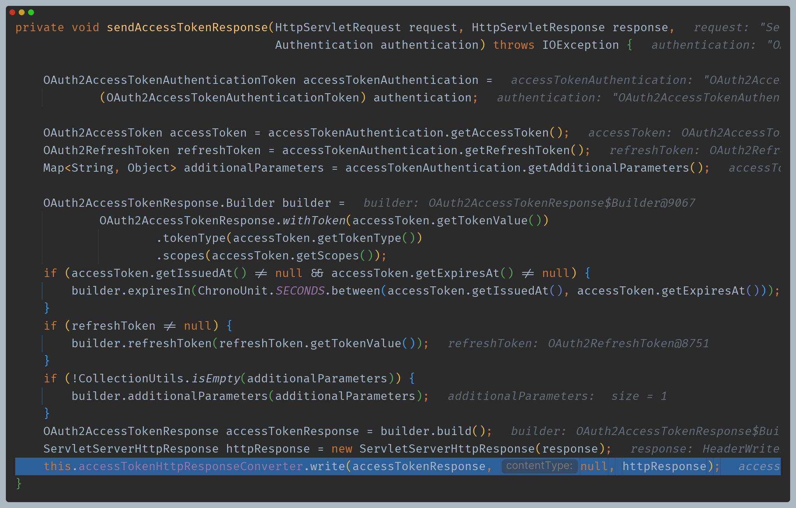

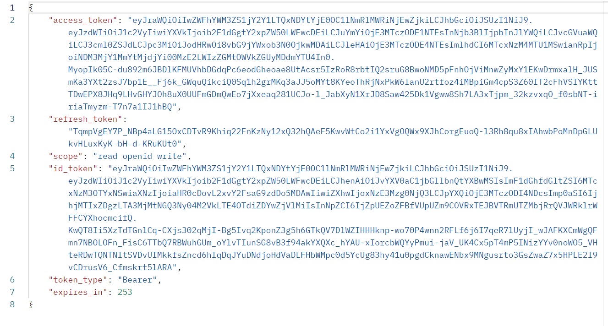