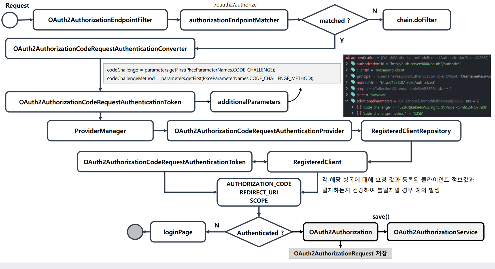
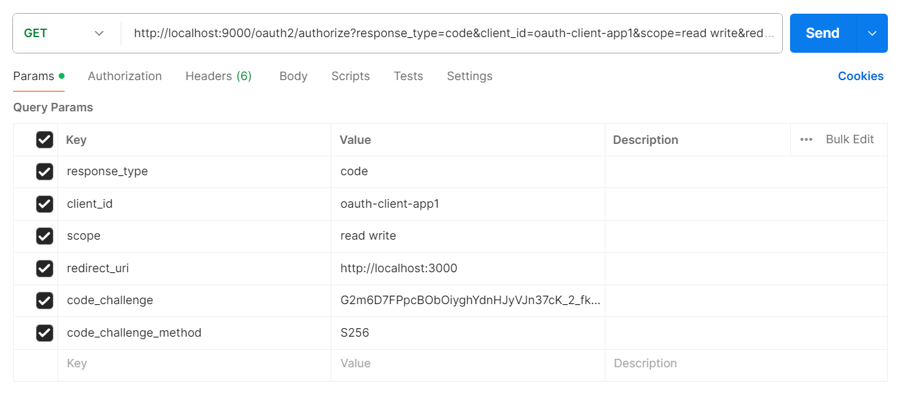
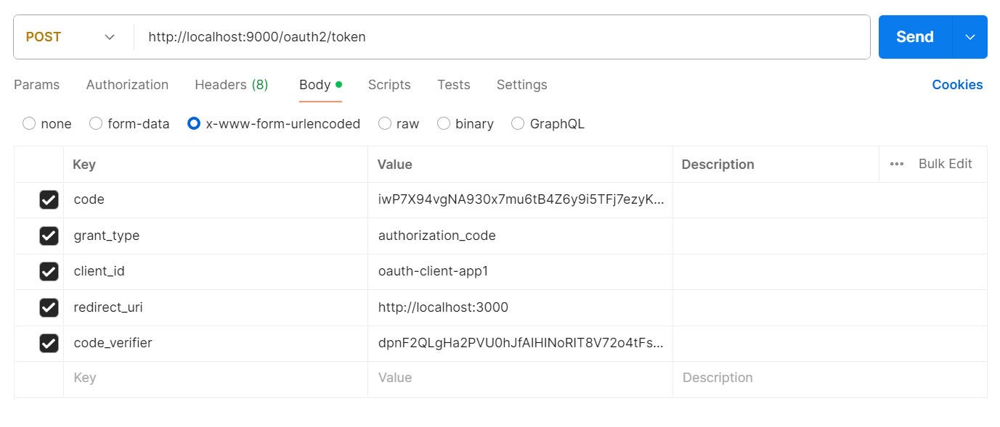
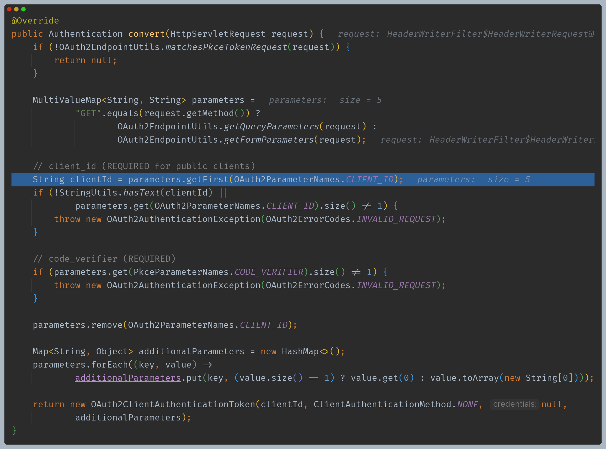
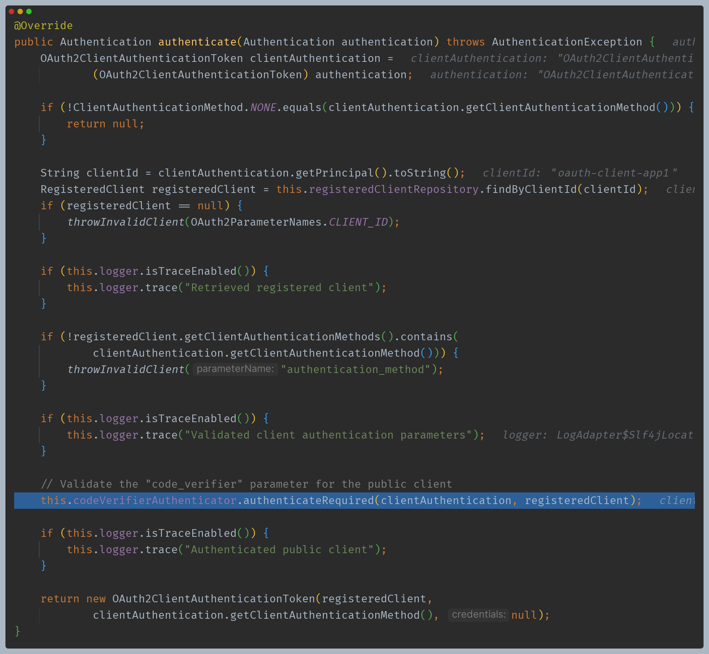
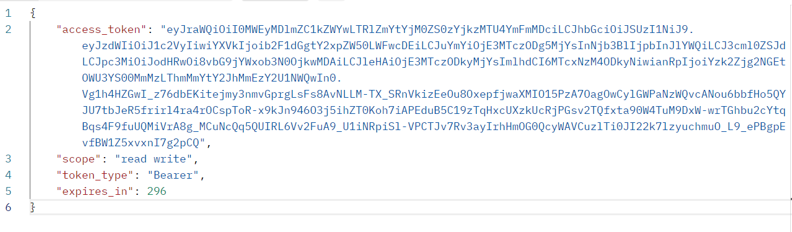
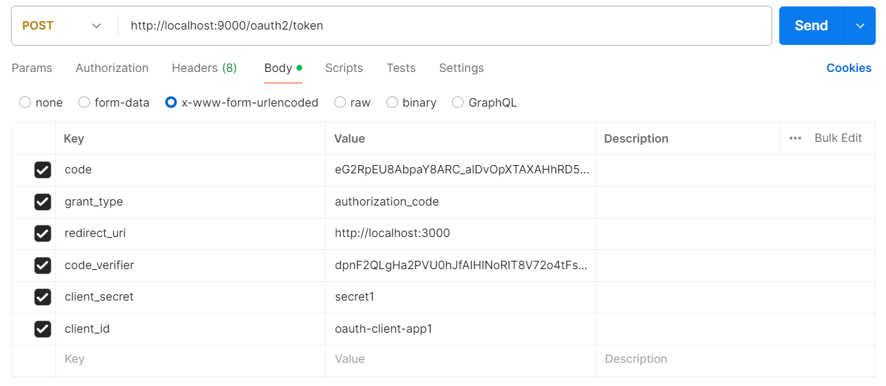
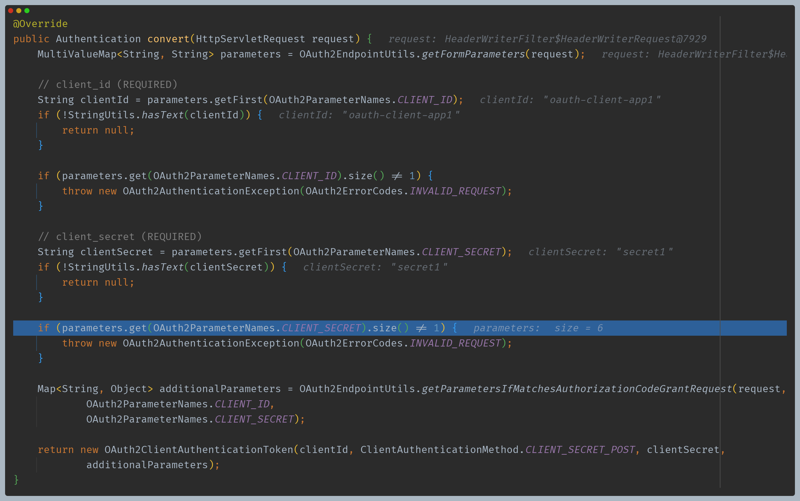
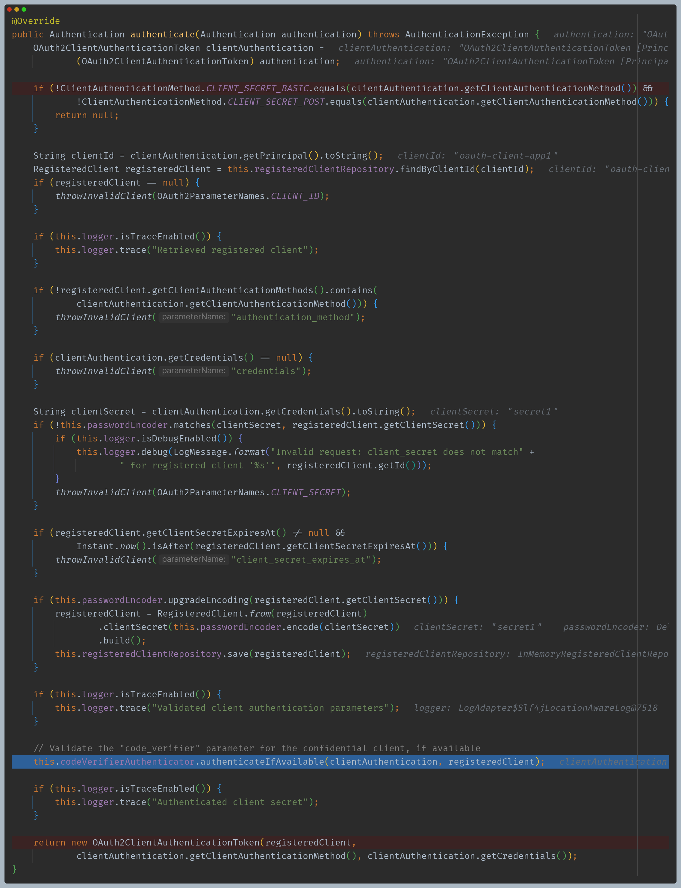
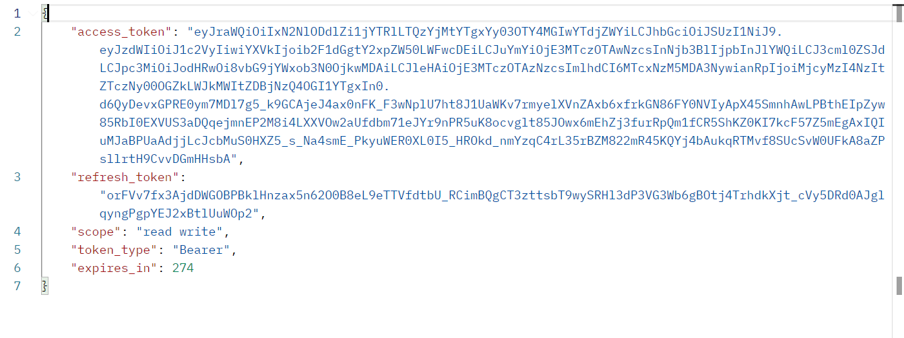

# OAuth 2.0 Token Endpoint

# Authorization Code with PKCE 흐름

---

# 코드 흐름

### 코드 요청

## 1. 공개 클라이언트

## 1-1. 토큰 요청

- [pkce-generator](https://tonyxu-io.github.io/pkce-generator/)

## 1-2. OAuth2ClientAuthenticationFilter -> PublicClientAuthenticationConverter

- 필요한 정보들을 추출해서 `OAuth2ClientAuthenticationToken`을 반환한다.

## 1-3. ProviderManager -> PublicClientAuthenticationProvider

- 최종 `OAuth2ClientAuthenticationToken`을 반환하기 전에 `codeVerifierAuthenticator`를 통해 검증을 한다.

## 1-4. OAuth2TokenEndpointFilter -> ... -> sendAccessTokenResponse

## 2. 기밀 클라이언트

## 2-1. 토큰 요청

## 2.2 OAuth2ClientAuthenticationFilter -> ClientSecretPostAuthenticationConverter

## 2.3 ProviderManager -> ClientSecretAuthenticationProvider

- 기밀 클라이언트라 하더라도 PKCE 기능을 사용했다면 PKCE 인증도 통과해야 정상적으로 토큰을 발급받을 수 있다.

## 2.4 OAuth2TokenEndpointFilter -> ... -> sendAccessTokenResponse

