# Spring Authorization Server - 엔드포인트 프로토콜

# OAuth 2.0 AuthorizationServer Endpoint

## OAuth2AuthorizationEndpointConfigurer

- OAuth2 권한 부여 엔드포인트에 대한 사용자 정의 할 수 있는 기능을 제공한다.
- OAuth2 권한 부여 요청에 대한 전처리, 기본 처리 및 후처리 로직을 커스텀하게 구현할 수 있는 API를 지원한다.
- `OAuth2AuthorizationEndpointFilter`를 구성하고 이를 OAuth2 인증 서버 `SecurityFilterChain` 빈에 등록한다.

## OAuth2AuthorizationEndpointFilter

- OAuth2 인증 요청 및 동의를 처리하는 필터이며 다음과 같은 기본값으로 구성된다.
- **DelegatingAuthenticationConverter**
  - 클라이언트 요청 파라미터를 `OAuth2AuthorizationCodeRequestAuthenticationToken` 또는 `OAuth2AuthorizationConsentAuthenticationToken`으로 변환하여
    **AuthenticationProvider**에게 전달한다.
- **AuthenticationProviders**
  - `OAuth2AuthorizationCodeRequestAuthenticationProvider` 와 `OAuth2AuthorizationConsentAuthenticationProvider` 두 개의 **AuthenticationProvider** 구현체를 가지고 있다.

## RequestMatcher

- **Code 요청 패턴**
  - `/oauth2/authorize, GET`, `/oauth2/authorize, POST`
- **Consent (동의하기) 요청 패턴**
  - `/oauth2/authorize, POST`

---

## 사용자 정의 기능

1. `AuthenticationConverter` 추가
2. 스프링 시큐리티가 관리하는 `AuthenticationConverter` 들을 커스텀하게 변경 가능
3. `AuthenticationProvider` 추가
4. 스프링 시큐리티가 관리하는 `AuthenticationProvider` 들을 커스텀하게 변경 가능
5. **인증된** `OAuth2AuthorizationCodeRequestAuthenticationToken `을 처리하고 `OAuth2AuthorizationResponse`를 반환하는 데 사용되는 후처리기
6. `OAuth2AuthorizationCodeRequestAuthenticationException`을 처리하고 `OAuth2Error` 응답을 반환하는 데 사용되는 후처리기
7. 권한 부여 요청 흐름 중에 동의가 필요한 경우 리소스 소유자를 리디렉션할 사용자 지정 동의 페이지의 URI.

---

# 흐름 및 아키텍처

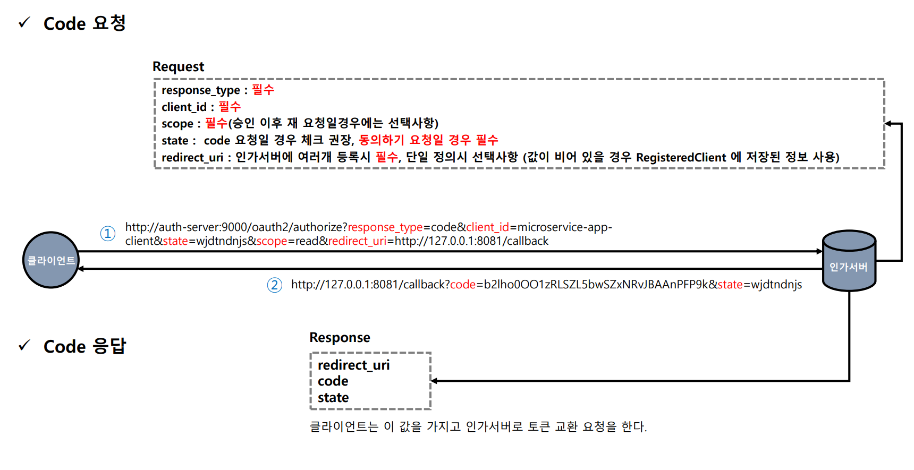

## 1. Resource Owner 인증 전 단계

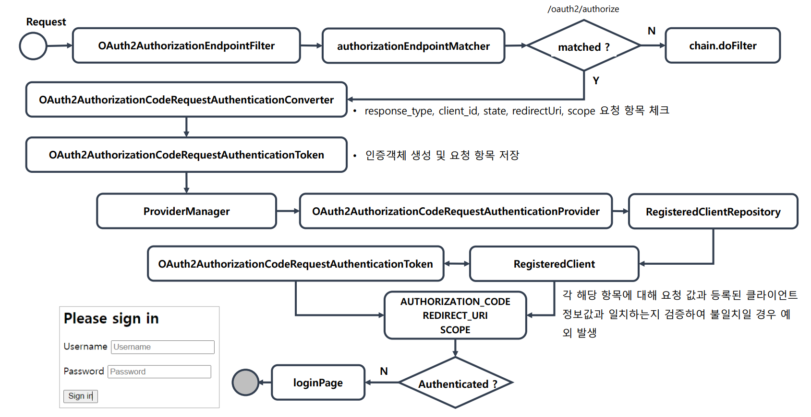

### 1.1 임시코드 요청

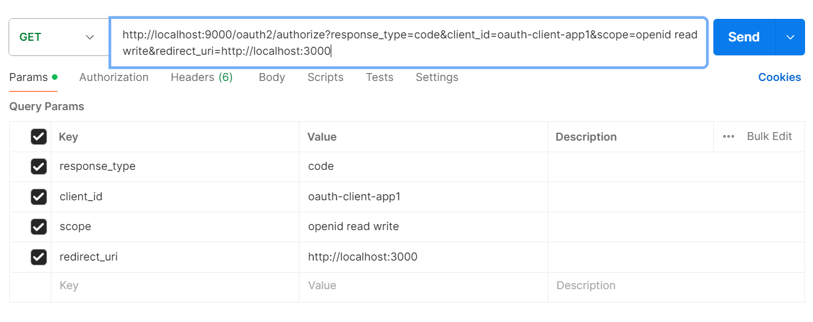

### 1.2 OAuth2AuthorizationEndpointFilter

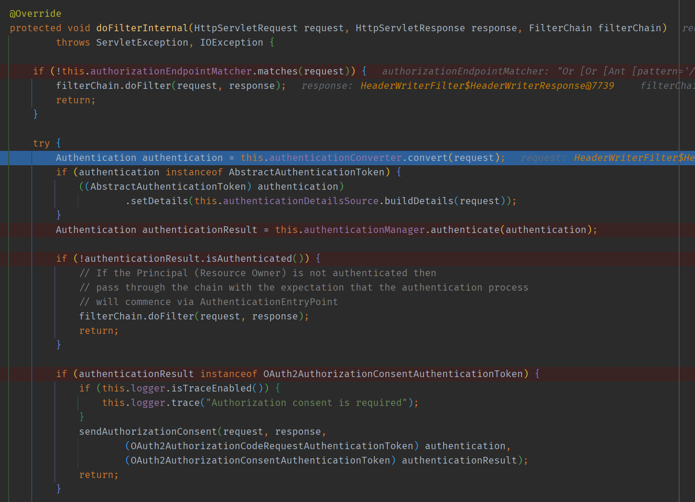

### 1.3 DelegatingAuthenticationConverter -> OAuth2AuthorizationCodeRequestAuthenticationConverter

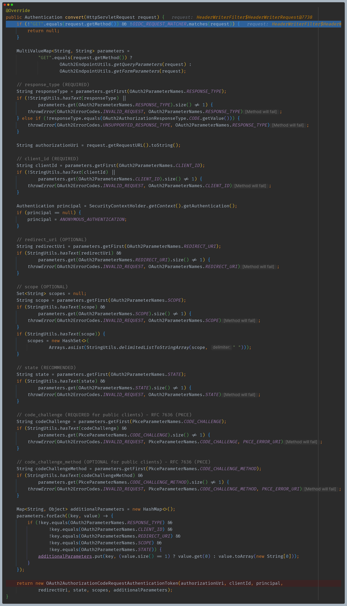

- 요청 파라미터에서 필수, 옵션인 값들을 추출해서 인증할 객체 생성 (`OAuth2AuthorizationCodeRequestAuthenticationToken`)
- 아직 사용자 인증을 하지는 않았으므로 `principal`은 `AnonymousAuthenticationToken` 으로 설정

### 1.4 ProviderManager -> OAuth2AuthorizationCodeRequestAuthenticationProvider

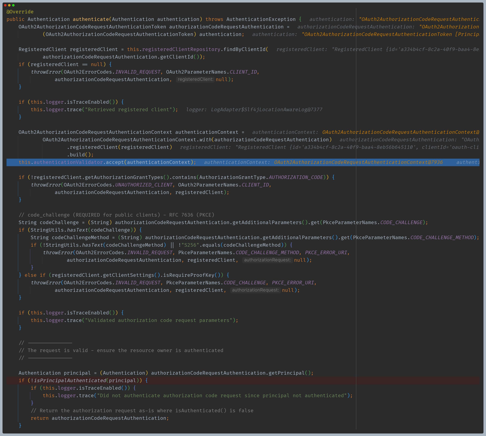

- 인가 서버에서 등록한 `RegisteredClient`와 `ProviderManager`에서 넘어온 인증 객체를 비교한다.(`redirect_uri`, `scope` 등)
- 아직 익명 객체이므로 더 이상 진행하지 않는다.

### 1.5 - ExceptionTranslationFilter -> AuthenticationEntryPoint

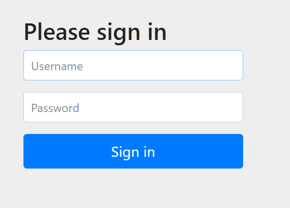

- 인증을 위해 로그인 페이지로 리다이렉트 한다.

## 2. 동의(Consent)

### OAuth2AuthorizationConsent

- `OAuth2AuthorizationConsent`는 OAuth2 권한 부여 요청 흐름의 권한 부여 동의를 나타낸다.
- 클라이언트에 대한 액세스를 승인할 때 리소스 소유자는 클라이언트가 요청한 권한의 하위 집합만 허용할 수 있다.
- 클라이언트가 범위를 요청하고 리소스 소유자가 요청된 범위에 대한 액세스를 허용하거나 거부하는 `authorization_code` 흐름이다.
- OAuth2 인증 요청 흐름이 완료되면 `OAuth2AuthorizationConsent`가 생성(또는 업데이트)되고, 부여된 권한을 클라이언트 및 리소스 소유자와 연결한다.

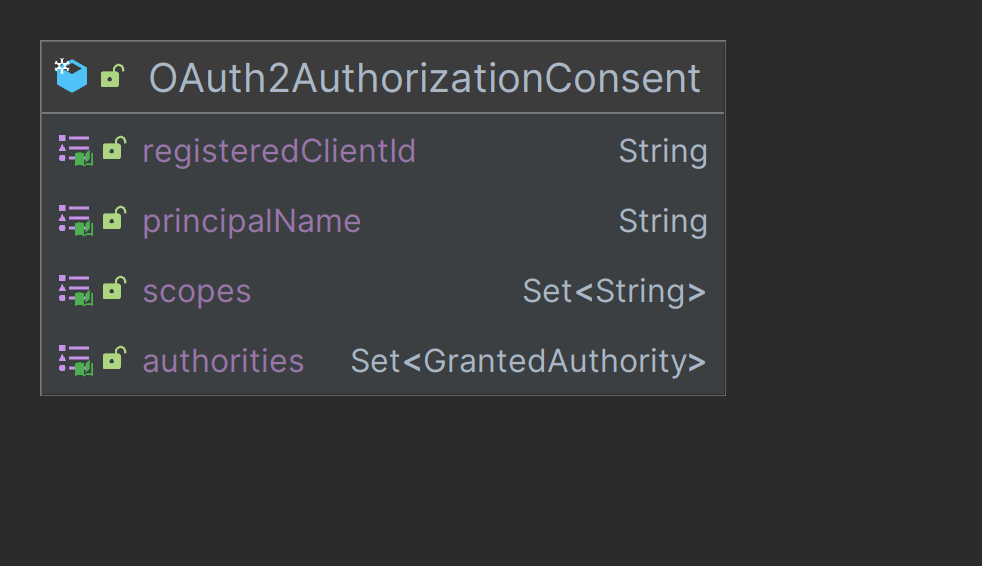

> - `registeredClientId` : 등록된 클라이언트를 고유하게 식별하는 ID
> - `principleName` : 리소스 소유자
> - `scopes` : 권한 요청 범위로서 동의의 선택 목록으로 나타낸다.
> - `authorities` : 리소스 소유자가 클라이언트에 부여한 권한

### OAuth2AuthorizationConsentService

- `OAuth2AuthorizationConsent`가 저장되고 기존 `OAuth2AuthorizationConsent`를 조회하는 클래스로 주로 OAuth2 권한 부여 요청 흐름을 구현하는 구성 요소에 의해 사용된다.
- 기본 구현체로 `InMemoryOAuth2AuthorizationConsentService`와 `JdbcOAuth2AuthorizationConsentService`가 있다.

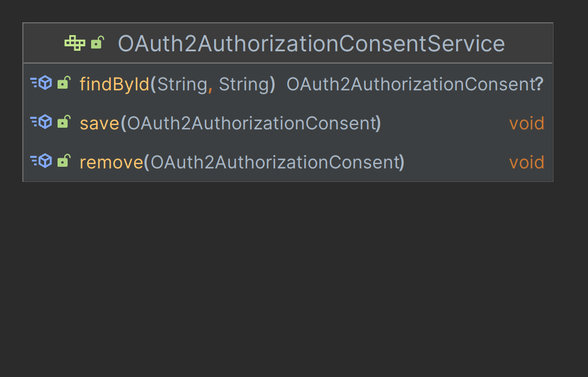

## 2. ResourceOwner 인증 및 Scope 동의 단계

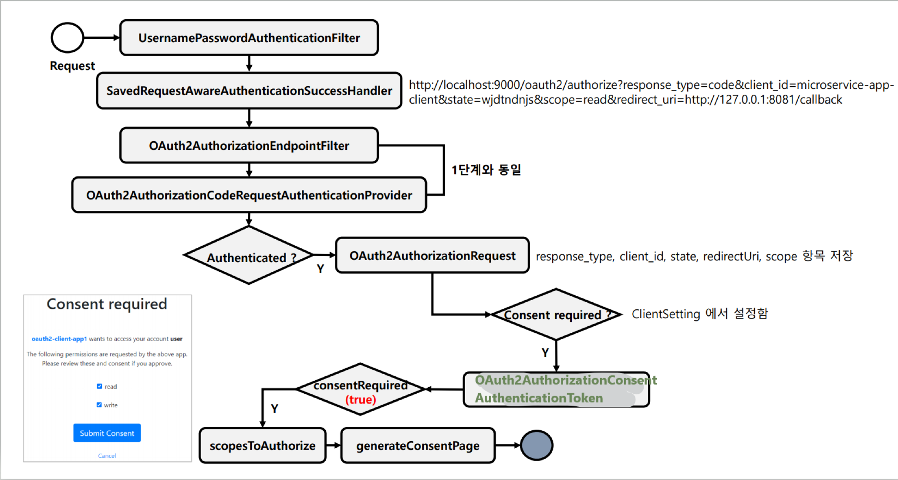

> - **ClientSetting 에서 동의하기를 `true`로 설정하면 위와 같이 진행된다.**
> - **하지만 동의하기를 `false`로 설정했다면 `OAuth2AuthorizationCodeRequestAuthenticationProvider`는 `OAuth2AuthorizationCodeRequestAuthenticationToken`를 반환하고
>   바로 `AuthenticationSuccessHandler`를 호출하여 코드를 반환한다.**

### 2.1 UsernamePasswordAuthenticationFilter -> SavedRequestAwareAuthenticationSuccessHandler

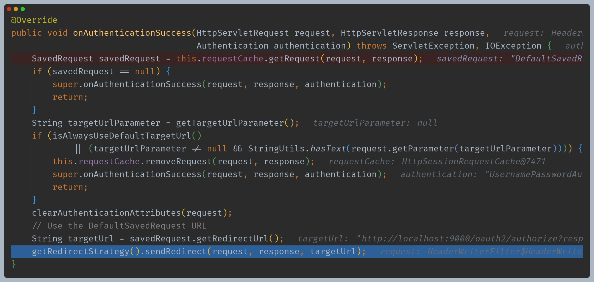

### 2.2 ProviderManager -> OAuth2AuthorizationCodeRequestAuthenticationProvider

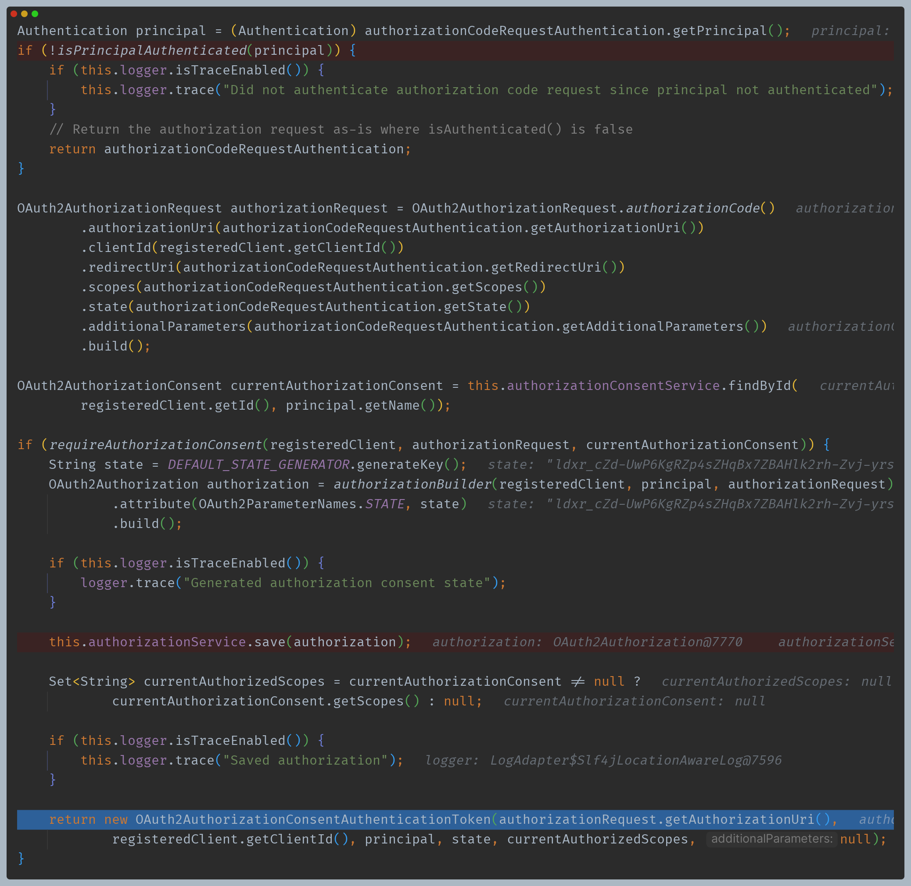

- 이제는 인증이 되었으므로 이후 로직을 수행한다.
- 차이점은 여기서는 `OAuth2AuthorizationConsentAuthenticationToken`를 반환한다.

### 2.3 OAuth2AuthorizationEndpointFilter -> sendAuthorizationConsent()

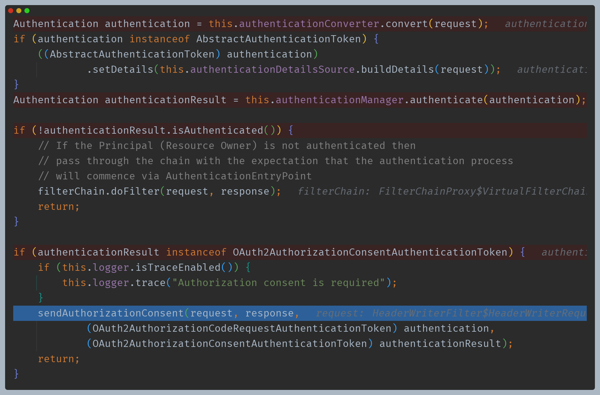

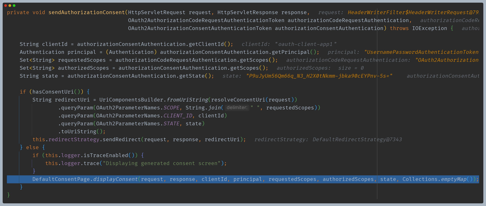

- 직접 설정한 동의하기 페이지를 만들지 않았으므로 디폴트로 실행된다.

**사용자가 스코프 선택 후 동의한 후**

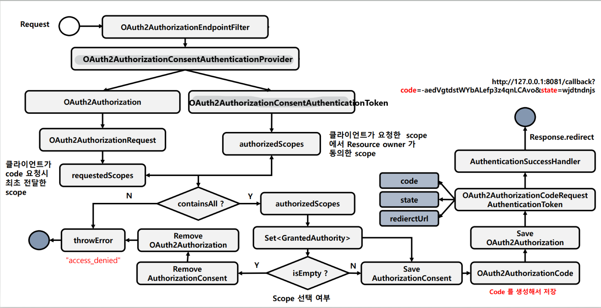

### 2.4 OAuth2AuthorizationEndpointFilter -> OAuth2AuthorizationConsentAuthenticationConverter

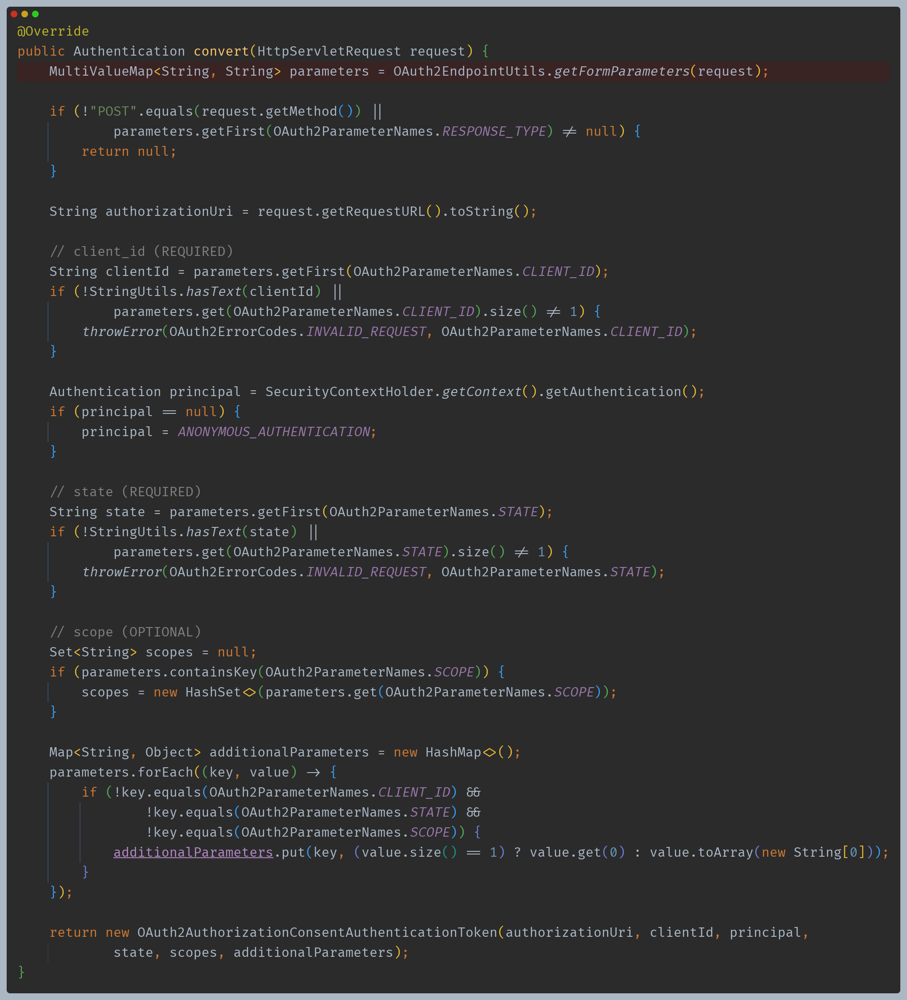

### 2.5 OAuth2AuthorizationConsentAuthenticationProvider

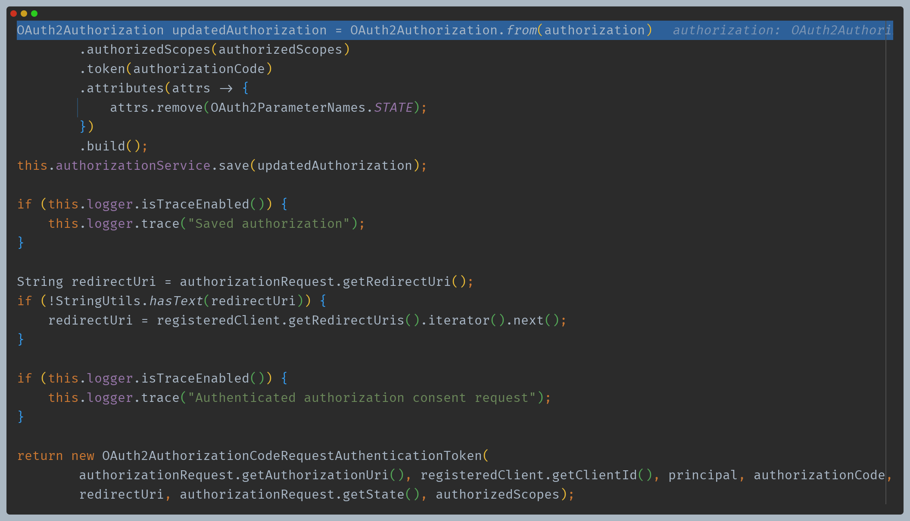

- 코드가 길어서 위 내용은 생략했는데 다음과 같은 과정을 거친다.
  - `SCOPE_` + scope 로 권한 매핑
  - 임시 코드 정보가 담긴 `OAuth2AuthorizationCode` 생성 후 저장
- 최종 `OAuth2AuthorizationCodeRequestAuthenticationToken` 반환

### 2.6 OAuth2AuthorizationEndpointFilter -> sendAuthorizationResponse()

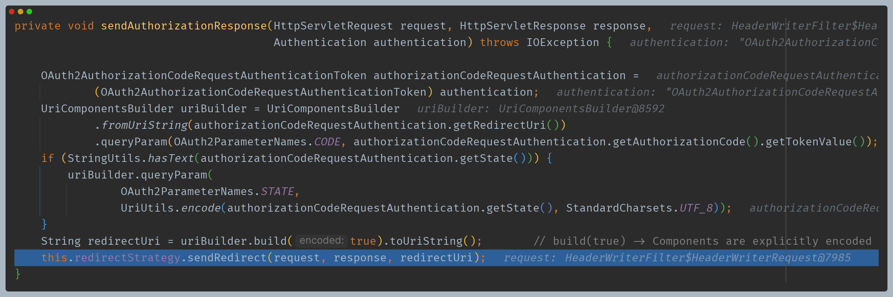

**코드 반환 완료**

---

[메인 ⏫](https://github.com/genesis12345678/TIL/blob/main/Spring/security/oauth/main.md)

[다음 ↪️ - Spring Authorization Server(엔드포인트 프로토콜) - TokenEndpoint](https://github.com/genesis12345678/TIL/blob/main/Spring/security/oauth/SpringServer/Endpoints/TokenEndpoint.md)