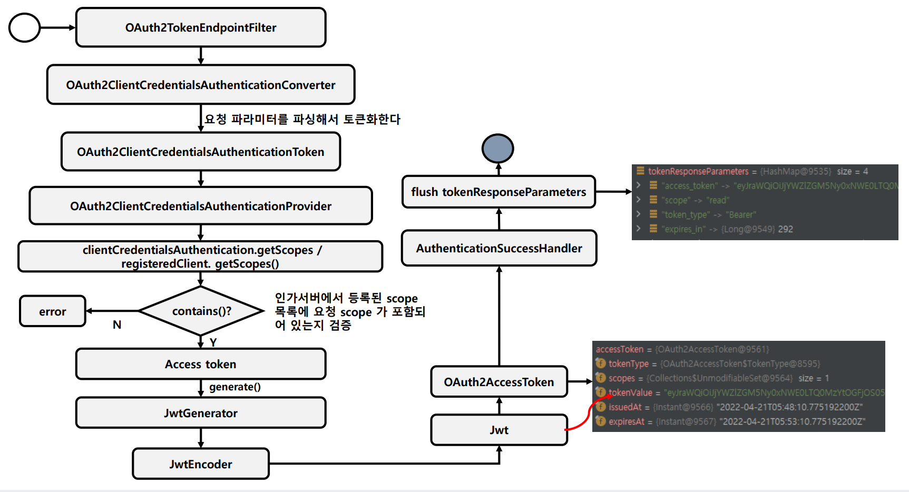
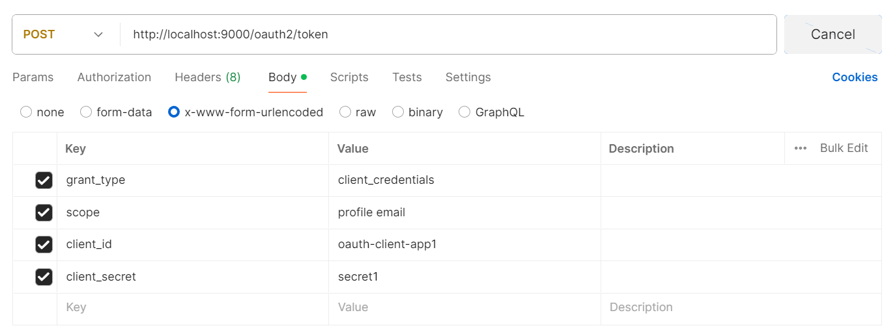
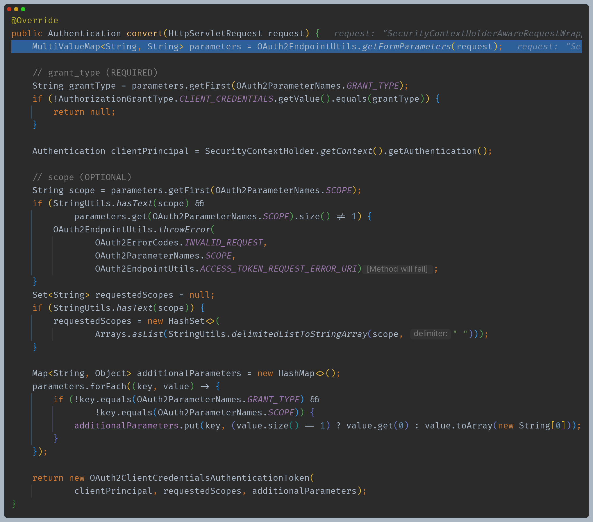
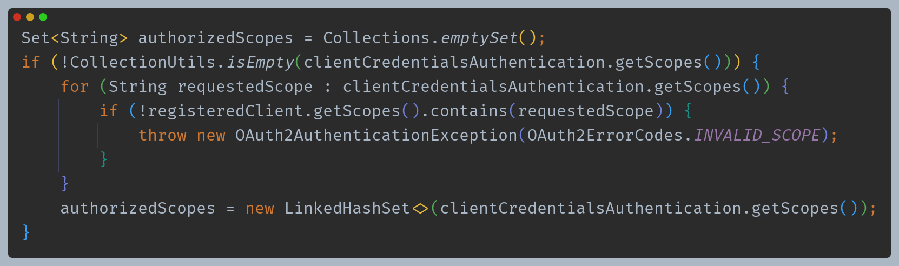
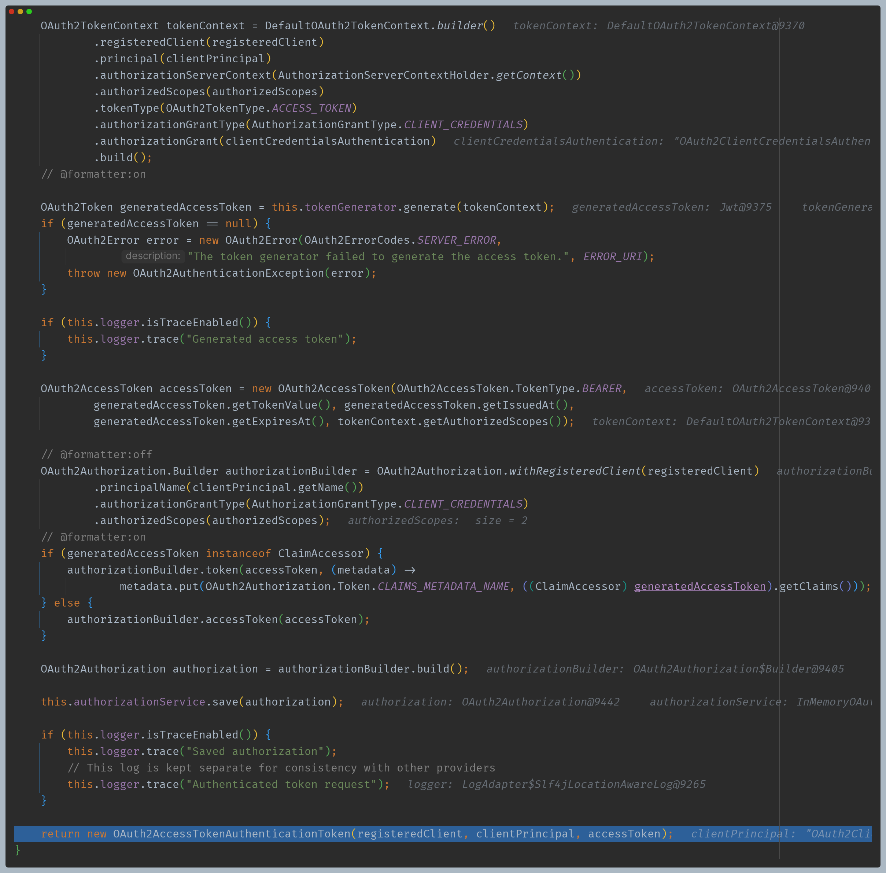
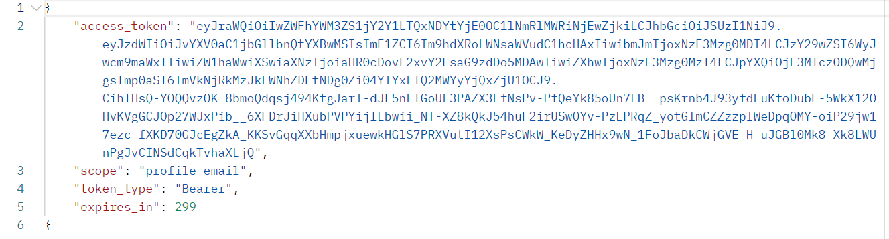

# OAuth 2.0 Token Endpoint

# Client Credentials 흐름

---

# 코드 흐름

## 1. 토큰 요청

## 2. OAuth2TokenEndpointFilter -> OAuth2ClientCredentialsAuthenticationConverter

- 필요한 정보를 추출해서 `OAuth2ClientCredentialsAuthenticationToken`을 반환한다.

## 3. ProviderManager -> OAuth2ClientCredentialsAuthenticationProvider

- 스코프 정보를 확인한다.

- 액세스 토큰만 발급받고 `OAuth2AccessTokenAuthenticationToken`을 반환한다.

## 4. OAuth2TokenEndpointFilter -> sendAccessTokenResponse()

