# Spring Authorization Server - 엔드포인트 프로토콜

# OAuth 2.0 Token Introspection Endpoint

## OAuth2TokenEndpointConfigurer

- OAuth2 토큰 검사 엔드포인트에 대한 사용자 정의 할 수 있는 기능을 제공한다.
- OAuth2 토큰 검사 요청에 대한 전처리, 기본 처리 및 후처리 로직을 커스텀하게 구현할 수 있도록 API를 지원한다.
- `OAuth2TokenIntrospectionEndpointFilter`를 구성하고 이를 OAuth2 인증 서버 `SecurityFilterChain` 빈에 등록한다.

## OAuth2TokenIntrospectionEndpointFilter

- OAuth2 토큰 검사 요청을 처리하는 필터이며 다음과 같은 기본값으로 구성된다.
- **introspectionRequestConverter**
  - OAuth2 토큰 검사 요청을 추출할 때 사용되며, `OAuth2TokenIntrospectionAuthenticationToken`을 반환한다.
- **OAuth2TokenIntrospectionAuthenticationProvider**
  - `OAuth2TokenIntrospectionAuthenticationToken`을 받아 인증 처리를 하는 `AuthenticationProvider` 구현체

## RequestMatcher

- **토큰 검사 요청 패턴**
  - `/oauth2/introspect, POST`

---

## 사용자 정의 기능

1. `introspectionRequestConverter` 추가
2. 스프링 시큐리티가 관리하는 `introspectionRequestConverter` 들을 커스텀하게 변경 가능
3. `AuthenticationProvider` 추가
4. 스프링 시큐리티가 관리하는 `AuthenticationProvider` 들을 커스텀하게 변경 가능
5. 인증된 `OAuth2TokenIntrospectionAuthenticationToken `을 처리하고 `OAuth2TokenIntrospection`를 반환하는 데 사용되는 후처리기
6. `OAuth2AuthenticationException`을 처리하고 `OAuth2Error` 응답을 반환하는 데 사용되는 후처리기

---

## Resource Server 설정

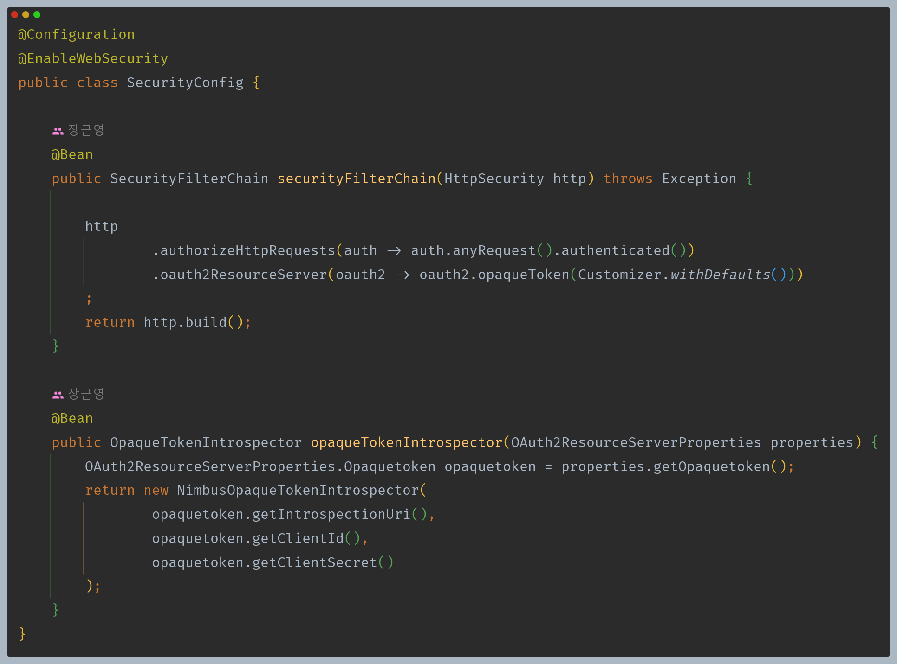

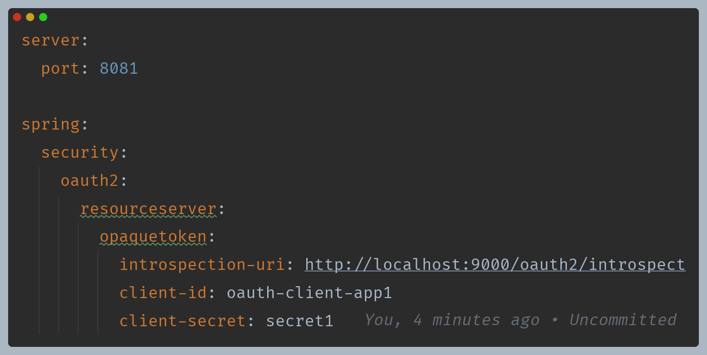

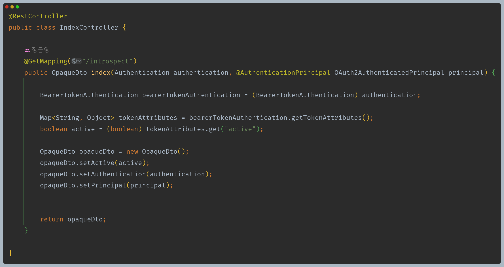

---

# 코드 흐름

## 1. 토큰 요청

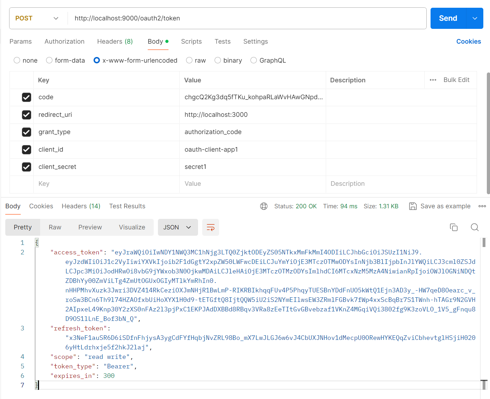

## 2. 액세스 토큰으로 리소스 서버로 요청

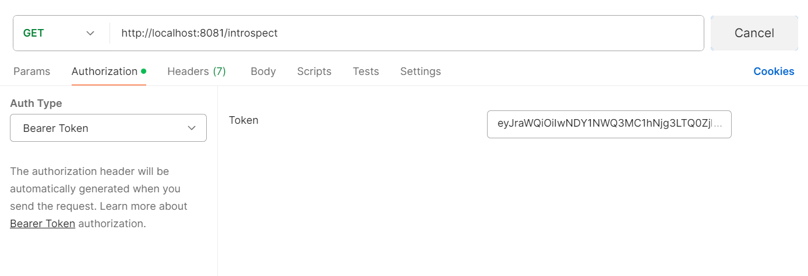

## 3. 리소스 서버 - BearerTokenAuthenticationFilter -> OpaqueTokenAuthenticationProvider

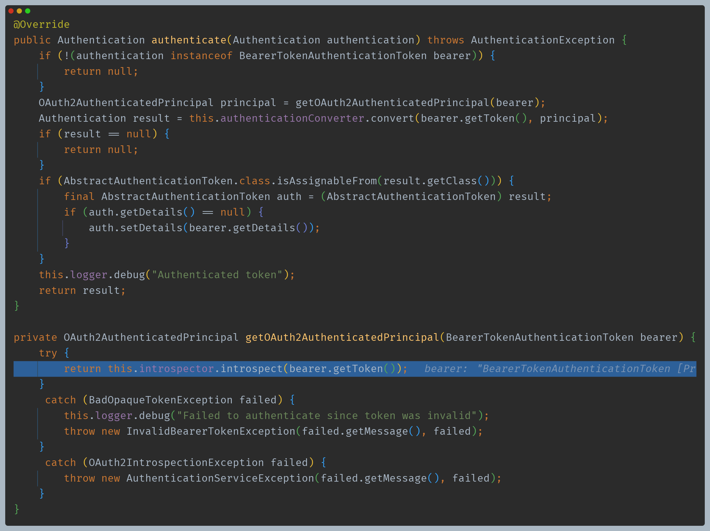

- `makeRequest()`로 인가 서버와 통신 후 응답을 받는다.

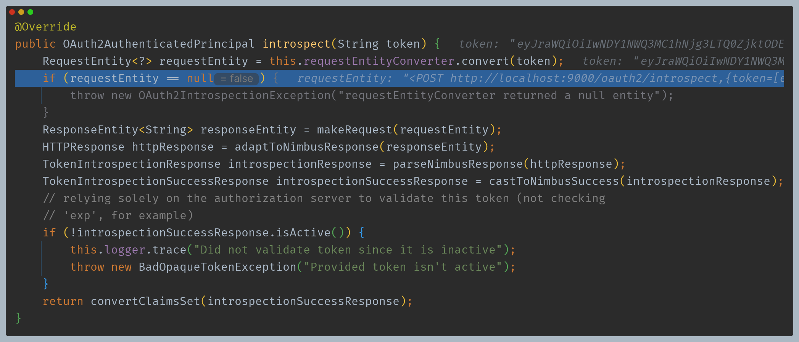

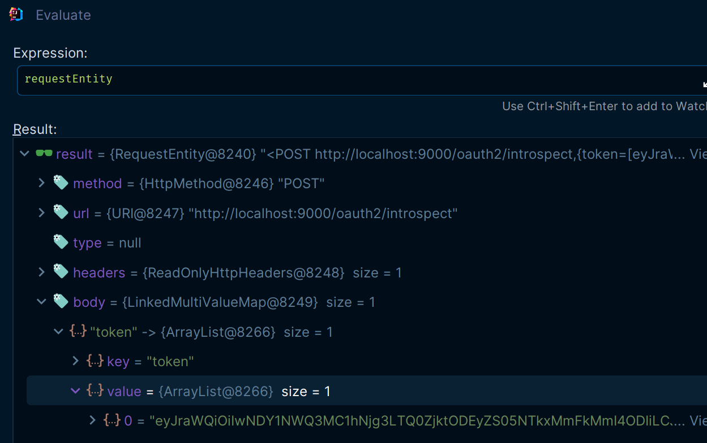

## 4. 인가 서버 - OAuth2TokenIntrospectionEndpointFilter -> OAuth2TokenIntrospectionAuthenticationConverter

- 필요한 정보 추출 후 `OAuth2TokenIntrospectionAuthenticationToken`을 반환한다.

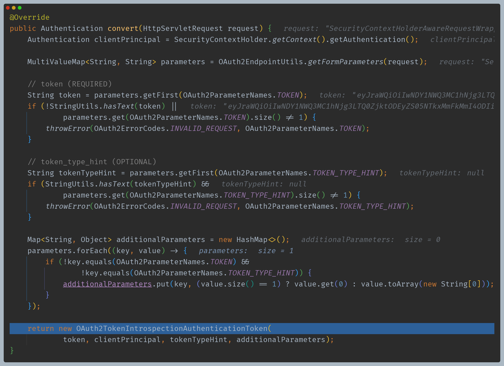

## 5. 인가 서버 - ProviderManager -> OAuth2TokenIntrospectionAuthenticationProvider

- 토큰의 유효성을 확인하고 `OAuth2TokenIntrospectionAuthenticationToken`을 반환한다.

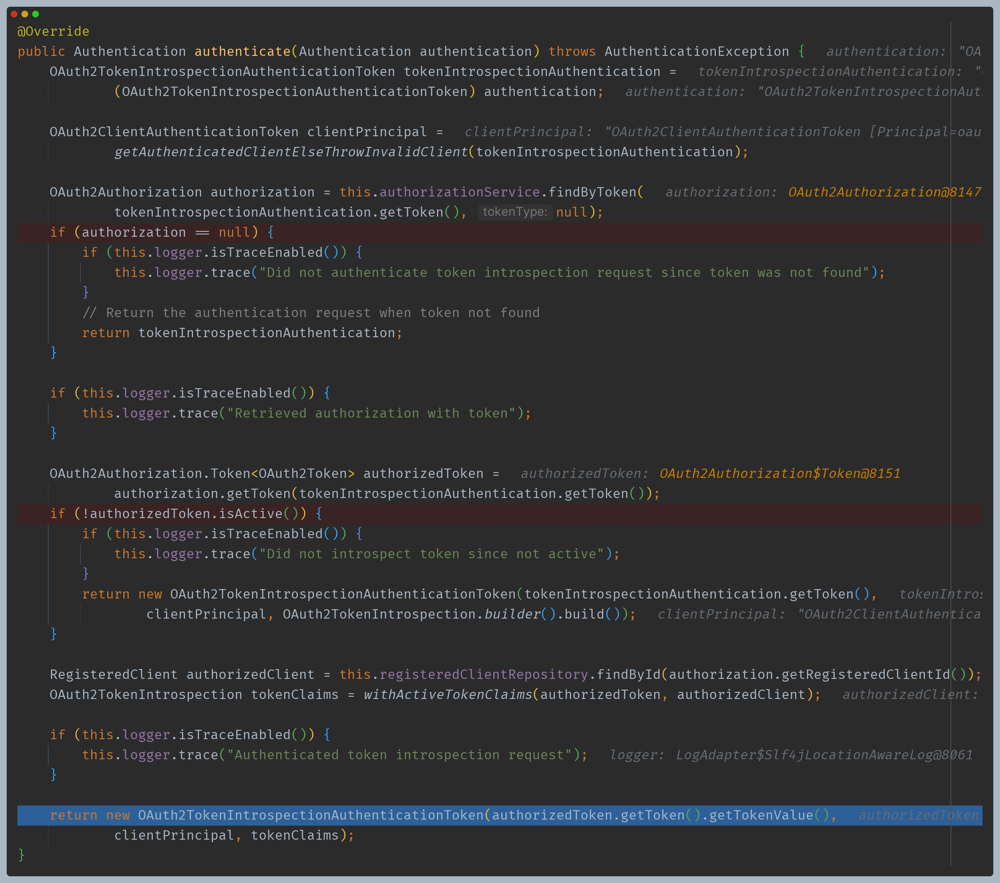

## 6. 인가 서버 - OAuth2TokenIntrospectionEndpointFilter -> sendIntrospectionResponse

## 7. 리소스 서버 - Controller

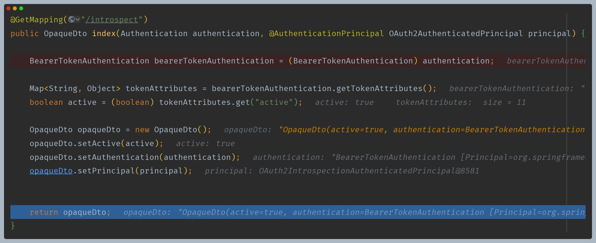

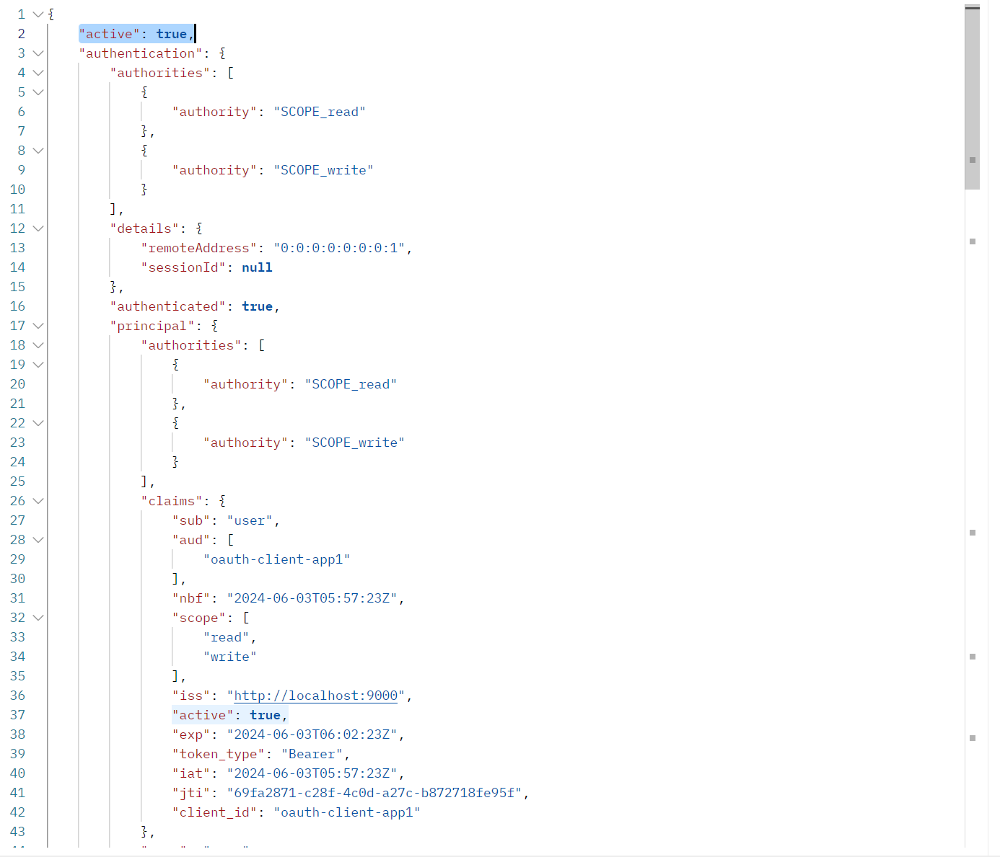

---

[이전 ↩️ - Spring Authorization Server(엔드포인트 프로토콜) - Token Endpoint]()

[메인 ⏫](https://github.com/genesis12345678/TIL/blob/main/Spring/security/oauth/main.md)

[다음 ↪️ - Spring Authorization Server(엔드포인트 프로토콜) - Token Revocation Endpoint]()