# OAuth 2.0 Token Endpoint

# Refresh Token 흐름

---

# 코드 흐름

## 1. 토큰 요청 후 받는 Refresh Token으로 요청하기

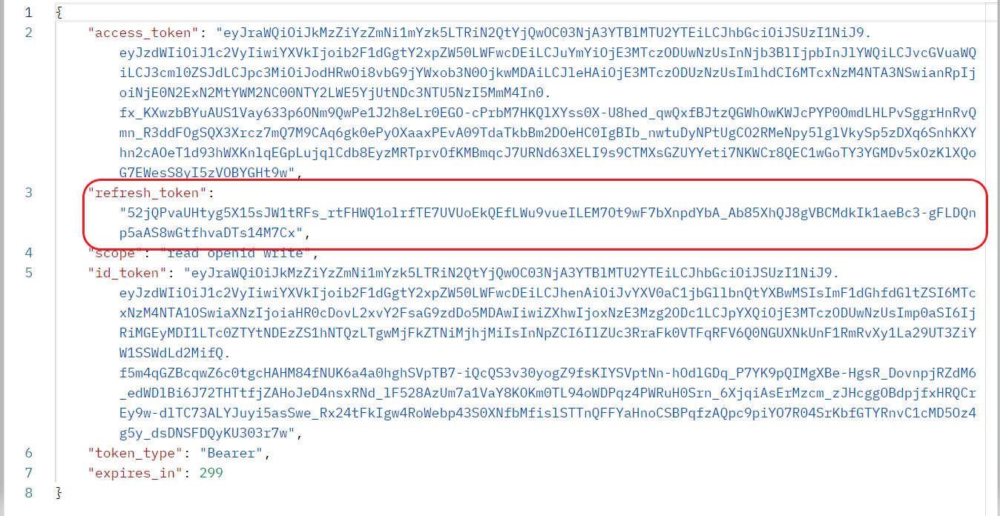

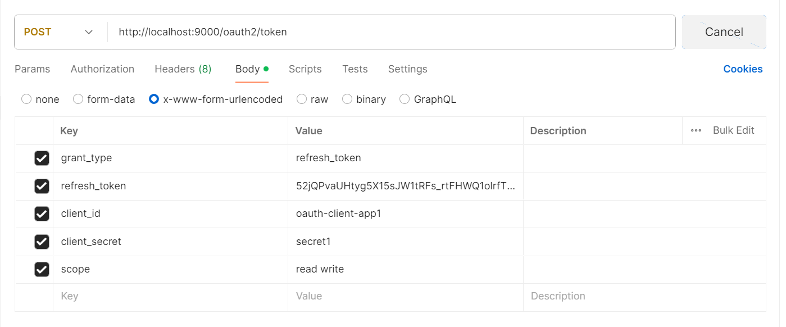

## 2. OAuth2TokenEndpointFilter -> OAuth2RefreshTokenAuthenticationConverter

- 필수 값들을 추출하여 `OAuth2RefreshTokenAuthenticationToken`을 반환한다.

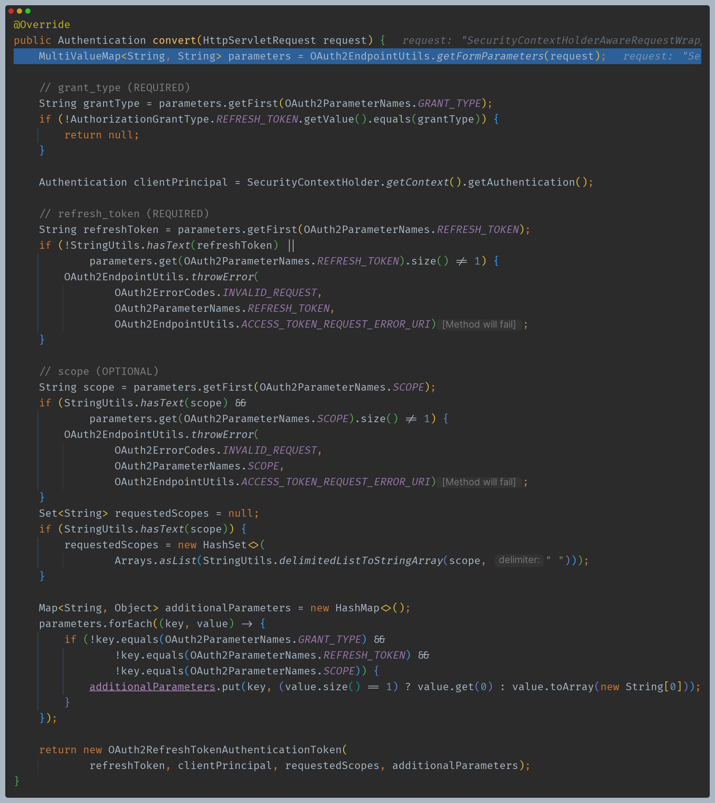

## 3. ProviderManager -> OAuth2RefreshTokenAuthenticationProvider

- `client_id`, `grant_type`, 토큰 유효성, `scope`를 확인한다.

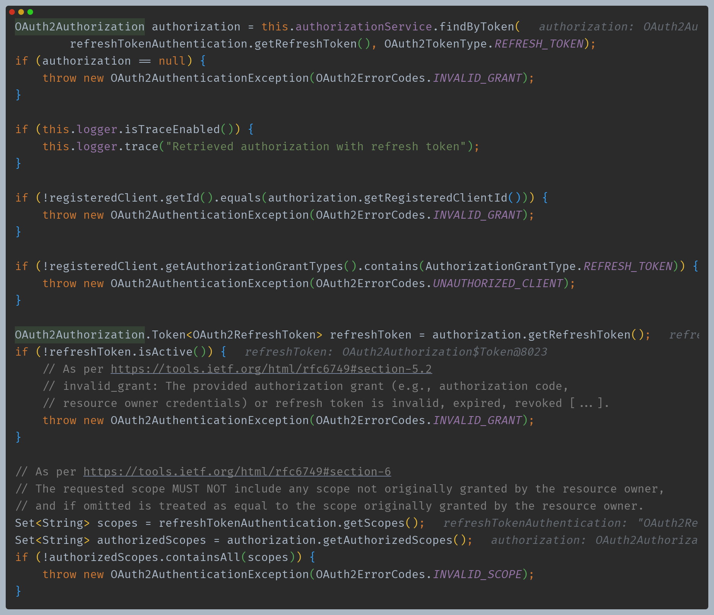

- 액세스 토큰 생성

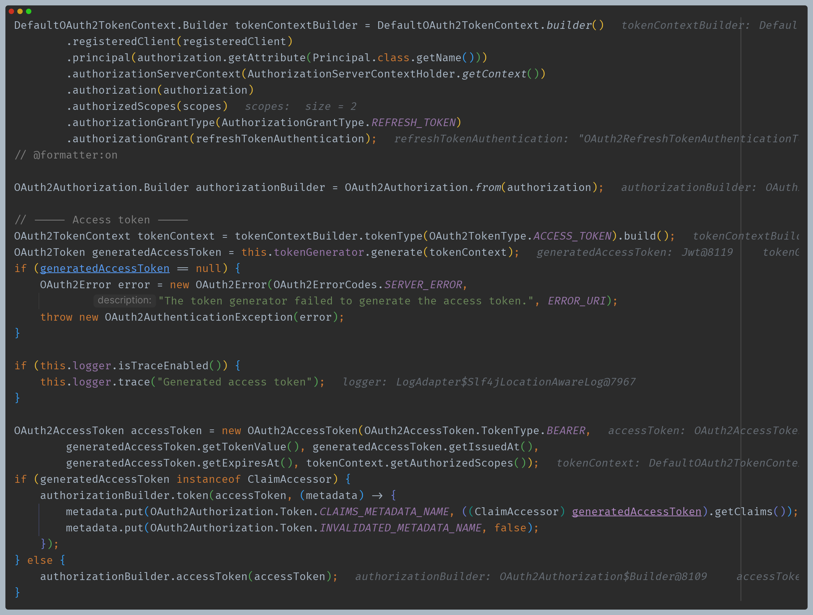

- 리프레시 토큰 생성
- 이때 `tokenSetting()`에 따라 리프레시 토큰을 그대로 사용하냐, 새로 생성하냐가 달라진다.
- 설정은 설정 클래스를 통해 설정할 수 있다.
  
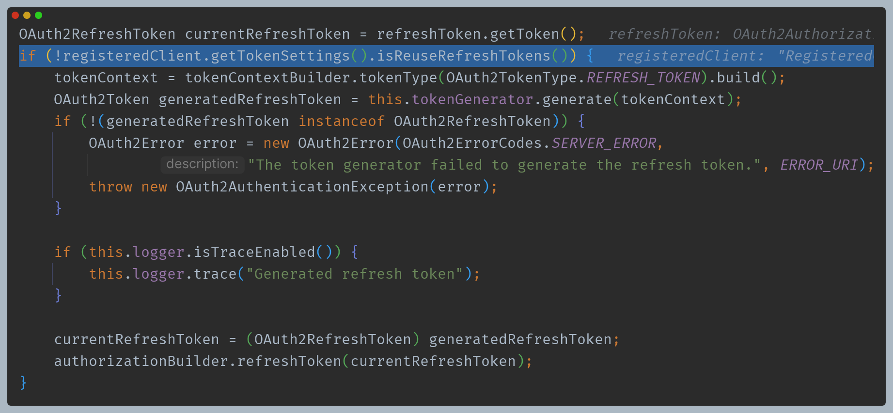

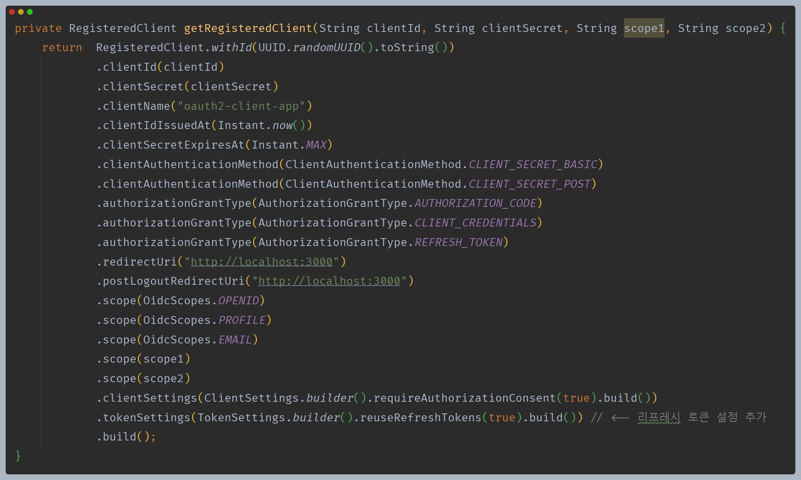

- `id_token`을 생성한다.
- 이때 리프레시 토큰을 요청했을 때 `scope`가 아니라 임시 코드를 요청했을 때 `scope`를 기준으로 한다.

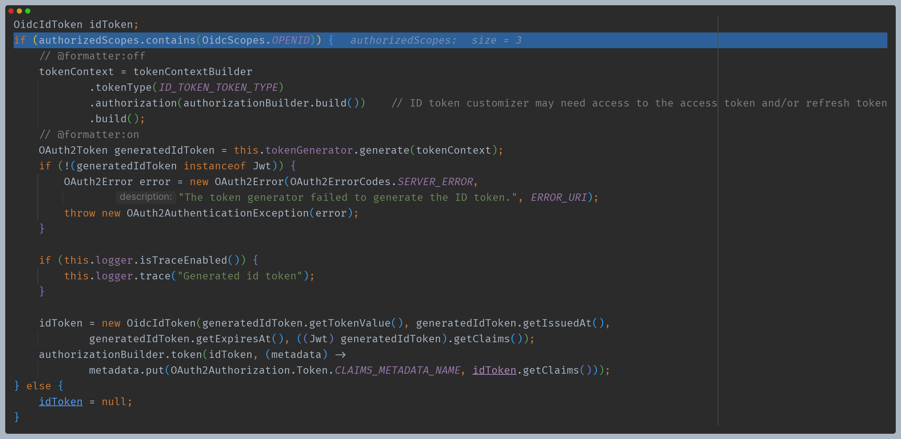

- `OAuth2Authorization`을 저장하고 `OAuth2AccessTokenAuthenticationToken`을 반환한다.

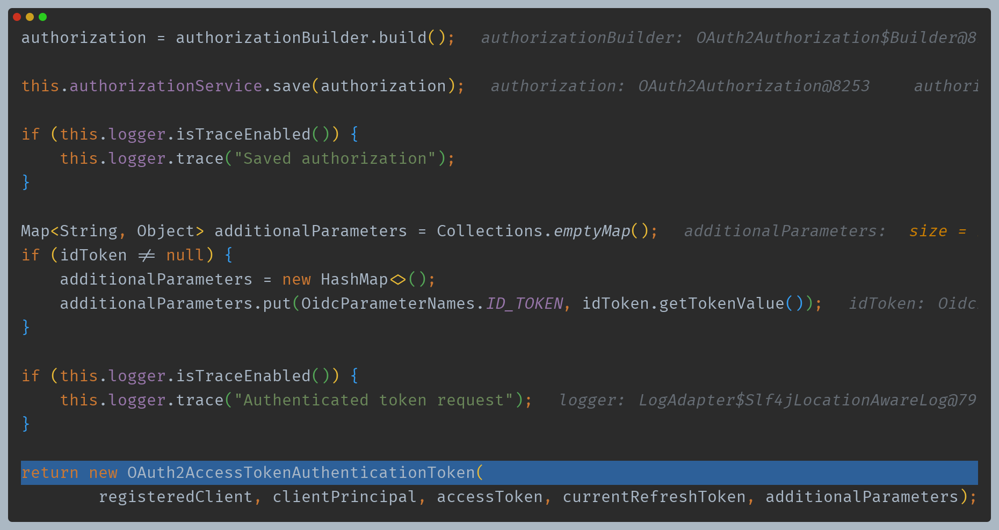

## 4. OAuth2TokenEndpointFilter -> sendAccessTokenResponse()

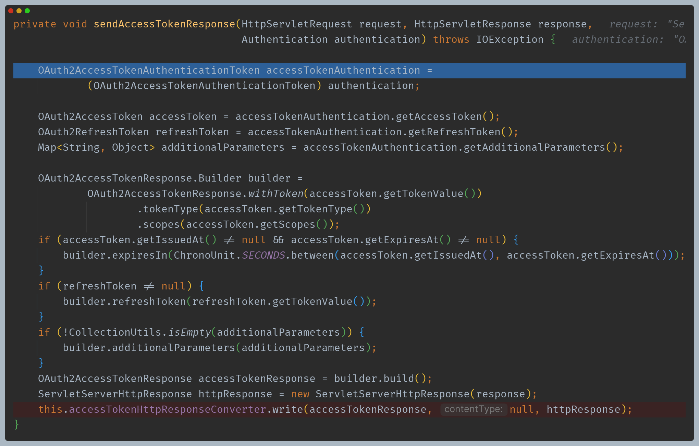

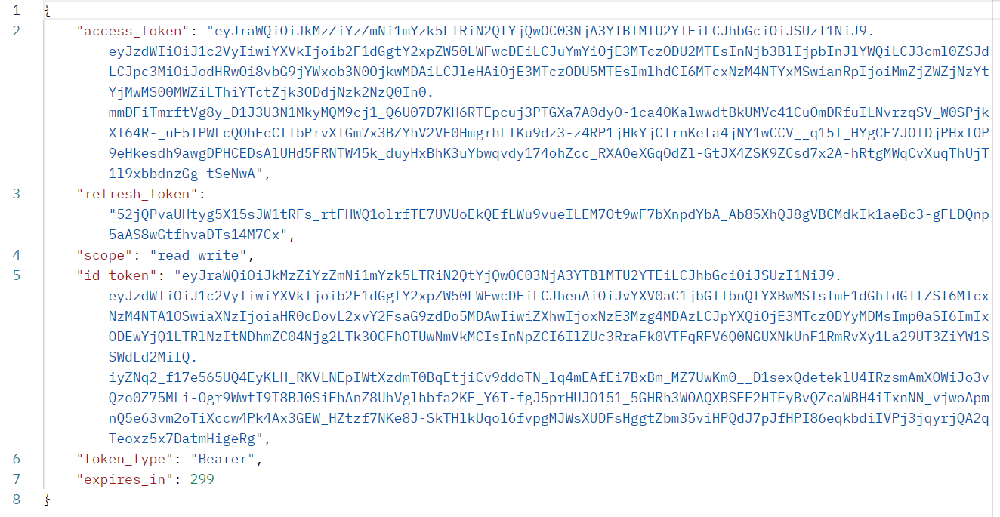