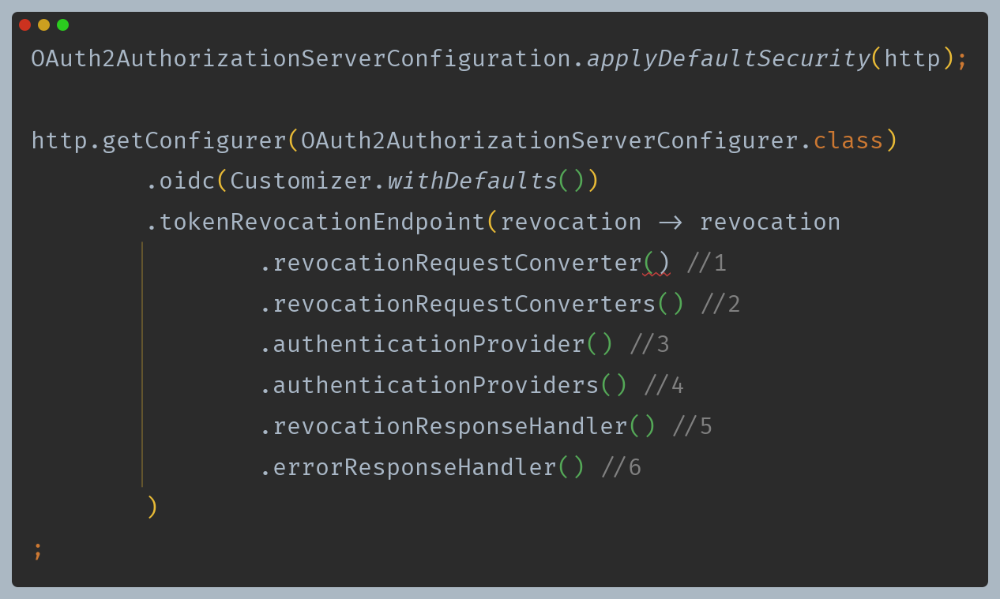
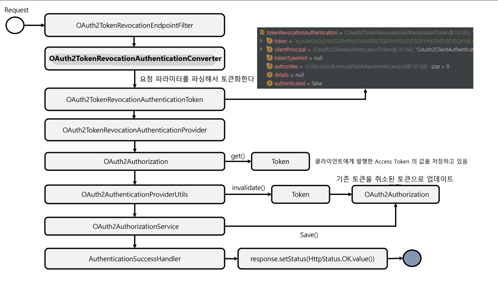
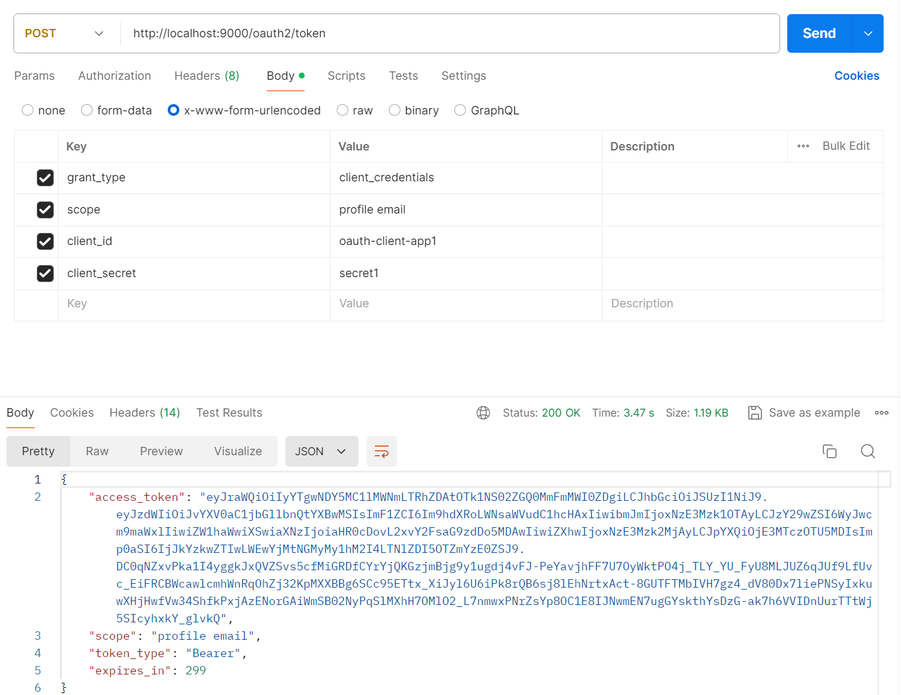
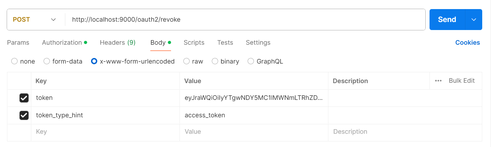
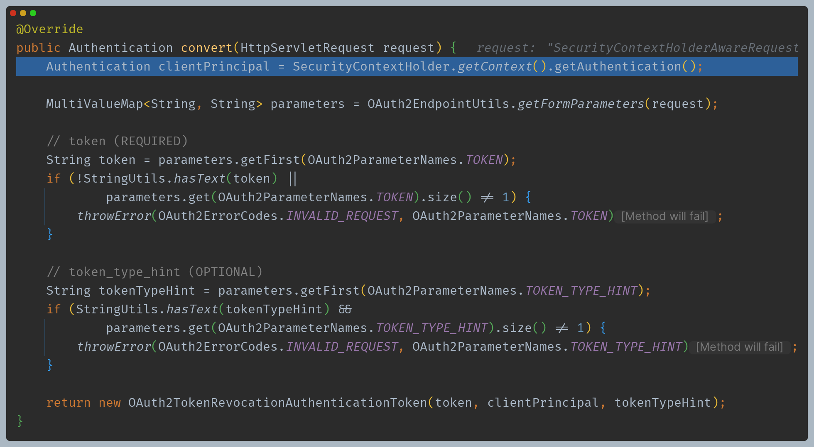
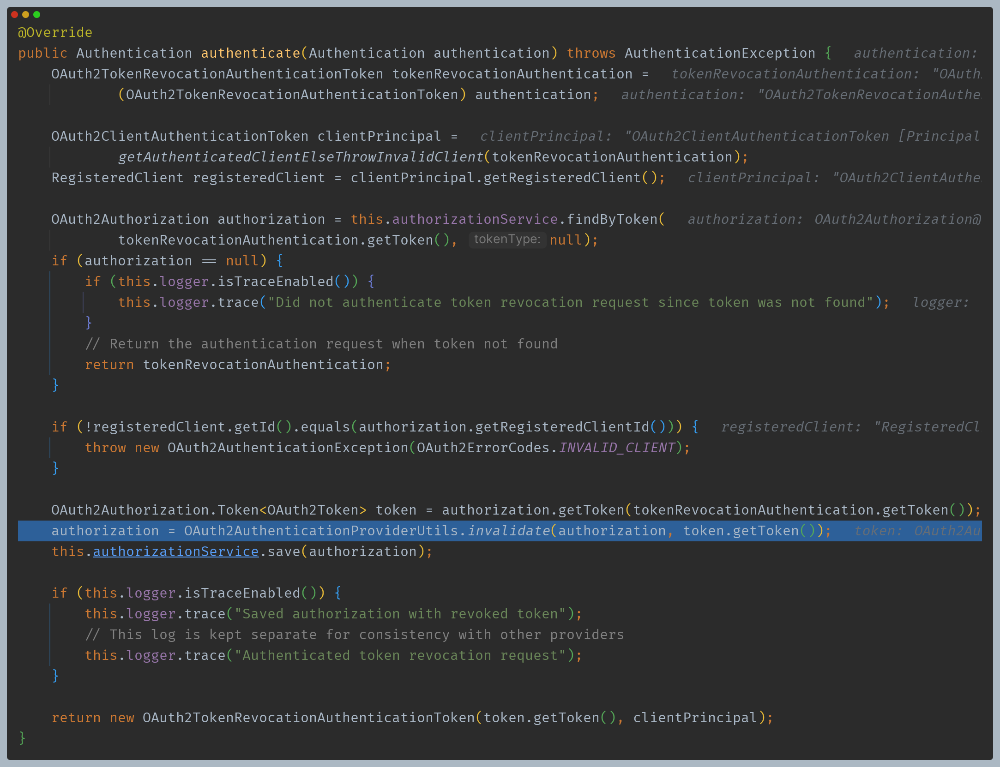
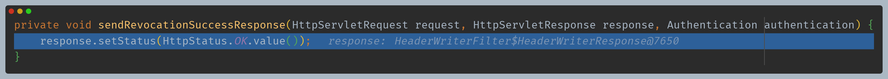
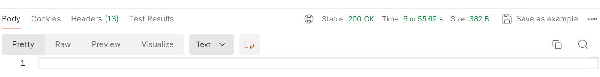

# Spring Authorization Server - 엔드포인트 프로토콜

# OAuth 2.0 Token Introspection Endpoint

## OAuth2TokenRevocationEndpointConfigurer

- OAuth2 토큰 취소 엔드포인트에 대한 사용자 정의 할 수 있는 기능을 제공한다.
- OAuth2 토큰 취소 요청에 대한 전처리, 기본 처리 및 후처리 로직을 커스텀하게 구현할 수 있도록 API를 지원한다.
- `OAuth2TokenRevocationEndpointFilter`를 구성하고 이를 OAuth2 인증 서버 `SecurityFilterChain` 빈에 등록한다.

## OAuth2TokenRevocationEndpointFilter

- OAuth2 토큰 취소 요청을 처리하는 필터이며 다음과 같은 기본값으로 구성된다.
- **revocationRequestConverter**
    - OAuth2 토큰 취소 요청을 추출할 때 사용되며, `OAuth2TokenRevocationAuthenticationToken`을 반환한다.
- **OAuth2TokenRevocationAuthenticationProvider**
    - `OAuth2TokenRevocationAuthenticationToken`을 받아 인증 처리를 하는 `AuthenticationProvider` 구현체

## RequestMatcher

- **토큰 검사 요청 패턴**
    - `/oauth2/revoke, POST`

---

## 사용자 정의 기능

1. `revocationRequestConverter` 추가
2. 스프링 시큐리티가 관리하는 `revocationRequestConverter` 들을 커스텀하게 변경 가능
3. `AuthenticationProvider` 추가
4. 스프링 시큐리티가 관리하는 `AuthenticationProvider` 들을 커스텀하게 변경 가능
5. 인증된 `OAuth2TokenRevocationAuthenticationToken `을 처리하고 응답을 반환하는 데 사용되는 후처리기
6. `OAuth2AuthenticationException`을 처리하고 `OAuth2Error` 응답을 반환하는 데 사용되는 후처리기

---

# 코드 흐름

## 1. 토큰 요청

## 2. 토큰 취소 요청

## 3. OAuth2TokenRevocationEndpointFilter -> OAuth2TokenRevocationAuthenticationConverter

- 필수 값을 추출하여 `OAuth2TokenRevocationAuthenticationToken`을 반환한다.

## 4. ProviderManager -> OAuth2TokenRevocationAuthenticationProvider

- `invalidate()` 를 통해 토큰의 메타 데이터를 새로 설정하고, `OAuth2TokenRevocationAuthenticationToken`을 반환한다.

## 5. OAuth2TokenRevocationEndpointFilter -> sendRevocationSuccessResponse()

## 6. 무효화된 토큰으로 토큰 검증 시도

- `OAuth2TokenIntrospectionEndpointFilter`의 검증에서 막혀 401 을 응답하는 것을 확인할 수 있다.

---

[이전 ↩️ - Spring Authorization Server(엔드포인트 프로토콜) - Token Introspection Endpoint](https://github.com/genesis12345678/TIL/blob/main/Spring/security/oauth/SpringServer/Endpoints/Introspection.md)

[메인 ⏫](https://github.com/genesis12345678/TIL/blob/main/Spring/security/oauth/main.md)

[다음 ↪️ - Spring Authorization Server(엔드포인트 프로토콜) - Authorization Server Metadata Endpoint](https://github.com/genesis12345678/TIL/blob/main/Spring/security/oauth/SpringServer/Endpoints/Metadata.md#spring-authorization-server---%EC%97%94%EB%93%9C%ED%8F%AC%EC%9D%B8%ED%8A%B8-%ED%94%84%EB%A1%9C%ED%86%A0%EC%BD%9C)