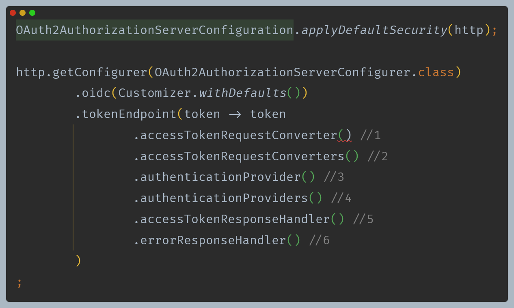
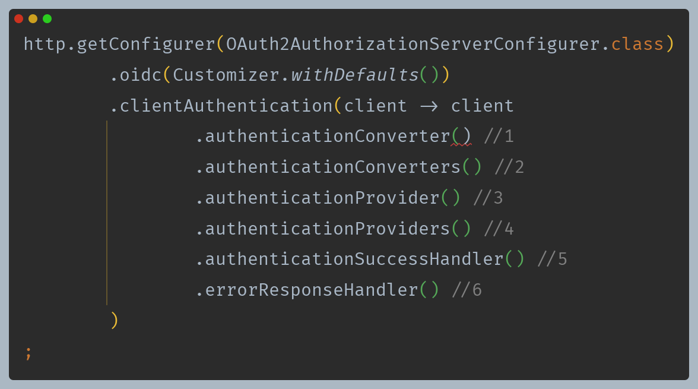
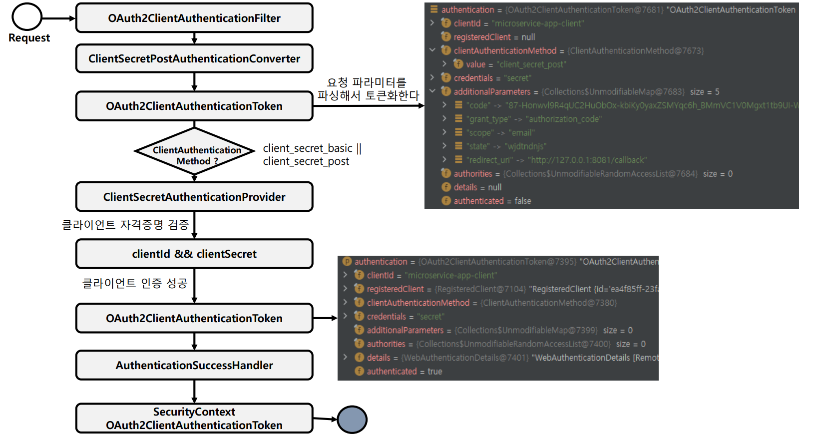
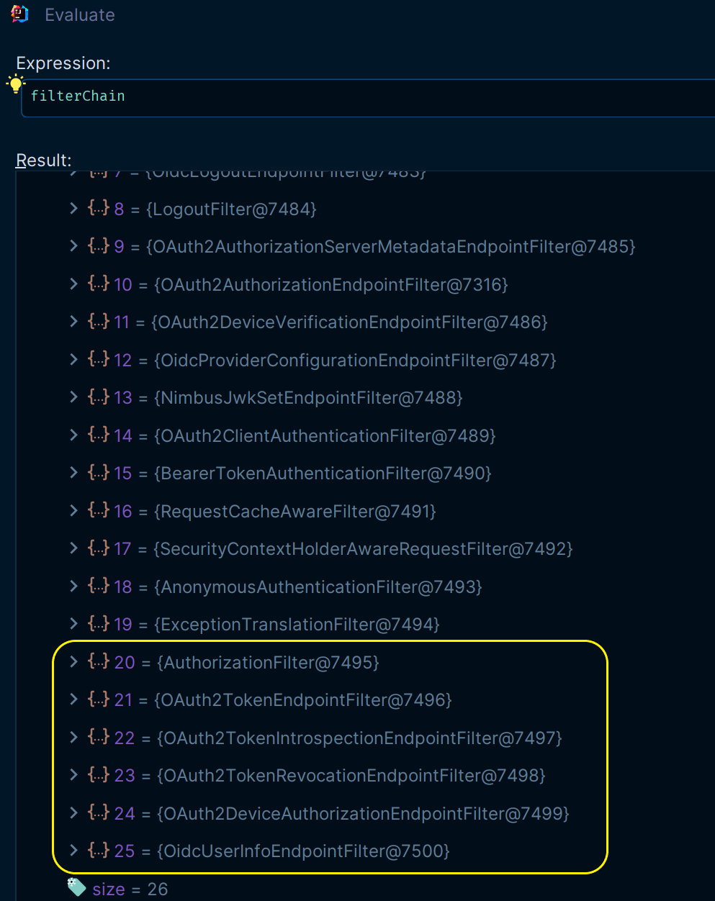
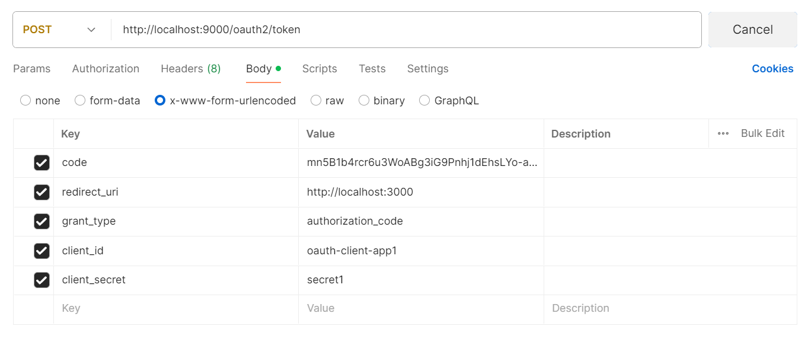
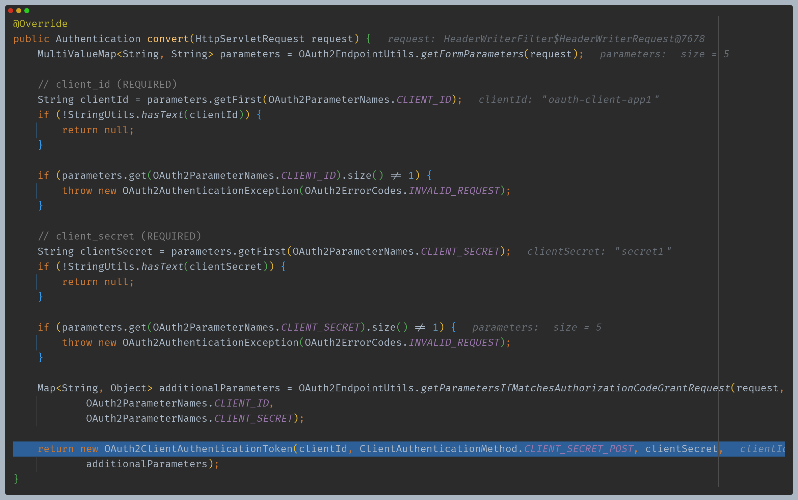
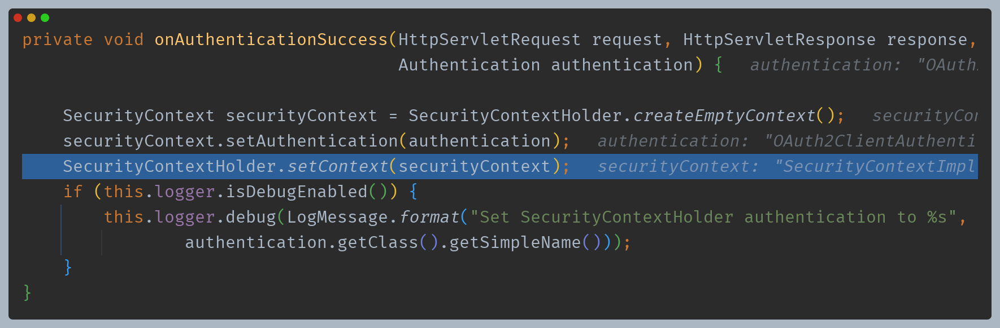
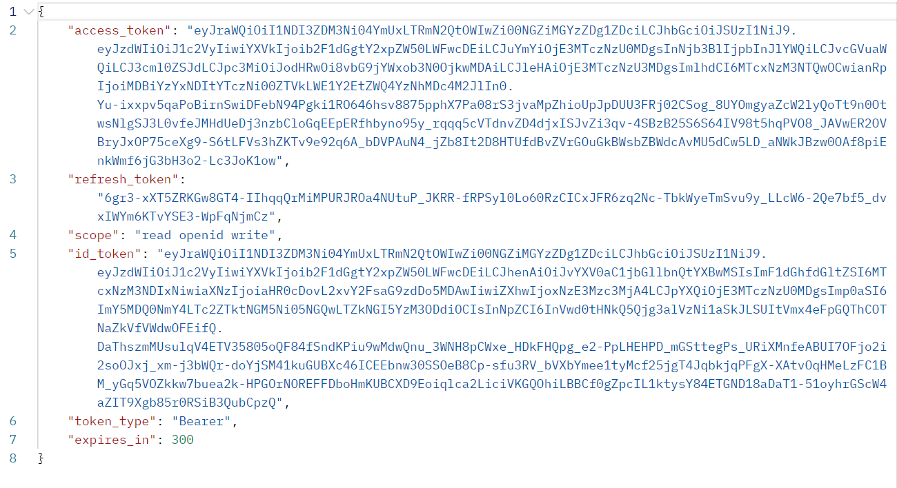

# Spring Authorization Server - 엔드포인트 프로토콜

# OAuth 2.0 Token Endpoint

## OAuth2TokenEndpointConfigurer

- OAuth2 토큰 엔드포인트에 대한 사용자 정의 할 수 있는 기능을 제공한다.
- OAuth2 토큰 요청에 대한 전처리, 기본 처리 및 후처리 로직을 커스텀하게 구현할 수 있도록 API를 지원한다.
- `OAuth2TokenEndpointFilter`를 구성하고 이를 OAuth2 인증 서버 `SecurityFilterChain` 빈에 등록한다.
- 지원되는 권한 부여 유형은 `authorization_code`, `refresh_token`, `client_credentials`, `device_code`  이다.

## OAuth2TokenEndpointFilter

- 클라이언트의 토큰 요청을 처리하는 필터이며 다음과 같은 기본값으로 구성된다.
  - **DelegatingAuthenticationConverter** - 각 특정 유형의 `AuthenticationConverter`를 호출해서 처리를 위임한다.
    - `OAuth2AuthorizationCodeAuthenticationConverter`
    - `OAuth2RefreshTokenAuthenticationConverter`
    - `OAuth2ClientCredentialsAuthenticationConverter`
    - `OAuth2DeviceCodeAuthenticationConverter`
    - 각 컨버터는 `HttpServletRequest` 정보를 `~~AuthenticationToken` 으로 변환하여 반환한다.
  - **AuthenticationProviders**
    - `OAuth2AuthorizationCodeAuthenticationProvider`
    - `RefreshTokenAuthenticationProvider`
    - `ClientCredentialsAuthenticationProvider`
    - `OAuth2DeviceCodeAuthenticationProvider`
    - 권한 부여 유형에 따라 토큰을 발행하는 `AuthenticationProvider` 구현체 들이다.
  - **AuthenticationSuccessHandler**
    - 인증된 `OAuth2AccessTokenAuthenticationToken`을 처리하는 내부 구현체로 인증 토큰을 사용하여 `OAuth2AccessTokenResponse`를 반환한다.
  - **AuthenticationFailureHandler**
    - `OAuth2AuthenticationException`과 관련된 `OAuth2Error` 응답을 반환한다.

## RequestMatcher

- **토큰 요청 패턴**
  - `/oauth2/token, POST`

---

## 사용자 정의 기능

1. `AuthenticationConverter` 추가
2. 스프링 시큐리티가 관리하는 `AuthenticationConverter` 들을 커스텀하게 변경 가능
3. `AuthenticationProvider` 추가
4. 스프링 시큐리티가 관리하는 `AuthenticationProvider` 들을 커스텀하게 변경 가능
5. `OAuth2AccessTokenAuthenticationToken `을 처리하고 `OAuth2AccessTokenResponse`를 반환하는 데 사용되는 후처리기
6. `OAuth2AuthenticationException`을 처리하고 `OAuth2Error` 응답을 반환하는 데 사용되는 후처리기

---

# 클라이언트 인증하기

## OAuth2ClientAuthenticationConfigurer

- OAuth2 클라이언트 인증을 위한 사용자 정의 기능을 제공한다.
- 클라이언트 인증 요청에 대한 전처리, 기본 처리 및 후처리 로직을 커스텀하게 구현할 수 있도록 API를 지원한다.
- `OAuth2ClientAuthenticationFilter`를 구성하고 이를 OAuth2 인증 서버 `SecurityFilterChain` 빈에 등록한다.
- 지원되는 클라이언트 인증 방법은 `client_secret_basic`, `client_secret_post`, `private_key_jwt`, `client_secret_jwt`, `none(공개 클라이언트)`이다.

## OAuth2ClientAuthenticationFilter

- 클라이언트 인증 요청을 처리하는 필터로 다음과 같은 기본값으로 구성된다.
  - **DelegatingAuthenticationConverter**
    - `JwtClientAssertionAuthenticationConverter` : 클라이언트 요청 방식이 **HTTP Basic**일 경우 처리
    - `ClientSecretBasicAuthenticationConverter` : 클라이언트 요청 방식이 **POST**일 경우 처리
    - `ClientSecretPostAuthenticationConverter` : 클라이언트 요청 방식이 **JWT**일 경우 처리
    - `PublicClientAuthenticationConverter` : 클라이언트 요청 방식이 **PKCE**일 경우 처리
  - **AuthenticationProviders**
    - `JwtClientAssertionAuthenticationProvider`
    - `ClientSecretAuthenticationProvider`
    - `PublicClientAuthenticationProvider`
    - 권한 부여 유형에 따라 토큰을 발행하는 `AuthenticationProvider` 구현체들
  - **AuthenticationSuccessHandler**
    - 인증된 `OAuth2ClientAuthenticationToken`을 `SecurityContext`에 저장하는 내부 구현체
  - **AuthenticationFailureHandler**
    - `OAuth2AuthenticationException`을 사용하여 `OAuth2Error`를 반환하는 내부 구현체

## RequestMatcher

- **토큰 요청 패턴**
  - `/oauth2/token POST`
  - `/oauth2/introspect POST`
  - `/oauth2/revoke POST`
  - `/oauth2/device_authorization POST`

## 사용자 정의 기능

1. `AuthenticationConverter` 추가
2. 스프링 시큐리티가 관리하는 `AuthenticationConverter` 들을 커스텀하게 변경 가능
3. `AuthenticationProvider` 추가
4. 스프링 시큐리티가 관리하는 `AuthenticationProvider` 들을 커스텀하게 변경 가능
5. `OAuth2ClientAuthenticationToken `을 처리하는 데 사용되는 후처리기
6. `OAuth2AuthenticationException`을 처리하고 `OAuth2Error` 응답을 반환하는 데 사용되는 후처리기

---

# 클라이언트 인증 흐름

- 필터 체인에 등록된 필터들의 순서를 보면 토큰과 관련된 필터들은 모두 `AuthorizationFilter` 뒤에 있는 것을 확인할 수 있다.
- 즉 토큰을 요청하기 위해서는 클라이언트 인증이 우선적으로 이루어져야 하며, 클라이언트 인증은 `OAuth2ClientAuthenticationFilter`에서 이루어진다.

## 1. 임시 코드로 토큰 요청

- `client_secret_post`  클라이언트 인증 방식

## 2. OAuth2ClientAuthenticationFilter -> ClientSecretPostAuthenticationConverter

- 필요한 정보 추출 후 `OAuth2ClientAuthenticationToken` 생성

## 3. ProviderManager -> ClientSecretAuthenticationProvider

- `ClientSecretAuthenticationProvider`는 `client_secret_basic` 방식과 `client_secret_post` 방식을 처리한다.
- 인가 서버에 등록된 클라이언트 정보와 일치하는지 여러가지 정보들을 확인한다.
- 이후 최종적으로 인증된 `OAuth2ClientAuthenticationToken`을 반환한다.

## 4. OAuth2ClientAuthenticationFilter -> onAuthenticationSuccess()

- 인증객체 저장

## 5. AuthorizationFilter -> OAuth2TokenEndpointFilter

- 클라이언트 인증을 마쳤으므로 `OAuth2TokenEndpointFilter`를 통해 최종 `OAuth2AccessTokenResponse` 반환

---

# 권한 부여 유형에 따른 코드 흐름

## [Authorization Code Endpoint 흐름]()
## [Client Credentials Endpoint 흐름]()
## [Refresh Token Endpoint 흐름]()
## [Authorization Code with PKCE Endpoint 흐름]()

---

[이전 ↩️ - Spring Authorization Server(엔드포인트 프로토콜) - AuthorizationServer Endpoint]()

[메인 ⏫](https://github.com/genesis12345678/TIL/blob/main/Spring/security/oauth/main.md)

[다음 ↪️ - Spring Authorization Server(엔드포인트 프로토콜) - Token Introspection Endpoint]()