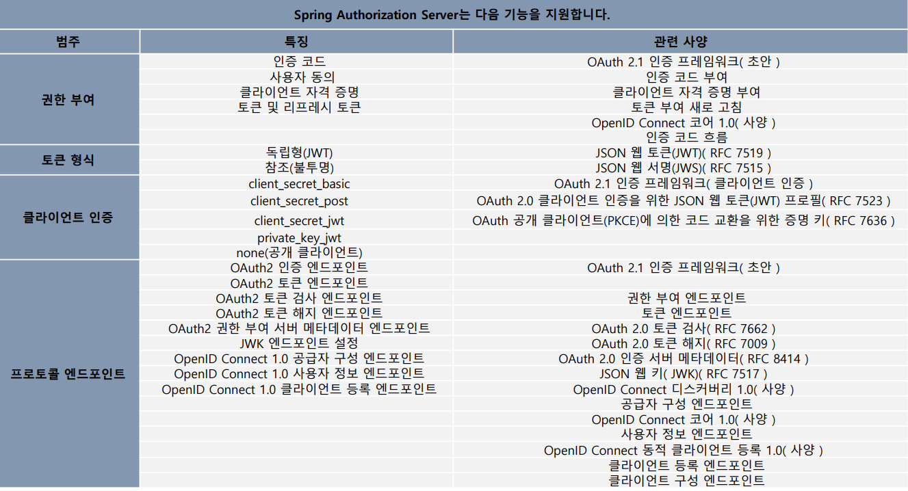

# Spring Authorization Server

- **Spring Authorization Server**는 OAuth 2.1 및 OpenID Connect 1.0 사양과 기타 관련 사양 의 구현을 제공하는 프레임워크. 
- OpenID Connect 1.0 ID 공급자 및 OAuth2 인증 서버 제품을 구축하기 위한 안전하고 가벼우며 사용자 정의 가능한 기반을 제공하기 위해 Spring Security를 기반으로 구축되었다.




[원본 - Spring Authorization Server 공식 문서](https://docs.spring.io/spring-authorization-server/reference/overview.html)

---

### 필요 의존성

```text
implementation "org.springframework.boot:spring-boot-starter-oauth2-authorization-server"
```

---

[메인 ⏫](https://github.com/genesis12345678/TIL/blob/main/Spring/security/oauth/main.md)

[다음 ↪️ - Spring Authorization Server - 초기화 과정(`Auth2AuthorizationServerConfiguration`)]()